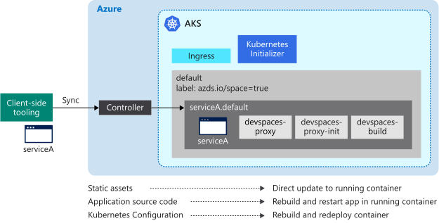

# How running your code with Azure Dev Spaces works

Azure Dev Spaces provides you with multiple ways to rapidly iterate and debug Kubernetes applications and collaborate with your team on an Azure Kubernetes Service (AKS) cluster. Once your [project is prepared to run in a dev space][how-it-works-prep], you can use Dev Spaces to build and run your project in your AKS cluster.

This article describes what happens run your code in AKS with Dev Spaces.

## Run your code

To run your code in a dev space, issue the `up` command in the same directory as your `azds.yaml` file:

```cmd
azds up
```

The `up` command uploads your application source files and other artifacts needed to build and run your project to the dev space. From there, the controller in your dev space:

1. Creates the Kubernetes objects to deploy your application.
1. Builds the container for your application.
1. Deploys your application to the dev space.
1. Creates a publicly accessible DNS name for your application endpoint if configured.
1. Uses *port-forward* to provide access to your application endpoint using http://localhost.
1. Forwards stdout and stderr to the client-side tooling.


## Starting a service

When you start a service in a dev space, the client-side tooling and controller work in coordination to synchronize your source files, create your container and Kubernetes objects, and run your application.

At a more granular level, here is what happens when you run `azds up`:

1. [Files are synchronized][sync-section] from the user's computer to an Azure file storage that is unique to the user's AKS cluster. The source code, Helm chart, and configuration files are uploaded.
1. The controller creates a request to start a new session. This request contains several properties, including a unique ID, space name, path to source code, and a debugging flag.
1. The controller replaces the *$(tag)* placeholder in the Helm chart with the unique session ID and installs the Helm chart for your service. Adding a reference to the unique session ID to the Helm chart allows the container deployed to the AKS cluster for this specific session to be tied back to the session request and associated information.
1. During the installation of the Helm chart, the Kubernetes webhook admission server adds additional containers to your application's pod for instrumentation and access to your project's source code. The devspaces-proxy and devspaces-proxy-init containers are added to provide HTTP tracing and space routing. The devspaces-build container is added to provide the pod with access to the Docker instance and project source code for building your application's container.
1. When the application's pod is started, the devspaces-build container and devspaces-proxy-init container are used to build the application container. The application container and devspaces-proxy containers are then started.
1. After the application container has started, the client-side functionality uses the Kubernetes *port-forward* functionality to provide HTTP access to your application over http://localhost. This port forwarding connects your development computer to the service in your dev space.
1. When all containers in the pod have started, the service is running. At this point, the client-side functionality begins to stream the HTTP traces, stdout, and stderr. This information is displayed by the client-side functionality for the developer.

## Updating a running service

While a service is running, Azure Dev Spaces has the ability to update that service if any of the project source files change. Dev Spaces also handles updating the service differently depending on the type of file that is changed. There are three ways Dev Spaces can update a running service:

* Directly updating a file
* Rebuilding and restarting the application's process inside the running application's container
* Rebuilding and redeploying the application's container



Certain project files that are static assets, such as html, css, and cshtml files, can be updated directly in the application's container without restarting anything. If a static asset changes, the new file is synchronized to the dev space and then used by the running container.

Changes to files such as source code or application configuration files can be applied by restarting the application's process within the running container. Once these files are synchronized, the application's process is restarted within the running container using the *devhostagent* process. When initially creating the application's container, the controller replaces the startup command for the application with a different process called *devhostagent*. The application's actual process is then run as a child process under *devhostagent*, and its output is piped out using *devhostagent*'s output. The *devhostagent* process is also part of Dev Spaces and can execute commands in the running container on behalf of Dev Spaces. When performing a restart, *devhostagent*:

* Stops the current process or processes associated with the application
* Rebuilds the application
* Restarts the process or processes associated with the application

The way *devhostagent* executes the preceding steps is [configured in `azds.yaml`][azds-yaml-section].

Updates to project files such as Dockerfiles, csproj files, or any part of the Helm chart require the application's container to be rebuilt and redeployed. When one of these files is synchronized to the dev space, the controller runs the [helm upgrade][helm-upgrade] command and the application's container is rebuilt and redeployed.

## File Synchronization

The first time an application is started in a dev space, all the application's source files are uploaded. While the application is running and on later restarts, only the changed files are uploaded. Two files are used to coordinate this process: a client-side file and a controller-side file.

The client-side file is stored in a temporary directory and is named based on a hash of the project directory you are running in Dev Spaces. For example, on Windows you would have a file like *Users\USERNAME\AppData\Local\Temp\1234567890abcdef1234567890abcdef1234567890abcdef1234567890abcdef.synclog* for your project. On Linux, the client-side file is stored in the */tmp* directory. You can find the directory on macOS by running the `echo $TMPDIR` command.

This file is in JSON format and contains:

* An entry for each project file that is synchronized with the dev space
* A synchronization ID
* The timestamp of the last sync operation

Each project file entry contains a path to the file and its timestamp.

The controller-side file is stored on the AKS cluster. It contains the synchronization ID and the timestamp of the last synchronization.

A sync happens when the synchronization timestamps do not match between the client-side and the controller-side files. During a sync, the client-side tooling iterates over the file entries in the client-side file. If the file's timestamp is after the sync timestamp, that file is synced to the dev space. Once the sync is complete, the sync timestamps are updated on both the client-side and controller-side files.

All of the project files are synced if the client-side file is not present. This behavior allows you to force a full sync by deleting the client-side file.

## How running your code is configured

Azure Dev Spaces uses the `azds.yaml` file to install and configure your service. The controller uses the `install` property in the `azds.yaml` file to install the Helm chart and create the Kubernetes objects:

```yaml
...
install:
  chart: charts/webfrontend
  values:
  - values.dev.yaml?
  - secrets.dev.yaml?
  set:
    replicaCount: 1
    image:
      repository: webfrontend
      tag: $(tag)
      pullPolicy: Never
    ingress:
      annotations:
        kubernetes.io/ingress.class: traefik-azds
      hosts:
      # This expands to [space.s.][rootSpace.]webfrontend.<random suffix>.<region>.azds.io
      # Customize the public URL by changing the 'webfrontend' text between the $(rootSpacePrefix) and $(hostSuffix) tokens
      # For more information see https://aka.ms/devspaces/routing
      - $(spacePrefix)$(rootSpacePrefix)webfrontend$(hostSuffix)
...
```

By default, the `prep` command will generate the Helm chart. It also sets the *install.chart* property to the directory of the Helm chart. If you wanted to use a Helm chart in a different location, you can update this property to use that location.

When installing the Helm charts, Azure Dev Spaces provides a way to override values in the Helm chart. The default values for the Helm chart are in `charts/APP_NAME/values.yaml`.

Using the *install.values* property, you can list one or more files that define values you want replaced in the Helm chart. For example, if you wanted a hostname or database configuration specifically when running your application in a dev space, you can use this override functionality. You can also add a *?* at the end of any of the file names to set it as optional.

The *install.set* property allows you to configure one or more values you want replaced in the Helm chart. Any values configured in *install.set* will override values configured in files listed in *install.values*. The properties under *install.set* are dependent on the values in the Helm chart and may be different depending on the generated Helm chart.

In the above example, the *install.set.replicaCount* property tells the controller how many instances of your application to run in your dev space. Depending on your scenario, you can increase this value, but it will have an impact on attaching a debugger to your application's pod. For more information, see the [troubleshooting article][troubleshooting].

In the generated Helm chart, the container image is set to *{{ .Values.image.repository }}:{{ .Values.image.tag }}*. The `azds.yaml` file defines *install.set.image.tag* property as *$(tag)* by default, which is used as the value for *{{ .Values.image.tag }}*. By setting the *install.set.image.tag* property in this way, it allows the container image for your application to be tagged in a distinct way when running Azure Dev Spaces. In this specific case, the image is tagged as *\<value from image.repository>:$(tag)*. You must use the *$(tag)* variable as the value of   *install.set.image.tag* in order for Dev Spaces recognize and locate the container in the AKS cluster.

In the above example, `azds.yaml` defines *install.set.ingress.hosts*. The *install.set.ingress.hosts* property defines a host name format for public endpoints. This property also uses *$(spacePrefix)*, *$(rootSpacePrefix)*, and *$(hostSuffix)*, which are values provided by the controller.

The *$(spacePrefix)* is the name of the child dev space, which takes the form of *SPACENAME.s*. The *$(rootSpacePrefix)* is the name of the parent space. For example, if *azureuser* is a child space of *default*, the value for *$(rootSpacePrefix)* is *default* and the value of *$(spacePrefix)* is *azureuser.s*. If the space is not a child space, *$(spacePrefix)* is blank. For example, if the *default* space has no parent space, the value for *$(rootSpacePrefix)* is *default* and the value of *$(spacePrefix)* is blank. The *$(hostSuffix)* is a DNS suffix that points to the Azure Dev Spaces Ingress Controller that runs in your AKS cluster. This DNS suffix corresponds to a wildcard DNS entry, for example *\*.RANDOM_VALUE.eus.azds.io*, that was created when the Azure Dev Spaces controller was added to your AKS cluster.

In the above `azds.yaml` file, you could also update *install.set.ingress.hosts* to change the host name of your application. For example, if you wanted to simplify the hostname of your application from *$(spacePrefix)$(rootSpacePrefix)webfrontend$(hostSuffix)* to *$(spacePrefix)$(rootSpacePrefix)web$(hostSuffix)*.

To build the container for your application, the controller uses the below sections of the `azds.yaml` configuration file:

```yaml
build:
  context: .
  dockerfile: Dockerfile
...
configurations:
  develop:
    build:
      dockerfile: Dockerfile.develop
      useGitIgnore: true
      args:
        BUILD_CONFIGURATION: ${BUILD_CONFIGURATION:-Debug}
...
```

The controller uses a Dockerfile to build and run your application.

The *build.context* property lists the directory where the Dockerfiles exist. The *build.dockerfile* property defines the name of the Dockerfile for building the production version of the application. The *configurations.develop.build.dockerfile* property configures the name of the Dockerfile for the development version of the application.

Having different Dockerfiles for development and production allows you to enable certain things during development and disable those items for production deployments. For example, you can enable debugging or more verbose logging during development and disable in a production environment. You can also update these properties if your Dockerfiles are named differently or are in a different location.

To help you rapidly iterate during development, Azure Dev Spaces will sync changes from your local project and incrementally update your application. The below section in the `azds.yaml` configuration file is used to configure the sync and update:

```yaml
...
configurations:
  develop:
    ...
    container:
      sync:
      - "**/Pages/**"
      - "**/Views/**"
      - "**/wwwroot/**"
      - "!**/*.{sln,csproj}"
      command: [dotnet, run, --no-restore, --no-build, --no-launch-profile, -c, "${BUILD_CONFIGURATION:-Debug}"]
      iterate:
        processesToKill: [dotnet, vsdbg]
        buildCommands:
        - [dotnet, build, --no-restore, -c, "${BUILD_CONFIGURATION:-Debug}"]
...
```

The files and directories that will sync changes are listed in the *configurations.develop.container.sync* property. These directories are synced initially when you run the `up` command as well as when changes are detected. If there are additional or different directories you would like synced to your dev space, you can change this property.

The *configurations.develop.container.iterate.buildCommands* property specifies how to build the application in a development scenario. The *configurations.develop.container.command* property provides the command for running the application in a development scenario. You may want to update either of these properties if there are additional build or runtime flags or parameters you would like to use during development.

The *configurations.develop.container.iterate.processesToKill* lists the processes to kill to stop the application. You may want to update this property if you want to change the restart behavior of your application during development. For example, if you updated the *configurations.develop.container.iterate.buildCommands* or *configurations.develop.container.command* properties to change how the application is built or started, you may need to change what processes are stopped.

When preparing your code using the `azds prep` command, you have the option of adding the `--enable-ingress` flag. Adding the `--enable-ingress` flag creates a publicly accessible URL for your application. If you omit this flag, the application is only accessible within the cluster or using the localhost tunnel. After you run the `azds prep` command, you can change this setting modifying the *ingress.enabled* property in `charts/APPNAME/values.yaml`:

```yaml
ingress:
  enabled: true
```

## Next steps

To learn more about networking and how requests are routed in Azure Dev Spaces see [How routing works with Azure Dev Spaces][how-it-works-routing].

To learn more about using Azure Dev Spaces for rapidly iterating and developing, see [How Local Process with Kubernetes works][how-it-works-local-process-kubernetes] and [How remote debugging your code with Azure Dev Spaces works][how-it-works-remote-debugging].

To get started using Azure Dev Spaces to run your project, see the following quickstarts:

* [Rapidly iterate and debug with Visual Studio Code and Java][quickstart-java]
* [Rapidly iterate and debug with Visual Studio Code and .NET][quickstart-netcore]
* [Rapidly iterate and debug with Visual Studio Code and Node.js][quickstart-node]
* [Rapidly iterate and debug with Visual Studio and .NET Core][quickstart-vs]
* [Using the CLI to develop an application on Kubernetes][quickstart-cli]


[azds-yaml-section]: #how-running-your-code-is-configured
[helm-upgrade]: https://helm.sh/docs/intro/using_helm/#helm-upgrade-and-helm-rollback-upgrading-a-release-and-recovering-on-failure
[how-it-works-local-process-kubernetes]: how-dev-spaces-works-local-process-kubernetes.md
[how-it-works-prep]: how-dev-spaces-works-prep.md
[how-it-works-remote-debugging]: how-dev-spaces-works-remote-debugging.md
[how-it-works-routing]: how-dev-spaces-works-routing.md
[quickstart-cli]: quickstart-cli.md
[quickstart-java]: quickstart-java.md
[quickstart-netcore]: quickstart-netcore.md
[quickstart-node]: quickstart-nodejs.md
[quickstart-vs]: quickstart-netcore-visualstudio.md
[sync-section]: #file-synchronization
[troubleshooting]: troubleshooting.md