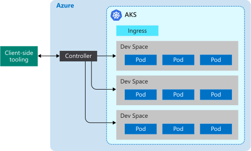

# How Azure Dev Spaces works and is configured

Developing a Kubernetes application can be challenging. You need Docker and Kubernetes configuration files. You need to figure out how to test your application locally and interact with other dependent services. You might need to handle developing and testing on multiple services at once and with a team of developers.

Azure Dev Spaces helps you develop, deploy, and debug Kubernetes applications directly in Azure Kubernetes Service (AKS). Azure Dev Spaces also allows a team to share a dev space. Sharing a dev space across a team allows individual team members to develop in isolation without having to replicate or mock up dependencies or other applications in the cluster.

Azure Dev Spaces creates and uses a configuration file for deploying, running, and debugging your Kubernetes applications in AKS. This configuration file resides with your application's code and can be added to your version control system.

This article describes the processes that power Azure Dev Spaces and how those processes are configured in the Azure Dev Spaces configuration file. To get Azure Dev Spaces running quickly and see it in practice, complete one of the quickstarts:

* [Java with CLI and Visual Studio Code](quickstart-java.md)
* [.NET Core with CLI and Visual Studio Code](quickstart-netcore.md)
* [.NET Core with Visual Studio](quickstart-netcore-visualstudio.md)
* [Node.js with CLI and Visual Studio Code](quickstart-nodejs.md)

## How Azure Dev Spaces works

Azure Dev Spaces has two distinct components that you interact with: the controller and the client-side tooling.



The controller performs the following actions:

* Manages dev space creation and selection.
* Installs your application's Helm chart and creates Kubernetes objects.
* Builds your application's container image.
* Deploys your application to AKS.
* Does incremental builds and restarts when your source code changes.
* Manages logs and HTTP traces.
* Forwards stdout and stderr to the client-side tooling.
* Allows team members to create child dev spaces derived from a parent dev space.
* Configures routing for applications within a space as well as across parent and child spaces.

The controller resides outside AKS. It drives the behavior and communication between the client-side tooling and the AKS cluster. The controller is enabled using the Azure CLI when you prepare your cluster to use Azure Dev Spaces. Once it is enabled, you can interact with it using the client-side tooling.

The client-side tooling allows the user to:
* Generate a Dockerfile, Helm chart, and Azure Dev Spaces configuration file for the application.
* Create parent and child dev spaces.
* Tell the controller to build and start your application.

While your application is running, the client-side tooling also:
* Receives and displays stdout and stderr from your application running in AKS.
* Uses [port-forward](https://kubernetes.io/docs/tasks/access-application-cluster/port-forward-access-application-cluster/) to allow web access to your application using http:\//localhost.
* Attaches a debugger to your running application in AKS.
* Syncs source code to your dev space when a change is detected for incremental builds, allowing for rapid iteration.

You can use the client-side tooling from the command line as part of the `azds` command. You can also use the client-side tooling with:

* Visual Studio Code using the [Azure Dev Spaces extension](https://marketplace.visualstudio.com/items?itemName=azuredevspaces.azds).
* Visual Studio with [Visual Studio Tools for Kubernetes](https://aka.ms/get-vsk8stools).

Here's the basic flow for setting up and using Azure Dev Spaces:
1. Prepare your AKS cluster for Azure Dev Spaces
1. Prepare your code for running on Azure Dev Spaces
1. Run your code on a dev space
1. Debug your code on a dev space
1. Share a dev space

We'll cover more details of how Azure Dev Spaces works in each of the below sections.

## Prepare your AKS cluster

Preparing your AKS cluster involves:
* Verifying your AKS cluster is in a region [supported by Azure Dev Spaces][supported-regions].
* Verifying you are running Kubernetes 1.10.3 or later.
* Enabling Azure Dev Spaces on your cluster using `az aks use-dev-spaces`

For more information on how to create and configure an AKS cluster for Azure Dev Spaces, see one of the getting started guides:
* [Get Started on Azure Dev Spaces with Java](get-started-java.md)
* [Get Started on Azure Dev Spaces with .NET Core and Visual Studio](get-started-netcore-visualstudio.md)
* [Get Started on Azure Dev Spaces with .NET Core](get-started-netcore.md)
* [Get Started on Azure Dev Spaces with Node.js](get-started-nodejs.md)

When Azure Dev Spaces is enabled on your AKS cluster, it installs the controller for your cluster. The controller is a separate Azure resource outside of your cluster and does the following to resources in your cluster:

* Creates or designates a Kubernetes namespace to use as a dev space.
* Removes any Kubernetes namespace named *azds*, if it exists, and creates a new one.
* Deploys a Kubernetes webhook configuration.
* Deploys a webhook admission server.
	

It also uses the same service principal that your AKS cluster uses to make service calls to other Azure Dev Spaces components.


In order to use Azure Dev Spaces, there must be at least one dev space. Azure Dev Spaces uses Kubernetes namespaces within your AKS cluster for dev spaces. When a controller is being installed, it prompts you to create a new Kubernetes namespace or choose an existing namespace to use as your first dev space. When a namespace is designated as a dev space, the controller adds the *azds.io/space=true* label to that namespace to identify it as a dev space. The initial dev space you create or designate is selected by default after you prepare your cluster. When a space is selected, it is used by Azure Dev Spaces for creating new workloads.

By default, the controller creates a dev space named *default* by upgrading the existing *default* Kubernetes namespace. You can use the client-side tooling to create new dev spaces and remove existing dev spaces. Due to a limitation in Kubernetes, the *default* dev space cannot be removed. The controller also removes any existing Kubernetes namespaces named *azds* to avoid conflicts with the `azds` command used by the client-side tooling.

The Kubernetes webhook admission server is used to inject pods with three containers during deployment for instrumentation: a devspaces-proxy container, a devspaces-proxy-init container, and a devspaces-build container. **All three of these containers run with root access on your AKS cluster.** They also use the same service principal that your AKS cluster uses to make service calls to other Azure Dev Spaces components.


The devspaces-proxy container is a sidecar container that handles all TCP traffic into and out of the application container and helps perform routing. The devspaces-proxy container reroutes HTTP messages if certain spaces are being used. For example, it can help route HTTP messages between applications in parent and child spaces. All non-HTTP traffic passes through devspaces-proxy unmodified. The devspaces-proxy container also logs all inbound and outbound HTTP messages and sends them to the client-side tooling as traces. These traces can then be viewed by the developer to inspect the behavior of the application.

The devspaces-proxy-init container is an [init container](https://kubernetes.io/docs/concepts/workloads/pods/init-containers/) that adds additional routing rules based on the space hierarchy to your application's container. It adds routing rules by updating the application container's */etc/resolv.conf* file and iptables configuration before it starts. The updates to */etc/resolv.conf* allow for DNS resolution of services in parent spaces. The iptables configuration updates ensure all TCP traffic into and out of the application's container are routed though devspaces-proxy. All updates from devspaces-proxy-init happen in addition to the rules that Kubernetes adds.

The devspaces-build container is an init container and has the project source code and Docker socket mounted. The project source code and access to Docker allows the application container to be built directly by the pod.

> [!NOTE]
> Azure Dev Spaces uses the same node to build your application's container and run it. As a result, Azure Dev Spaces does not need an external container registry for building and running your application.

The Kubernetes webhook admission server listens for any new pod that's created in the AKS cluster. If that pod is deployed to any namespace with the *azds.io/space=true* label, it injects that pod with the additional containers. The devspaces-build container is only injected if the application's container is run using the client-side tooling.

Once you have prepared your AKS cluster, you can use the client-side tooling to prepare and run your code in your dev space.

## Prepare your code

In order to run your application in a dev space, it needs to be containerized, and you need to define how it should be deployed to Kubernetes. To containerize your application, you need a Dockerfile. To define how your application is deployed to Kubernetes, you need a [Helm chart](https://docs.helm.sh/). To assist in creating both the Dockerfile and Helm chart for your application, the client-side tools provide the `prep` command:

```cmd
azds prep --public
```

The `prep` command will look at the files in your project and try to create the Dockerfile and Helm chart for running your application in Kubernetes. Currently, the `prep` command will generate a Dockerfile and Helm chart with the following languages:

* Java
* Node.js
* .NET Core

You *must* run the `prep` command from a directory that contains source code. Running the `prep` command from the correct directory allows the client-side tooling to identify the language and create an appropriate Dockerfile to containerize your application. You can also run the `prep` command from a directory that contains a *pom.xml* file for Java projects.

If you run the `prep` command from directory that does not contain source code, the client-side tooling will not generate a Dockerfile. It will also display an error saying: *Dockerfile could not be generated due to unsupported language*. This error also occurs if the client-side tooling does not recognize the project type.

When you run the `prep` command, you have the option of specifying the `--public` flag. This flag tells the controller to create an internet-accessible endpoint for this service. If you do not specify this flag, the service is only accessible from within the cluster or using the localhost tunnel created by the client-side tooling. You can enable or disable this behavior after running the `prep` command by updating the generated Helm chart.

The `prep` command will not replace any existing Dockerfiles or Helm charts you have in your project. If an existing Dockerfile or Helm chart uses the same naming convention as the files generated by the `prep` command, the `prep` command will skip generating those files. Otherwise, the `prep` command will generate its own Dockerfile or Helm chart along side the existing files.

The `prep` command will also generate a `azds.yaml` file at the root of your project. Azure Dev Spaces uses this file to build, install, configure, and run your application. This configuration file lists the location of your Dockerfile and Helm chart and also provides additional configuration on top of those artifacts.

Here is an example azds.yaml file created using [.NET Core sample application](https://github.com/Azure/dev-spaces/tree/master/samples/dotnetcore/getting-started/webfrontend):

```yaml
kind: helm-release
apiVersion: 1.1
build:
  context: .
  dockerfile: Dockerfile
install:
  chart: charts/webfrontend
  values:
  - values.dev.yaml?
  - secrets.dev.yaml?
  set:
    replicaCount: 1
    image:
      repository: webfrontend
      tag: $(tag)
      pullPolicy: Never
    ingress:
      annotations:
        kubernetes.io/ingress.class: traefik-azds
      hosts:
        # This expands to [space.s.][rootSpace.]webfrontend.<random suffix>.<region>.azds.io
        # Customize the public URL by changing the 'webfrontend' text between the $(rootSpacePrefix) and $(hostSuffix) tokens
        # For more information see https://aka.ms/devspaces/routing
        - $(spacePrefix)$(rootSpacePrefix)webfrontend$(hostSuffix)
configurations:
  develop:
    build:
      dockerfile: Dockerfile.develop
      useGitIgnore: true
      args:
        BUILD_CONFIGURATION: ${BUILD_CONFIGURATION:-Debug}
    container:
      sync:
      - "**/Pages/**"
      - "**/Views/**"
      - "**/wwwroot/**"
      - "!**/*.{sln,csproj}"
      command: [dotnet, run, --no-restore, --no-build, --no-launch-profile, -c, "${BUILD_CONFIGURATION:-Debug}"]
      iterate:
        processesToKill: [dotnet, vsdbg]
        buildCommands:
        - [dotnet, build, --no-restore, -c, "${BUILD_CONFIGURATION:-Debug}"]
```

The `azds.yaml` file generated by the `prep` command should work fine for a simple, single project development scenario. If your specific project has increased complexity, you may need to update this file after running the `prep` command. For example, your project may require some tweaking to your build or launch process based on your development or debugging needs. You also might have multiple applications in your project, which require multiple build processes or a different build content.

## Run your code

To run your code in a dev space, issue the `up` command in the same directory as your `azds.yaml` file:

```cmd
azds up
```

The `up` command uploads your application source files and other artifacts needed to build and run your project to the dev space. From there, the controller in your dev space:

1. Creates the Kubernetes objects to deploy your application.
1. Builds the container for your application.
1. Deploys your application to the dev space.
1. Creates a publicly accessible DNS name for your application endpoint if configured.
1. Uses *port-forward* to provide access to your application endpoint using http://localhost.
1. Forwards stdout and stderr to the client-side tooling.


### Starting a service

When you start a service in a dev space, the client-side tooling and controller work in coordination to synchronize your source files, create your container and Kubernetes objects, and run your application.

At a more granular level, here is what happens when you run `azds up`:

1. Files are synchronized from the user’s machine to an Azure file storage that is unique to the user’s AKS cluster. The source code, Helm chart, and configuration files are uploaded. More details on the synchronization process are available in the next section.
1. The controller creates a request to start a new session. This request contains several properties, including a unique ID, space name, path to source code, and a debugging flag.
1. The controller replaces the *$(tag)* placeholder in the Helm chart with the unique session ID and installs the Helm chart for your service. Adding a reference to the unique session ID to the Helm chart allows the container deployed to the AKS cluster for this specific session to be tied back to the session request and associated information.
1. During the installation of the Helm chart, the Kubernetes webhook admission server adds additional containers to your application's pod for instrumentation and access to your project's source code. The devspaces-proxy and devspaces-proxy-init containers are added to provide HTTP tracing and space routing. The devspaces-build container is added to provide the pod with access to the Docker instance and project source code for building your application's container.
1. When the application's pod is started, the devspaces-build container and devspaces-proxy-init container are used to build the application container. The application container and devspaces-proxy containers are then started.
1. After the application container has started, the client-side functionality uses the Kubernetes *port-forward* functionality to provide HTTP access to your application over http://localhost. This port forwarding connects your development machine to the service in your dev space.
1. When all containers in the pod have started, the service is running. At this point, the client-side functionality begins to stream the HTTP traces, stdout, and stderr. This information is displayed by the client-side functionality for the developer.

### Updating a running service

While a service is running, Azure Dev Spaces has the ability to update that service if any of the project source files change. Dev Spaces also handles updating the service differently depending on the type of file that is changed. There are three ways Dev Spaces can update a running service:

* Directly updating a file
* Rebuilding and restarting the application's process inside the running application's container
* Rebuilding and redeploying the application's container


Certain project files that are static assets, such as html, css, and cshtml files, can be updated directly in the application's container without restarting anything. If a static asset changes, the new file is synchronized to the dev space and then used by the running container.

Changes to files such as source code or application configuration files can be applied by restarting the application's process within the running container. Once these files are synchronized, the application's process is restarted within the running container using the *devhostagent* process. When initially creating the application's container, the controller replaces the startup command for the application with a different process called *devhostagent*. The application's actual process is then run as a child process under *devhostagent*, and its output is piped out using *devhostagent*'s output. The *devhostagent* process is also part of Dev Spaces and can execute commands in the running container on behalf of Dev Spaces. When performing a restart, *devhostagent*:

* Stops the current process or processes associated with the application
* Rebuilds the application
* Restarts the process or processes associated with the application

The way *devhostagent* executes the preceding steps is configured in the `azds.yaml` configuration file. This configuration is detailed in a later section.

Updates to project files such as Dockerfiles, csproj files, or any part of the Helm chart require the application's container to be rebuilt and redeployed. When one of these files is synchronized to the dev space, the controller runs the [helm upgrade](https://helm.sh/docs/helm/#helm-upgrade) command and the application's container is rebuilt and redeployed.

### File Synchronization

The first time an application is started in a dev space, all the application's source files are uploaded. While the application is running and on later restarts, only the changed files are uploaded. Two files are used to coordinate this process: a client-side file and a controller-side file.

The client-side file is stored in a temporary directory and is named based on a hash of the project directory you are running in Dev Spaces. For example, on Windows you would have a file like *Users\USERNAME\AppData\Local\Temp\1234567890abcdef1234567890abcdef1234567890abcdef1234567890abcdef.synclog* for your project. On Linux, the client-side file is stored in the */tmp* directory. You can find the directory on macOS by running the `echo $TMPDIR` command.

This file is in JSON format and contains:

* An entry for each project file that is synchronized with the dev space
* A synchronization ID
* The timestamp of the last sync operation

Each project file entry contains a path to the file and its timestamp.

The controller-side file is stored on the AKS cluster. It contains the synchronization ID and the timestamp of the last synchronization.

A sync happens when the synchronization timestamps do not match between the client-side and the controller-side files. During a sync, the client-side tooling iterates over the file entries in the client-side file. If the file's timestamp is after the sync timestamp, that file is synced to the dev space. Once the sync is complete, the sync timestamps are updated on both the client-side and controller-side files.

All of the project files are synced if the client-side file is not present. This behavior allows you to force a full sync by deleting the client-side file.

### How routing works

A dev space is built on top of AKS and uses the same [networking concepts](../aks/concepts-network.md). Azure Dev Spaces also has a centralized *ingressmanager* service and deploys its own Ingress Controller to the AKS cluster. The *ingressmanager* service monitors AKS clusters with dev spaces and augments the Azure Dev Spaces Ingress Controller in the cluster with Ingress objects for routing to application pods. The devspaces-proxy container in each pod adds an `azds-route-as` HTTP header for HTTP traffic to a dev space based on the URL. For example, a request to the URL *http://azureuser.s.default.serviceA.fedcba09...azds.io* would get an HTTP header with `azds-route-as: azureuser`. The devspaces-proxy container will not add an `azds-route-as` header if one is already present.

When an HTTP request is made to a service from outside the cluster, the request goes to the Ingress controller. The Ingress controller routes the request directly to the appropriate pod based on its Ingress objects and rules. The devspaces-proxy container in the pod receives the request, adds the `azds-route-as` header based on the URL, and then routes the request to the application container.

When an HTTP request is made to a service from another service within the cluster, the request first goes through the calling service's devspaces-proxy container. The devspaces-proxy container looks at the HTTP request and checks the `azds-route-as` header. Based on the header, the devspaces-proxy container will look up the IP address of the service associated with the header value. If an IP address is found, the devspaces-proxy container reroutes the request to that IP address. If an IP address is not found, the devspaces-proxy container routes the request to the parent application container.

For example, the applications *serviceA* and *serviceB* are deployed to a parent dev space called *default*. *serviceA* relies on *serviceB* and makes HTTP calls to it. Azure User creates a child dev space based on the *default* space called *azureuser*. Azure User also deploys their own version of *serviceA* to their child space. When a request is made to *http://azureuser.s.default.serviceA.fedcba09...azds.io*:


1. The Ingress controller looks up the IP for the pod associated with the URL, which is *serviceA.azureuser*.
1. The Ingress controller finds the IP for the pod in Azure User's dev space and routes the request to the *serviceA.azureuser* pod.
1. The devspaces-proxy container in the *serviceA.azureuser* pod receives the request and adds `azds-route-as: azureuser` as an HTTP header.
1. The devspaces-proxy container in the *serviceA.azureuser* pod routes the request to the *serviceA* application container in the *serviceA.azureuser* pod.
1. The *serviceA* application in the *serviceA.azureuser* pod makes a call to *serviceB*. The *serviceA* application also contains code to preserve the existing `azds-route-as` header, which in this case is `azds-route-as: azureuser`.
1. The devspaces-proxy container in the *serviceA.azureuser* pod receives the request and looks up the IP of *serviceB* based on the value of the `azds-route-as` header.
1. The devspaces-proxy container in the *serviceA.azureuser* pod does not find an IP for *serviceB.azureuser*.
1. The devspaces-proxy container in the *serviceA.azureuser* pod looks up the IP for *serviceB* in the parent space, which is *serviceB.default*.
1. The devspaces-proxy container in the *serviceA.azureuser* pod finds the IP for *serviceB.default* and routes the request to the *serviceB.default* pod.
1. The devspaces-proxy container in the *serviceB.default* pod receives the request and routes the request to the *serviceB* application container in the *serviceB.default* pod.
1. The *serviceB* application in the *serviceB.default* pod returns a response to the *serviceA.azureuser* pod.
1. The devspaces-proxy container in the *serviceA.azureuser* pod receives the response and routes the response to the *serviceA* application container in the *serviceA.azureuser* pod.
1. The *serviceA* application receives the response and then returns its own response.
1. The devspaces-proxy container in the *serviceA.azureuser* pod receives the response from the *serviceA* application container and routes the response to the original caller outside of the cluster.

All other TCP traffic that is not HTTP passes through the Ingress controller and devspaces-proxy containers unmodified.

### How running your code is configured

Azure Dev Spaces uses the `azds.yaml` file to install and configure your service. The controller uses the `install` property in the `azds.yaml` file to install the Helm chart and create the Kubernetes objects:

```yaml
...
install:
  chart: charts/webfrontend
  values:
  - values.dev.yaml?
  - secrets.dev.yaml?
  set:
    replicaCount: 1
    image:
      repository: webfrontend
      tag: $(tag)
      pullPolicy: Never
    ingress:
      annotations:
        kubernetes.io/ingress.class: traefik-azds
      hosts:
      # This expands to [space.s.][rootSpace.]webfrontend.<random suffix>.<region>.azds.io
      # Customize the public URL by changing the 'webfrontend' text between the $(rootSpacePrefix) and $(hostSuffix) tokens
      # For more information see https://aka.ms/devspaces/routing
      - $(spacePrefix)$(rootSpacePrefix)webfrontend$(hostSuffix)
...
```

By default, the `prep` command will generate the Helm chart. It also sets the *install.chart* property to the directory of the Helm chart. If you wanted to use a Helm chart in a different location, you can update this property to use that location.

When installing the Helm charts, Azure Dev Spaces provides a way to override values in the Helm chart. The default values for the Helm chart are in `charts/APP_NAME/values.yaml`.

Using the *install.values* property, you can list one or more files that define values you want replaced in the Helm chart. For example, if you wanted a hostname or database configuration specifically when running your application in a dev space, you can use this override functionality. You can also add a *?* at the end of any of the file names to set it as optional.

The *install.set* property allows you to configure one or more values you want replaced in the Helm chart. Any values configured in *install.set* will override values configured in files listed in *install.values*. The properties under *install.set* are dependent on the values in the Helm chart and may be different depending on the generated Helm chart.

In the above example, the *install.set.replicaCount* property tells the controller how many instances of your application to run in your dev space. Depending on your scenario, you can increase this value, but it will have an impact on attaching a debugger to your application's pod. For more information, see the [troubleshooting article](troubleshooting.md).

In the generated Helm chart, the container image is set to *{{ .Values.image.repository }}:{{ .Values.image.tag }}*. The `azds.yaml` file defines *install.set.image.tag* property as *$(tag)* by default, which is used as the value for *{{ .Values.image.tag }}*. By setting the *install.set.image.tag* property in this way, it allows the container image for your application to be tagged in a distinct way when running Azure Dev Spaces. In this specific case, the image is tagged as *\<value from image.repository>:$(tag)*. You must use the *$(tag)* variable as the value of   *install.set.image.tag* in order for Dev Spaces recognize and locate the container in the AKS cluster.

In the above example, `azds.yaml` defines *install.set.ingress.hosts*. The *install.set.ingress.hosts* property defines a host name format for public endpoints. This property also uses *$(spacePrefix)*, *$(rootSpacePrefix)*, and *$(hostSuffix)*, which are values provided by the controller. 

The *$(spacePrefix)* is the name of the child dev space, which takes the form of *SPACENAME.s*. The *$(rootSpacePrefix)* is the name of the parent space. For example, if *azureuser* is a child space of *default*, the value for *$(rootSpacePrefix)* is *default* and the value of *$(spacePrefix)* is *azureuser.s*. If the space is not a child space, *$(spacePrefix)* is blank. For example, if the *default* space has no parent space, the value for *$(rootSpacePrefix)* is *default* and the value of *$(spacePrefix)* is blank. The *$(hostSuffix)* is a DNS suffix that points to the Azure Dev Spaces Ingress Controller that runs in your AKS cluster. This DNS suffix corresponds to a wildcard DNS entry, for example *\*.RANDOM_VALUE.eus.azds.io*, that was created when the Azure Dev Spaces controller was added to your AKS cluster.

In the above `azds.yaml` file, you could also update *install.set.ingress.hosts* to change the host name of your application. For example, if you wanted to simplify the hostname of your application from *$(spacePrefix)$(rootSpacePrefix)webfrontend$(hostSuffix)* to *$(spacePrefix)$(rootSpacePrefix)web$(hostSuffix)*.

To build the container for your application, the controller uses the below sections of the `azds.yaml` configuration file:

```yaml
build:
  context: .
  dockerfile: Dockerfile
...
configurations:
  develop:
    build:
      dockerfile: Dockerfile.develop
      useGitIgnore: true
      args:
        BUILD_CONFIGURATION: ${BUILD_CONFIGURATION:-Debug}
...
```

The controller uses a Dockerfile to build and run your application.

The *build.context* property lists the directory where the Dockerfiles exist. The *build.dockerfile* property defines the name of the Dockerfile for building the production version of the application. The *configurations.develop.build.dockerfile* property configures the name of the Dockerfile for the development version of the application.

Having different Dockerfiles for development and production allows you to enable certain things during development and disable those items for production deployments. For example, you can enable debugging or more verbose logging during development and disable in a production environment. You can also update these properties if your Dockerfiles are named differently or are in a different location.

To help you rapidly iterate during development, Azure Dev Spaces will sync changes from your local project and incrementally update your application. The below section in the `azds.yaml` configuration file is used to configure the sync and update:

```yaml
...
configurations:
  develop:
    ...
    container:
      sync:
      - "**/Pages/**"
      - "**/Views/**"
      - "**/wwwroot/**"
      - "!**/*.{sln,csproj}"
      command: [dotnet, run, --no-restore, --no-build, --no-launch-profile, -c, "${BUILD_CONFIGURATION:-Debug}"]
      iterate:
        processesToKill: [dotnet, vsdbg]
        buildCommands:
        - [dotnet, build, --no-restore, -c, "${BUILD_CONFIGURATION:-Debug}"]
...
```

The files and directories that will sync changes are listed in the *configurations.develop.container.sync* property. These directories are synced initially when you run the `up` command as well as when changes are detected. If there are additional or different directories you would like synced to your dev space, you can change this property.

The *configurations.develop.container.iterate.buildCommands* property specifies how to build the application in a development scenario. The *configurations.develop.container.command* property provides the command for running the application in a development scenario. You may want to update either of these properties if there are additional build or runtime flags or parameters you would like to use during development.

The *configurations.develop.container.iterate.processesToKill* lists the processes to kill to stop the application. You may want to update this property if you want to change the restart behavior of your application during development. For example, if you updated the *configurations.develop.container.iterate.buildCommands* or *configurations.develop.container.command* properties to change how the application is built or started, you may need to change what processes are stopped.

When preparing your code using the `azds prep` command, you have the option of adding the `--public` flag. Adding the `--public` flag creates a publicly accessible URL for your application. If you omit this flag, the application is only accessible within the cluster or using the localhost tunnel. After you run the `azds prep` command, you can change this setting modifying the *ingress.enabled* property in `charts/APPNAME/values.yaml`:

```yaml
ingress:
  enabled: true
```

## Debug your code

For Java, .NET and Node.js applications, you can debug your application running directly in your dev space using Visual Studio Code or Visual Studio. Visual Studio Code and Visual Studio provide tooling to connect to your dev space, launch your application, and attach a debugger. After running `azds prep`, you can open your project in Visual Studio Code or Visual Studio. Visual Studio Code or Visual Studio will generate their own configuration files for connecting which is separate from running `azds prep`. From within Visual Studio Code or Visual Studio, you can set breakpoints and launch your application to your dev space.


When you launch your application using Visual Studio Code or Visual Studio for debugging, they handle launching and connecting to your dev space in the same way as running `azds up`. The client-side tooling in Visual Studio Code and Visual Studio also provide an additional parameter with specific information for debugging. The parameter contains the name of debugger image, the location of the debugger within in the debugger's image, and the destination location within the application's container to mount the debugger folder.

The debugger image is automatically determined by the client-side tooling. It uses a method similar to the one used during Dockerfile and Helm chart generate when running `azds prep`. After the debugger is mounted in the application's image, it is run using `azds exec`.

## Sharing a dev space

When working with a team, you can [share a dev space across an entire team](how-to/share-dev-spaces.md) and create derived dev spaces. A dev space can be used by anyone with contributor access to the dev space's resource group.

You can also create a new dev space that is derived from another dev space. When you create a derived dev space, the *azds.io/parent-space=PARENT-SPACE-NAME* label is added to the derived dev space's namespace. Also, all applications from the parent dev space are shared with the derived dev space. If you deploy an updated version of an application to the derived dev space, it will only exist in the derived dev space and the parent dev space will remain unaffected. You can have a maximum of three levels of derived dev spaces or *grandparent* spaces.

The derived dev space will also intelligently route requests between its own applications and the applications shared from its parent. The routing works by attempting to route request to an application in the derived dev space and falling back to the shared application from the parent dev space. The routing will fall back to the shared application in the grandparent space if the application is not in the parent space.

For example:
* The dev space *default* has applications *serviceA* and *serviceB* .
* The dev space *azureuser* is derived from *default*.
* An updated version of *serviceA* is deployed to *azureuser*.

When using *azureuser*, all requests to *serviceA* will be routed to the updated version in *azureuser*. A request to *serviceB* will first try to be routed to the *azureuser* version of *serviceB*. Since it does not exist, it will be routed to the *default* version of *serviceB*. If the *azureuser* version of *serviceA* is removed, all requests to *serviceA* will fall back to using the *default* version of *serviceA*.

## Next steps

To get started using Azure Dev Spaces, see the following quickstarts:

* [Java with CLI and Visual Studio Code](quickstart-java.md)
* [.NET Core with CLI and Visual Studio Code](quickstart-netcore.md)
* [.NET Core with Visual Studio](quickstart-netcore-visualstudio.md)
* [Node.js with CLI and Visual Studio Code](quickstart-nodejs.md)

To get started with team development, see the following how-to articles:

* [Team Development - Java with CLI and Visual Studio Code](team-development-java.md)
* [Team Development - .NET Core with CLI and Visual Studio Code](team-development-netcore.md)
* [Team Development - .NET Core with Visual Studio](team-development-netcore-visualstudio.md)
* [Team Development - Node.js with CLI and Visual Studio Code](team-development-nodejs.md)


[supported-regions]: about.md#supported-regions-and-configurations
