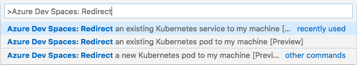
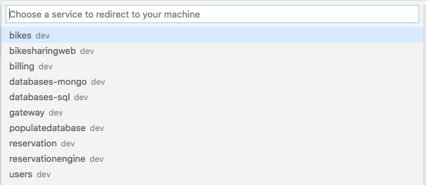
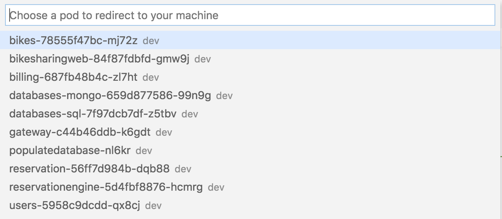
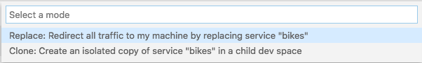
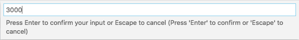
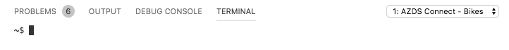
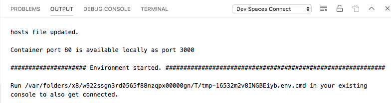

# Azure Dev Spaces Connect (preview)

Azure Dev Spaces Connect allows you to run and debug code with or without a container on your development machine, while still connected to your Kubernetes cluster with the rest of your application or services. Connecting your development machine to your cluster helps you to quickly develop your application and perform end-to-end testing without having to create any Docker or Kubernetes configuration. You can also connect to your AKS cluster without affecting other workloads or users who may be using the same cluster.

Azure Dev Spaces Connect redirects traffic between your connected AKS cluster and your development machine. This traffic redirection allows code on your development machine and services running in your AKS cluster to communicate as if they are in the same AKS cluster. Since your code is running on your development machine, you also have flexibility in the development tools you are using to run and debug that code. Azure Dev Spaces Connect also provides a way to replicate environment variables and mounted files available to pods in your AKS cluster in your development machine.

In this guide, you will learn how to:

- Set up Azure Dev Spaces on a managed Kubernetes cluster in Azure.
- Deploy a large application with multiple microservices to a dev space.
- Use Azure Dev Spaces Connect to redirect traffic between your AKS cluster and code running on your development machine.

> [!IMPORTANT]
> This feature is currently in preview. Previews are made available to you on the condition that you agree to the [supplemental terms of use](https://azure.microsoft.com/support/legal/preview-supplemental-terms/). Some aspects of this feature may change prior to general availability (GA).

## Before you begin

This guide uses the [Azure Dev Spaces Bike Sharing sample application](https://github.com/Azure/dev-spaces/tree/master/samples/BikeSharingApp) to demonstrate Azure Dev Spaces Connect. If you have your own application on AKS cluster you would like to use instead, you can start [here](#use-azure-dev-spaces-connect).

### Limitations

* UDP is not supported with Azure Dev Spaces Connect at this time.

### Prerequisites

* An Azure subscription. If you don't have an Azure subscription, you can create a [free account](https://azure.microsoft.com/free).
* [Azure CLI installed][azure-cli].
* [Helm 2.13 or greater installed][helm-installed].
* [Visual Studio Code][vs-code] with the [Azure Dev Spaces][azds-vs-code] extension installed and running on MacOS or Windows 10.

## Create an Azure Kubernetes Service cluster

You must create an AKS cluster in a [supported region][supported-regions]. The below commands create a resource group called *MyResourceGroup* and an AKS cluster called *MyAKS*.

```cmd
az group create --name MyResourceGroup --location eastus
az aks create -g MyResourceGroup -n MyAKS --location eastus --disable-rbac --generate-ssh-keys
```

## Enable Azure Dev Spaces on your AKS cluster

Use the `use-dev-spaces` command to enable Dev Spaces on your AKS cluster and follow the prompts. The below command enables Dev Spaces on the *MyAKS* cluster in the *MyResourceGroup* group and creates a dev space called *dev*.

> [!NOTE]
> The `use-dev-spaces` command will also install the Azure Dev Spaces CLI if its not already installed. You cannot install the Azure Dev Spaces CLI in the Azure Cloud Shell.

```cmd
az aks use-dev-spaces -g MyResourceGroup -n MyAKS --space dev --yes
```

## Get sample application code

In this article, you use the [Azure Dev Spaces Bike Sharing sample application](https://github.com/Azure/dev-spaces/tree/master/samples/BikeSharingApp) to demonstrate using Azure Dev Spaces.

Clone the application from GitHub and navigate into its directory:

```cmd
git clone https://github.com/Azure/dev-spaces
cd dev-spaces/samples/BikeSharingApp/
```

## Retrieve the HostSuffix for *dev*

Use the `azds show-context` command to show the HostSuffix for *dev*.

```cmd
$ azds show-context

Name                ResourceGroup     DevSpace  HostSuffix
------------------  ----------------  --------  -----------------------
MyAKS               MyResourceGroup   dev       fedcab0987.eus.azds.io
```

## Update the Helm chart with your HostSuffix

Open [charts/values.yaml](https://github.com/Azure/dev-spaces/blob/master/samples/BikeSharingApp/charts/values.yaml) and replace all instances of `<REPLACE_ME_WITH_HOST_SUFFIX>` with the HostSuffix value you retrieved earlier. Save your changes and close the file.

## Run the sample application in Kubernetes

The commands for running the sample application on Kubernetes are part of an existing process and have no dependency on Azure Dev Spaces tooling. In this case, Helm is the tooling used to run this sample application but other tooling could be used to run your entire application in a namespace within a cluster. The Helm commands are targeting the dev space named *dev* you created earlier, but this dev space is also a Kubernetes namespace. As a result, dev spaces can be targeted by other tooling the same as other namespaces.

You can use Azure Dev Spaces for development after an application is running in a cluster regardless of the tooling used to deploy it.

### Use Helm to install the sample application

Use the `helm init` and `helm install` commands to set up and install the sample application on your cluster.

```cmd
cd charts/
helm init --wait
helm install -n bikesharing . --dep-up --namespace dev --atomic 
```

> [!Note]
> **If you are using an RBAC-enabled cluster**, be sure to configure [a service account for Tiller](https://helm.sh/docs/using_helm/#role-based-access-control). Otherwise, `helm` commands will fail.

The `helm install` command may take several minutes to complete. The output of the command shows the status of all the services it deployed to the cluster when completed:

```cmd
$ cd charts/
$ helm init --wait
...
Happy Helming!

$ helm install -n bikesharing . --dep-up --namespace dev --atomic

Hang tight while we grab the latest from your chart repositories...
...
NAME               READY  UP-TO-DATE  AVAILABLE  AGE
bikes              1/1    1           1          4m32s
bikesharingweb     1/1    1           1          4m32s
billing            1/1    1           1          4m32s
gateway            1/1    1           1          4m32s
reservation        1/1    1           1          4m32s
reservationengine  1/1    1           1          4m32s
users              1/1    1           1          4m32s
```

### Navigate to your sample application

After the sample application is installed on your cluster and since you have Dev Spaces enabled on your cluster, use the `azds list-uris` command to display the URLs for the sample application in *dev* that is currently selected.

```cmd
$ azds list-uris
Uri                                                 Status
--------------------------------------------------  ---------
http://dev.bikesharingweb.fedcab0987.eus.azds.io/  Available
http://dev.gateway.fedcab0987.eus.azds.io/         Available
```

Navigate to the *bikesharingweb* service by opening the public URL from the `azds list-uris` command. In the above example, the public URL for the *bikesharingweb* service is `http://dev.bikesharingweb.fedcab0987.eus.azds.io/`. Select *Aurelia Briggs (customer)* as the user, then select a bike to rent. Verify you see a placeholder image for the bike.

## Use Azure Dev Spaces Connect

Open *dev-spaces/samples/BikeSharingApp/Bikes* in Visual Studio Code and use the Azure Dev Spaces Connect extension to connect your development machine to your AKS cluster.

To use the Azure Dev Spaces Connect extension, open the Command Palette in Visual Studio Code by clicking *View* then *Command Palette*. Begin typing `Azure Dev Spaces: Redirect` and click on either `Azure Dev Spaces: Redirect an existing Kubernetes service to my machine [Preview]`, `Azure Dev Spaces: Redirect an existing Kubernetes pod to my machine [Preview]`, or `Azure Dev Spaces: Redirect a new Kubernetes pod to my machine [Preview]`.



### Select a redirection option

If you run `Azure Dev Spaces: Redirect an existing Kubernetes service to my machine [Preview]`, you are asked to choose an existing Kubernetes service:



This option redirects all traffic in the AKS cluster for this service to the version of your application running in your development machine. If this service has multiple pods running in the AKS cluster, all traffic for this service is only routed to your development machine. Azure Dev Spaces Connect also routes all outbound traffic from the application back to your AKS cluster.

If you run `Azure Dev Spaces: Redirect an existing Kubernetes pod to my machine [Preview]`, you are asked to choose a specific pod:



This option connects to a specific pod. This option is useful for interacting with pods that do not send or receive traffic and replicating terminated pods. If the pod does send and receive traffic, this option behaves in a similar way to `Azure Dev Spaces: Redirect an existing Kubernetes service to my machine [Preview]` and will redirect all traffic in the AKS cluster for all pods related to the service of the selected pod.

If you run `Azure Dev Spaces: Redirect a new Kubernetes pod to my machine [Preview]`, you are not prompted to select an existing pod or service. This option redirects all outbound traffic from the application running on your development machine to the AKS cluster.

For this example, choose `Azure Dev Spaces: Redirect an existing Kubernetes service to my machine [Preview]` and select the *bikes* service.

### Select a connection mode

After you select your redirection option, you are prompted to choose either the *Replace* or *Clone* connection mode.



The *Replace* option replaces current pod or service in the AKS cluster and redirects all the traffic for that service to your development machine. This option can be disruptive to other services in your AKS cluster that interact with the service you are redirecting may not function until you start the application on your development machine. The *Clone* option allows you to choose an existing child dev space or create a new child dev space for redirecting traffic for a pod or service to your development machine. This option allows you to work in isolation and not disrupt other services since only traffic to that child dev space will be redirected to your development machine. The *Clone* option requires your AKS cluster to have Azure Dev Spaces enabled.

For this example, choose *Replace*.

> [!NOTE]
> If your existing service's pod has multiple containers, you are also prompted to choose the application's container.

### Select a port for your application

After you select your connection mode, you are prompted to enter the TCP port your local application. If your application opens multiple ports, separate them by a comma for example *80,81*. If your application does not accept any network requests, enter *0*. For this example, enter *8080*.



### Confirm you are connected

After you select your application's TCP port, Azure Dev Spaces Connect will establish a connection to the AKS cluster. Azure Dev Spaces Connect injects an agent into your AKS cluster to redirect traffic between the AKS cluster and your development machine. Establishing this connection may take a few minutes. Azure Dev Spaces Connect will also request administrator access in order to modify the *hosts* file in your development machine.

> [!IMPORTANT]
> Once Azure Dev Spaces Connect establishes a connection to your AKS cluster, the other services in your AKS cluster may not function correctly until you start the service in your development machine. Also, if your service has a dependency that is not available in your development machine, you may need to modify your application or provide [additional configuration](#additional-configuration)

Azure Dev Spaces Connect opens a terminal window titled *AZDS Connect - Bikes* after it establishes a connection to your AKS cluster. This terminal window has all the environment variables and DNS entries configured from your AKS cluster. Any code you run in this terminal window or using the Visual Studio Code debugger is connected to the AKS cluster.



Additionally, Azure Dev Spaces Connect creates a window titled *Dev Spaces Connect* with all its output.



Azure Dev Spaces Connect also has a status bar item showing the connection status.


Verify the status bar shows *Dev Spaces: Connected to dev/bikes on local port 8080*.

### Configure your application on your development machine

Open the *AZDS Connect - Bikes* terminal window and run `npm install`:

```console
$ npm install

> fsevents@1.2.9 install ./dev-spaces/samples/BikeSharingApp/Bikes/node_modules/fsevents
> node install
...
```

Open [server.js](https://github.com/Azure/dev-spaces/blob/master/samples/BikeSharingApp/Bikes/server.js#L352) and on line 352 update *port* to *8080*:

```javascript
var port = 8080;
var server = null;
```

Click *Debug* then *Open Configurations*. This creates a `.vscode/launch.json` file. Replace the contents of that file with the following:

```json
{
    "configurations": [
        ...
        {
            "type": "node",
            "request": "launch",
            "name": "Launch via NPM",
            "runtimeExecutable": "npm",
            "runtimeArgs": [
                "run-script",
                "debug"
            ],
            "port": 9229
        }
    ]
}
```

Open [package.json](https://github.com/Azure/dev-spaces/blob/master/samples/BikeSharingApp/Bikes/package.json) and add a debugging script:

```json
  "devDependencies": {
    "nodemon": "^1.18.10"
  },
  "scripts": {
    "debug": "node --nolazy --inspect-brk=9229 server.js"
  }
```

### Start your application on your development machine

Click on the *Debug* icon on the left and click on the start button next to *Launch via NPM* at the top.


Your application will start and Azure Dev Spaces Connect redirects traffic between your AKS cluster and your development machine. You will see messages similar to the below in the *Debug Console*:

```console
/usr/local/bin/npm run-script debug 
...
Debugger attached.
Collection: bikes
MongoDB connection string: mongodb://databases-mongo
Connected to MongoDB
Listening on port 8080
```

Navigate to the *bikesharingweb* service by clicking on the Azure Dev Spaces Connect status bar and choosing the public URL of your application. You can also find the public URL from the `azds list-uris` command you ran earlier. If you are not using Azure Dev Spaces on your cluster, use the IP or the URL for the application for the namespace you are using. In the above example, the public URL for the *bikesharingweb* service is `http://dev.bikesharingweb.fedcab0987.eus.azds.io/`. Select *Aurelia Briggs (customer)* as the user, then select a bike to rent.

### Set a break point

Open [server.js](https://github.com/Azure/dev-spaces/blob/master/samples/BikeSharingApp/Bikes/server.js#L233) and click somewhere on line 233 to put your cursor there. Set a breakpoint by hitting *F9* or clicking *Debug* then *Toggle Breakpoint*.

Navigate to the *bikesharingweb* service by opening the public URL. Select *Aurelia Briggs (customer)* as the user, then select a bike to rent. Notice the image for the bike does not load. Return to Visual Studio Code and observe line 233 is highlighted. The breakpoint you set has paused the service at line 233. To resume the service, hit *F5* or click *Debug* then *Continue*. Return to your browser and verify you see a placeholder image for the bike.

Remove the breakpoint by putting your cursor on line 233 in `server.js` and hitting *F9*.

### Update your application

Edit `server.js` to remove lines 232 and 233:

```javascript
    // Hard code image url *FIX ME*
    theBike.imageUrl = "/static/logo.svg";
```

The section should now look like:

```javascript
    var theBike = result;
    theBike.id = theBike._id;
    delete theBike._id;
```

Save your changes and click *Debug* then *Restart Debugging*. Refresh your browser and verify that you no longer see a placeholder image for the bike.

Click *Debug* then *Stop Debugging* to stop the debugger. Click on the Azure Dev Spaces Connect status bar to disconnect from the AKS cluster.

## Additional configuration

Azure Dev Spaces Connect can handle routing traffic and replicating environment variables without any additional configuration. If you need to download any files that are mounted to the container in your AKS cluster, such as a ConfigMap file, you can create a `azds-local.env` to download those files to your development machine.

Here is an example `azds-local.env`:

```
# This downloads the "whitelist" volume from the container,
# saves it to a temporary directory on your development machine,
# and sets the full path to an environment variable called WHITELIST_PATH.

WHITELIST_PATH=${volumes.whitelist}/whitelist

# This downloads a file from the container's 'default-token-<any>' mount directory 
# to /var/run/secrets/kubernetes.io/serviceaccount on your development machine.

KUBERNETES_IN_CLUSTER_CONFIG_OVERWRITE=${volumes.default-token-*|/var/run/secrets/kubernetes.io/serviceaccount}


# This makes the myapp1 service available to your development machine
# regardless of the AKS cluster you are connected to and
# sets the local IP to an environment variable called MYAPP1_SERVICE_HOST.

MYAPP1_SERVICE_HOST=${services.myapp1}

# If the myapp1 service is made available in this way, 
# you can also access it using "myapp1" and "myapp1.svc.cluster.local"
# in addition to the IP in the MYAPP1_SERVICE_HOST environment variable.
```

## Next steps

Learn how to use Azure Dev Spaces and GitHub Actions to test changes from a pull request directly in AKS before the pull request is merged into your repository’s main branch.

> [!div class="nextstepaction"]
> [GitHub Actions & Azure Kubernetes Service][gh-actions]

[azds-vs-code]: https://marketplace.visualstudio.com/items?itemName=azuredevspaces.azds
[azure-cli]: /cli/azure/install-azure-cli?view=azure-cli-latest
[bike-sharing-github]: https://github.com/Azure/dev-spaces/tree/master/samples/BikeSharingApp
[gh-actions]: github-actions.md
[helm-installed]: https://helm.sh/docs/using_helm/#installing-helm
[supported-regions]: ../about.md#supported-regions-and-configurations
[team-quickstart]: ../quickstart-team-development.md
[vs-code]: https://code.visualstudio.com/download