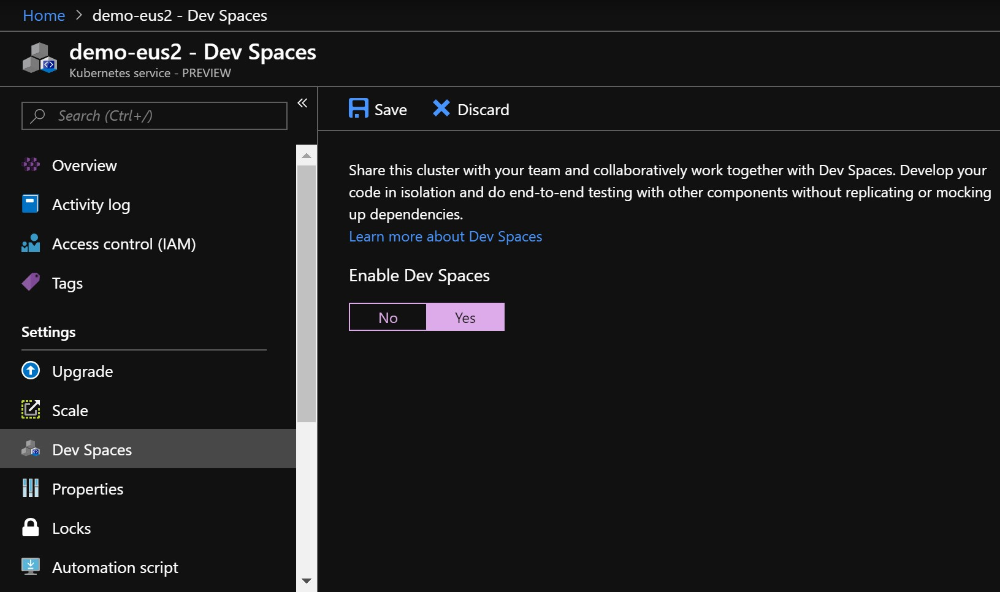

# Business continuity and disaster recovery in Azure Dev Spaces

## Review disaster recovery guidance for Azure Kubernetes Service (AKS)

Azure Dev Spaces is a feature of Azure Kubernetes Service (AKS). You should be aware of guidelines for disaster recovery in AKS and consider whether they apply to the AKS clusters that you use for Dev Spaces. For more information, please reference [Best practices for business continuity and disaster recovery in Azure Kubernetes Service (AKS)](https://docs.microsoft.com/azure/aks/operator-best-practices-multi-region)

## Enable Dev Spaces on AKS clusters in different regions

Enabling Dev Spaces on AKS clusters in different regions allows you to resume using Dev Spaces immediately after an Azure region failure.

For general information about multi-region deployments of AKS, see [Plan for multi-region deployment](https://docs.microsoft.com/azure/aks/operator-best-practices-multi-region#plan-for-multiregion-deployment)

For information about deploying an AKS cluster that is compatible with Azure Dev Spaces, see [Create a Kubernetes cluster using Azure Cloud Shell](https://docs.microsoft.com/azure/dev-spaces/how-to/create-cluster-cloud-shell)

### Enable Dev Spaces via the Azure portal

Click the **Dev Spaces** navigation item under the properties of each cluster in the Azure portal. Then choose the option to enable Dev Spaces.



Repeat this process for each cluster.

### Enable Dev Spaces via the Azure CLI

You can also enable Dev Spaces at the command line:

```cmd
az aks use-dev-spaces -g <resource group name> -n <cluster name>
```

## Deploy your team's baseline to each cluster

When working with Dev Spaces, you typically deploy the entire application to a parent dev space on your Kubernetes cluster. By default, the `default` space is used. The initial deployment includes all services as well as the external resources that those services depend on, such as databases or queues. This is known as the *baseline*. Once you set up a baseline in the parent dev space, you iterate on and debug individual services inside child dev spaces.

You should deploy the most recent versions of your baseline set of services to clusters in multiple regions. Updating your baseline services in this manner ensures that you can continue to use Dev Spaces if there is an Azure region failure. For example, if you deploy your baseline via a CI/CD pipeline, modify the pipeline so that it deploys to multiple clusters in different regions.

## Select the correct AKS cluster to use for Dev Spaces

Once you've properly configured a backup cluster running your team's baseline, you can quickly switch over to the backup cluster at any time. Then you can rerun the individual services that you are working on in Dev Spaces.

Select a different cluster with the following CLI command:

```cmd
az aks use-dev-spaces -g <new resource group name> -n <new cluster name>
```

You can list the available dev spaces on the new cluster with the following command:

```cmd
azds space list
```

You can create a new dev space to work in, or select an existing dev space, with the following command:

```cmd
azds space select -n <space name>
```

After running these commands, the selected cluster and dev space will be used for subsequent CLI operations, and for debugging projects using the Visual Studio Code extension for Azure Dev Spaces.

If you are using Visual Studio, you can switch the cluster used by an existing project through the following steps:

1. Open your project in Visual Studio.
1. Right click the project name in Solution Explorer and click **Properties**
1. In the left pane, click **Debug**
1. On the Debug properties page, click the **Profile** drop-down list and choose **Azure Dev Spaces**.
1. Click the **Change** button.
1. In the dialog that appears, select the AKS cluster that you wish to use. If desired, choose a different dev space to work in, or create a new dev space, by selecting the appropriate option from the **Space** drop-down list.

Once you have selected the correct cluster and space, you can press F5 to run the service in Dev Spaces.

Repeat these steps for any other projects configured to use the original cluster.

## Access a service on a backup cluster

If you have configured your service to use a public DNS name, then the service will have a different URL if you run it on a backup cluster. Public DNS names are always in the format `<space name>.s.<root space name>.<service name>.<cluster GUID>.<region>.azds.io`. If you switch to a different cluster, the cluster GUID and possibly the region will change.

Dev Spaces always shows the correct URL for the service when running `azds up`, or in the Output window in Visual Studio under **Azure Dev Spaces**.

You can also find the URL by running the `azds list-uris` command:
```
$ azds list-uris
Uri                                                     Status
------------------------------------------------------  ---------
http://default.mywebapi.d05afe7e006a4fddb73c.eus.azds.io/  Available
```

Use this URL when accessing the service.
