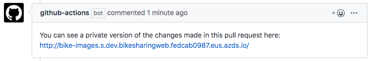

# GitHub Actions & Azure Kubernetes Service (preview)

Azure Dev Spaces provides a workflow using GitHub Actions that allows you to test changes from a pull request directly in AKS before the pull request is merged into your repository's main branch. Having a running application to review changes of a pull request can increase the confidence of both the developer as well as team members. This running application can also help team members such as, product managers and designers, become part of the review process during early stages of development.

In this guide, you will learn how to:

* Set up Azure Dev Spaces on a managed Kubernetes cluster in Azure.
* Deploy a large application with multiple microservices to a dev space.
* Set up CI/CD with GitHub actions.
* Test a single microservice in an isolated dev space within the context of the full application.

> [!IMPORTANT]
> This feature is currently in preview. Previews are made available to you on the condition that you agree to the [supplemental terms of use](https://azure.microsoft.com/support/legal/preview-supplemental-terms/). Some aspects of this feature may change prior to general availability (GA).

## Prerequisites

* An Azure subscription. If you don't have an Azure subscription, you can create a [free account](https://azure.microsoft.com/free).
* [Azure CLI installed][azure-cli-installed].
* [Helm 3 installed][helm-installed].
* A GitHub Account with [GitHub Actions enabled][github-actions-beta-signup].
* The [Azure Dev Spaces Bike Sharing sample application](https://github.com/Azure/dev-spaces/tree/master/samples/BikeSharingApp/README.md) running on an AKS cluster.

## Create an Azure Container Registry

Create an Azure Container Registry (ACR):

```azurecli
az acr create --resource-group MyResourceGroup --name <acrName> --sku Basic
```

> [!IMPORTANT]
> The name your ACR must be unique within Azure and contain 5-50 alphanumeric characters. Any letters you use must be lower case.

Save the *loginServer* value from the output because it is used in a later step.

## Create a service principal for authentication

Use [az ad sp create-for-rbac][az-ad-sp-create-for-rbac] to create a service principal. For example:

```azurecli
az ad sp create-for-rbac --sdk-auth --skip-assignment
```

Save the JSON output because it is used in a later step.

Use [az aks show][az-aks-show] to display the *ID* of your AKS cluster:

```azurecli
az aks show -g MyResourceGroup -n MyAKS  --query id
```

Use [az acr show][az-acr-show] to display the *ID* of the ACR:

```azurecli
az acr show --name <acrName> --query id
```

Use [az role assignment create][az-role-assignment-create] to give *Contributor* access to your AKS cluster and *AcrPush* access to your ACR.

```azurecli
az role assignment create --assignee <ClientId> --scope <AKSId> --role Contributor
az role assignment create --assignee <ClientId>  --scope <ACRId> --role AcrPush
```

> [!IMPORTANT]
> You must be the owner of both your AKS cluster and ACR in order to give your service principal access to those resources.

## Configure your GitHub action

> [!IMPORTANT]
> You must have GitHub Actions enabled for your repository. To enable GitHub Actions for your repository, navigate to your repository on GitHub, click on the Actions tab, and choose to enable actions for this repository.

Navigate to your forked repository and click *Settings*. Click on *Secrets* in the left sidebar. Click *Add a new secret* to add each new secret below:

1. *AZURE_CREDENTIALS*: the entire output from the service principal creation.
1. *RESOURCE_GROUP*: the resource group for your AKS cluster, which in this example is *MyResourceGroup*.
1. *CLUSTER_NAME*: the name of your AKS cluster, which in this example is *MyAKS*.
1. *CONTAINER_REGISTRY*: the *loginServer* for the ACR.
1. *HOST*: the host for your Dev Space, which takes the form *<MASTER_SPACE>.<APP_NAME>.<HOST_SUFFIX>*, which in this example is *dev.bikesharingweb.fedcab0987.eus.azds.io*.
1. *IMAGE_PULL_SECRET*: the name of the secret you wish to use, for example *demo-secret*.
1. *MASTER_SPACE*: the name of your parent Dev Space, which in this example is *dev*.
1. *REGISTRY_USERNAME*: the *clientId* from the JSON output from the service principal creation.
1. *REGISTRY_PASSWORD*: the *clientSecret* from the JSON output from the service principal creation.

> [!NOTE]
> All of these secrets are used by the GitHub action and are configured in [.github/workflows/bikes.yml][github-action-yaml].

Optionally, if you want to update the master space after your PR is merged, add the *GATEWAY_HOST* secret, which takes the form *<MASTER_SPACE>.gateway.<HOST_SUFFIX>*, which in this example is *dev.gateway.fedcab0987.eus.azds.io*. Once you merge your changes into the master branch in your fork, another action will run to rebuild and run your entire application in the master dev space. In this example, the master space is *dev*. This action is configured in [.github/workflows/bikesharing.yml][github-action-bikesharing-yaml].

Additionally, if you would like the changes in your PR to run in a grandchild space, update the *MASTER_SPACE* and *HOST* secrets. For example, if your application is running in *dev* with a child space *dev/azureuser1*, to have the PR run in a child space of *dev/azureuser1*:

* Update *MASTER_SPACE* to the child space you want as the parent space, in this example *azureuser1*.
* Update *HOST* to *<GRANDPARENT_SPACE>.<APP_NAME>.<HOST_SUFFIX>*, in this example *dev.bikesharingweb.fedcab0987.eus.azds.io*.

## Create a new branch for code changes

Navigate to `BikeSharingApp/` and create a new branch called *bike-images*.

```cmd
cd dev-spaces/samples/BikeSharingApp/
git checkout -b bike-images
```

Edit [Bikes/server.js][bikes-server-js] to remove lines 232 and 233:

```javascript
    // Hard code image url *FIX ME*
    theBike.imageUrl = "/static/logo.svg";
```

The section should now look like:

```javascript
    var theBike = result;
    theBike.id = theBike._id;
    delete theBike._id;
```

Save the file then use `git add` and `git commit` to stage your changes.

```cmd
git add Bikes/server.js 
git commit -m "Removing hard coded imageUrl from /bikes/:id route"
```

## Push your changes

Use `git push` to push your new branch to your forked repository:

```cmd
git push origin bike-images
```

After the push is complete, navigate to your forked repository on GitHub to create a pull request with the *master* branch in your forked repository as the base branch compared to the *bike-images* branch.

After your pull request is opened, navigate to the *Actions* tab. Verify a new action has started and is building the *Bikes* service.

## View the child space with your changes

After the action has completed, you will see a comment with a URL to your new child space based the changes in the pull request.

> [!div class="mx-imgBorder"]
> 

Navigate to the *bikesharingweb* service by opening the URL from the comment. Select *Aurelia Briggs (customer)* as the user, then select a bike to rent. Verify you no longer see the placeholder image for the bike.

If you merge your changes into the *master* branch in your fork, another action will run to rebuild and run your entire application in the parent dev space. In this example, the parent space is *dev*. This action is configured in [.github/workflows/bikesharing.yml][github-action-bikesharing-yaml].

## Clean up your Azure resources

```azurecli
az group delete --name MyResourceGroup --yes --no-wait
```

## Next steps

Learn how Azure Dev Spaces helps you develop more complex applications across multiple containers, and how you can simplify collaborative development by working with different versions or branches of your code in different spaces.

> [!div class="nextstepaction"]
> [Team development in Azure Dev Spaces][team-quickstart]

[azure-cli-installed]: /cli/azure/install-azure-cli?view=azure-cli-latest
[az-ad-sp-create-for-rbac]: /cli/azure/ad/sp#az-ad-sp-create-for-rbac
[az-acr-show]: /cli/azure/acr#az-acr-show
[az-aks-show]: /cli/azure/aks?view=azure-cli-latest#az-aks-show
[az-role-assignment-create]: /cli/azure/role/assignment#az-role-assignment-create
[bikes-server-js]: https://github.com/Azure/dev-spaces/blob/master/samples/BikeSharingApp/Bikes/server.js#L232-L233
[bike-sharing-gh]: https://github.com/Azure/dev-spaces/
[bike-sharing-values-yaml]: https://github.com/Azure/dev-spaces/blob/master/samples/BikeSharingApp/charts/values.yaml
[github-actions-beta-signup]: https://github.com/features/actions
[github-action-yaml]: https://github.com/Azure/dev-spaces/blob/master/.github/workflows/bikes.yml
[github-action-bikesharing-yaml]: https://github.com/Azure/dev-spaces/blob/master/.github/workflows/bikesharing.yml
[helm-installed]: https://helm.sh/docs/intro/install/
[supported-regions]: https://azure.microsoft.com/global-infrastructure/services/?products=kubernetes-service
[sp-acr]: ../../container-registry/container-registry-auth-service-principal.md
[sp-aks]: ../../aks/kubernetes-service-principal.md
[team-quickstart]: ../quickstart-team-development.md
