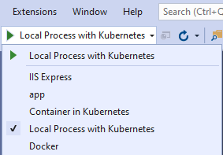
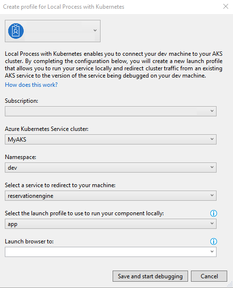

# Use Local Process with Kubernetes with Visual Studio (preview)

Local Process with Kubernetes allows you to run and debug code on your development computer, while still connected to your Kubernetes cluster with the rest of your application or services. For example, if you have a large microservices architecture with many interdependent services and databases, replicating those dependencies on your development computer can be difficult. Additionally, building and deploying code to your Kubernetes cluster for each code change during inner-loop development can be slow, time consuming, and difficult to use with a debugger.

Local Process with Kubernetes avoids having to build and deploy your code to your cluster by instead creating a connection directly between your development computer and your cluster. Connecting your development computer to your cluster while debugging allows you to quickly test and develop your service in the context of the full application without creating any Docker or Kubernetes configuration.

Local Process with Kubernetes redirects traffic between your connected Kubernetes cluster and your development computer. This traffic redirection allows code on your development computer and services running in your Kubernetes cluster to communicate as if they are in the same Kubernetes cluster. Local Process with Kubernetes also provides a way to replicate environment variables and mounted volumes available to pods in your Kubernetes cluster in your development computer. Providing access to environment variables and mounted volumes on your development computer allows you to quickly work on your code without having replicate those dependencies manually.

In this guide, you will learn how to use Local Process with Kubernetes to redirect traffic between your Kubernetes cluster and code running on your development computer. This guide also provides a script for deploying a large sample application with multiple microservices on a Kubernetes cluster.

> [!IMPORTANT]
> This feature is currently in preview. Previews are made available to you on the condition that you agree to the [supplemental terms of use][preview-terms]. Some aspects of this feature may change prior to general availability (GA).

## Before you begin

This guide uses the [Azure Dev Spaces Bike Sharing sample application][bike-sharing-github] to demonstrate connecting your development computer to a Kubernetes cluster. If you already have your own application running on a Kubernetes cluster, you can still follow the steps below and use the names of your own services.

### Prerequisites

* An Azure subscription. If you don't have an Azure subscription, you can create a [free account](https://azure.microsoft.com/free).
* [Azure CLI installed][azure-cli].
* [Visual Studio 2019][visual-studio] version 16.7 Preview 2 or greater running on Windows 10 with the *ASP.NET and web development* and *Azure development* workloads installed.
* [Azure Dev Spaces CLI installed][azds-cli].

### Enable the Local Process with Kubernetes preview feature in Visual Studio

To enable Local Process with Kubernetes in Visual Studio, click *Tools* > *Options* > *Environment* > *Preview Features*. Select *Enable local debugging for Kubernetes services*.

Also, for .NET console applications, install the *Microsoft.VisualStudio.Azure.Kubernetes.Tools.Targets* NuGet Package.

## Create a Kubernetes cluster

Create an AKS cluster in a [supported region][supported-regions]. The below commands create a resource group called *MyResourceGroup* and an AKS cluster called *MyAKS*.

```azurecli-interactive
az group create \
    --name MyResourceGroup \
    --location eastus

az aks create \
    --resource-group MyResourceGroup \
    --name MyAKS \
    --location eastus \
    --node-count 3 \
    --generate-ssh-keys
```

## Install the sample application

Install the sample application on your cluster using the provided script. You can run this script on your development computer or using the [Azure Cloud Shell][azure-cloud-shell].

```azurecli-interactive
git clone https://github.com/Azure/dev-spaces
cd dev-spaces/
chmod +x ./local-process-quickstart.sh
./local-process-quickstart.sh -g MyResourceGroup -n MyAKS
```

Navigate to the sample application running your cluster by opening its public URL, which is displayed in the output of the installation script.

```console
$ ./local-process-quickstart.sh -g MyResourceGroup -n MyAKS
Defaulting Dev spaces repository root to current directory : ~/dev-spaces
Setting the Kube context
...
To try out the app, open the url:
dev.bikesharingweb.EXTERNAL_IP.nip.io
```

In the above sample, the public URL is `dev.bikesharingweb.EXTERNAL_IP.nip.io`.

## Connect to your cluster and debug a service

On your development computer, download and configure the Kubernetes CLI to connect to your Kubernetes cluster using [az aks get-credentials][az-aks-get-credentials].

```azurecli
az aks get-credentials --resource-group MyResourceGroup --name MyAKS
```

Open *dev-spaces/samples/BikeSharingApp/ReservationEngine/app.csproj* from the [Azure Dev Spaces Bike Sharing sample application][bike-sharing-github] in Visual Studio.

In your project, select *Local Process with Kubernetes* from the launch settings dropdown as shown below.



Click on the start button next to *Local Process with Kubernetes*. In the *Local Process with Kubernetes* dialog:

* Select your subscription.
* Select *MyAKS* for your cluster.
* Select *dev* for your namespace.
* Select *reservationengine* for the service to redirect.
* Select *app* for the launch profile.
* Select `http://dev.bikesharingweb.EXTERNAL_IP.nip.io` for the URL to launch your browser.



> [!IMPORTANT]
> You can only redirect services that have a single pod.

Click *Save and start debugging*.

All traffic in the Kubernetes cluster is redirected for the *reservationengine* service to the version of your application running in your development computer. Local Process with Kubernetes also routes all outbound traffic from the application back to your Kubernetes cluster.

> [!NOTE]
> You will be prompted to allow the *KubernetesDNSManager* to run elevated and modify your hosts file.

Your development computer is connected when the status bar shows you are connected to the *reservationengine* service.


> [!NOTE]
> On subesquent launches, you will not be prompted with the *Local Process with Kubernetes* dialog. You update these settings in the *Debug* pane in the project properties.

Once your development computer is connected, traffic starts redirecting to your development computer for the service you are replacing.

## Set a break point

Open [BikesHelper.cs][bikeshelper-cs-breakpoint] and click somewhere on line 26 to put your cursor there. Set a breakpoint by hitting *F9* or clicking *Debug* then *Toggle Breakpoint*.

Navigate to the sample application by opening the public URL. Select *Aurelia Briggs (customer)* as the user, then select a bike to rent. Click *Rent Bike*. Return to Visual Studio and observe line 26 is highlighted. The breakpoint you set has paused the service at line 26. To resume the service, hit *F5* or click *Debug* then *Continue*. Return to your browser and verify the page shows you have rented the bike.

Remove the breakpoint by putting your cursor on line 26 in `BikesHelper.cs` and hitting *F9*.

> [!NOTE]
> By default, stopping the debugging task also disconnects your development computer from your Kubernetes cluster. You can change this behavior by changing *Disconnect after debugging* to *false* in the *Kubernetes Debugging Tools* section of the debugging options. After updating this setting, your development computer will remain connected when you stop and start debugging. To disconnect your development computer from you cluster click on the *Disconnect* button on the toolbar.
>
> If Visual Studio abruptly ends the connection to the cluster or terminates, the service you are redirecting may not be restored to its original state before you connected with Local Process with Kubernetes. To fix this issue, see the [Troubleshooting guide][troubleshooting].

## Using logging and diagnostics

You can find the diagnostic logs in `Azure Dev Spaces` directory in your [development computer's *TEMP* directory][azds-tmp-dir].

## Remove the sample application from your cluster

Use the provided script to remove the sample application from your cluster.

```azurecli-interactive
./local-process-quickstart.sh -c -g MyResourceGroup -n MyAKS
```

## Next steps

Learn how to use Azure Dev Spaces and GitHub Actions to test changes from a pull request directly in AKS before the pull request is merged into your repository’s main branch.

> [!div class="nextstepaction"]
> [GitHub Actions & Azure Kubernetes Service][gh-actions]

[azds-cli]: install-dev-spaces.md#install-the-client-side-tools
[azds-tmp-dir]: ../troubleshooting.md#before-you-begin
[azds-vs-code]: https://marketplace.visualstudio.com/items?itemName=azuredevspaces.azds
[azure-cli]: /cli/azure/install-azure-cli?view=azure-cli-latest
[azure-cloud-shell]: ../../cloud-shell/overview.md
[az-aks-get-credentials]: /cli/azure/aks?view=azure-cli-latest#az-aks-get-credentials
[az-aks-vs-code]: https://marketplace.visualstudio.com/items?itemName=ms-kubernetes-tools.vscode-aks-tools
[bike-sharing-github]: https://github.com/Azure/dev-spaces/tree/master/samples/BikeSharingApp
[gh-actions]: github-actions.md
[preview-terms]: https://azure.microsoft.com/support/legal/preview-supplemental-terms/
[bikeshelper-cs-breakpoint]: https://github.com/Azure/dev-spaces/blob/master/samples/BikeSharingApp/ReservationEngine/BikesHelper.cs#L26
[supported-regions]: https://azure.microsoft.com/global-infrastructure/services/?products=kubernetes-service
[troubleshooting]: ../troubleshooting.md#fail-to-restore-original-configuration-of-deployment-on-cluster
[visual-studio]: https://www.visualstudio.com/vs/