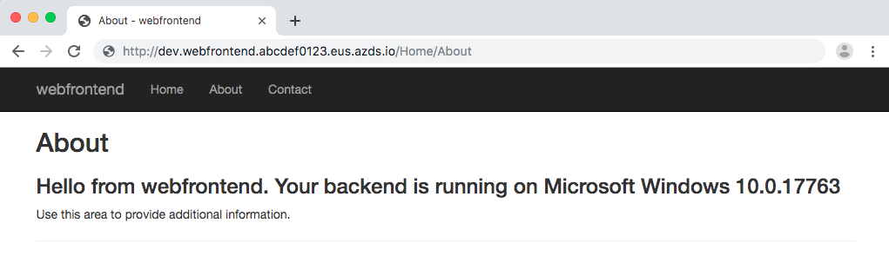

# Interact with Windows containers using Azure Dev Spaces

You can enable Azure Dev Spaces on both new and existing Kubernetes namespaces. Azure Dev Spaces will run and instrument services that run on Linux containers. Those services can also interact with applications that run on Windows containers in the same namespace. This article shows you how to use Dev Spaces to run services in a namespace with existing Windows containers. At this time, you cannot debug or attach to Windows containers with Azure Dev Spaces.

## Set up your cluster

This article assumes you already have a cluster with both Linux and Windows node pools. If you need to create a cluster with Linux and Windows node pools, you can follow the instructions [here][windows-container-cli].

Connect to your cluster using [kubectl][kubectl], the Kubernetes command-line client. To configure `kubectl` to connect to your Kubernetes cluster, use the [az aks get-credentials][az-aks-get-credentials] command. This command downloads credentials and configures the Kubernetes CLI to use them.

```azurecli-interactive
az aks get-credentials --resource-group myResourceGroup --name myAKSCluster
```

To verify the connection to your cluster, use the [kubectl get][kubectl-get] command to return a list of the cluster nodes.

```azurecli-interactive
kubectl get nodes
```

The following example output shows a cluster with both a Windows and Linux node. Make sure the status is *Ready* for each node before proceeding.

```console
NAME                                STATUS   ROLES   AGE    VERSION
aks-nodepool1-12345678-vmss000000   Ready    agent   13m    v1.14.8
aks-nodepool1-12345678-vmss000001   Ready    agent   13m    v1.14.8
aksnpwin000000                      Ready    agent   108s   v1.14.8
```

Apply a [taint][using-taints] to your Windows nodes. The taint on your Windows nodes prevents Dev Spaces from scheduling Linux containers to run on your Windows nodes. The following command example command applies a taint to the *aksnpwin987654* Windows node from the previous example.

```azurecli-interactive
kubectl taint node aksnpwin987654 sku=win-node:NoSchedule
```

> [!IMPORTANT]
> When you apply a taint to a node, you must configure a matching toleration in your service's deployment template to run your service on that node. The sample application is already configured with a [matching toleration][sample-application-toleration-example] to the taint you configured in the previous command.

## Run your Windows service

Run your Windows service on your AKS cluster and verify it is in a *Running* state. This article uses a [sample application][sample-application] to demonstrate a Windows and Linux service running on your cluster.

Clone the sample application from GitHub and navigate into the `dev-spaces/samples/existingWindowsBackend/mywebapi-windows` directory:

```console
git clone https://github.com/Azure/dev-spaces
cd dev-spaces/samples/existingWindowsBackend/mywebapi-windows
```

The sample application uses [Helm 3][helm-installed] to run the Windows service on your cluster. Navigate to the `charts` directory and use Helm run the Windows service:

```console
cd charts/
kubectl create ns dev
helm install windows-service . --namespace dev
```

The above command uses Helm to run your Windows service in the *dev* namespace. If you don't have a namespace named *dev*, it will be created.

Use the `kubectl get pods` command to verify your Windows service is running in your cluster. 

```console
$ kubectl get pods --namespace dev --watch
NAME                     READY   STATUS              RESTARTS   AGE
myapi-4b9667d123-1a2b3   0/1     ContainerCreating   0          47s
...
myapi-4b9667d123-1a2b3   1/1     Running             0          98s
```

## Enable Azure Dev Spaces

Enable Dev Spaces in the same namespace you used to run your Windows service. The following command enables Dev Spaces in the *dev* namespace:

```console
az aks use-dev-spaces -g myResourceGroup -n myAKSCluster --space dev --yes
```

## Update your Windows service for Dev Spaces

When you enable Dev Spaces on an existing namespace with containers that are already running, by default, Dev Spaces will try and instrument any new containers that run in that namespace. Dev Spaces will also try and instrument any new containers created for service already running in the namespace. To prevent Dev Spaces from instrumenting a container running in your namespace, add the *no-proxy* header to the `deployment.yaml`.

Add `azds.io/no-proxy: "true"` to the `existingWindowsBackend/mywebapi-windows/charts/templates/deployment.yaml` file:

```yaml
apiVersion: apps/v1
kind: Deployment
metadata:
  ...
spec:
  replicas: {{ .Values.replicaCount }}
  selector:
    ...
  template:
    metadata:
      labels:
        app.kubernetes.io/name: {{ include "mywebapi.name" . }}
        app.kubernetes.io/instance: {{ .Release.Name }}
        azds.io/no-proxy: "true"
```

Use `helm list` to list the deployment for your Windows service:

```cmd
$ helm list --namespace dev
NAME         	  REVISION	UPDATED                 	STATUS  	CHART         	APP VERSION	NAMESPACE
windows-service	1       	Wed Jul 24 15:45:59 2019	DEPLOYED	mywebapi-0.1.0	1.0        	dev  
```

In the above example, the name of your deployment is *windows-service*. Update your Windows service with the new configuration using `helm upgrade`:

```cmd
helm upgrade windows-service . --namespace dev
```

Since you updated your `deployment.yaml`, Dev Spaces will not try and instrument your service.

## Run your Linux application with Azure Dev Spaces

Navigate to the `webfrontend` directory and use the `azds prep` and `azds up` commands to run your Linux application on your cluster.

```console
cd ../../webfrontend-linux/
azds prep --public
azds up
```

The `azds prep --public` command generates the Helm chart and Dockerfiles for your application.

> [!TIP]
> The [Dockerfile and Helm chart](../how-dev-spaces-works.md#prepare-your-code) for your project is used by Azure Dev Spaces to build and run your code, but you can modify these files if you want to change how the project is built and ran.

The `azds up` command runs your service in the namespace.

```console
$ azds up
Using dev space 'dev' with target 'myAKSCluster'
Synchronizing files...4s
Installing Helm chart...11s
Waiting for container image build...6s
Building container image...
Step 1/12 : FROM mcr.microsoft.com/dotnet/core/sdk:2.2
...
Step 12/12 : ENTRYPOINT ["/bin/bash", "/entrypoint.sh"]
Built container image in 36s
Waiting for container...2s
Service 'webfrontend' port 'http' is available at http://dev.webfrontend.abcdef0123.eus.azds.io/
Service 'webfrontend' port 80 (http) is available via port forwarding at http://localhost:57648
```

You can see the service running by opening the public URL, which is displayed in the output from the azds up command. In this example, the public URL is `http://dev.webfrontend.abcdef0123.eus.azds.io/`. Navigate to the service in a browser and click on *About* at the top. Verify you see a message from the *mywebapi* service containing the version of Windows the container is using.



## Next steps

Learn how Azure Dev Spaces helps you develop more complex applications across multiple containers, and how you can simplify collaborative development by working with different versions or branches of your code in different spaces.

> [!div class="nextstepaction"]
> [Team development in Azure Dev Spaces][team-development-qs]

[kubectl]: https://kubernetes.io/docs/user-guide/kubectl/
[kubectl-get]: https://kubernetes.io/docs/reference/generated/kubectl/kubectl-commands#get
[helm-installed]: https://helm.sh/docs/intro/install/
[sample-application]: https://github.com/Azure/dev-spaces/tree/master/samples/existingWindowsBackend
[sample-application-toleration-example]: https://github.com/Azure/dev-spaces/blob/master/samples/existingWindowsBackend/mywebapi-windows/charts/templates/deployment.yaml#L24-L27
[team-development-qs]: ../quickstart-team-development.md
[az-aks-get-credentials]: /cli/azure/aks?view=azure-cli-latest#az-aks-get-credentials
[team-development]: ../team-development-netcore.md
[using-taints]: ../../aks/use-multiple-node-pools.md#schedule-pods-using-taints-and-tolerations
[windows-container-cli]: ../../aks/windows-container-cli.md
