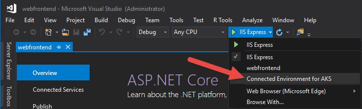

# Share Azure Dev Spaces

With Azure Dev Spaces, you can share your dev space with others on your team. Each developer can work in their own space without fear of breaking others. Also, working together in one space can enable you to test code end-to-end without having to create mocks or simulate dependencies. See the [Learn about team development](../team-development-nodejs.md) guide for more information.

## Set up a dev space for multiple developers

1. Create a Dev Space in Azure. Choose [.NET Core and VS Code](../get-started-netcore.md), [.NET Core and Visual Studio](../get-started-netcore-visualstudio.md), or [Node.js and VS Code](../get-started-nodejs.md). You'll need to have Owner or Contributor access to the selected Azure subscription.
1. Ensure each team member has the [appropriate permissions to access the Azure Dev Spaces controller](../troubleshooting.md#incorrect-rbac-permissions-for-calling-dev-spaces-controller-and-apis). For example, you can configure the Azure Dev Space's **resource group** to [grant Contributor access](/azure/active-directory/role-based-access-control-configure) for each team member. You can check a dev space's resource group by running this command: `azds show-context`
1. Ask team members to **select the dev space** in order to develop in it.
   * **Command line or VS Code**: To see existing Azure Dev Spaces you have access to: `azds space list`. To select a dev space: `azds space select`.
   * **Visual Studio IDE**: Open a project in Visual Studio, select **Azure Dev Spaces** from the launch settings drop-down. In the dialog that opens, select an existing cluster.

     

## Next steps

See [Learn about team development](../team-development-nodejs.md) for more information.
