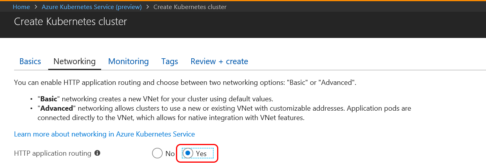

## Create a Kubernetes cluster enabled for Azure Dev Spaces

1. Sign in to the Azure portal at http://portal.azure.com.
1. Choose **Create a resource** > search for **Kubernetes** > select **Kubernetes Service** > **Create**.

   Complete the following steps under each heading of the create AKS cluster form.

    - **PROJECT DETAILS**:  select an Azure subscription and a new or existing Azure resource group.
    - **CLUSTER DETAILS**: enter a name, region (currently, you must choose EastUS, Central US, WestEurope, WestUS2, CanadaCentral, or CanadaEast), version, and DNS name prefix for the AKS cluster.
    - **SCALE**: select a VM size for the AKS agent nodes and the number of nodes. If you’re getting started with Azure Dev Spaces, one node is enough to explore all the features. The node count can be easily adjusted any time after the cluster is deployed. Note that the VM size can’t be changed once an AKS cluster has been created. However, once an AKS cluster has been deployed, you can easily create a new AKS cluster with larger VMs and use Dev Spaces to redeploy to that larger cluster if you need to scale up.

   Make sure to choose Kubernetes version 1.9.6 or later.

   

   Select **Next: Authentication** when complete.

1. Choose your desired setting for Role-based Access Control (RBAC). Azure Dev Spaces supports clusters with RBAC enabled, or disabled.

    

1. Make sure that Http Application Routing is enabled.

   

    > [!Note]
    > To enable [Http Application Routing](/azure/aks/http-application-routing) on an existing cluster, use the command: `az aks enable-addons --resource-group myResourceGroup --name myAKSCluster --addons http_application_routing`

1. Select **Review + create** and then **Create** when complete.
