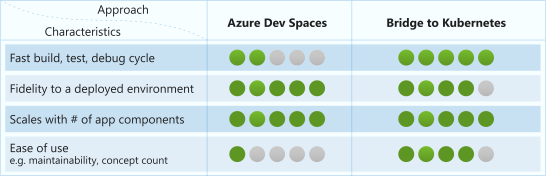

# Migrating to Bridge to Kubernetes

> [!IMPORTANT]
> Azure Dev Spaces will be retired on October 31, 2023. Customers should move to using Bridge to Kubernetes, a client developer tool.
>
> The purpose of Azure Dev Spaces was about easing users into developing on Kubernetes. A significant tradeoff in the approach of Azure Dev Spaces was putting extra burden on users to understand Docker and Kubernetes configurations as well as Kubernetes deployment concepts. Over time, it also became clear that the approach of Azure Dev Spaces did not effectively decrease the speed of inner loop development on Kubernetes. Bridge to Kubernetes effectively decreases the speed of inner loop development and avoids unnecessary burden on users.
>
> The core mission remains unchanged: Build the best experiences to develop, test, and debug microservice code in the context of the larger application.

Bridge to Kubernetes provides a lighter weight alternative to many of the development scenarios that work with Azure Dev Spaces. Bridge to Kubernetes is a client-side only experience using extensions in [Visual Studio][vs] and [Visual Studio Code][vsc].  

Bridge to Kubernetes helps your development experience by allowing an established Kubernetes application to include a service running on your local development workstation. Unlike Dev Spaces, Bridge to Kubernetes reduces inner loop complexities by side-stepping the need to create Docker and Kubernetes configurations, allowing developers to focus purely on the business logic of their microservice code.

Bridge to Kubernetes helps you to iterate on code running on your development computer while consuming dependencies and existing configuration from your Kubernetes environment. In contrast, Azure Dev Spaces deploys your microservice into the Kubernetes environment before you can remotely debug your service and iterate on your code.

This article provides a comparison between Azure Dev Spaces and Bridge to Kubernetes as well as instructions for migrating from Azure Dev Spaces to Bridge to Kubernetes.

## Development Approaches



Azure Dev Spaces helped Kubernetes developers work with code running directly in their AKS cluster, avoiding the need for a local environment that did not resemble the deployed environment. This approach improved certain aspects of development, but it also introduced a prerequisite of learning and maintaining additional concepts such as Docker, Kubernetes, and Helm before you could start using Azure Dev Spaces.

Bridge to Kubernetes allows developers to work directly on their development computers while interacting with the rest of their cluster. This approach takes advantage of the familiarity and speed of running code directly on their development computers while sharing the dependencies and environment provided by their cluster. This approach also takes advantage of the fidelity and scaling that comes from running in Kubernetes.

## Feature Comparison

Azure Dev Spaces and Bridge to Kubernetes have similar features, they also differ in several areas:

| Requirement  | Azure Dev Spaces  | Bridge to Kubernetes  |
|---------------|-------------------|--------------------------------|
| Azure Kubernetes Service | In 15 Azure regions | Any AKS service region    |
| **Security** |
| Security access needed on your cluster  | AKS Cluster contributor  | Kubernetes RBAC -Deployment update   |
| Security access needed on your development computer  | N/A  | Local admin / sudo   |
| **Usability** |
| Independent from Kubernetes and Docker artifacts  | No  | Yes   |
| Automatic rollback of changes, post-debug  | No  | Yes   |
| **Supported Client Tooling** |
| Works with Visual Studio 2019  | Yes  | Yes   |
| Works with Visual Studio Code  | Yes  | Yes   |
| Works with a CLI  | Yes  | No   |
| **Operating System Compatibility** |
| Works on Windows 10  | Yes  | Yes  |
| Works on Linux  | Yes  | Yes  |
| Works on macOS  | Yes  | Yes  |
| **Capabilities** |
| Developer Isolation or Team Development  | Yes  | Yes  |
| Selectively overwrite environment variables  | No  | Yes  |
| Creation of Dockerfile and Helm chart  | Yes  | No  |
| Persistent deployment of code to Kubernetes  | Yes  | No  |
| Remote debugging in a Kubernetes pod  | Yes  | No  |
| Local debugging, connected to Kubernetes  | No  | Yes  |
| Debugging multiple services at the same time, on the same workstation  | Yes  | Yes  |

## Kubernetes inner loop development

The biggest difference between Azure Dev Spaces and Bridge to Kubernetes is where your code runs. Azure Dev Spaces helps develop and debug your microservice code, but requires that you run that code in your cluster. Bridge to Kubernetes allows you to develop and debug your microservice code directly on your development computer while still in the context of the larger application running in Kubernetes. Bridge to Kubernetes extends the perimeter of the Kubernetes cluster and allows local processes to inherit configuration from Kubernetes.


When using Bridge to Kubernetes, a network connection between your development computer and your cluster is established. For the lifetime of this connection, a proxy is added to your cluster in place of your Kubernetes deployment that redirects requests to the service to your development computer. When you disconnect, the application deployment will revert to using the original version of the deployment running on the cluster. This approach differs from how Azure Dev Spaces works in which code is synchronized to the cluster, built, then run. Azure Dev Spaces also doesn’t roll back your code.

Bridge to Kubernetes has the flexibility to work with applications running in Kubernetes regardless of their deployment method. If you use CI/CD to build and run your application, regardless of whether you use established tools or custom scripts, you can still use Bridge to Kubernetes to develop and debug your code.

> [!TIP]
> The [Microsoft Kubernetes extension][kubernetes-extension] lets you quickly develop Kubernetes manifests with Intellisense and helps scaffold Helm charts.  

### Transition to Bridge to Kubernetes from Azure Dev Spaces

1. If you're using Visual Studio, update your Visual Studio IDE to version 16.7 or greater and install the Bridge to Kubernetes extension from the [Visual Studio Marketplace][vs-marketplace]. If you're using Visual Studio Code, install the [Bridge to Kubernetes extension][vsc-marketplace].
1. Disable the Azure Dev Spaces controller using the Azure portal or the [Azure Dev Spaces CLI][azds-delete].
1. Use [Azure Cloud Shell](https://shell.azure.com). Or on Mac, Linux or Windows with bash installed, open a bash shell prompt. Make sure that the following tools are available in your command-line environment: Azure CLI, docker, kubectl, curl, tar, and gunzip.
1. Create a container registry, or use an existing one. You can create a container registry in Azure using [Azure Container Registry](../container-registry/index.yml) or by using [Docker Hub](https://hub.docker.com/). When using Azure Cloud Shell, only Azure Container Registry is available for hosting docker images.
1. Run the migration script to convert Azure Dev Spaces assets to Bridge to Kubernetes assets. The script builds a new image compatible with Bridge to Kubernetes, uploads it to the designated registry, and then uses [Helm](https://helm.sh) to update the cluster with the image. You must provide the resource group, the name of the AKS cluster, and a container registry. There are other command-line options as shown here:

   ```azure-cli
   curl -sL https://aka.ms/migrate-tool | bash -s -- -g ResourceGroupName -n AKSName -h ContainerRegistryName -r PathOfTheProject -y
   ```

   The script supports the following flags:

   ```cmd  
    -g Name of resource group of AKS Cluster [required]
    -n Name of AKS Cluster [required]
    -h Container registry name. Examples: ACR, Docker [required]
    -k Kubernetes namespace to deploy resources (uses 'default' otherwise)
    -r Path to root of the project that needs to be migrated (default = current working directory)
    -t Image name & tag in format 'name:tag' (default is 'projectName:stable')
    -i Enable a public endpoint to access your service over internet. (default is false)
    -c Docker build context path. (default = project root path passed to '-r' option)
    -y Doesn't prompt for non-tty terminals
    -d Helm Debug switch
   ```

1. Manually migrate any customizations, such as environment variable settings, in *azds.yaml* into your project's *values.yml* file.
1. (optional) Remove the `azds.yaml` file from your project.
1. Configure Bridge to Kubernetes on your deployed application. For more information on using Bridge to Kubernetes in Visual Studio, see [Use Bridge to Kubernetes in Visual Studio][use-btk-vs]. For VS Code, see [Use Bridge to Kubernetes in VS Code][use-btk-vsc].
1. Start debugging using the newly created Bridge to Kubernetes debug/launch profile.
1. You can run the script again as needed to redeploy to your cluster.

## Team development in a shared cluster

You can also use developer-specific routing with Bridge to Kubernetes. The Azure Dev Spaces team development scenario uses multiple Kubernetes namespaces to isolate a service from the rest of the application using the concept of parent and child namespaces. Bridge to Kubernetes offers the same capability, but with improved performance characteristics and within the same application namespace.

Both Bridge to Kubernetes and Azure Dev Spaces require HTTP headers to be present and propagated throughout the application. If you have already configured your application to handle header propagation for Azure Dev Spaces, then the header needs to be updated. To transition to Bridge to Kubernetes from Azure Dev Spaces, update configured header from *azds-route-as* to *kubernetes-route-as*.

## Evaluate Bridge to Kubernetes

If you’d like to experiment with Bridge to Kubernetes before you disable Azure Dev Spaces in your cluster, the easiest way is to use a new cluster. If you try to use Azure Dev Spaces and Bridge to Kubernetes at the same time on the same cluster, you will run into issues when using the routing features on both.

### Use Visual Studio to evaluate Bridge to Kubernetes

1. Update your Visual Studio IDE to version 16.7 or greater and install the Bridge to Kubernetes extension from the [Visual Studio Marketplace][vs-marketplace].
1. Create a new AKS cluster and deploy your application. You can also use a [sample application][btk-sample-app].
1. Configure Bridge to Kubernetes on your deployed application. For more information on using Bridge to Kubernetes in Visual Studio, see [Use Bridge to Kubernetes][use-btk-vs].
1. Start debugging in Visual Studio using the newly created Bridge to Kubernetes debug profile.

### Use Visual Studio Code to evaluate Bridge to Kubernetes

1. Install the [Bridge to Kubernetes extension][vsc-marketplace].
1. Create a new AKS cluster and deploy your application. You can also use a [sample application][btk-sample-app].
1. Configure Bridge to Kubernetes on your deployed application. For more information on using Bridge to Kubernetes in Visual Studio Code, see [Use Bridge to Kubernetes][use-btk-vsc].
1. Start debugging in Visual Studio using the newly created Bridge to Kubernetes launch profile.

## Next steps

Learn more about how Bridge to Kubernetes works.

> [!div class="nextstepaction"]
> [How Bridge to Kubernetes works][how-it-works-bridge-to-kubernetes]


[azds-delete]: how-to/install-dev-spaces.md#remove-azure-dev-spaces-using-the-cli
[kubernetes-extension]: https://marketplace.visualstudio.com/items?itemName=ms-kubernetes-tools.vscode-kubernetes-tools
[btk-sample-app]: /visualstudio/containers/bridge-to-kubernetes#install-the-sample-application
[how-it-works-bridge-to-kubernetes]: /visualstudio/containers/overview-bridge-to-kubernetes
[use-btk-vs]: /visualstudio/containers/bridge-to-kubernetes#connect-to-your-cluster-and-debug-a-service
[use-btk-vsc]: https://code.visualstudio.com/docs/containers/bridge-to-kubernetes
[vs]: https://visualstudio.microsoft.com/
[vsc-marketplace]: https://marketplace.visualstudio.com/items?itemName=mindaro.mindaro
[vs-marketplace]: https://marketplace.visualstudio.com/items?itemName=ms-azuretools.mindaro
[vsc]: https://code.visualstudio.com/
