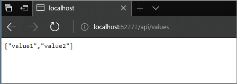

---
title: "Running multiple dependent services: .NET Core & Visual Studio"
services: azure-dev-spaces
ms.custom: vs-azure
ms.workload: azure-vs
ms.date: 07/09/2018
ms.topic: tutorial
description: "This tutorial shows you how to use Azure Dev Spaces and Visual Studio to debug a multi-service .NET Core application on Azure Kubernetes Service"
keywords: "Docker, Kubernetes, Azure, AKS, Azure Kubernetes Service, containers, Helm, service mesh, service mesh routing, kubectl, k8s"
---
# Running multiple dependent services: .NET Core and Visual Studio with Azure Dev Spaces

In this tutorial, you'll learn how to develop multi-service applications using Azure Dev Spaces, along with some of the added benefits that Dev Spaces provides.

## Call another container
In this section, you're going to create a second service, `mywebapi`, and have `webfrontend` call it. Each service will run in separate containers. You'll then debug across both containers.


### Download sample code for *mywebapi*
For the sake of time, let's download sample code from a GitHub repository. Go to https://github.com/Azure/dev-spaces and select **Clone or Download** to download the GitHub repository. The code for this section is in `samples/dotnetcore/getting-started/mywebapi`.

### Run *mywebapi*
1. Open the project `mywebapi` in a *separate Visual Studio window*.
1. Select **Azure Dev Spaces** from the launch settings dropdown as you did previously for the `webfrontend` project. Rather than creating a new AKS cluster this time, select the same one you already created. As before, leave the Space defaulted to `default` and click **OK**. In the Output window, you may notice Visual Studio starts to "warm up" this new service in your dev space in order to speed up things when you start debugging.
1. Hit F5, and wait for the service to build and deploy. You'll know it's ready when the Visual Studio status bar turns orange
1. Take note of the endpoint URL displayed in the **Azure Dev Spaces for AKS** pane in the **Output** window. It will look something like `http://localhost:<portnumber>`. It might seem like the container is running locally, but actually it's running in the dev space in Azure.
2. When `mywebapi` is ready, open your browser to the localhost address and append `/api/values` to the URL to invoke the default GET API for the `ValuesController`. 
3. If all the steps were successful, you should be able to see a response from the `mywebapi` service that looks like this.

    

### Make a request from *webfrontend* to *mywebapi*
Let's now write code in `webfrontend` that makes a request to `mywebapi`. Switch to the Visual Studio window that has the `webfrontend` project. In the `HomeController.cs` file, *replace* the code for the About method with the following code:

   ```csharp
   public async Task<IActionResult> About()
   {
      ViewData["Message"] = "Hello from webfrontend";

      using (var client = new System.Net.Http.HttpClient())
            {
                // Call *mywebapi*, and display its response in the page
                var request = new System.Net.Http.HttpRequestMessage();
                request.RequestUri = new Uri("http://mywebapi/api/values/1");
                if (this.Request.Headers.ContainsKey("azds-route-as"))
                {
                    // Propagate the dev space routing header
                    request.Headers.Add("azds-route-as", this.Request.Headers["azds-route-as"] as IEnumerable<string>);
                }
                var response = await client.SendAsync(request);
                ViewData["Message"] += " and " + await response.Content.ReadAsStringAsync();
            }

      return View();
   }
   ```

The preceding code example forwards the `azds-route-as` header from the incoming request to the outgoing request. You'll see later how this facilitates a more productive development experience in [team scenarios](team-development-netcore-visualstudio.md).

### Debug across multiple services
1. At this point, `mywebapi` should still be running with the debugger attached. If it is not, hit F5 in the `mywebapi` project.
1. Set a breakpoint in the `Get(int id)` method in the `Controllers/ValuesController.cs` file that handles `api/values/{id}` GET requests.
1. In the `webfrontend` project where you pasted the above code, set a breakpoint just before it sends a GET request to `mywebapi/api/values`.
1. Hit F5 in the `webfrontend` project. Visual Studio will again open a browser to the appropriate localhost port and the web app will be displayed.
1. Click on the “**About**” link at the top of the page to trigger the breakpoint in the `webfrontend` project. 
1. Hit F10 to proceed. The breakpoint in the `mywebapi` project will now be triggered.
1. Hit F5 to proceed and you will be back in the code in the `webfrontend` project.
1. Hitting F5 one more time will complete the request and return a page in the browser. In the web app, the About page will display a message concatenated by the two services: "Hello from webfrontend and Hello from mywebapi."

### Well done!
You now have a multi-container application where each container can be developed and deployed separately.

## Next steps

> [!div class="nextstepaction"]
> [Learn about team development in Dev Spaces](team-development-netcore-visualstudio.md)
