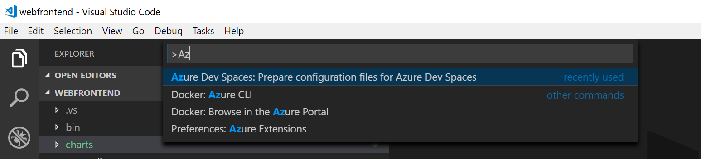
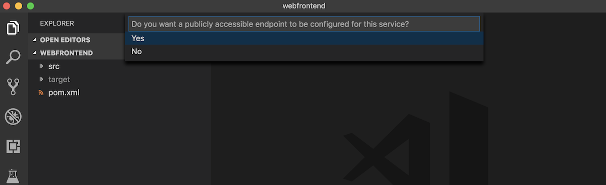
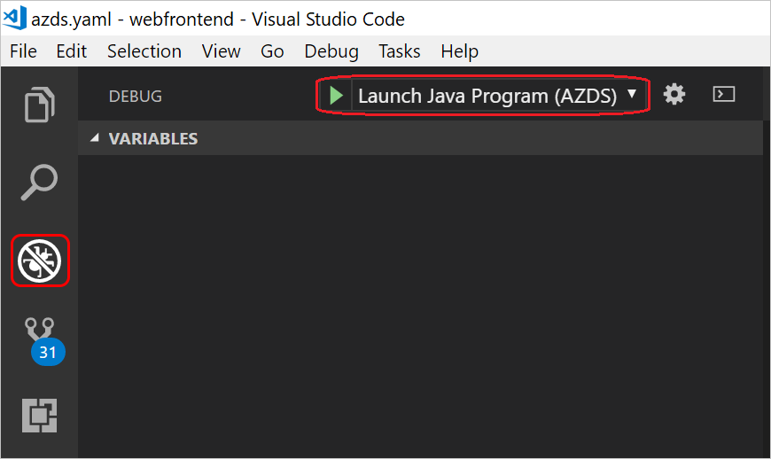
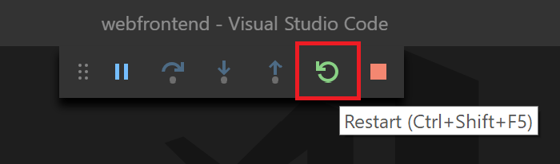

# Quickstart: Debug and iterate on Kubernetes with Visual Studio Code and Java - Azure Dev Spaces

In this guide, you will learn how to:

- Set up Azure Dev Spaces with a managed Kubernetes cluster in Azure.
- Iteratively develop code in containers using Visual Studio Code.
- Debug the code in your dev space from Visual Studio Code.

Azure Dev Spaces also allows you to debug and iterate using:
- [Node.js and Visual Studio Code](quickstart-nodejs.md)
- [.NET Core and Visual Studio Code](quickstart-netcore.md)
- [.NET Core and Visual Studio](quickstart-netcore-visualstudio.md)

## Prerequisites

- An Azure subscription. If you don't have one, you can create a [free account](https://azure.microsoft.com/free).
- [Visual Studio Code installed](https://code.visualstudio.com/download).
- The [Azure Dev Spaces](https://marketplace.visualstudio.com/items?itemName=azuredevspaces.azds) and [Java Debugger for Azure Dev Spaces](https://marketplace.visualstudio.com/items?itemName=vscjava.vscode-java-debugger-azds) extensions for Visual Studio Code installed.
- [Azure CLI installed](/cli/azure/install-azure-cli?view=azure-cli-latest).
- [Maven installed and configured](https://maven.apache.org).

## Create an Azure Kubernetes Service cluster

You need to create an AKS cluster in a [supported region][supported-regions]. The below commands create a resource group called *MyResourceGroup* and an AKS cluster called *MyAKS*.

```cmd
az group create --name MyResourceGroup --location eastus
az aks create -g MyResourceGroup -n MyAKS --location eastus --disable-rbac --generate-ssh-keys
```

## Enable Azure Dev Spaces on your AKS cluster

Use the `use-dev-spaces` command to enable Dev Spaces on your AKS cluster and follow the prompts. The below command enables Dev Spaces on the *MyAKS* cluster in the *MyResourceGroup* group and creates a *default* dev space.

> [!NOTE]
> The `use-dev-spaces` command will also install the Azure Dev Spaces CLI if its not already installed. You cannot install the Azure Dev Spaces CLI in the Azure Cloud Shell.

```cmd
$ az aks use-dev-spaces -g MyResourceGroup -n MyAKS

'An Azure Dev Spaces Controller' will be created that targets resource 'MyAKS' in resource group 'MyResourceGroup'. Continue? (y/N): y

Creating and selecting Azure Dev Spaces Controller 'MyAKS' in resource group 'MyResourceGroup' that targets resource 'MyAKS' in resource group 'MyResourceGroup'...2m 24s

Select a dev space or Kubernetes namespace to use as a dev space.
 [1] default
Type a number or a new name: 1

Kubernetes namespace 'default' will be configured as a dev space. This will enable Azure Dev Spaces instrumentation for new workloads in the namespace. Continue? (Y/n): Y

Configuring and selecting dev space 'default'...3s

Managed Kubernetes cluster 'MyAKS' in resource group 'MyResourceGroup' is ready for development in dev space 'default'. Type `azds prep` to prepare a source directory for use with Azure Dev Spaces and `azds up` to run.
```

## Get sample application code

In this article, you use the [Azure Dev Spaces sample application](https://github.com/Azure/dev-spaces) to demonstrate using Azure Dev Spaces.

Clone the application from GitHub.

```cmd
git clone https://github.com/Azure/dev-spaces
```

## Prepare the sample application in Visual Studio Code

Open Visual Studio Code, click *File* then *Open...*, navigate to the *dev-spaces/samples/java/getting-started/webfrontend* directory, and click *Open*.

You now have the *webfrontend* project open in Visual Studio Code. To run the application in your dev space, generate the Docker and Helm chart assets using the Azure Dev Spaces extension in the Command Palette.

To open the Command Palette in Visual Studio Code, click *View* then *Command Palette*. Begin typing `Azure Dev Spaces` and click on `Azure Dev Spaces: Prepare configuration files for Azure Dev Spaces`.



When Visual Studio Code also prompts you to configure your base images, exposed port and public endpoint, choose `Azul Zulu OpenJDK for Azure (Free LTS)` for the base image, `8080` for the exposed port, and `Yes` to enable a public endpoint.




This command prepares your project to run in Azure Dev Spaces by generating a Dockerfile and Helm chart. It also generates a *.vscode* directory with debugging configuration at the root of your project.

> [!TIP]
> The [Dockerfile and Helm chart](how-dev-spaces-works.md#prepare-your-code) for your project is used by Azure Dev Spaces to build and run your code, but you can modify these files if you want to change how the project is built and ran.

## Build and run code in Kubernetes from Visual Studio

Click on the *Debug* icon on the left and click *Launch Java Program (AZDS)* at the top.



This command builds and runs your service in Azure Dev Spaces. The *Terminal* window at the bottom shows the build output and URLs for your service running Azure Dev Spaces. The *Debug Console* shows the log output.

> [!Note]
> If you don't see any Azure Dev Spaces commands in the *Command Palette*, make sure you have installed the [Visual Studio Code extension for Azure Dev Spaces](https://marketplace.visualstudio.com/items?itemName=azuredevspaces.azds). Also verify you opened the *dev-spaces/samples/java/getting-started/webfrontend* directory in Visual Studio Code.

You can see the service running by opening the public URL.

Click *Debug* then *Stop Debugging* to stop the debugger.

## Update code

To deploy an updated version of your service, you can update any file in your project and rerun *Launch Java Program (AZDS)*. For example:

1. If your application is still running, click *Debug* then *Stop Debugging* to stop it.
1. Update [line 19 in `src/main/java/com/ms/sample/webfrontend/Application.java`](https://github.com/Azure/dev-spaces/blob/master/samples/java/getting-started/webfrontend/src/main/java/com/ms/sample/webfrontend/Application.java#L19) to:
    
    ```java
    return "Hello from webfrontend in Azure!";
    ```

1. Save your changes.
1. Rerun *Launch Java Program (AZDS)*.
1. Navigate to your running service and observe your changes.
1. Click *Debug* then *Stop Debugging* to stop your application.

## Setting and using breakpoints for debugging

Start your service using *Launch Java Program (AZDS)*. This also runs your service in debugging mode.

Navigate back to the *Explorer* view by clicking *View* then *Explorer*. Open `src/main/java/com/ms/sample/webfrontend/Application.java` and click somewhere on line 19 to put your cursor there. To set a breakpoint hit *F9* or click *Debug* then *Toggle Breakpoint*.

Open your service in a browser and notice no message is displayed. Return to Visual Studio Code and observe line 19 is highlighted. The breakpoint you set has paused the service at line 19. To resume the service, hit *F5* or click *Debug* then *Continue*. Return to your browser and notice the message is now displayed.

While running your service in Kubernetes with a debugger attached, you have full access to debug information such as the call stack, local variables, and exception information.

Remove the breakpoint by putting your cursor on line 19 in `src/main/java/com/ms/sample/webfrontend/Application.java` and hitting *F9*.

## Update code from Visual Studio Code

While the service is running in debugging mode, update line 19 in `src/main/java/com/ms/sample/webfrontend/Application.java`. For example:
```java
return "Hello from webfrontend in Azure while debugging!";
```

Save the file. Click *Debug* then *Restart Debugging* or in the *Debug toolbar*, click the *Restart Debugging* button.



Open your service in a browser and notice your updated message is displayed.

Instead of rebuilding and redeploying a new container image each time code edits are made, Azure Dev Spaces incrementally recompiles code within the existing container to provide a faster edit/debug loop.

## Clean up your Azure resources

```cmd
az group delete --name MyResourceGroup --yes --no-wait
```

## Next steps

Learn how Azure Dev Spaces helps you develop more complex applications across multiple containers, and how you can simplify collaborative development by working with different versions or branches of your code in different spaces.

> [!div class="nextstepaction"]
> [Working with multiple containers and team development](multi-service-java.md)


[supported-regions]: https://azure.microsoft.com/global-infrastructure/services/?products=kubernetes-service
