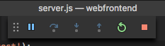

# Quickstart: Create a Kubernetes dev space with Azure Dev Spaces (Node.js)

In this guide, you will learn how to:

- Set up Azure Dev Spaces with a managed Kubernetes cluster in Azure.
- Iteratively develop code in containers using VS Code and the command line.
- Debug code running in your cluster.

> [!Note]
> **If you get stuck** at any time, see the [Troubleshooting](troubleshooting.md) section, or post a comment on this page. You can also try the more detailed [tutorial](get-started-nodejs.md).

## Prerequisites

- An Azure subscription. If you don't have an Azure subscription, you can create a [free account](https://azure.microsoft.com/free).
- [Visual Studio Code](https://code.visualstudio.com/download).
- [Azure CLI](/cli/azure/install-azure-cli?view=azure-cli-latest) version 2.0.43 or higher.
- A Kubernetes cluster running Kubernetes 1.9.6 or later, in the EastUS, CentralUS, WestUS2, WestEurope, CanadaCentral, or CanadaEast region, with **Http Application Routing** enabled.

    ```cmd
    az group create --name MyResourceGroup --location <region>
    az aks create -g MyResourceGroup -n myAKS --location <region> --kubernetes-version 1.11.2 --enable-addons http_application_routing --generate-ssh-keys
    ```

## Set up Azure Dev Spaces

The Azure CLI and the Azure Dev Spaces extension can be installed and run on Windows, Mac, or Linux machines. For Linux, the following distributions are supported: Ubuntu (18.04, 16.04, and 14.04), Debian 8 and 9, RHEL 7, Fedora 26+, CentOS 7, openSUSE 42.2, and SLES 12.

Follow these steps to set up Azure Dev Spaces:

1. Set up Dev Spaces on your AKS cluster: `az aks use-dev-spaces -g MyResourceGroup -n MyAKS`
1. Download the [Azure Dev Spaces extension](https://marketplace.visualstudio.com/items?itemName=azuredevspaces.azds) for VS Code. Click Install once on the extension's Marketplace page, and again in VS Code.

## Build and run code in Kubernetes

1. Download sample code from GitHub: [https://github.com/Azure/dev-spaces](https://github.com/Azure/dev-spaces) 
1. Change directory to the webfrontend folder: `cd dev-spaces/samples/nodejs/getting-started/webfrontend`
1. Generate Docker and Helm chart assets: `azds prep --public`
1. Build and run your code in AKS. In the terminal window from the **webfrontend folder**, run this command: `azds up`
1. Scan the console output for information about the URL that was created by the `up` command. It will be in the form: 

   ```output
   (pending registration) Service 'webfrontend' port 'http' will be available at <url>
   Service 'webfrontend' port 80 (TCP) is available at http://localhost:<port>
   ```

   Open this URL in a browser window, and you should see the web app load. As the container executes, `stdout` and `stderr` output is streamed to the terminal window.
   
   > [!Note]
   > On first run, it can take several minutes for public DNS to be ready. If the public URL does not resolve, you can use the alternative http://localhost:<portnumber> URL that is displayed in the console output. If you use the localhost URL, it may seem like the container is running locally, but actually it is running in AKS. For your convenience, and to facilitate interacting with the service from your local machine, Azure Dev Spaces creates a temporary SSH tunnel to the container running in Azure. You can come back and try the public URL later when the DNS record is ready.

### Update a content file
Azure Dev Spaces isn't just about getting code running in Kubernetes - it's about enabling you to quickly and iteratively see your code changes take effect in a Kubernetes environment in the cloud.

1. Locate the file `./public/index.html` and make an edit to the HTML. For example, change the page's background color to a shade of blue:

    ```html
    <body style="background-color: #95B9C7; margin-left:10px; margin-right:10px;">
    ```

1. Save the file. Moments later, in the Terminal window you'll see a message saying a file in the running container was updated.
1. Go to your browser and refresh the page. You should see your color update.

What happened? Edits to content files, like HTML and CSS, don't require the Node.js process to restart, so an active `azds up` command will automatically sync any modified content files directly into the running container in Azure, thereby providing a fast way to see your content edits.

### Test from a mobile device
Open the web app on a mobile device using the public URL for webfrontend. You may want to copy and send the URL from your desktop to your device to save you from entering the long address. When the web app loads in your mobile device, you will notice that the UI does not display properly on a small device.

To fix this, you'll add a `viewport` meta tag:
1. Open the file `./public/index.html`
1. Add a `viewport` meta tag in the existing `head` element:

    ```html
    <head>
        <!-- Add this line -->
        <meta name="viewport" content="width=device-width, initial-scale=1">
    </head>
    ```

1. Save the file.
1. Refresh your device's browser. You should now see the web app rendered correctly. 

This is an example of how some problems just aren't found until you test on the devices where an app is meant to be used. With Azure Dev Spaces, you can rapidly iterate on your code and validate any changes on target devices.

### Update a code file
Updating server-side code files requires a little more work, because a Node.js app needs to restart.

1. In the terminal window, press `Ctrl+C` (to stop `azds up`).
1. Open the code file named `server.js`, and edit service's hello message: 

    ```javascript
    res.send('Hello from webfrontend running in Azure!');
    ```

3. Save the file.
1. Run  `azds up` in the terminal window. 

This rebuilds the container image and redeploys the Helm chart. Reload the browser page to see your code changes take effect.

But there is an even *faster method* for developing code, which you'll explore in the next section. 

## Debug a container in Kubernetes

In this section, you'll use VS Code to directly debug our container running in Azure. You'll also learn how to get a faster edit-run-test loop.


### Initialize debug assets with the VS Code extension
You first need to configure your code project so VS Code will communicate with our dev space in Azure. The VS Code extension for Azure Dev Spaces provides a helper command to set up debug configuration. 

Open the **Command Palette** (using the **View | Command Palette** menu), and use auto-complete to type and select this command: `Azure Dev Spaces: Prepare configuration files for Azure Dev Spaces`.

This adds debug configuration for Azure Dev Spaces under the `.vscode` folder. This command is not to be confused with the `azds prep` command, which configures the project for deployment.


### Select the AZDS debug configuration
1. To open the Debug view, click on the Debug icon in the **Activity Bar** on the side of VS Code.
1. Select **Launch Program (AZDS)** as the active debug configuration.


> [!Note]
> If you don't see any Azure Dev Spaces commands in the Command Palette, ensure you have installed the VS Code extension for Azure Dev Spaces.

### Debug the container in Kubernetes
Hit **F5** to debug your code in Kubernetes!

Similar to the `up` command, code is synced to the dev space when you start debugging, and a container is built and deployed to Kubernetes. This time, the debugger is attached to the remote container.

> [!Tip]
> The VS Code status bar will display a clickable URL.

Set a breakpoint in a server-side code file, for example within the `app.get('/api'...` in  `server.js`. Refresh the browser page, or press the 'Say It Again' button, and you should hit the breakpoint and be able to step through code.

You have full access to debug information just like you would if the code was executing locally, such as the call stack, local variables, exception information, etc.

### Edit code and refresh the debug session
With the debugger active, make a code edit; for example, modify the hello message again:

```javascript
app.get('/api', function (req, res) {
    res.send('**** Hello from webfrontend running in Azure! ****');
});
```

Save the file, and in the **Debug actions pane**, click the **Refresh** button. 



Instead of rebuilding and redeploying a new container image each time code edits are made, which will often take considerable time, Azure Dev Spaces will restart the Node.js process in between debug sessions to provide a faster edit/debug loop.

Refresh the web app in the browser, or press the *Say It Again* button. You should see your custom message appear in the UI.

### Use NodeMon to develop even faster

The sample `webfrontend` project was configured to use [nodemon](https://nodemon.io/), a popular tool for speeding up Node.js development that is fully compatible with Azure Dev Spaces.

Try the following steps:
1. Stop the VS Code debugger.
1. Click on the Debug icon in the **Activity Bar** on the side of VS Code. 
1. Select **Attach (AZDS)** as the active debug configuration.
1. Hit F5.

In this configuration, the container is configured to start *nodemon*. When server code edits are made, *nodemon* automatically restarts the Node process, just like it does when you develop locally. 
1. Edit the hello message again in `server.js`, and save the file.
1. Refresh the browser, or click the *Say It Again* button, to see your changes take effect!

**Now you have a method for rapidly iterating on code and debugging directly in Kubernetes!**

## Next steps

> [!div class="nextstepaction"]
> [Working with multiple containers and team development](team-development-nodejs.md)
