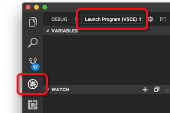

# Quickstart: Develop with Node.js on Kubernetes using Azure Dev Spaces

In this guide, you will learn how to:

- Set up Azure Dev Spaces with a managed Kubernetes cluster in Azure.
- Iteratively develop code in containers using Visual Studio Code and the command line.
- Debug the code in your dev space from Visual Studio Code.

## Prerequisites

- An Azure subscription. If you don't have an Azure subscription, you can create a [free account](https://azure.microsoft.com/free).
- [Visual Studio Code installed](https://code.visualstudio.com/download).
- The [Azure Dev Spaces](https://marketplace.visualstudio.com/items?itemName=azuredevspaces.azds) extension for Visual Studio Code installed.
- [Azure CLI installed](/cli/azure/install-azure-cli?view=azure-cli-latest).

## Create an Azure Kubernetes Service cluster

You need to create an AKS cluster in a [supported region][supported-regions]. The below commands create a resource group called *MyResourceGroup* and an AKS cluster called *MyAKS*.

```cmd
az group create --name MyResourceGroup --location eastus
az aks create -g MyResourceGroup -n MyAKS --location eastus --node-vm-size Standard_DS2_v2 --node-count 1 --disable-rbac --generate-ssh-keys
```

## Enable Azure Dev Spaces on your AKS cluster

Use the `use-dev-spaces` command to enable Dev Spaces on your AKS cluster and follow the prompts. The below command enables Dev Spaces on the *MyAKS* cluster in the *MyResourceGroup* group and creates a *default* dev space.

```cmd
$ az aks use-dev-spaces -g MyResourceGroup -n MyAKS

'An Azure Dev Spaces Controller' will be created that targets resource 'MyAKS' in resource group 'MyResourceGroup'. Continue? (y/N): y

Creating and selecting Azure Dev Spaces Controller 'MyAKS' in resource group 'MyResourceGroup' that targets resource 'MyAKS' in resource group 'MyResourceGroup'...2m 24s

Select a dev space or Kubernetes namespace to use as a dev space.
 [1] default
Type a number or a new name: 1

Kubernetes namespace 'default' will be configured as a dev space. This will enable Azure Dev Spaces instrumentation for new workloads in the namespace. Continue? (Y/n): Y

Configuring and selecting dev space 'default'...3s

Managed Kubernetes cluster 'MyAKS' in resource group 'MyResourceGroup' is ready for development in dev space 'default'. Type `azds prep` to prepare a source directory for use with Azure Dev Spaces and `azds up` to run.
```

## Get sample application code

In this article, you use the [Azure Dev Spaces sample application](https://github.com/Azure/dev-spaces) to demonstrate using Azure Dev Spaces.

Clone the application from GitHub and navigate into the *dev-spaces/samples/nodejs/getting-started/webfrontend* directory:

```cmd
git clone https://github.com/Azure/dev-spaces
cd dev-spaces/samples/nodejs/getting-started/webfrontend
```

## Prepare the application

Generate the Docker and Helm chart assets for running the application in Kubernetes using the `azds prep` command:

```cmd
azds prep --public
```

You must run the `prep` command from the *dev-spaces/samples/nodejs/getting-started/webfrontend* directory to correctly generate the Docker and Helm chart assets.

## Build and run code in Kubernetes

Build and run your code in AKS using the `azds up` command:

```cmd
$ azds up
Using dev space 'default' with target 'MyAKS'
Synchronizing files...2s
Installing Helm chart...2s
Waiting for container image build...2m 25s
Building container image...
Step 1/8 : FROM node
Step 2/8 : ENV PORT 80
Step 3/8 : EXPOSE 80
Step 4/8 : WORKDIR /app
Step 5/8 : COPY package.json .
Step 6/8 : RUN npm install
Step 7/8 : COPY . .
Step 8/8 : CMD ["npm", "start"]
Built container image in 6m 17s
Waiting for container...13s
Service 'webfrontend' port 'http' is available at http://webfrontend.1234567890abcdef1234.eus.azds.io/
Service 'webfrontend' port 80 (http) is available at http://localhost:54256
...
```

You can see the service running by opening the public URL, which is displayed in the output from the `azds up` command. In this example, the public URL is *http://webfrontend.1234567890abcdef1234.eus.azds.io/*.

If you stop the `azds up` command using *Ctrl+c*, the service will continue to run in AKS, and the public URL will remain available.

## Update code

To deploy an updated version of your service, you can update any file in your project and rerun the `azds up` command. For example:

1. If `azds up` is still running, press *Ctrl+c*.
1. Update [line 10 in `server.js`](https://github.com/Azure/dev-spaces/blob/master/samples/nodejs/getting-started/webfrontend/server.js#L10) to:
    
    ```javascript
        res.send('Hello from webfrontend in Azure');
    ```

1. Save your changes.
1. Rerun the `azds up` command:

    ```cmd
    $ azds up
    Using dev space 'default' with target 'MyAKS'
    Synchronizing files...1s
    Installing Helm chart...3s
    Waiting for container image build...
    ...    
    ```

1. Navigate to your running service and observe your changes.
1. Press *Ctrl+c* to stop the `azds up` command.

## Initialize code for debugging in Kubernetes with Visual Studio Code

Open Visual Studio Code, click *File* then *Open...*, navigate to the *dev-spaces/samples/nodejs/getting-started/webfrontend* directory, and click *Open*.

You now have the *webfrontend* project open in Visual Studio Code, which is the same service you ran using the `azds up` command. To debug this service in AKS using Visual Studio Code, as opposed to using `azds up` directly, you need to prepare this project to use Visual Studio Code to communicate with your dev space.

To open the Command Palette in Visual Studio Code, click *View* then *Command Palette*. Begin typing `Azure Dev Spaces` and click on `Azure Dev Spaces: Prepare configuration files for Azure Dev Spaces`.


This command prepares your project to run in Azure Dev Spaces directly from Visual Studio Code. It also generates a *.vscode* directory with debugging configuration at the root of your project.

## Build and run code in Kubernetes from Visual Studio Code

Click on the *Debug* icon on the left and click *Launch Server (AZDS)* at the top.



This command builds and runs your service in Azure Dev Spaces in debugging mode. The *Terminal* window at the bottom shows the build output and URLs for your service running Azure Dev Spaces. The *Debug Console* shows the log output.

> [!Note]
> If you don't see any Azure Dev Spaces commands in the *Command Palette*, make sure you have installed the [Visual Studio Code extension for Azure Dev Spaces](https://marketplace.visualstudio.com/items?itemName=azuredevspaces.azds). Also verify you opened the *dev-spaces/samples/nodejs/getting-started/webfrontend* directory in Visual Studio Code.

Click *Debug* then *Stop Debugging* to stop the debugger.

## Setting and using breakpoints for debugging

Start your service using *Launch Server (AZDS)*.

Navigate back to the *Explorer* view by clicking *View* then *Explorer*. Open `server.js` and click somewhere on line 10 to put your cursor there. To set a breakpoint hit *F9* or click *Debug* then *Toggle Breakpoint*.

Open your service in a browser and notice no message is displayed. Return to Visual Studio Code and observe line 10 is highlighted. The breakpoint you set has paused the service at line 10. To resume the service, hit *F5* or click *Debug* then *Continue*. Return to your browser and notice the message is now displayed.

While running your service in Kubernetes with a debugger attached, you have full access to debug information such as the call stack, local variables, and exception information.

Remove the breakpoint by putting your cursor on line 10 in `server.js` and hitting *F9*.

Click *Debug* then *Stop Debugging* to stop the debugger.

## Update code from Visual Studio Code

Change the debug mode to *Attach to a Server (AZDS)* and start the service:


This command builds and runs your service in Azure Dev Spaces. It also starts a [nodemon](https://nodemon.io) process in your service's container and attaches VS Code to it. The *nodemon* process allows for automatic restarts when source code changes are made, enabling faster inner loop development similar to developing on your local machine.

After the service starts, navigate to it using your browser and interact with it.

While the service is running, return to VS Code and update line 10 in `server.js`. For example:
```javascript
    res.send('Hello from webfrontend in Azure while debugging!');
```

Save the file and return to your service in a browser. Interact with the service and notice your updated message is displayed.

While running *nodemon*, the Node process is automatically restarted as soon as any code changes are detected. This automatic restart process is similar to the experience of editing and restarting your service on your local machine, providing an inner loop development experience.

## Clean up your Azure resources

```cmd
az group delete --name MyResourceGroup --yes --no-wait
```

## Next steps

Learn how Azure Dev Spaces helps you develop more complex applications across multiple containers, and how you can simplify collaborative development by working with different versions or branches of your code in different spaces.

> [!div class="nextstepaction"]
> [Working with multiple containers and team development](multi-service-nodejs.md)


[supported-regions]: about.md#supported-regions-and-configurations