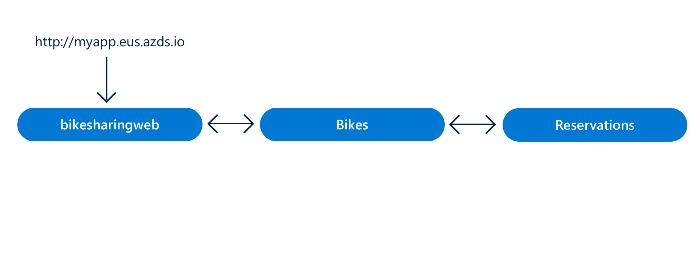

# Quickstart: Team development on Kubernetes - Azure Dev Spaces

In this guide, you will learn how to:

- Set up Azure Dev Spaces on a managed Kubernetes cluster in Azure.
- Deploy a large application with multiple microservices to a dev space.
- Test a single microservice in an isolated dev space within the context of the full application.



## Prerequisites

- An Azure subscription. If you don't have an Azure subscription, you can create a [free account](https://azure.microsoft.com/free).
- [Azure CLI installed](/cli/azure/install-azure-cli?view=azure-cli-latest).
- [Helm 2.13 - 2.16 installed][helm-installed].

## Create an Azure Kubernetes Service cluster

You must create an AKS cluster in a [supported region][supported-regions]. The below commands create a resource group called *MyResourceGroup* and an AKS cluster called *MyAKS*.

```cmd
az group create --name MyResourceGroup --location eastus
az aks create -g MyResourceGroup -n MyAKS --location eastus --disable-rbac --generate-ssh-keys
```

## Enable Azure Dev Spaces on your AKS cluster

Use the `use-dev-spaces` command to enable Dev Spaces on your AKS cluster and follow the prompts. The below command enables Dev Spaces on the *MyAKS* cluster in the *MyResourceGroup* group and creates a dev space called *dev*.

> [!NOTE]
> The `use-dev-spaces` command will also install the Azure Dev Spaces CLI if its not already installed. You cannot install the Azure Dev Spaces CLI in the Azure Cloud Shell.

```cmd
az aks use-dev-spaces -g MyResourceGroup -n MyAKS --space dev --yes
```

## Get sample application code

In this article, you use the [Azure Dev Spaces Bike Sharing sample application](https://github.com/Azure/dev-spaces/tree/master/samples/BikeSharingApp) to demonstrate using Azure Dev Spaces.

Clone the application from GitHub and navigate into its directory:

```cmd
git clone https://github.com/Azure/dev-spaces
cd dev-spaces/samples/BikeSharingApp/
```

## Retrieve the HostSuffix for *dev*

Use the `azds show-context` command to show the HostSuffix for *dev*.

```cmd
$ azds show-context

Name                ResourceGroup     DevSpace  HostSuffix
------------------  ----------------  --------  -----------------------
MyAKS               MyResourceGroup   dev       fedcab0987.eus.azds.io
```

## Update the Helm chart with your HostSuffix

Open [charts/values.yaml](https://github.com/Azure/dev-spaces/blob/master/samples/BikeSharingApp/charts/values.yaml) and replace all instances of `<REPLACE_ME_WITH_HOST_SUFFIX>` with the HostSuffix value you retrieved earlier. Save your changes and close the file.

## Run the sample application in Kubernetes

The commands for running the sample application on Kubernetes are part of an existing process and have no dependency on Azure Dev Spaces tooling. In this case, Helm is the tooling used to run this sample application but other tooling could be used to run your entire application in a namespace within a cluster. The Helm commands are targeting the dev space named *dev* you created earlier, but this dev space is also a Kubernetes namespace. As a result, dev spaces can be targeted by other tooling the same as other namespaces.

You can use Azure Dev Spaces for team development after an application is running in a cluster regardless of the tooling used to deploy it.

Use the `helm init` and `helm install` commands to set up and install the sample application on your cluster.

```cmd
cd charts/
helm init --wait
helm install -n bikesharing . --dep-up --namespace dev --atomic 
```
> [!Note]
> **If you are using an RBAC-enabled cluster**, be sure to configure [a service account for Tiller](https://helm.sh/docs/using_helm/#role-based-access-control). Otherwise, `helm` commands will fail.

The `helm install` command may take several minutes to complete. The output of the command shows the status of all the services it deployed to the cluster when completed:

```cmd
$ cd charts/
$ helm init --wait
...
Happy Helming!

$ helm install -n bikesharing . --dep-up --namespace dev --atomic

Hang tight while we grab the latest from your chart repositories...
...
NAME               READY  UP-TO-DATE  AVAILABLE  AGE
bikes              1/1    1           1          4m32s
bikesharingweb     1/1    1           1          4m32s
billing            1/1    1           1          4m32s
gateway            1/1    1           1          4m32s
reservation        1/1    1           1          4m32s
reservationengine  1/1    1           1          4m32s
users              1/1    1           1          4m32s
```

After the sample application is installed on your cluster and since you have Dev Spaces enabled on your cluster, use the `azds list-uris` command to display the URLs for the sample application in *dev* that is currently selected.

```cmd
$ azds list-uris
Uri                                                 Status
--------------------------------------------------  ---------
http://dev.bikesharingweb.fedcab0987.eus.azds.io/  Available
http://dev.gateway.fedcab0987.eus.azds.io/         Available
```

Navigate to the *bikesharingweb* service by opening the public URL from the `azds list-uris` command. In the above example, the public URL for the *bikesharingweb* service is `http://dev.bikesharingweb.fedcab0987.eus.azds.io/`. Select *Aurelia Briggs (customer)* as the user. Verify you see the text *Hi Aurelia Briggs | Sign Out* at the top.


## Create child dev spaces

Use the `azds space select` command to create two child spaces under *dev*:

```cmd
azds space select -n dev/azureuser1 -y
azds space select -n dev/azureuser2 -y
```

The above commands create two child spaces under *dev* named *azureuser1* and *azureuser2*. These two child spaces represent distinct dev spaces for developers *azureuser1* and *azureuser2* to use for making changes to the sample application.

Use the `azds space list` command to list all the dev spaces and confirm *dev/azureuser2* is selected.

```cmd
$ azds space list
   Name            DevSpacesEnabled
-  --------------  ----------------
   default         False
   dev             True
   dev/azureuser1  True
*  dev/azureuser2  True
```

Use the `azds list-uris` to display the URLs for the sample application in the currently selected space that is *dev/azureuser2*.

```cmd
$ azds list-uris
Uri                                                             Status
--------------------------------------------------              ---------
http://azureuser2.s.dev.bikesharingweb.fedcab0987.eus.azds.io/  Available
http://azureuser2.s.dev.gateway.fedcab0987.eus.azds.io/         Available
```

Confirm that the URLs displayed by the `azds list-uris` command have the *azureuser2.s.dev* prefix. This prefix confirms that the current space selected is *azureuser2*, which is a child of *dev*.

Navigate to the *bikesharingweb* service for the *dev/azureuser2* dev space by opening the public URL from the `azds list-uris` command. In the above example, the public URL for the *bikesharingweb* service is `http://azureuser2.s.dev.bikesharingweb.fedcab0987.eus.azds.io/`. Select *Aurelia Briggs (customer)* as the user. Verify you see the text *Hi Aurelia Briggs | Sign out* at the top.

## Update code

Open *BikeSharingWeb/components/Header.js* with a text editor and change the text in the [span element with the `userSignOut` className](https://github.com/Azure/dev-spaces/blob/master/samples/BikeSharingApp/BikeSharingWeb/components/Header.js#L16).

```html
<span className="userSignOut">
    <Link href="/devsignin"><span tabIndex="0">Welcome {props.userName} | Sign out</span></Link>
</span>
```

Save your changes and close the file.

## Build and run the updated bikesharingweb service in the *dev/azureuser2* dev space

Navigate to the *BikeSharingWeb/* directory and run the `azds up` command.

```cmd
$ cd ../BikeSharingWeb/
$ azds up

Using dev space 'dev/azureuser2' with target 'MyAKS'
Synchronizing files...2s
...
Service 'bikesharingweb' port 'http' is available at http://azureuser2.s.dev.bikesharingweb.fedcab0987.eus.azds.io/
Service 'bikesharingweb' port 80 (http) is available at http://localhost:54256
...
```

This command builds and runs the *bikesharingweb* service in the *dev/azureuser2* dev space. This service runs in addition to the *bikesharingweb* service running in *dev* and is only used for requests with the *azureuser2.s* URL prefix. For more information on how routing works between parent and child dev spaces, see [How Azure Dev Spaces works and is configured](how-dev-spaces-works.md).

Navigate to the *bikesharingweb* service for the *dev/azureuser2* dev space by opening the public URL displayed in the output of the `azds up` command. Select *Aurelia Briggs (customer)* as the user. Verify you see the updated text in the upper right corner. You may need to refresh the page or clear your browser's cache if you do not immediately see this change.


> [!NOTE]
> When you navigate to your service while running `azds up`, the HTTP request traces are also displayed in the output of the `azds up` command. These traces can help you troubleshoot and debug your service. You can disable these traces using `--disable-http-traces` when running `azds up`.

## Verify other Dev Spaces are unchanged

If the `azds up` command is still running, press *Ctrl+c*.

```cmd
$ azds list-uris --all
Uri                                                             Status
--------------------------------------------------              ---------
http://azureuser1.s.dev.bikesharingweb.fedcab0987.eus.azds.io/  Available
http://azureuser1.s.dev.gateway.fedcab0987.eus.azds.io/         Available
http://azureuser2.s.dev.bikesharingweb.fedcab0987.eus.azds.io/  Available
http://azureuser2.s.dev.gateway.fedcab0987.eus.azds.io/         Available
http://dev.bikesharingweb.fedcab0987.eus.azds.io/               Available
http://dev.gateway.fedcab0987.eus.azds.io/                      Available
```

Navigate to the *dev* version of *bikesharingweb* in your browser, choose *Aurelia Briggs (customer)* as the user, and verify you see the original text in the upper right corner. Repeat these steps with the *dev/azureuser1* URL. Notice the changes are only applied to the *dev/azureuser2* version of *bikesharingweb*. This isolation of changes to *dev/azureuser2* allows for *azureuser2* to make changes without affecting *azureuser1*.

To have these changes reflected in *dev* and *dev/azureuser1*, you should follow your team's existing workflow or CI/CD pipeline. For example, this workflow may involve committing your change to your version control system and deploying the update using a CI/CD pipeline or tooling such as Helm.

## Clean up your Azure resources

```cmd
az group delete --name MyResourceGroup --yes --no-wait
```

## Next steps

Learn how Azure Dev Spaces helps you develop more complex apps across multiple containers, and how you can simplify collaborative development by working with different versions or branches of your code in different spaces.

> [!div class="nextstepaction"]
> [Working with multiple containers and team development](multi-service-nodejs.md)

[helm-installed]: https://v2.helm.sh/docs/using_helm/#installing-helm
[supported-regions]: https://azure.microsoft.com/global-infrastructure/services/?products=kubernetes-service
