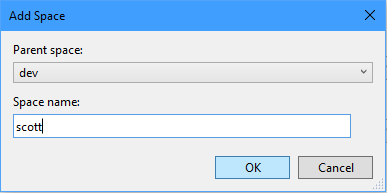
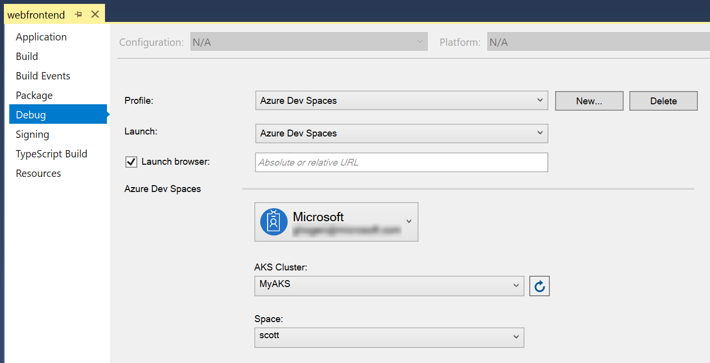

# Team development using .NET Core and Visual Studio with Azure Dev Spaces

In this tutorial, you'll learn how a team of developers can simultaneously collaborate in the same Kubernetes cluster using Dev Spaces.

## Learn about team development

So far you've run your application's code as if you were the only developer working on the app. In this section, you'll learn how Azure Dev Spaces streamlines team development:
* Enable a team of developers to work in the same environment, by working in a shared dev space or in distinct dev spaces as needed.
* Supports each developer iterating on their code in isolation and without fear of breaking others.
* Test code end-to-end, prior to code commit, without having to create mocks or simulate dependencies.

### Challenges with developing microservices
Your sample application isn't complex at the moment. But in real-world development, challenges soon emerge as you add more services and the development team grows.

* Your development machine may not have enough resources to run every service you need at once.
* Some services may need to be publicly reachable. For example, a service may need to have an endpoint that responds to a webhook.
* If you want to run a subset of services, you have to know the full dependency hierarchy between all your services. Determining this hierarchy can be difficult, especially as your number of services increase.
* Some developers resort to simulating, or mocking up, many of their service dependencies. This approach can help, but managing those mocks can soon impact development cost. Plus, this approach leads to your development environment looking different from production, which can lead to subtle bugs occurring.
* It follows that doing any type of integration testing becomes difficult. Integration testing can only realistically happen post-commit, which means you see problems later in the development cycle.

    

### Work in a shared dev space
With Azure Dev Spaces, you can set up a *shared* dev space in Azure. Each developer can focus on just their part of the application, and can iteratively develop *pre-commit code* in a dev space that already contains all the other services and cloud resources that their scenarios depend on. Dependencies are always up-to-date, and developers are working in a way that mirrors production.

### Work in your own space
As you develop code for your service, and before you're ready to check it in, code often won't be in a good state. You're still iteratively shaping it, testing it, and experimenting with solutions. Azure Dev Spaces provides the concept of a **space**, which allows you to work in isolation, and without the fear of breaking your team members.

## Use Dev Spaces for team development
Let's demonstrate these ideas with a concrete example using our *webfrontend* -> *mywebapi* sample application. We'll imagine a scenario where a developer, Scott, needs to make a change to the *mywebapi* service, and *only* that service. The *webfrontend* won't need to change as part of Scott's update.

_Without_ using Dev Spaces, Scott would have a few ways to develop and test his update, none of which are ideal:
* Run ALL components locally, which requires a more powerful development machine with Docker installed, and potentially MiniKube.
* Run ALL components in an isolated namespace on the Kubernetes cluster. Since *webfrontend* isn't changing, using an isolated namespace is a waste of cluster resources.
* ONLY run *mywebapi*, and make manual REST calls to test. This type of testing doesn't test the full end-to-end flow.
* Add development-focused code to *webfrontend* that allows the developer to send requests to a different instance of *mywebapi*. Adding this code complicates the *webfrontend* service.

### Set up your baseline
First we'll need to deploy a baseline of our services. This deployment will represent the "last known good" so you can easily compare the behavior of your local code vs. the checked-in version. We'll then create a child space based on this baseline so we can test our changes to *mywebapi* within the context of the larger application.

1. Clone the [Dev Spaces sample application](https://github.com/Azure/dev-spaces): `git clone https://github.com/Azure/dev-spaces && cd dev-spaces`
1. Check out the remote branch *azds_updates*: `git checkout -b azds_updates origin/azds_updates`
1. Close any F5/debug sessions for both services, but keep the projects open in their Visual Studio windows.
1. Switch to the Visual Studio window with the _mywebapi_ project.
1. Right-click on the project in **Solution Explorer** and select **Properties**.
1. Select the **Debug** tab on the left to show the Azure Dev Spaces settings.
1. Select **Change** to create the space that will be used when you F5 or Ctrl+F5 the service.
1. In the Space dropdown, select **\<Create New Space…\>**.
1. Make sure the parent space is set to **\<none\>**, and enter space name **dev**. Click OK.
1. Press Ctrl+F5 to run _mywebapi_ without the debugger attached.
1. Switch to the Visual Studio window with the _webfrontend_ project and press Ctrl+F5 to run it as well.

> [!Note]
> It is sometimes necessary to refresh your browser after the web page is initially displayed 
> following a Ctrl+F5.

> [!TIP]
> The above steps manually set up a baseline, but we recommend teams use CI/CD to automatically keep your baseline up to date with committed code.
>
> Check out our [guide to setting up CI/CD with Azure DevOps](how-to/setup-cicd.md) to create a workflow similar to the following diagram.
>
> 

Anyone who opens the public URL and navigates to the web app will invoke the code path you have written which runs through both services using the default _dev_ space. Now suppose you want to continue developing *mywebapi* - how can you do this and not interrupt other developers who are using the dev space? To do that, you'll set up your own space.

### Create a new dev space
From within Visual Studio, you can create additional spaces that will be used when you F5 or Ctrl+F5 your service. You can call a space anything you'd like, and you can be flexible about what it means (ex. _sprint4_ or _demo_).

Do the following to create a new space:
1. Switch to the Visual Studio window with the *mywebapi* project.
2. Right-click on the project in **Solution Explorer** and select **Properties**.
3. Select the **Debug** tab on the left to show the Azure Dev Spaces settings.
4. From here, you can change or create the cluster and/or space that will be used when you F5 or Ctrl+F5. *Make sure the Azure Dev Space you created earlier is selected*.
5. In the Space dropdown, select **\<Create New Space…\>**.

    

6. In the **Add Space** dialog, set the parent space to **dev**, and enter a name for your new space. You can use your name (for example, "scott") for the new space so that it is identifiable to your peers what space you're working in. Click **OK**.

    

7. You should now see your AKS cluster and new Space selected on the project properties page.

    

### Update code for *mywebapi*

1. In the *mywebapi* project make a code change to the `string Get(int id)` method in file `Controllers/ValuesController.cs` as follows:
 
    ```csharp
    [HttpGet("{id}")]
    public string Get(int id)
    {
        return "mywebapi now says something new";
    }
    ```

2. Set a breakpoint in this updated block of code (you may already have one set from before).
3. Hit F5 to start the _mywebapi_ service, which will start the service in your cluster using the selected space. The selected space in this case is _scott_.

Here is a diagram that will help you understand how the different spaces work. The purple path shows a request via the _dev_ space, which is the default path used if no space is prepended to the URL. The pink path shows a request via the _dev/scott_ space.


This built-in capability of Azure Dev Spaces enables you to test code end-to-end in a shared environment without requiring each developer to re-create the full stack of services in their space. This routing requires propagation headers to be forwarded in your app code, as illustrated in the previous step of this guide.

### Test code running in the _dev/scott_ space
To test your new version of *mywebapi* in conjunction with *webfrontend*, open your browser to the public access point URL for *webfrontend* (for example, `http://dev.webfrontend.123456abcdef.eus.azds.io`) and go to the About page. You should see the original message "Hello from webfrontend and Hello from mywebapi".

Now, add the "scott.s." part to the URL so it reads something like http\://scott.s.dev.webfrontend.123456abcdef.eus.azds.io and refresh the browser. The breakpoint you set in your *mywebapi* project should get hit. Click F5 to proceed and in your browser you should now see the new message "Hello from webfrontend and mywebapi now says something new." This is because the path to your updated code in *mywebapi* is running in the _dev/scott_ space.

Once you have a _dev_ space that always contains your latest changes, and assuming your application is designed to take advantage of DevSpace's space-based routing as described in this tutorial section, hopefully it becomes easy to see how Dev Spaces can greatly assist in testing new features within the context of the larger application. Rather than having to deploy _all_ services to your private space, you can create a private space that derives from _dev_, and only "up" the services you're actually working on. The Dev Spaces routing infrastructure will handle the rest by utilizing as many services out of your private space as it can find, while defaulting back to the latest version running in the _dev_ space. And better still, _multiple_ developers can actively develop different services at the same time in their own space without disrupting each other.

### Well done!
You've completed the getting started guide! You learned how to:

> [!div class="checklist"]
> * Set up Azure Dev Spaces with a managed Kubernetes cluster in Azure.
> * Iteratively develop code in containers.
> * Independently develop two separate services, and used Kubernetes' DNS service discovery to make a call to another service.
> * Productively develop and test your code in a team environment.
> * Establish a baseline of functionality using Dev Spaces to easily test isolated changes within the context of a larger microservice application

Now that you've explored Azure Dev Spaces, [share your dev space with a team member](how-to/share-dev-spaces.md) and help them see how easy it is to collaborate together.

## Clean up
To completely delete an Azure Dev Spaces instance on a cluster, including all the dev spaces and running services within it, use the `az aks remove-dev-spaces` command. Bear in mind that this action is irreversible. You can add support for Azure Dev Spaces again on the cluster, but it will be as if you are starting again. Your old services and spaces won't be restored.

The following example lists the Azure Dev Spaces controllers in your active subscription, and then deletes the Azure Dev Spaces controller that is associated with AKS cluster 'myaks' in resource group 'myaks-rg'.

```cmd
azds controller list
```

```azurecli
az aks remove-dev-spaces --name myaks --resource-group myaks-rg
```
