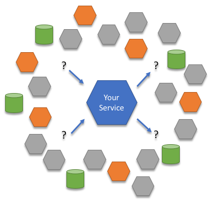
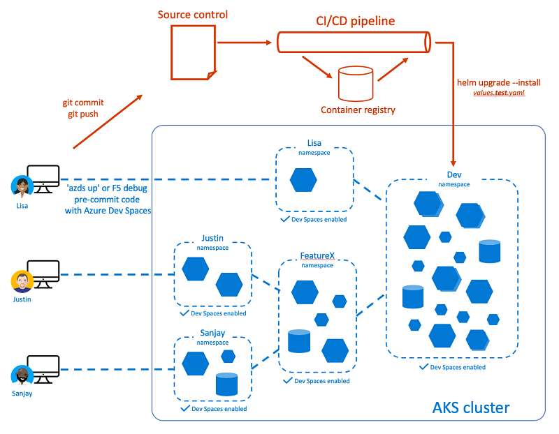
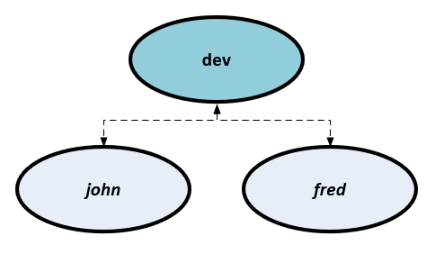
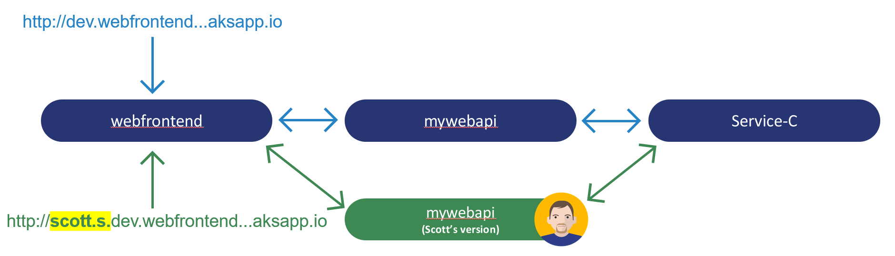

# Team development using .NET Core and Visual Studio Code with Azure Dev Spaces

In this tutorial, you'll learn how a team of developers can simultaneously collaborate in the same Kubernetes cluster using Dev Spaces.

## Learn about team development
So far you've been running your application's code as if you were the only developer working on the app. In this section, you'll learn how Azure Dev Spaces streamlines team development:
* Enable a team of developers to work in the same environment, by working in a shared dev space or in distinct dev spaces as needed.
* Supports each developer iterating on their code in isolation and without fear of breaking others.
* Test code end-to-end, prior to code commit, without having to create mocks or simulate dependencies.

### Challenges with developing microservices
Your sample application isn't very complex at the moment. But in real-world development, challenges soon emerge as you add more services and the development team grows. It can become unrealistic to run everything locally for development.

* Your development machine may not have enough resources to run every service you need at once.
* Some services may need to be publicly reachable. For example, a service may need to have an endpoint that responds to a webhook.
* If you want to run a subset of services, you have to know the full dependency hierarchy between all your services. Determining this can be difficult, especially as your number of services increase.
* Some developers resort to simulating, or mocking up, many of their service dependencies. This approach can help, but managing those mocks can soon impact development cost. Plus, this approach leads to your development environment looking very different from production, which allows subtle bugs to creep in.
* It follows that doing any type of integration testing becomes difficult. Integration testing can only realistically happen post-commit, which means you see problems later in the development cycle.

    

### Work in a shared dev space
With Azure Dev Spaces, you can set up a *shared* dev space in Azure. Each developer can focus on just their part of the application, and can iteratively develop *pre-commit code* in a dev space that already contains all the other services and cloud resources that their scenarios depend on. Dependencies are always up-to-date, and developers are working in a way that mirrors production.

### Work in your own space
As you develop code for your service, and before you're ready to check it in, code often won't be in a good state. You're still iteratively shaping it, testing it, and experimenting with solutions. Azure Dev Spaces provides the concept of a **space**, which allows you to work in isolation, and without the fear of breaking your team members.

## Use Dev Spaces for team development
Let's demonstrate these ideas with a concrete example using our *webfrontend* -> *mywebapi* sample application. We'll imagine a scenario where a developer, Scott, needs to make a change to the *mywebapi* service, and *only* that service. The *webfrontend* won't need to change as part of Scott's update.

_Without_ using Dev Spaces, Scott would have a few ways to develop and test his update, none of which are ideal:
* Run ALL components locally. This requires a more powerful development machine with Docker installed, and potentially MiniKube.
* Run ALL components in an isolated namespace on the Kubernetes cluster. Since *webfrontend* isn't changing, this is a waste of cluster resources.
* ONLY run *mywebapi*, and make manual REST calls to test. This doesn't test the full end-to-end flow.
* Add development-focused code to *webfrontend* that allows the developer to send requests to a different instance of *mywebapi*. This complicates the *webfrontend* service.

### Set up your baseline
First we'll need to deploy a baseline of our services. This deployment will represent the "last known good" so you can easily compare the behavior of your local code vs. the checked-in version. We'll then create a child space based on this baseline so we can test our changes to *mywebapi* within the context of the larger application.

1. Clone the [Dev Spaces sample application](https://github.com/Azure/dev-spaces): `git clone https://github.com/Azure/dev-spaces && cd dev-spaces`
1. Checkout the remote branch *azds_updates*: `git checkout -b azds_updates origin/azds_updates`
1. Select the _dev_ space: `azds space select --name dev`. When prompted to select a parent dev space, select _\<none\>_.
1. Navigate to the _mywebapi_ directory and execute: `azds up -d`
1. Navigate to the _webfrontend_ directory and execute: `azds up -d`
1. Execute `azds list-uris` to see the public endpoint for _webfrontend_

> [!TIP]
> The above steps manually set up a baseline, but we recommend teams use CI/CD to automatically keep your baseline up to date with committed code.
>
> Check out our [guide to setting up CI/CD with Azure DevOps](how-to/setup-cicd.md) to create a workflow similar to the following diagram.
>
> 

At this point your baseline should be running. Run the `azds list-up --all` command, and you'll see output similar to the following:

```
$ azds list-up --all

Name                          DevSpace  Type     Updated  Status
----------------------------  --------  -------  -------  -------
mywebapi                      dev       Service  3m ago   Running
mywebapi-56c8f45d9-zs4mw      dev       Pod      3m ago   Running
webfrontend                   dev       Service  1m ago   Running
webfrontend-6b6ddbb98f-fgvnc  dev       Pod      1m ago   Running
```

The DevSpace column shows that both services are running in a space named _dev_. Anyone who opens the public URL and navigates to the web app will invoke the checked-in code path that runs through both services. Now suppose you want to continue developing _mywebapi_. How can you make code changes and test them and not interrupt other developers who are using the dev environment? To do that, you'll set up your own space.

### Create a dev space
To run your own version of _mywebapi_ in a space other than _dev_, you can create your own space by using the following command:

```cmd
azds space select --name scott
```

When prompted, select _dev_ as the **parent dev space**. This means our new space, _dev/scott_, will derive from the space _dev_. We'll shortly see how this will help us with testing.

Keeping with our introductory hypothetical, we've used the name _scott_ for the new space so peers can identify who is working in it. But it can be called anything you like, and be flexible about what it means, like _sprint4_ or _demo_. Whatever the case, _dev_ serves as the baseline for all developers working on a piece of this application:



Run the `azds space list` command to see a list of all the spaces in the dev environment. The _Selected_ column indicates which space you currently have selected (true/false). In your case, the space named _dev/scott_ was automatically selected when it was created. You can select another space at any time with the `azds space select` command.

Let's see it in action.

### Make a code change
Go to the VS Code window for `mywebapi` and make a code edit to the `string Get(int id)` method in `Controllers/ValuesController.cs`, for example:

```csharp
[HttpGet("{id}")]
public string Get(int id)
{
    return "mywebapi now says something new";
}
```

### Run the service

To run the service, hit F5 (or type `azds up` in the Terminal Window) to run the service. The service will automatically run in your newly selected space _dev/scott_. Confirm that your service is running in its own space by running `azds list-up`:

```cmd
$ azds list-up

Name                      DevSpace  Type     Updated  Status
mywebapi                  scott     Service  3m ago   Running
webfrontend               dev       Service  26m ago  Running
```

Notice an instance of *mywebapi* is now running in the _dev/scott_ space. The version running in _dev_ is still running but it is not listed.

List the URLs for the current space by running `azds list-uris`.

```cmd
$ azds list-uris

Uri                                                                        Status
-------------------------------------------------------------------------  ---------
http://localhost:53831 => mywebapi.scott:80                                Tunneled
http://scott.s.dev.webfrontend.6364744826e042319629.ce.azds.io/  Available
```

Notice the public access point URL for *webfrontend* is prefixed with *scott.s*. This URL is unique to the _dev/scott_ space. This URL prefix tells the Ingress controller to route requests to the _dev/scott_ version of a service. When a request with this URL is handled by Dev Spaces, the Ingress Controller first tries to route the request to the *webfrontend* service in the _dev/scott_ space. If that fails, the request will be routed to the *webfrontend* service in the _dev_ space as a fallback. Also notice there is a localhost URL to access the service over localhost using the Kubernetes *port-forward* functionality. For more information about URLs and routing in Azure Dev Spaces, see [How Azure Dev Spaces works and is configured](how-dev-spaces-works.md).



This built-in feature of Azure Dev Spaces lets you test code in a shared space without requiring each developer to re-create the full stack of services in their space. This routing requires your app code to forward propagation headers, as illustrated in the previous step of this guide.

### Test code in a space
To test your new version of *mywebapi* with *webfrontend*, open your browser to the public access point URL for *webfrontend* and go to the About page. You should see your new message displayed.

Now, remove the "scott.s." part of the URL, and refresh the browser. You should see the old behavior (with the *mywebapi* version running in _dev_).

Once you have a _dev_ space, which always contains your latest changes, and assuming your application is designed to take advantage of DevSpace's space-based routing as described in this tutorial section, hopefully it becomes easy to see how Dev Spaces can greatly assist in testing new features within the context of the larger application. Rather than having to deploy _all_ services to your private space, you can create a private space that derives from _dev_, and only "up" the services you're actually working on. The Dev Spaces routing infrastructure will handle the rest by utilizing as many services out of your private space as it can find, while defaulting back to the latest version running in the _dev_ space. And better still, _multiple_ developers can actively develop different services at the same time in their own space without disrupting each other.

### Well done!
You've completed the getting started guide! You learned how to:

> [!div class="checklist"]
> * Set up Azure Dev Spaces with a managed Kubernetes cluster in Azure.
> * Iteratively develop code in containers.
> * Independently develop two separate services, and used Kubernetes' DNS service discovery to make a call to another service.
> * Productively develop and test your code in a team environment.
> * Establish a baseline of functionality using Dev Spaces to easily test isolated changes within the context of a larger microservice application

Now that you've explored Azure Dev Spaces, [share your dev space with a team member](how-to/share-dev-spaces.md) and begin collaborating.

## Clean up
To completely delete an Azure Dev Spaces instance on a cluster, including all the dev spaces and running services within it, use the `az aks remove-dev-spaces` command. Bear in mind that this action is irreversible. You can add support for Azure Dev Spaces again on the cluster, but it will be as if you are starting again. Your old services and spaces won't be restored.

The following example lists the Azure Dev Spaces controllers in your active subscription, and then deletes the Azure Dev Spaces controller that is associated with AKS cluster 'myaks' in resource group 'myaks-rg'.

```cmd
azds controller list
```

```azurecli
az aks remove-dev-spaces --name myaks --resource-group myaks-rg
```
