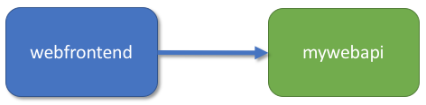

# Team development with Azure Dev Spaces

In this tutorial, you'll learn how to use multiple dev spaces to work simultaneously in different development environments, keeping separate work in separate dev spaces in the same cluster.

## Call a service running in a separate container

In this section you're going to create a second service, `mywebapi`, and have `webfrontend` call it. Each service will run in separate containers. You'll then debug across both containers.



### Open sample code for *mywebapi*
You should already have the sample code for `mywebapi` for this guide under a folder named `samples` (if not, go to https://github.com/Azure/dev-spaces and select **Clone or Download** to download the GitHub repository.) The code for this section is in `samples/nodejs/getting-started/mywebapi`.

### Run *mywebapi*
1. Open the folder `mywebapi` in a *separate VS Code window*.
1. Open the **Command Palette** (using the **View | Command Palette** menu), and use auto-complete to type and select this command: `Azure Dev Spaces: Prepare configuration files for Azure Dev Spaces`. This command is not to be confused with the `azds prep` command, which configures the project for deployment.
1. Hit F5, and wait for the service to build and deploy. You'll know it's ready when the VS Code debug bar appears.
1. Take note of the endpoint URL, it will look something like http://localhost:\<portnumber\>. **Tip: The VS Code status bar will display a clickable URL.** It may seem like the container is running locally, but actually it is running in your development environment in Azure. The reason for the localhost address is because `mywebapi` has not defined any public endpoints and can only be accessed from within the Kubernetes instance. For your convenience, and to facilitate interacting with the private service from your local machine, Azure Dev Spaces creates a temporary SSH tunnel to the container running in Azure.
1. When `mywebapi` is ready, open your browser to the localhost address. You should see a response from the `mywebapi` service ("Hello from mywebapi").


### Make a request from *webfrontend* to *mywebapi*
Let's now write code in `webfrontend` that makes a request to `mywebapi`.
1. Switch to the VS Code window for `webfrontend`.
1. Add these lines of code at the top of `server.js`:
    ```javascript
    var request = require('request');
    ```

3. *Replace* the code for the `/api` GET handler. When handling a request, it in turn makes a call to `mywebapi`, and then returns the results from both services.

    ```javascript
    app.get('/api', function (req, res) {
       request({
          uri: 'http://mywebapi',
          headers: {
             /* propagate the dev space routing header */
             'azds-route-as': req.headers['azds-route-as']
          }
       }, function (error, response, body) {
           res.send('Hello from webfrontend and ' + body);
       });
    });
    ```
 4. *Remove* the `server.close()` line at the end of `server.js`

The preceding code example forwards the `azds-route-as` header from the incoming request to the outgoing request. You'll see later how this helps teams with collaborative development.

### Debug across multiple services
1. At this point, `mywebapi` should still be running with the debugger attached. If it is not, hit F5 in the `mywebapi` project.
1. Set a breakpoint in the default GET `/` handler.
1. In the `webfrontend` project, set a breakpoint just before it sends a GET request to `http://mywebapi`.
1. Hit F5 in the `webfrontend` project.
1. Open the web app, and step through code in both services. The web app should display a message concatenated by the two services: "Hello from webfrontend and Hello from mywebapi."

Well done! You now have a multi-container application where each container can be developed and deployed separately.

## Learn about team development

[!INCLUDE [](../../includes/team-development-1.md)]

Now see it in action:
1. Go to the VS Code window for `mywebapi` and make a code edit to the default GET `/` handler, for example:

    ```javascript
    app.get('/', function (req, res) {
        res.send('mywebapi now says something new');
    });
    ```

[!INCLUDE [](../../includes/team-development-2.md)]

### Well done!
You've completed the getting started guide! You learned how to:

> [!div class="checklist"]
> * Set up Azure Dev Spaces with a managed Kubernetes cluster in Azure.
> * Iteratively develop code in containers.
> * Independently develop two separate services, and used Kubernetes' DNS service discovery to make a call to another service.
> * Productively develop and test your code in a team environment.

Now that you've explored Azure Dev Spaces, [share your dev space with a team member](how-to/share-dev-spaces.md) and help them see how easy it is to collaborate together.

## Clean up
To completely delete an Azure Dev Spaces instance on a cluster, including all the dev spaces and running services within it, use the `az aks remove-dev-spaces` command. Bear in mind that this action is irreversible. You can add support for Azure Dev Spaces again on the cluster, but it will be as if you are starting again. Your old services and spaces won't be restored.

The following example lists the Azure Dev Spaces controllers in your active subscription, and then deletes the Azure Dev Spaces controller that is associated with AKS cluster 'myaks' in resource group 'myaks-rg'.

```cmd
    azds controller list
    az aks remove-dev-spaces --name myaks --resource-group myaks-rg
```


