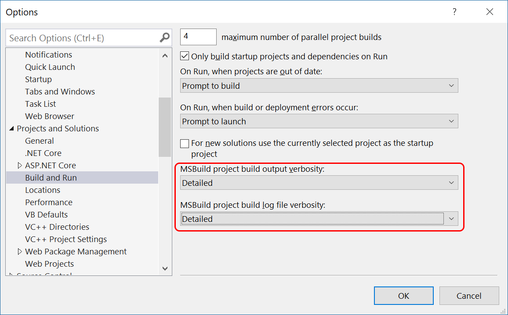

# Azure Dev Spaces troubleshooting

This guide contains information about common problems you may have when using Azure Dev Spaces.

If you have a problem when using Azure Dev Spaces, create an [issue in the Azure Dev Spaces GitHub repository](https://github.com/Azure/dev-spaces/issues).

## Before you begin

To troubleshoot problems more effectively, it may help to create more detailed logs for review.

For the Visual Studio extension, set the `MS_VS_AZUREDEVSPACES_TOOLS_LOGGING_ENABLED` environment variable to 1. Be sure to restart Visual Studio for the environment variable to take effect. Once enabled, detailed logs are written to your `%TEMP%\Microsoft.VisualStudio.Azure.DevSpaces.Tools` directory.

In the CLI, you can output more information during command execution by using the `--verbose` switch. You can also browse more detailed logs in `%TEMP%\Azure Dev Spaces`. On a Mac, the TEMP directory can be found by running `echo $TMPDIR` from a terminal window. On a Linux computer, the TEMP directory is usually `/tmp`.

Azure Dev Spaces also works best when debugging a single instance, or pod. The `azds.yaml` file contains a setting, *replicaCount*, that indicates the number of pods that Kubernetes runs for your service. If you change the *replicaCount* to configure your application to run multiple pods for a given service, the debugger attaches to the first pod, when listed alphabetically. The debugger attaches to a different pod when the original pod recycles, possibly resulting in unexpected behavior.

## Common issues when enabling Azure Dev Spaces

### Error "Failed to create Azure Dev Spaces controller"

You might see this error when something goes wrong with the creation of the controller. If it's a transient error, delete and recreate the controller to fix it.

You can also try deleting the controller:

```bash
azds remove -g <resource group name> -n <cluster name>
```

Use the Azure Dev Spaces CLI to delete a controller. It’s not possible to delete a controller from Visual Studio. You also can't install the Azure Dev Spaces CLI in the Azure Cloud Shell so you can't delete a controller from the Azure Cloud Shell.

If you don't have the Azure Dev Spaces CLI installed, you can first install it using the following command then delete your controller:

```cmd
az aks use-dev-spaces -g <resource group name> -n <cluster name>
```

Recreating the controller can be done from the CLI or Visual Studio. See the [Team development](quickstart-team-development.md) or [Develop with .NET Core](quickstart-netcore-visualstudio.md) quickstarts for examples.

### Controller create failing because of controller name length

An Azure Dev Spaces controller's name can't be longer than 31 characters. If your controller's name exceeds 31 characters when you enable Dev Spaces on an AKS cluster or create a controller, you'll receive an error. For example:

```console
Failed to create a Dev Spaces controller for cluster 'a-controller-name-that-is-way-too-long-aks-east-us': Azure Dev Spaces Controller name 'a-controller-name-that-is-way-too-long-aks-east-us' is invalid. Constraint(s) violated: Azure Dev Spaces Controller names can only be at most 31 characters long*
```

To fix this issue, create a controller with an alternate name. For example:

```cmd
azds controller create --name my-controller --target-name MyAKS --resource-group MyResourceGroup
```

### Enabling Dev Spaces failing when Windows node pools are added to an AKS cluster

Currently, Azure Dev Spaces is intended to run on Linux pods and nodes only. When you have an AKS cluster with a Windows node pool, you must ensure that Azure Dev Spaces pods are only scheduled on Linux nodes. If an Azure Dev Spaces pod is scheduled to run on a Windows node, that pod won't start and enabling Dev Spaces will fail.

To fix this issue, [add a taint](../aks/operator-best-practices-advanced-scheduler.md#provide-dedicated-nodes-using-taints-and-tolerations) to your AKS cluster to ensure Linux pods aren't scheduled to run on a Windows node.

### Error "Found no untainted Linux nodes in Ready state on the cluster. There needs to be at least one untainted Linux node in Ready state to deploy pods in 'azds' namespace."

Azure Dev Spaces couldn't create a controller on your AKS cluster because it couldn't find an untainted node in a *Ready* state to schedule pods on. Azure Dev Spaces requires at least one Linux node in a *Ready* state that allows for scheduling pods without specifying tolerations.

To fix this issue, [update your taint configuration](../aks/operator-best-practices-advanced-scheduler.md#provide-dedicated-nodes-using-taints-and-tolerations) on your AKS cluster to ensure at least one Linux node allows for scheduling pods without specifying tolerations. Also, ensure that at least one Linux node that allows scheduling pods without specifying tolerations is in the *Ready* state. If your node is taking a long time to reach the *Ready* state, you can try restarting your node.

### Error "Azure Dev Spaces CLI not installed properly" when running `az aks use-dev-spaces`

An update to the Azure Dev Spaces CLI changed its installation path. If you're using a version of the Azure CLI earlier than 2.0.63, you may see this error. To display your version of the Azure CLI, use `az --version`.

```bash
$ az --version
azure-cli                         2.0.60 *
...
```

Despite the error message when running `az aks use-dev-spaces` with a version of the Azure CLI before 2.0.63, the installation does succeed. You can continue to use `azds` without any issues.

To fix this issue, update your installation of the [Azure CLI](/cli/azure/install-azure-cli?view=azure-cli-latest) to 2.0.63 or later. This update will resolve the error message you receive when running `az aks use-dev-spaces`. Alternatively, you can continue to use your current version of the Azure CLI and the Azure Dev Spaces CLI.

### Error "Unable to reach kube-apiserver"

You might see this error when Azure Dev Spaces is unable to connect to your AKS cluster's API server. 

If access to your AKS cluster API server is locked down or if you have [API server authorized IP address ranges](../aks/api-server-authorized-ip-ranges.md) enabled for your AKS cluster, you must also [create](../aks/api-server-authorized-ip-ranges.md#create-an-aks-cluster-with-api-server-authorized-ip-ranges-enabled) or [update](../aks/api-server-authorized-ip-ranges.md#update-a-clusters-api-server-authorized-ip-ranges) your cluster to [allow additional ranges based on your region](https://github.com/Azure/dev-spaces/tree/master/public-ips).

Ensure that the API server is available by running kubectl commands. If the API server is unavailable, please contact AKS support and try again when the API server is working.

## Common issues when preparing your project for Azure Dev Spaces

### Warning "Dockerfile could not be generated due to unsupported language"
Azure Dev Spaces provides native support for C# and Node.js. When you run `azds prep` in a directory with code written in one of these languages, Azure Dev Spaces automatically creates an appropriate Dockerfile for you.

You can still use Azure Dev Spaces with code written in other languages, but you need to manually create the Dockerfile before running `azds up` for the first time.

If your application is written in a language that Azure Dev Spaces doesn't natively support, you need to provide an appropriate Dockerfile to build a container image running your code. Docker provides a [list of best practices for writing Dockerfiles](https://docs.docker.com/develop/develop-images/dockerfile_best-practices/) and a [Dockerfile reference](https://docs.docker.com/engine/reference/builder/) that can help you write a Dockerfile that suits your needs.

Once you have an appropriate Dockerfile in place, you run `azds up` to run your application in Azure Dev Spaces.

## Common issues when starting or stopping services with Azure Dev Spaces

### Error "Config file not found:"

When running `azds up`, you may see this error. Both `azds up` and `azds prep` must be run from the root directory of the project you want to run in your dev space.

To fix this issue:
1. Change your current directory to the root folder containing your service code. 
1. If you don't have a _azds.yaml_ file in the code folder, run `azds prep` to generate Docker, Kubernetes, and Azure Dev Spaces assets.

### Timeout at "Waiting for container image build..." step with AKS virtual nodes

This timeout occurs when you attempt to use Dev Spaces to run a service that is configured to run on an [AKS virtual node](https://docs.microsoft.com/azure/aks/virtual-nodes-portal). Dev Spaces doesn't currently support building or debugging services on virtual nodes.

If you run `azds up` with the `--verbose` switch, or enable verbose logging in Visual Studio, you see additional detail:

```cmd
$ azds up --verbose

Installed chart in 2s
Waiting for container image build...
pods/mywebapi-76cf5f69bb-lgprv: Scheduled: Successfully assigned default/mywebapi-76cf5f69bb-lgprv to virtual-node-aci-linux
Streaming build container logs for service 'mywebapi' failed with: Timed out after 601.3037572 seconds trying to start build logs streaming operation. 10m 1s
Container image build failed
```

The above command shows that the service's pod was assigned to *virtual-node-aci-linux*, which is a virtual node.

To fix this issue, update the Helm chart for the service to remove any *nodeSelector* or *tolerations* values that allow the service to run on a virtual node. These values are typically defined in the chart's `values.yaml` file.

You can still use an AKS cluster that has the virtual nodes feature enabled, if the service you wish to build or debug via Dev Spaces runs on a VM node. Running a service with Dev Spaces on a VM node is the default configuration.

### Error "could not find a ready tiller pod" when launching Dev Spaces

This error occurs if the Helm client can no longer talk to the Tiller pod running in the cluster.

To fix this issue, restart the agent nodes in your cluster.

### Error "release azds-\<identifier\>-\<spacename\>-\<servicename\> failed: services '\<servicename\>' already exists" or "Pull access denied for \<servicename\>, repository does not exist or may require 'docker login'"

These errors can occur if you mix running direct Helm commands (such as `helm install`, `helm upgrade`, or `helm delete`) with Dev Spaces commands (such as `azds up` and `azds down`) inside the same dev space. They occur because Dev Spaces has its own Tiller instance, which conflicts with your own Tiller instance running in the same dev space.

It's fine to use both Helm commands and Dev Spaces commands against the same AKS cluster, but each Dev Spaces-enabled namespace should use either one or the other.

For example, suppose you use a Helm command to run your entire application in a parent dev space. You can create child dev spaces off that parent, use Dev Spaces to run individual services inside the child dev spaces, and test the services together. When you're ready to check in your changes, use a Helm command to deploy the updated code to the parent dev space. Don't use `azds up` to run the updated service in the parent dev space, because it will conflict with the service initially run using Helm.

### Existing Dockerfile not used to build a container

Azure Dev Spaces can be configured to point to a specific _Dockerfile_ in your project. If it appears Azure Dev Spaces isn't using the _Dockerfile_ you expect to build your containers, you might need to explicitly tell Azure Dev Spaces which Dockerfile to use. 

To fix this issue, open the _azds.yaml_ file that Azure Dev Spaces generated in your project. Update *configurations: develop: build: dockerfile* to point to the Dockerfile you want to use. For example:

```yaml
...
configurations:
  develop:
    build:
      dockerfile: Dockerfile.develop
```

### Error "unauthorized: authentication required" when trying to use a Docker image from a private registry

You're using a Docker image from a private registry that requires authentication.

To fix this issue, you can allow Dev Spaces to authenticate and pull images from this private registry using [imagePullSecrets](https://kubernetes.io/docs/concepts/configuration/secret/#using-imagepullsecrets). To use imagePullSecrets, [create a Kubernetes secret](https://kubernetes.io/docs/concepts/containers/images/#specifying-imagepullsecrets-on-a-pod) in the namespace where you're using the image. Then provide the secret as an imagePullSecret in `azds.yaml`.

Below is an example of a specifying imagePullSecrets in `azds.yaml`.

```yaml
kind: helm-release
apiVersion: 1.1
build:
  context: $BUILD_CONTEXT$
  dockerfile: Dockerfile
install:
  chart: $CHART_DIR$
  values:
  - values.dev.yaml?
  - secrets.dev.yaml?
  set:
    # Optional, specify an array of imagePullSecrets. These secrets must be manually created in the namespace.
    # This will override the imagePullSecrets array in values.yaml file.
    # If the dockerfile specifies any private registry, the imagePullSecret for the registry must be added here.
    # ref: https://kubernetes.io/docs/concepts/containers/images/#specifying-imagepullsecrets-on-a-pod
    #
    # This uses credentials from secret "myRegistryKeySecretName".
    imagePullSecrets:
      - name: myRegistryKeySecretName
```

> [!IMPORTANT]
> Setting imagePullSecrets in `azds.yaml` will override imagePullSecrets specified in the `values.yaml`.

### Error "Service cannot be started."

You might see this error when your service code fails to start. The cause is often in user code. To get more diagnostic information, enable more detailed logging when starting your service.

From the command line, use the `--verbose` to enable more detailed logging. You can also specify an output format using `--output`. For example:

```cmd
azds up --verbose --output json
```

In Visual Studio:

1. Open **Tools > Options** and under **Projects and Solutions**, choose **Build and Run**.
2. Change the settings for **MSBuild project build output verbosity** to **Detailed** or **Diagnostic**.

    

### Rerunning a service after controller re-creation

You receive a *Service cannot be started* error when attempting to rerun a service after you have removed and then recreated the Azure Dev Spaces controller associated with this cluster. In this situation, the verbose output contains the following text:

```cmd
Installing Helm chart...
Release "azds-33d46b-default-webapp1" does not exist. Installing it now.
Error: release azds-33d46b-default-webapp1 failed: services "webapp1" already exists
Helm install failed with exit code '1': Release "azds-33d46b-default-webapp1" does not exist. Installing it now.
Error: release azds-33d46b-default-webapp1 failed: services "webapp1" already exists
```

This error occurs because removing the Dev Spaces controller doesn't remove services previously installed by that controller. Recreating the controller and then attempting to run the services using the new controller fails because the old services are still in place.

To address this problem, use the `kubectl delete` command to manually remove the old services from your cluster, then rerun Dev Spaces to install the new services.

### Error "Service cannot be started." when using multi-stage Dockerfiles

You receive a *Service cannot be started* error when using a multi-stage Dockerfile. In this situation, the verbose output contains the following text:

```cmd
$ azds up -v
Using dev space 'default' with target 'AksClusterName'
Synchronizing files...6s
Installing Helm chart...2s
Waiting for container image build...10s
Building container image...
Step 1/12 : FROM [imagename:tag] AS base
Error parsing reference: "[imagename:tag] AS base" is not a valid repository/tag: invalid reference format
Failed to build container image.
Service cannot be started.
```

This error occurs because AKS nodes run an older version of Docker that doesn't support multi-stage builds. To avoid multi-stage builds, rewrite your Dockerfile.

### Network traffic is not forwarded to your AKS cluster when connecting your development machine

When using [Azure Dev Spaces to connect your AKS cluster to your development machine](how-to/connect.md), you may encounter an issue where network traffic is not forwarded between your development machine and your AKS cluster.

When connecting your development machine to your AKS cluster, Azure Dev Spaces forwards network traffic between your AKS cluster and your development machine by modifying your development machine's `hosts` file. Azure Dev Spaces creates an entry in the `hosts` with the address of the Kubernetes service you are replacing as a host name. This entry is used with port forwarding to direct network traffic between your development machine and the AKS cluster. If a service on your development machine conflicts with the port of the Kubernetes service you are replacing, Azure Dev Spaces cannot forward network traffic for the Kubernetes service. For example, the *Windows BranchCache* service is usually bound to *0.0.0.0:80*, which conflicts will cause a conflict for port 80 on all local IPs.

To fix this issue, you need to stop any services or processes that conflict with port of the Kubernetes service you are trying to replace. You can use tools, such as *netstat*, to inspect what services or processes on your development machine are in conflict.

For example, to stop and disable the *Windows BranchCache* service:
* Run `services.msc` from the command prompt.
* Right click on *BranchCache* and select *Properties*.
* Click *Stop*.
* Optionally, you can disable it by setting *Startup type* to *Disabled*.
* Click *OK*.

## Common issues using Visual Studio and Visual Studio Code with Azure Dev Spaces

### Error "Required tools and configurations are missing"

This error might occur when launching VS Code: "[Azure Dev Spaces] Required tools and configurations to build and debug '[project name]' are missing."
The error means that azds.exe is not in the PATH environment variable, as seen in VS Code.

Try launching VS Code from a command prompt where the PATH environment variable is set properly.

### Error "Required tools to build and debug 'projectname' are out of date."

You see this error in Visual Studio Code if you have a newer version of the VS Code extension for Azure Dev Spaces, but an older version of the Azure Dev Spaces CLI.

Try downloading and installing the latest version of the Azure Dev Spaces CLI:

* [Windows](https://aka.ms/get-azds-windows)
* [Mac](https://aka.ms/get-azds-mac)
* [Linux](https://aka.ms/get-azds-linux)

### Error: "Failed to find debugger extension for type:coreclr"

You may see this error when running the Visual Studio Code debugger. You might not have the VS Code extension for C# installed on your development machine. The C# extension includes debugging support for .NET Core (CoreCLR).

To fix this issue, install the [VS Code extension for C#](https://marketplace.visualstudio.com/items?itemName=ms-vscode.csharp).

### Error "Configured debug type 'coreclr' is not supported"

You may see this error when running the Visual Studio Code debugger. You might not have the VS Code extension for Azure Dev Spaces installed on your development machine.

To fix this issue, install the [VS Code extension for Azure Dev Spaces](get-started-netcore.md).

### Error "Invalid 'cwd' value '/src'. The system cannot find the file specified." or "launch: program '/src/[path to project binary]' does not exist"

You may see this error when running the Visual Studio Code debugger. By default, the VS Code extension uses `src` as the working directory for the project on the container. If you've updated your `Dockerfile` to specify a different working directory, you may see this error.

To fix this issue, update the `launch.json` file under the `.vscode` subdirectory of your project folder. Change the `configurations->cwd` directive to point to the same directory as the `WORKDIR` defined in your project's `Dockerfile`. You may also need to update the `configurations->program` directive as well.

### Error "The pipe program 'azds' exited unexpectedly with code 126."

You may see this error when running the Visual Studio Code debugger.

To fix this issue, close and reopen Visual Studio Code. Restart the debugger.

### Error "Internal watch failed: watch ENOSPC" when attaching debugging to a Node.js application

This error occurs when the node running the pod with the Node.js application you're trying to attach to with a debugger has exceeded the *fs.inotify.max_user_watches* value. In some cases, [the default value of *fs.inotify.max_user_watches* may be too small to handle attaching a debugger directly to a pod](https://github.com/Azure/AKS/issues/772).

A temporary workaround for this issue is to increase the value of *fs.inotify.max_user_watches* on each node in the cluster and restart that node for the changes to take effect.

## Other common issues

### Error "azds" is not recognized as an internal or external command, operable program, or batch file

This error can happen if `azds.exe` is not installed or configured correctly.

To fix this issue:

1. Check the location %ProgramFiles%/Microsoft SDKs\Azure\Azure Dev Spaces CLI for `azds.exe`. If it's there, add that location to the PATH environment variable.
2. If `azds.exe` isn't installed, run the following command:

    ```cmd
    az aks use-dev-spaces -n <cluster-name> -g <resource-group>
    ```

### Authorization error "Microsoft.DevSpaces/register/action"

You need *Owner* or *Contributor* access in your Azure subscription to manage Azure Dev Spaces. If you're trying to manage Dev Spaces and you don't have *Owner* or *Contributor* access to the associated Azure subscription, you may see an authorization error. For example:

```console
The client '<User email/Id>' with object id '<Guid>' does not have authorization to perform action 'Microsoft.DevSpaces/register/action' over scope '/subscriptions/<Subscription Id>'.
```

To fix this issue, using an account with *Owner* or *Contributor* access to the Azure subscription, manually register the `Microsoft.DevSpaces` namespace:

```console
az provider register --namespace Microsoft.DevSpaces
```

### New pods aren't starting

The Kubernetes initializer can't apply the PodSpec for new pods due to RBAC permission changes to the *cluster-admin* role in the cluster. The new pod may also have an invalid PodSpec, for example the service account associated with the pod no longer exists. To see the pods that are in a *Pending* state due to the initializer issue, use the `kubectl get pods` command:

```bash
kubectl get pods --all-namespaces --include-uninitialized
```

This issue can impact pods in *all namespaces* in the cluster including namespaces where Azure Dev Spaces is not enabled.

To fix this issue, [update the Dev Spaces CLI to the latest version](./how-to/upgrade-tools.md#update-the-dev-spaces-cli-extension-and-command-line-tools) and then deleting the *azds InitializerConfiguration* from the Azure Dev Spaces controller:

```bash
az aks get-credentials --resource-group <resource group name> --name <cluster name>
kubectl delete InitializerConfiguration azds
```

Once you have removed the *azds InitializerConfiguration* from the Azure Dev Spaces controller, use `kubectl delete` to remove any pods in a *Pending* state. After all pending pods have been removed, redeploy your pods.

If new pods are still stuck in a *Pending* state after a redeployment, use `kubectl delete` to remove any pods in a *Pending* state. After all pending pods have been removed, delete the controller from the cluster and reinstall it:

```bash
azds remove -g <resource group name> -n <cluster name>
azds controller create --name <cluster name> -g <resource group name> -tn <cluster name>
```

After your controller is reinstalled, redeploy your pods.

### Incorrect RBAC permissions for calling Dev Spaces controller and APIs

The user accessing the Azure Dev Spaces controller must have access to read the admin *kubeconfig* on the AKS cluster. For example, this permission is available in the [built-in Azure Kubernetes Service Cluster Admin Role](../aks/control-kubeconfig-access.md#available-cluster-roles-permissions). The user accessing the Azure Dev Spaces controller must also have the *Contributor* or *Owner* RBAC role for the controller. More details on updating a user's permissions for an AKS cluster are available [here](../aks/control-kubeconfig-access.md#assign-role-permissions-to-a-user-or-group).

To update the user's RBAC role for the controller:

1. Sign in to the Azure portal at https://portal.azure.com.
1. Navigate to the Resource Group containing the controller, which is usually the same as your AKS cluster.
1. Enable the *Show hidden types* checkbox.
1. Click on the controller.
1. Open the *Access Control (IAM)* pane.
1. Click on the *Role Assignments* tab.
1. Click *Add* then *Add role assignment*.
    * For *Role*, select either *Contributor* or *Owner*.
    * For *Assign access to*, select *Azure AD user, group, or service principal*.
    * For *Select*, search for the user you want to give permissions.
1. Click *Save*.

### DNS name resolution fails for a public URL associated with a Dev Spaces service

You can configure a public URL endpoint for your service by specifying the `--public` switch to the `azds prep` command, or by selecting the `Publicly Accessible` checkbox in Visual Studio. The public DNS name is automatically registered when you run your service in Dev Spaces. If this DNS name is not registered, you see a *Page cannot be displayed* or *Site cannot be reached* error in your web browser when connecting to the public URL.

To fix this issue:

* Check the status of all URLs associated with your Dev Spaces services:

  ```console
  azds list-uris
  ```

* If a URL is in the *Pending* state, Dev Spaces is still waiting for DNS registration to complete. Sometimes, it takes a few minutes for registration to complete. Dev Spaces also opens a localhost tunnel for each service, which you can use while waiting on DNS registration.
* If a URL stays in the *Pending* state for more than 5 minutes, it may indicate a problem with the external DNS pod that creates the public endpoint or the nginx ingress controller pod that acquires the public endpoint. Use the following commands to delete these pods and allow AKS to automatically recreate them:
  ```console
  kubectl delete pod -n kube-system -l app=addon-http-application-routing-external-dns
  kubectl delete pod -n kube-system -l app=addon-http-application-routing-nginx-ingress
  ```

### Error "upstream connect error or disconnect/reset before headers"

You may see this error when trying to access your service. For example, when you go to the service's URL in a browser. This error means the container port isn't available. This can for the follow reasons:

* The container is still in the process of being built and deployed. This issue can arise if you run `azds up` or start the debugger, and then try to access the container before it has successfully deployed.
* Port configuration is not consistent across your _Dockerfile_, Helm Chart, and any server code that opens up a port.

To fix this issue:

1. If the container is in the process of being built/deployed, you can wait 2-3 seconds and try accessing the service again. 
1. Check your port configuration. The specified port numbers should be **identical** in all of the following assets:
    * **Dockerfile:** Specified by the `EXPOSE` instruction.
    * **[Helm chart](https://docs.helm.sh):** Specified by the `externalPort` and `internalPort` values for a service (often located in a `values.yml` file),
    * Any ports being opened up in application code, for example in Node.js: `var server = app.listen(80, function () {...}`

### The type or namespace name "MyLibrary" couldn't be found

A library project you're using can't be found. With Dev Spaces, the build context is at the project/service level by default.  

To fix this issue:

1. Modify the `azds.yaml` file to set the build context to the solution level.
2. Modify the `Dockerfile` and `Dockerfile.develop` files to refer to the project files, for example `.csproj`, correctly relative to the new build context.
3. Add a `.dockerignore` in the same directory as the `.sln` file.
4. Update the `.dockerignore` with additional entries as needed.

You can find an example at [here](https://github.com/sgreenmsft/buildcontextsample).

### Horizontal pod autoscaling not working in a dev space

When you run a service in a dev space, that service's pod is [injected with additional containers for instrumentation](how-dev-spaces-works.md#prepare-your-aks-cluster) and all the containers in a pod need to have resource limits and requests set for Horizontal Pod Autoscaling.

To fix this issue, apply a resource request and limit to the injected Dev Spaces containers. Resource requests and limits can be applied for the injected container (devspaces-proxy) by adding the `azds.io/proxy-resources` annotation to your pod spec. The value should be set to a JSON object representing the resources section of the container spec for the proxy.

Below is an example of a proxy-resources annotation that is to be applied to your pod spec.
```
azds.io/proxy-resources: "{\"Limits\": {\"cpu\": \"300m\",\"memory\": \"400Mi\"},\"Requests\": {\"cpu\": \"150m\",\"memory\": \"200Mi\"}}"
```

### Enable Azure Dev Spaces on an existing namespace with running pods

You may have an existing AKS cluster and namespace with running pods where you want to enable Azure Dev Spaces.

To enable Azure Dev Spaces on an existing namespace in an AKS cluster, run `use-dev-spaces` and use `kubectl` to restart all pods in that namespace.

```console
az aks get-credentials --resource-group MyResourceGroup --name MyAKS
az aks use-dev-spaces -g MyResourceGroup -n MyAKS --space my-namespace --yes
kubectl -n my-namespace delete pod --all
```

After your pods have restarted, you can begin using your existing namespace with Azure Dev Spaces.

### Enable Azure Dev Spaces on AKS cluster with restricted egress traffic for cluster nodes

To enable Azure Dev Spaces on an AKS cluster for which the egress traffic from cluster nodes is restricted, you will have to allow following FQDNs:

| FQDN                                    | Port      | Use      |
|-----------------------------------------|-----------|----------|
| cloudflare.docker.com | HTTPS:443 | To pull linux alpine and other Azure Dev Spaces images |
| gcr.io | HTTP:443 | To pull helm/tiller images|
| storage.googleapis.com | HTTP:443 | To pull helm/tiller images|
| azds-<guid>.<location>.azds.io | HTTPS:443 | To communicate with Azure Dev Spaces backend services for your controller. The exact FQDN can be found in the "dataplaneFqdn" in %USERPROFILE%\.azds\settings.json|