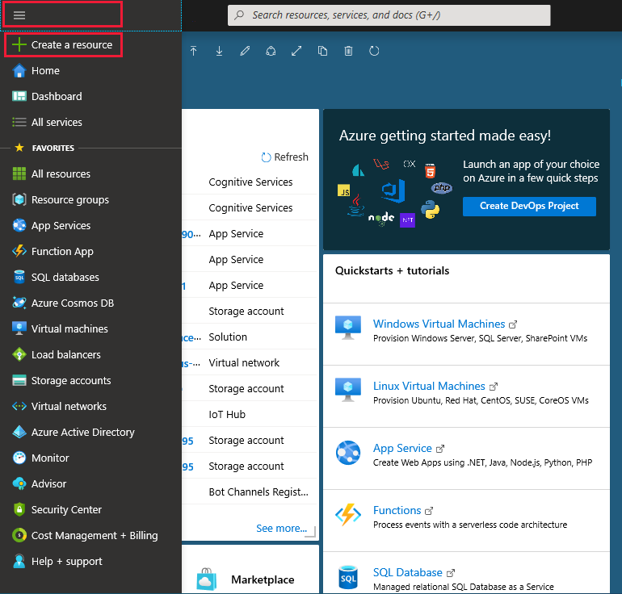
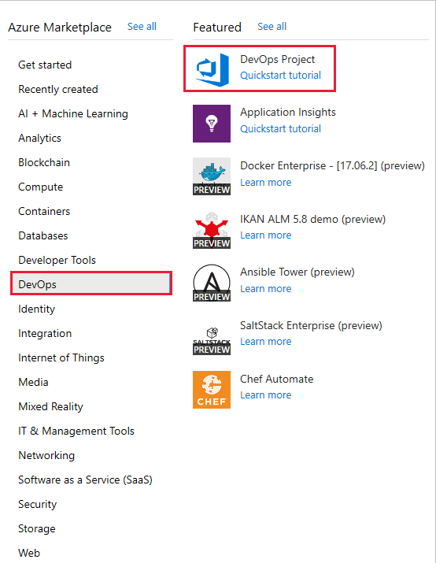

# Tutorial: Create a CI/CD pipeline for your existing code by using Azure DevOps Projects

Azure DevOps Projects presents a simplified experience where you can bring your existing code and Git repo or choose a sample application to create a continuous integration (CI) and continuous delivery (CD) pipeline to Azure.

You will:

> [!div class="checklist"]
> * Use DevOps Projects to create a CI/CD pipeline
> * Configure access to your GitHub repo and choose a framework
> * Configure Azure DevOps and an Azure subscription 
> * Commit changes to GitHub and automatically deploy them to Azure
> * Examine the Azure Pipelines CI/CD pipeline
> * Clean up resources

## Prerequisites

* An Azure subscription. You can get one free through [Visual Studio Dev Essentials](https://visualstudio.microsoft.com/dev-essentials/).
* Access to a GitHub or external Git repo that contains .NET, Java, PHP, Node, Python, or static web code.

## Sign in to the Azure portal

Azure DevOps Projects creates a CI/CD pipeline in Azure Pipelines. You can create a new Azure DevOps organization or use an existing organization. Azure DevOps Projects also creates Azure resources in the Azure subscription of your choice.

1. Sign in to the [Azure portal](https://portal.azure.com).

2. From the Azure portal menu, select **Create a resource**.

   

3. Select **DevOps > DevOps Project**.

   

3. Select **Bring your own code**, then select **Next**.

## Configure access to your GitHub repo and choose a framework

1. Select either **GitHub** or an external **Git** code repository. For this tutorial select **GitHub**. You may be required to Authenticate with GitHub the first time to allow Azure to access your GitHub repository.

2. Finish by selecting the **Repository** and **Branch**, select **Next**.

3. If you are using Docker containers change **Is app Dockerized** to **YES**, for this tutorial leave **NO** selected, select **Next**. For more information about using Docker containers hover over the **i** icon.

   

4. From the dropdowns, select the **application runtime** and **framework**, then select **Next**. The application framework, that you choose, dictates the type of Azure service deployment target that’s available.

5. Select the **Azure service** to deploy the application too, then select **Next**.

## Configure Azure DevOps and an Azure subscription

1. Enter a **Project name**.

2. Create a new free **Azure DevOps Organization** or choose an existing organization from the dropdown.

3. Select your **Azure Subscription**, enter a name for your **Web app** or take the default. Select a **Location**, then select **Done**. After a few minutes, the DevOps Project Deployment Overview is displayed in the Azure portal.

4. Select **Go to resource** to view the DevOps Project dashboard. In the upper right corner, pin the **Project** to your dashboard for quick access. Azure DevOps Projects automatically configures a CI build and release trigger. Your code remains in your GitHub repo or another external repo. A sample app is set up in a repo in your **Azure DevOps Organization**. A build is executed, and your app is deployed to Azure.

   

5. The dashboard provides visibility into your code repo, your CI/CD pipeline, and your app in Azure. At the right under Azure resources, select **Browse** to view your running app.

## Commit changes to GitHub and automatically deploy them to Azure

You're now ready to collaborate with a team on your app by using a CI/CD process that automatically deploys your latest work to your website. Each change to the GitHub repo starts a build in Azure DevOps, and a CD pipeline executes a deployment to Azure.

1. From your DevOps Project dashboard, select **Repositories**. Your GitHub repository opens in a new browser tab. Make a change to your application, and then click **Commit changes**.

2. After a few moments, a build starts in Azure Pipelines. You can monitor the build status in the DevOps Projects dashboard, or monitor it in your Azure DevOps organization by selecting the **Build pipelines** tab from the project dashboard.

## Examine the Azure Pipelines CI/CD pipeline

Azure DevOps Projects automatically configures a CI/CD pipeline in Azure Pipelines. Explore and customize the pipeline as needed. To familiarize yourself with the build and release pipelines, do the following:

1. From the DevOps Projects dashboard, select **Build pipelines**.

2. Once your **Azure Pipelines** page opens, you'll see a history of the most recent builds and the status for each build.

   

3. In the upper right corner of the **Builds** page, you’ll see options to **Edit** the current build, **Queue** to queue a new build and the ellipsis (**&#8942;**) to open a menu with more options, select **Edit**.

4. The build performs various tasks, such as fetching sources from the repo, restoring dependencies, and publishing outputs for deployments. To the right under **Name**, change the build pipeline name to something more descriptive. Select **Save & Queue**, then **Save**, leave a comment and then select **Save** again.

   

5. To see an audit trail of your recent changes for the build, select the **History** tab. Azure DevOps tracks any changes made to the build pipeline and allows you to compare versions.

6. Select the **Triggers** tab. Azure DevOps Project automatically creates a CI trigger with some default settings. Triggers such as **Enable continuous integration** can be set to execute a build each time a code change has been committed, or scheduling builds to run at specific times.

## Clean up resources

When they are no longer needed, you can delete the Azure App service and related resources that you created in this tutorial. To do so, use the **Delete** functionality on the DevOps Projects dashboard.

## Next steps

When you configured your CI/CD process in this tutorial, a build and release pipeline were automatically created in Azure DevOps Projects. You can modify these build and release pipelines to meet the needs of your team. You learned how to:

> [!div class="checklist"]
>  * Use DevOps Projects to create a CI/CD pipeline
> * Configure access to your GitHub repo and choose a framework
> * Configure Azure DevOps and an Azure subscription
> * Commit changes to GitHub and automatically deploy them to Azure
> * Examine the Azure Pipelines CI/CD pipeline
> * Clean up resources

To learn more about the CI/CD pipeline, see:

> [!div class="nextstepaction"]
> [Define your multi-stage continuous deployment (CD) pipeline](https://docs.microsoft.com/azure/devops/pipelines/release/define-multistage-release-process?view=vsts)

To learn more about application monitoring, see:
  
 > [!div class="nextstepaction"]
 > [What is Azure monitor](https://docs.microsoft.com/azure/azure-monitor/overview)
