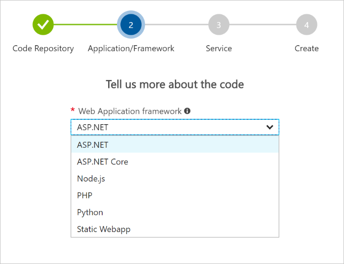
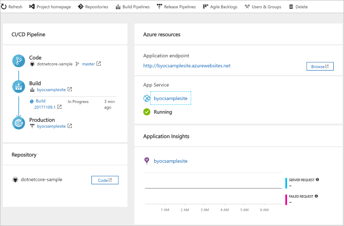

# Tutorial: Create a CI/CD pipeline for your existing code by using Azure DevOps Projects

Azure DevOps Projects presents a simplified experience where you can bring your existing code and Git repo or choose a sample application to create a continuous integration (CI) and continuous delivery (CD) pipeline to Azure.

You will:

> [!div class="checklist"]
> * Use DevOps Projects to create a CI/CD pipeline
> * Configure access to your GitHub repo and choose a framework
> * Configure Azure DevOps and an Azure subscription 
> * Commit changes to GitHub and automatically deploy them to Azure
> * Examine the Azure Pipelines CI/CD pipeline
> * Configure Azure Application Insights monitoring
> * Clean up resources

## Prerequisites

* An Azure subscription. You can get one free through [Visual Studio Dev Essentials](https://visualstudio.microsoft.com/dev-essentials/).
* Access to a GitHub or external Git repo that contains .NET, Java, PHP, Node, Python, or static web code.

## Sign in to the Azure portal

Azure DevOps Projects creates a CI/CD pipeline in Azure Pipelines. You can create a new Azure DevOps organization or use an existing organization. Azure DevOps Projects also creates Azure resources in the Azure subscription of your choice.

1. Sign in to the [Azure portal](https://portal.azure.com).

1. In the left pane, select **New**.

1. In the search box, type **DevOps Projects**, and then select **Create**.

   	

1. Select **Bring your own code**, and then select **Next**.

## Configure access to your GitHub repo and choose a framework

1. Select either **GitHub** or an external Git repo, and then select your repo and the branch that contains your application.

1. Select your web framework, and then select **Next**.

   	

	The application framework, which you chose previously, dictates the type of Azure service deployment target that's available here. 
	
1. Select the target service, and then select **Next**.

## Configure Azure DevOps and an Azure subscription 

1. Create a new Azure DevOps organization or select an existing organization.

	a. Enter a name for your project in Azure DevOps. 
	
	b. Select your Azure subscription and location, enter a name for your application, and then select **Done**.

	After a few minutes, the DevOps Projects dashboard is displayed in the Azure portal. A sample application is set up in a repo in your Azure DevOps organization, a build is executed, and your application is deployed to Azure. This dashboard provides visibility into your GitHub code repo, the CI/CD pipeline, and your application in Azure. 
	
1. Select **Browse** to view your running application.

   	 
	
Azure DevOps Projects automatically configures a CI build and release trigger. Your code remains in your GitHub repo or another external repo. 

## Commit changes to GitHub and automatically deploy them to Azure 

You're now ready to collaborate with a team on your app by using a CI/CD process that automatically deploys your latest work to your website. Each change to the GitHub repo starts a build in Azure DevOps, and a CD pipeline executes a deployment to Azure.

1. Make a change to your application, and then commit the change to your GitHub repo.  
	After a few moments, a build starts in Azure Pipelines. You can monitor the build status in the DevOps Projects dashboard, or you can monitor it in the browser with your Azure DevOps organization.

1. After the build is completed, refresh your application to verify your changes.

## Examine the Azure Pipelines CI/CD pipeline

Azure DevOps Projects automatically configures a CI/CD pipeline in Azure Pipelines. Explore and customize the pipeline as needed. To familiarize yourself with the build and release pipelines, do the following:

1. At the top of the DevOps Projects dashboard, select **Build pipelines**.  
	A browser tab displays the build pipeline for your new project.

1. Point to the **Status** field, and then select the ellipsis (...).  
	A menu displays several options, such as queueing a new build, pausing a build, and editing the build pipeline.

1. Select **Edit**.

1. In this pane, you can examine the various tasks for your build pipeline.  
	The build performs various tasks, such as fetching sources from the Git repo, restoring dependencies, and publishing outputs used for deployments.

1. At the top of the build pipeline, select the build pipeline name.

1. Change the name of your build pipeline to something more descriptive, select **Save & queue**, and then select **Save**.

1. Under your build pipeline name, select **History**.  
	You see an audit trail of your recent changes for the build. Azure DevOps keeps track of any changes made to the build pipeline, and it allows you to compare versions.

1. Select **Triggers**.  
	Azure DevOps Projects automatically creates a CI trigger, and every commit to the repo starts a new build. Optionally, you can choose to include or exclude branches from the CI process.

1. Select **Retention**.  
        Depending on your scenario, you can specify policies to keep or remove a certain number of builds.

1. Select **Build and Release**, and then select **Releases**.  
	Azure DevOps Projects creates a release pipeline to manage deployments to Azure.

1. Select the ellipsis (...) next to your release pipeline, and then select **Edit**.  
	The release pipeline contains a *pipeline*, which defines the release process. 
	
1. Under **Artifacts**, select **Drop**.  
	The build pipeline you examined in the previous steps produces the output that's used for the artifact. 

1. Next to the **Drop** icon, select **Continuous deployment trigger**.  
	This release pipeline has an enabled CD trigger, which executes a deployment every time there is a new build artifact available. Optionally, you can disable the trigger so that your deployments require manual execution. 

1. At the left, select **Tasks**.  
	Tasks are the activities that your deployment process executes. In this example, a task was created to deploy to the Azure App service.

1. At the right, select **View releases** to display a history of releases.

1. Select the ellipsis (...) next to a release, and then select **Open**.  
	There are several menus to explore, such as a release summary, associated work items, and tests.

1. Select **Commits**.  
	This view shows code commits that are associated with this deployment. 

1. Select **Logs**.  
	The logs contain useful information about the deployment process. You can view them both during and after deployments.

## Configure Azure Application Insights monitoring

With Azure Application insights, you can easily monitor your application's performance and usage. Azure DevOps Projects automatically configures an Application Insights resource for your application. You can further configure various alerts and monitoring capabilities as needed.

1. In the Azure portal, go to the DevOps Projects dashboard. 

1. At the lower right, select the **Application Insights** link for your app.  
	The **Application Insights** pane opens. This view contains usage, performance, and availability monitoring information for your app.

     

1. Select **Time range**, and then select **Last hour**. To filter the results, select **Update**.  
	You can now view all activity from the last 60 minutes. To exit the time range, select **x**.

1. Select **Alerts**, and then select **Add metric alert**. 

1. Enter a name for the alert.

1. In the **Source Alter on** drop-down list, select your **App Service resource.** <!-- Please confirm whether this should be "Source Alter on" or "Source Alert on" -->

1. In the **Metric** drop-down list, examine the various alert metrics.  
	The default alert is for a **server response time greater than 1 second**. You can easily configure a variety of alerts to improve the monitoring capabilities of your app.

1. Select the **Notify via Email owners, contributors, and readers** check box.  
	Optionally, you can perform additional actions when an alert is displayed by executing an Azure logic app.

1. Select **OK** to create the alert.  
	After a few moments, the alert appears as active on the dashboard.
	
1. Exit the **Alerts** area, and go back to the **Application Insights** pane.

1. Select **Availability**, and then select **Add test**. 

1. Enter a test name, and then select **Create**.  
	A simple ping test is created to verify the availability of your application. After a few minutes, test results are available, and the Application Insights dashboard displays an availability status.

## Clean up resources

When they are no longer needed, you can delete the Azure App service and related resources that you created in this tutorial. To do so, use the **Delete** functionality on the DevOps Projects dashboard.

## Next steps

When you configured your CI/CD process in this tutorial, a build and release pipeline were automatically created in Azure DevOps Projects. You can modify these build and release pipelines to meet the needs of your team. You learned how to:

> [!div class="checklist"]
> * Use DevOps Projects to create a CI/CD pipeline
> * Configure access to your GitHub repo and choose a framework
> * Configure Azure DevOps and an Azure subscription 
> * Commit changes to GitHub and automatically deploy them to Azure
> * Examine the Azure Pipelines CI/CD pipeline
> * Configure Azure Application Insights monitoring
> * Clean up resources

To learn more about the CI/CD pipeline, see:

> [!div class="nextstepaction"]
> [Define your multi-stage continuous deployment (CD) pipeline](https://docs.microsoft.com/azure/devops/pipelines/release/define-multistage-release-process?view=vsts)
