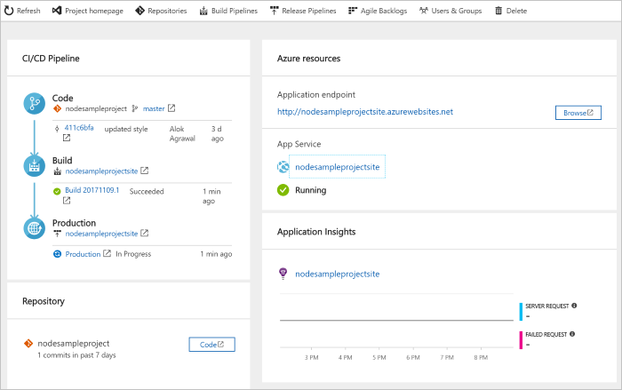

---
<<<<<<< HEAD
title: Create a CI/CD pipeline for Node.js with Azure DevOps Projects | Quickstart
description: DevOps Projects makes it easy to get started with Azure. It helps you launch an app on an Azure service of your choice in few quick steps.
=======
title: 'Quickstart: Create a CI/CD pipeline for  Node.js with Azure DevOps Projects' 
description: DevOps Projects makes it easy to get started on Azure. It helps you launch an app on an Azure service of your choice in few quick steps.
>>>>>>> 256631dbffa6084662397853f04439c19541e60b
ms.prod: devops
ms.technology: devops-cicd
services: vsts
documentationcenter: vs-devops-build
author: mlearned
manager: douge
editor: ''
ms.assetid:
ms.workload: web
ms.tgt_pltfrm: na
ms.devlang: na
ms.topic: quickstart
ms.date: 07/09/2018
ms.author: mlearned
ms.custom: mvc
monikerRange: 'vsts'
---

<<<<<<< HEAD
# Create a CI/CD pipeline for Node.js with Azure DevOps Projects

Azure DevOps Projects presents a simplified experience that  creates Azure resources and sets up a continuous integration (CI) and continuous delivery (CD) pipeline for your Node.js app in Azure DevOps Services.  
=======
#  Create a CI/CD pipeline for  Node.js with Azure DevOps Projects 

Azure DevOps Projects presents a simplified experience that creates Azure resources and sets up a continuous integration (CI) and continuous delivery (CD) pipeline for your Node.js app in Azure Pipelines.  
>>>>>>> 256631dbffa6084662397853f04439c19541e60b

If you don't have an Azure subscription, you can get one free through [Visual Studio Dev Essentials](https://visualstudio.microsoft.com/dev-essentials/).

## Sign in to the Azure portal

<<<<<<< HEAD
Azure DevOps Projects creates a CI/CD pipeline in Azure.  You can create a free **new Azure DevOps Services** organization or use an **existing organization**.  DevOps Projects also creates **Azure resources** in the **Azure subscription** of your choice.
=======
DevOps Projects creates a CI/CD pipeline in Azure Pipelines. You can create a  new Azure DevOps organization or use an existing organization. DevOps Projects also creates Azure resources in the Azure subscription of your choice.
>>>>>>> 256631dbffa6084662397853f04439c19541e60b

1. Sign in to the [Microsoft Azure portal](https://portal.azure.com).

<<<<<<< HEAD
1. Select the **Create a resource** icon in the menu on the left, and then search **DevOps Projects**.  Select **Create**.
=======
1. In the left pane, select **Create a resource**, and then search for **DevOps Projects**. 
>>>>>>> 256631dbffa6084662397853f04439c19541e60b

   	

## Select a sample application and Azure service

1. Select the Node.js sample application.  
	The Node.js samples include a choice of several application frameworks.

<<<<<<< HEAD
1. The default sample framework is **Express.js**. Leave the default setting, and then select **Next**.  

1. **Web App on Windows** is the default deployment target.  The application framework, which you chose in the previous steps, dictates the type of Azure service deployment target that's available here. Leave the default service, and then select **Next**.
=======
1. The default sample framework is Express.js. Leave the default setting, and then select **Next**.  
	**Web App on Windows** is the default deployment target.  The application framework, which you chose previously, dictates the type of Azure service deployment target available here.  

2. Leave the default service, and then select **Next**.
>>>>>>> 256631dbffa6084662397853f04439c19541e60b
 
## Configure Azure DevOps and an Azure subscription 

<<<<<<< HEAD
1. Create a **new** Azure DevOps Services organization or choose an **existing** organization.  Choose a **name** for your project.  Select your **Azure subscription**, your **location**, and then choose a **name** for your application.  When you're done, choose **Done**.

1. In a few minutes, the **Azure DevOps Projects dashboard** loads in the Azure portal. A sample application is set up in a repository in your Azure DevOps Services organization, a build runs, and your application deploys to Azure.  This dashboard provides visibility into your **code repository**, **Azure CI/CD pipeline**, and your **application in Azure**.  On the right side of the dashboard, select **Browse** to view your running application.

   	 
	
Azure DevOps Projects automatically configures a CI build and release trigger.  You're now ready to collaborate with a team on a Node.js app with a CI/CD process that automatically deploys your latest work to your web site.

## Commit code changes and execute CI/CD

Azure DevOps Projects created a Git repository in your Azure DevOps Services organization or GitHub account. Take the following steps to view the repository and make code changes to your application.

1. On the left side of the DevOps Project dashboard, select the link for your **master** branch.  This link opens a view to the newly created Git repository.

1. To view the repository clone URL, select **Clone** from the top right of the browser. You can clone your Git repository in your favorite IDE. In the next few steps, you can use the web browser to make and commit code changes directly to the master branch.

1. On the left side of the browser, navigate to the **views/index.pug** file.

1. Select **Edit**, and then make a change to the h2 heading. For example, type **Get started right away with the Azure DevOps Project** or make some other change.

1. Choose **Commit**, and then save your changes.

1. In your browser, go to the **Azure DevOps Project dashboard**. You should now see a build in progress.  The changes you just made are automatically built and deployed via an Azure CI/CD pipeline.

## Examine the Azure CI/CD pipeline

Azure DevOps Projects automatically configured a full Azure CI/CD pipeline in your Azure DevOps Services organization.  Explore and customize the pipeline as needed. Take the following steps to familiarize yourself with the Azure DevOps Services build and release pipelines.

1. Select **Build Pipelines** from the **top** of the Azure DevOps Projects dashboard.  This link opens a browser tab and the Azure DevOps Services build pipeline for your new project.

1. Move your cursor to the right of the build pipeline next to the **Status** field. Select the **ellipsis** that appears.  This action opens a menu where you can start several activities such as queueing a new build, pausing a build, and editing the build pipeline.

1. Select **Edit**.

1. From this view, **examine the various tasks** for your build pipeline.  The build runs various tasks such as fetching sources from the Git repository, restoring dependencies, and publishing outputs that are used for deployments.
=======
1. Create a new Azure DevOps organization or choose an existing organization. 

	a. Choose a name for your project. 

	b. Select your Azure subscription and location, choose a name for your application, and then select **Done**.  
	After a few minutes, the DevOps Projects dashboard is displayed  in the Azure portal. A sample application is set up in a repository in your Azure DevOps organization, a build is executed, and your application is deployed to Azure. This dashboard provides visibility into your code repository, the  CI/CD pipeline, and your application in Azure.
	 
3. Select **Browse** to view your running application.

   	 
	
DevOps Projects automatically configured a CI build and release trigger.  You're now ready to collaborate with a team on a  Node.js app with a CI/CD process that automatically deploys your latest work to your web site.

## Commit code changes and execute CI/CD

DevOps Projects creates a Git repository in Azure Repos or GitHub. Take the following steps to view the repository and make code changes to your application.

1. On the left of the DevOps Projects dashboard, select the link for your master branch.  
This link opens a view to the newly created Git repository.

1. To view the repository clone URL, select **Clone** on the top right of the browser.   
	You can clone your Git repository in your favorite IDE. In the next few steps, you can use the web browser to make and commit code changes directly to the master branch.

1. On the left side of the browser, go to the **views/index.pug** file.

1. Select **Edit**, and then make a change to the h2 heading.  
	For example, type **Get started right away with the Azure DevOps Project** or make some other change.

1. Select **Commit**, and then save your changes.

1. In your browser, go to the DevOps Projects dashboard.   
You should now see a build in progress. The changes you just made are automatically built and deployed via a CI/CD pipeline.

## Examine the Azure CI/CD pipeline

In the previous step, DevOps Projects automatically configured a full CI/CD pipeline. Explore and customize the pipeline as needed. Take the following steps to familiarize yourself with the build and release pipelines.

1. At the top of the DevOps Projects dashboard, select **Build Pipelines**.  
This link opens a browser tab and the build pipeline for your new project.

1. Point to the **Status** field, and then select the ellipsis  (...).  
	This action opens a menu where you can start several activities such as queuing a new build, pausing a build, and editing the build pipeline.

1. Select **Edit**.

1. In this pane, you can examine the various tasks for your build pipeline.  
The build performs a variety of tasks such as fetching sources from the Git repository, restoring dependencies, and publishing outputs that are used for deployments.

1. At the top of the build pipeline, select the build pipeline name.
>>>>>>> 256631dbffa6084662397853f04439c19541e60b

1. Change the name of your build pipeline to something more descriptive, select **Save & queue**, and then select **Save**.

<<<<<<< HEAD
1. Change the **name** of your build pipeline to something more descriptive.  Select **Save & queue**, and then select **Save**.

1. Under your build pipeline name, select **History**.  You see an audit trail of your recent changes for the build.  Azure DevOps Services keeps track of any changes that are made to the build pipeline, which means that you can compare versions.

1. Select **Triggers**.  Azure DevOps Projects automatically created a CI trigger, and every commit to the repository starts a new build.  You can optionally choose to include or exclude branches from the CI process.
=======
1. Under your build pipeline name, select **History**.   
In the **History** pane, you see an audit trail of your recent changes for the build.  Azure Pipelines keeps track of any changes that are made to the build pipeline, and it allows you to compare versions.

1. Select **Triggers**.   
 DevOps Projects automatically created a CI trigger, and every commit to the repository starts a new build.  You can optionally choose to include or exclude branches from the CI process.

1. Select **Retention**.   
Depending on your scenario, you can specify policies to keep or remove a certain number of builds.
>>>>>>> 256631dbffa6084662397853f04439c19541e60b

1. Select **Build and Release**, and then select **Releases**.  
 DevOps Projects creates a release pipeline to manage 		deployments to Azure.

<<<<<<< HEAD
1. Select **Build and Release**, and then select **Releases**.  Azure DevOps Projects created an Azure DevOps Services release pipeline to manage deployments to Azure.

1. On the left side of the browser, select the **ellipsis** next to your release pipeline, and then select **Edit**.

1. The release pipeline contains a **pipeline**, which defines the release process.  Under **Artifacts**, select **Drop**. The build pipeline that you examined in the previous steps produces the output that's used for the artifact. 

1. To the right of the **Drop** icon, select the **Continuous deployment trigger**. This release pipeline has an enabled CD trigger, which runs a deployment every time there is a new build artifact available.  Optionally, you can disable the trigger so that your deployments require manual execution. 

1. On the left side of the browser, select **Tasks**. The tasks are the activities that your deployment process performs.  In this example, a task was created to deploy to **Azure App service**.

1. On the right side of the browser, select **View releases**.  This view shows a history of releases.

1. Select the **ellipsis** next to one of your releases, and then select **Open**.  There are several menus to explore from this view, such as a release summary, associated work items, and tests.

1. Select **Commits**. This view shows code commits that are associated with the specific deployment. 
=======
1. On the left, select the ellipsis (...) next to your release pipeline, and then select **Edit**.  
The release pipeline defines the release process.

12. Under **Artifacts**, select **Drop**.  
	The build pipeline you examined in the previous steps produces the output used for the artifact. 

1. Next to the **Drop** icon, select the **Continuous deployment trigger**.  
This release pipeline has an enabled CD trigger, which runs a deployment every time there is a new build artifact available. Optionally, you can disable the trigger so that your deployments require manual execution. 

1. On the left, select **Tasks**.   
The tasks are the activities that your deployment process performs. In this example, a task was created to deploy to Azure App Service.

1. On the right, select **View releases**.  
This view shows a history of releases.

1. Select the ellipsis (...) next to one of your releases, and then select **Open**.  
There are several menus to explore, such as a release summary, associated work items, and tests.
>>>>>>> 256631dbffa6084662397853f04439c19541e60b

1. Select **Commits**.   
This view shows code commits that are associated with the specific deployment.

1. Select **Logs**.  
The logs contain useful information about the deployment process. They can be viewed both during and after deployments.

## Clean up resources

<<<<<<< HEAD
You can delete Azure App Service and related resources that were created in this quickstart by using the **Delete** functionality on the Azure DevOps Projects dashboard.

## Next steps

When you configured your CI/CD process in this quickstart, a build and release pipeline were automatically created in your Azure DevOps project. You can modify these build and release pipelines to meet the needs of your team. To learn more see this tutorial:
=======
You can delete Azure App Service and other related resources that you created when you don't need them anymore. Use the **Delete** functionality on the DevOps Projects dashboard.

## Next steps

When you configured your CI/CD process, build and release pipelines were automatically created. You can modify these build and release pipelines to meet the needs of your team. To learn more about the CI/CD pipeline, see:
>>>>>>> 256631dbffa6084662397853f04439c19541e60b

> [!div class="nextstepaction"]
> [Customize CD process](https://docs.microsoft.com/azure/devops/pipelines/release/define-multistage-release-process?view=vsts)

## Videos

> [!VIDEO https://www.youtube.com/embed/3etwjubReJs]
