# Create a CI/CD pipeline in Azure Pipelines for Node.js with Azure DevOps Starter

In this quickstart, you create a NodeJS progressive web app (PWA) using [GatsbyJS](https://www.gatsbyjs.org/) and the simplified Azure DevOps Starter creation experience. When finished, you have a continuous integration (CI) and continuous delivery (CD) pipeline for your PWA in Azure Pipelines. Azure DevOps Starter sets up what you need for developing, deploying, and monitoring.

## Prerequisites

- An Azure account with an active subscription. [Create an account for free](https://azure.microsoft.com/free/?ref=microsoft.com&utm_source=microsoft.com&utm_medium=docs&utm_campaign=visualstudio). 
- An [Azure DevOps](https://azure.microsoft.com/services/devops/) organization.

## Sign in to the Azure portal

DevOps Starter creates a CI/CD pipeline in Azure Pipelines. You can create a new Azure DevOps organization or use an existing organization. DevOps Starter also creates Azure resources in the Azure subscription of your choice.

1. Sign in to the [Azure portal](https://portal.azure.com), and in the left pane, select **Create a resource**. 

   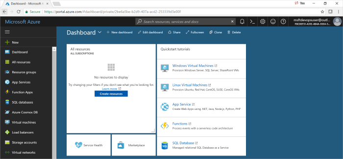

1. In the search box, type **DevOps Starter**, and then select. Click on **Add** to create a new one.

    

## Select a sample application and Azure service

1. Select the Node.js sample application.   

    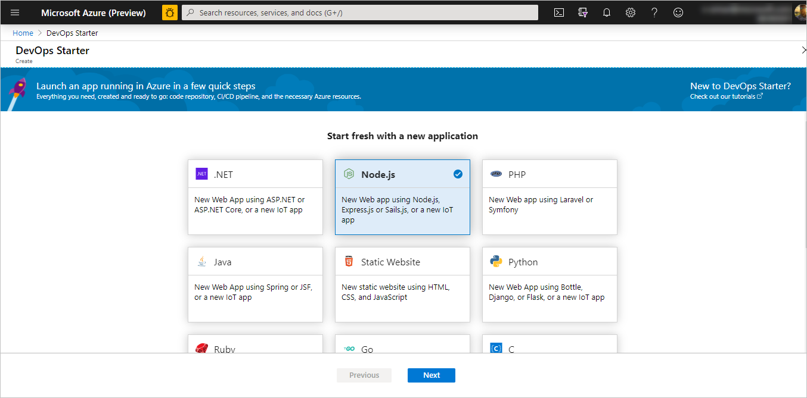 

1. The default sample framework is **Express.js**. Change the selection to **Simple Node.js App** and then select **Next**. 

    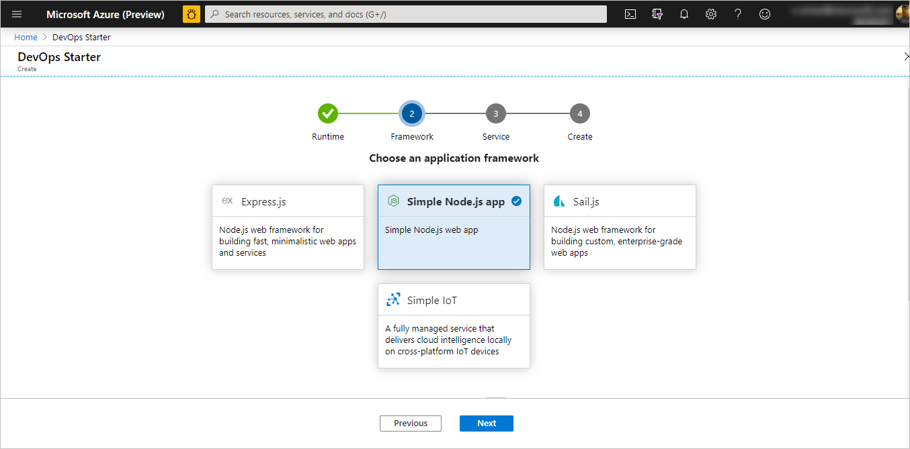 

1. The deployment targets available in this step are dictated by the application framework selected in step 2. In this example, **Windows Web App** is the default deployment target. Leave **Web App for Containers** set and select **Next**.

    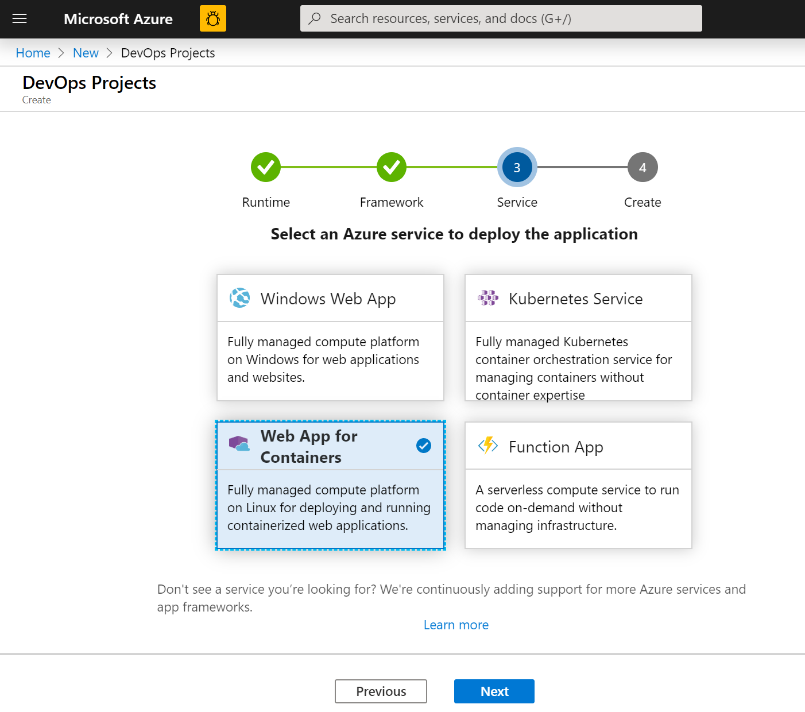

## Configure a project name and an Azure subscription

1. In the final step of the DevOps Starter creation workflow, you assign a project name, select an Azure subscription, and select **Done**.  

    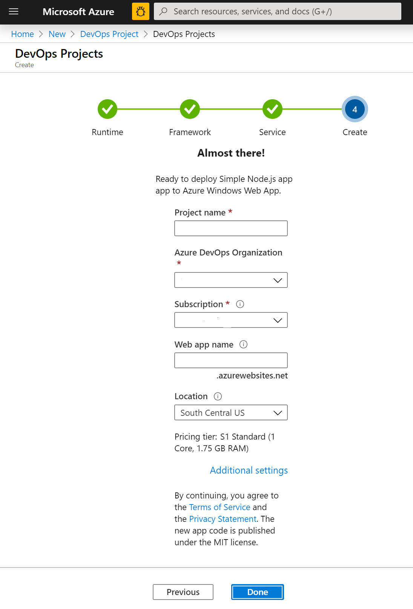

1. A summary page displays while your project is built and your application is deployed to Azure. After a brief period, a project is created in your [Azure DevOps organization](https://dev.azure.com/) that includes a git repo, a Kanban board, a deployment pipeline, test plans, and the artifacts required by your app.  

## Managing your project

1. Navigate to **All Resources** and find your DevOps Starter. Select your **DevOps Starter**.

    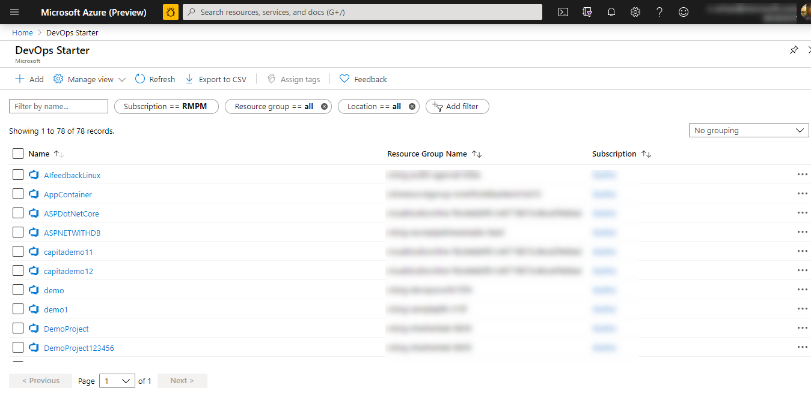

1. You are directed to a dashboard that provides visibility into your project homepage, code repository, the  CI/CD pipeline, and a link to your running app. Select the **Project Homepage** to view your application in **Azure DevOps** and, in another browser tab, select the **Application Endpoint** to view the live sample app. We change this sample later to use GatsbyJS generated PWA.

    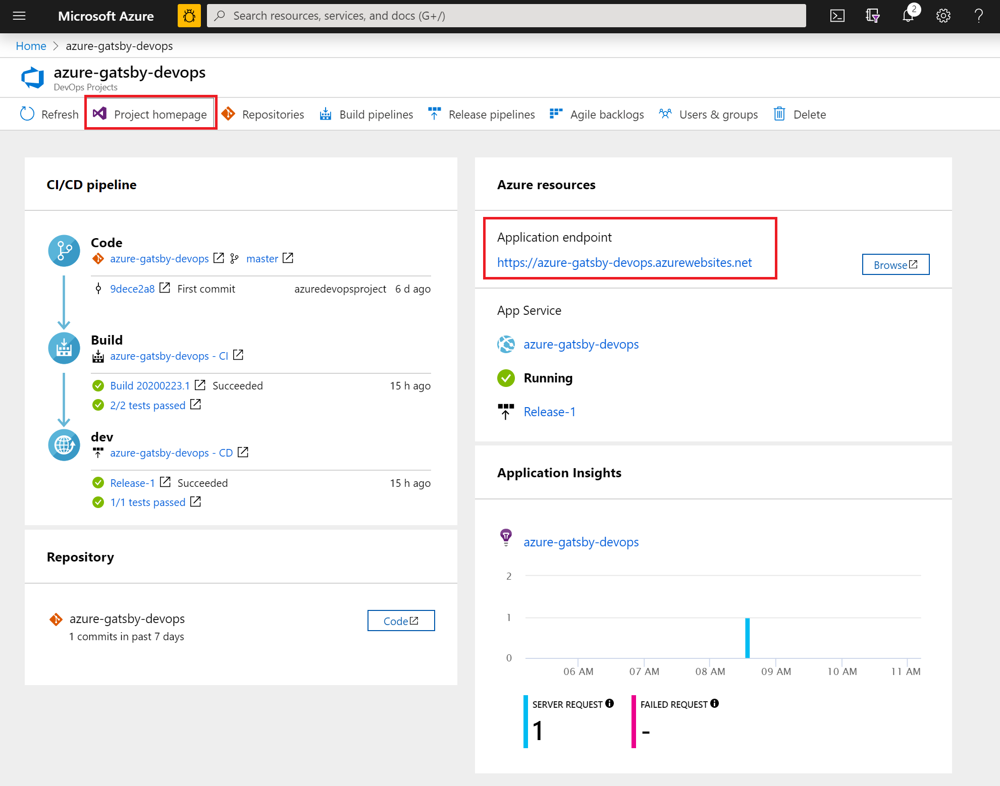 

1. From your Azure DevOps project, you can invite team members to collaborate and establish a Kanban board to start tracking your work. For more information, see [here](https://docs.microsoft.com/azure/devops/user-guide/what-is-azure-devops?view=azure-devops).

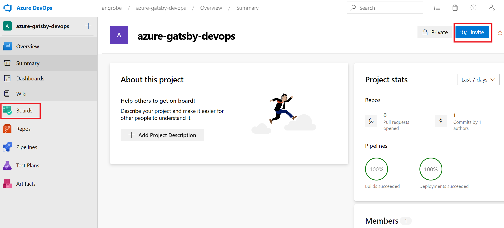

## Clone the repo and install your Gatsby PWA

DevOps Starter creates a git repository in Azure Repos or GitHub. This example has created an Azure Repo. The next step is to clone the repo and make changes.

1. Select **Repos** from your **DevOps Project** and then click **Clone**.  There are various mechanisms to clone the git repo to your desktop.  Choose the one that fits your development experience.  

    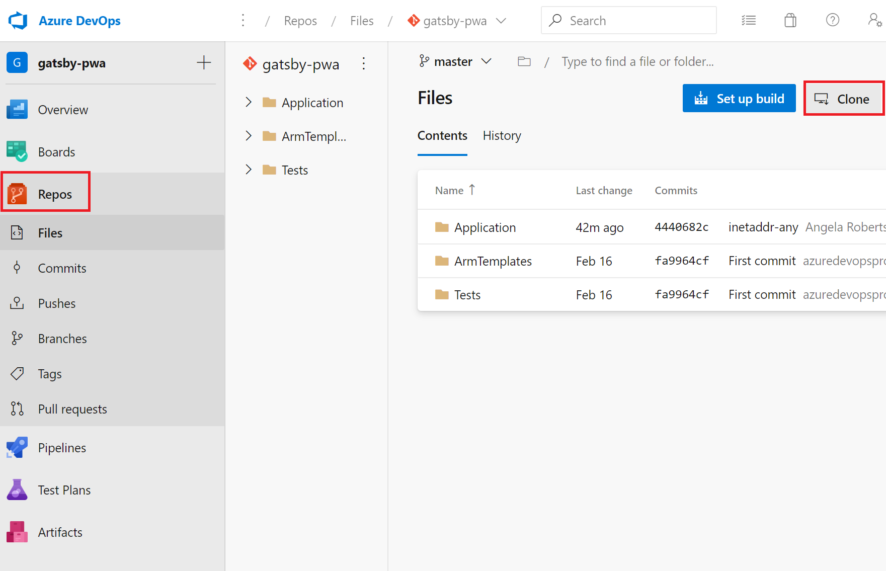

1. After the repo is cloned to your desktop, make some changes to the starter template. Start by installing the GatsbyJS CLI from your terminal.

   ```powershell
    npm install -g gatsby
   ```

1. From the terminal, navigate to the root of your repo. It should contain three folders that look like this:

    ```powershell
    Mode                LastWriteTime         Length Name
    ----                -------------         ------ ----
    d-----        2/23/2020  10:42 PM                Application
    d-----        2/23/2020   3:05 PM                ArmTemplates
    d-----        2/23/2020   3:05 PM                Tests
    ```
    
1. We do not want all of the files in the Application folder because we are going to replace it with a Gatsby starter. Run the following commands, in sequence, to trim it down.
    
    ```powershell
    cp .\Application\Dockerfile .
    rmdir Application
    ```

1. Use the Gatsby CLI to generate a sample PWA. Run `gatsby new` from the terminal to begin the PWA wizard and select `gatsby-starter-blog` for your starter template. It should resemble this sample:

    ```powershell
    c:\myproject> gatsby new
    √ What is your project called? ... my-gatsby-project
    ? What starter would you like to use? » - Use arrow-keys. Return to submit.
        gatsby-starter-default
        gatsby-starter-hello-world
    >   gatsby-starter-blog
        (Use a different starter)
    ```
    
1. You now have a folder named `my-gatsby-project`. Rename it to `Application` and copy the `Dockerfile` into it.
    
    ```powershell
    mv my-gatsby-project Application
    mv Dockerfile Application
    ```
    
1. In your favorite editor, open the Dockerfile and change the first line from `FROM node:8` to `FROM node:12`. This change ensures that your container is using Node.js version 12.x instead of version 8.x. GatsbyJS requires more modern versions of Node.js.

1. Next, open the package.json file in the Application folder and edit the [scripts field](https://docs.npmjs.com/files/package.json#scripts) to ensure that your development and production servers listen on all available network interfaces (for example, 0.0.0.0) and port 80. Without these settings, the container app service is unable to route traffic to your Node.js app running inside your container. The `scripts` field should resemble what is below. Specifically, you want to change the `develop`, `serve`, and `start` targets from their defaults.

    ```json
      "scripts": {
        "build": "gatsby build",
        "develop": "gatsby develop  -H 0.0.0.0 -p 80",
        "format": "prettier --write \"**/*.{js,jsx,json,md}\"",
        "start": "npm run serve",
        "serve": "npm run build && gatsby serve -H 0.0.0.0 -p 80",
        "clean": "gatsby clean",
        "test": "echo \"Write tests! -> https://gatsby.dev/unit-testing\" && exit 1"
      }
    ```
    
## Edit Your CI/CD pipelines

1. Before you commit the code in the previous section, make some changes to your build and release pipelines. Edit your 'Build Pipeline' and update the Node task to use Node.js version 12.x. Set the **Task version** field to 1.x and the **Version** field to 12.x.

    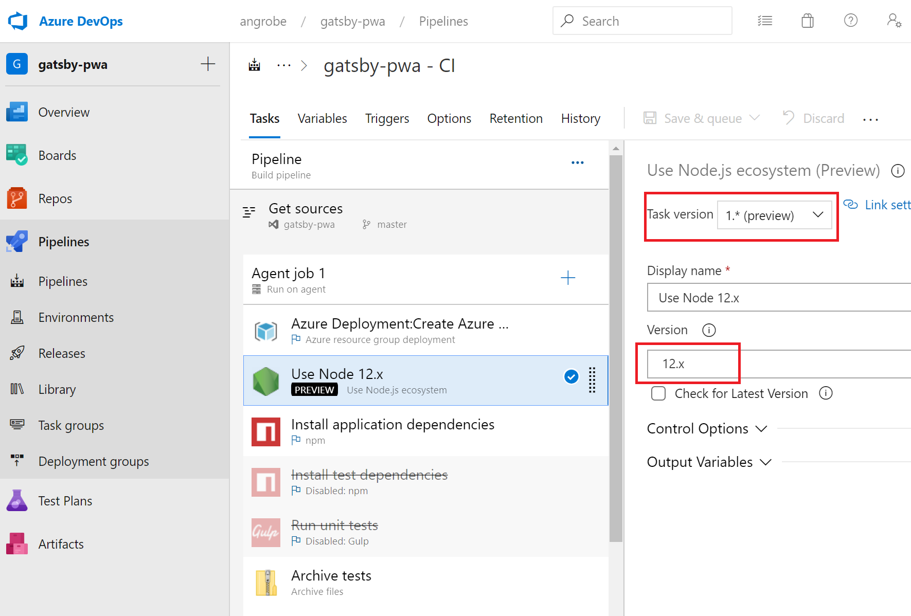

1. In this quickstart, we are not creating unit tests and we are disabling those steps in our build pipeline. When you write tests, you can re-enable these steps. Right-click to select the tasks labeled **Install test dependencies** and **Run unit tests** and disable them.

    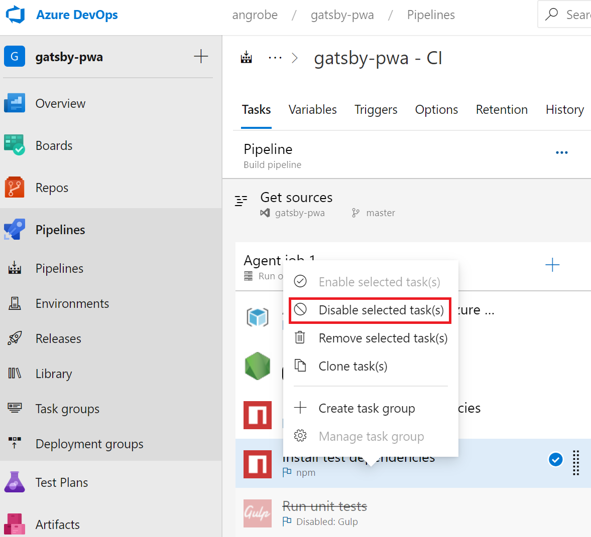

1. Edit your release pipeline.

    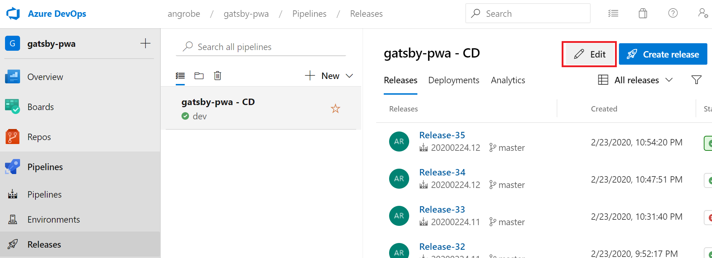

1. As with the build pipeline, change the Node task to use 12.x and disable the two test tasks. Your release should resemble this screenshot.

    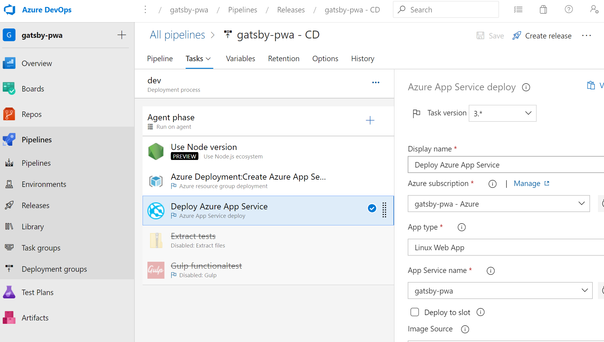

1. On the left side of the browser, go to the **views/index.pug** file.

1. Select **Edit**, and then make a change to the h2 heading.  For example, enter **Get started right away with Azure DevOps Starter** or make some other change.

1. Select **Commit**, and then save your changes.

1. In your browser, go to the DevOps Starter dashboard.   
You should now see a build in progress. The changes you made are automatically built and deployed through a CI/CD pipeline.

## Commit your changes and examine the Azure CI/CD pipeline

In the previous two steps, you added a Gatsby generated PWA to your git repo and edited your pipelines to build and deploy the code. We can commit the code, and watch it progress through the build and release pipeline.

1. From the root of your project's git repo in a terminal, run the following commands to push your code to your Azure DevOps project:

    ```powershell
    git add .
    git commit -m "My first Gatsby PWA"
    git push
    ```
    
1. A build is started as soon as `git push` completes. You can follow the progress from the **Azure DevOps Dashboard**.

3. After a few minutes, your build and release pipelines should finish and your PWA should be deployed to a container. Click the **Application endpoint** link from the dashboard above and you should see a Gatsby starter project for blogs.

## Clean up resources

You can delete Azure App Service and other related resources that you created when you don't need the resources anymore. Use the **Delete** functionality on the DevOps Starter dashboard.

## Next steps

When you configure your CI/CD process, build and release pipelines are automatically created. You can change these build and release pipelines to meet the needs of your team. To learn more about the CI/CD pipeline, see:

> [!div class="nextstepaction"]
> [Customize CD process](https://docs.microsoft.com/azure/devops/pipelines/release/define-multistage-release-process?view=vsts)

