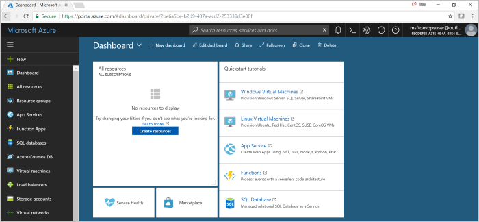

# Create a CI/CD pipeline for Ruby on Rails with the Azure DevOps Project

Configure continuous integration (CI) and continuous delivery (CD) for your Ruby on Rails application with The **Azure DevOps Project**.  The Azure DevOps project simplifies the initial configuration of a VSTS build and release pipeline.

If you don't have an Azure subscription, you can get one free through [Visual Studio Dev Essentials](https://visualstudio.microsoft.com/dev-essentials/).

## Sign in to the Azure portal

The Azure DevOps Project creates a CI/CD pipeline in VSTS.  You can create a **new VSTS** account or use an **existing account**.  The Azure DevOps Project also creates **Azure resources** in the **Azure subscription** of your choice.

1. Sign into the [Microsoft Azure portal](https://portal.azure.com).

1. Choose the **Create a resource** icon in the left navigation bar, then search for **DevOps project**.  Choose **Create**.

   	

## Select a sample application and Azure service

1. Select the **Ruby** sample application.

1. Select the **Ruby on Rails** application framework.  When you're done, choose **Next**.

1. **Web App on Linux** is the default deployment target.  Optionally, you can choose Web App for Containers.  The application framework, which you chose on the previous steps, dictates the type of Azure service deployment target available here.  Select the **target service** of your choice.  When you're done, choose **Next**.

## Configure VSTS and an Azure subscription 

1. Create a **new** free VSTS account or choose an **existing** account.  Choose a **name** for your VSTS project.  Select your **Azure subscription**, **location**, and choose a **name** for your application.  When you're done, choose **Done**.

    

1. In a few minutes, the **project dashboard** loads in the Azure portal.  A sample application is set up in a repository in your VSTS account, a build executes, and your application deploys to Azure.  This dashboard provides visibility into your **code repository**, **VSTS CI/CD pipeline**, and your **application in Azure**.  On the right side of the dashboard, select **Browse** to view your running application.

   	 

## Commit code changes and execute CI/CD

The Azure DevOps project created a Git repository in your VSTS or GitHub account.  Follow the steps below to view the repository and make code changes to your application.

1. On the left-hand side of the DevOps project dashboard, select the link for your **master** branch.  This link opens a view to the newly created Git repository.

1. To view the repository clone URL, select **Clone** from the top right of the browser. You can clone your Git repository in your favorite IDE.  In the next few steps, you can use the web browser to make and commit code changes directly to the master branch.

1. On the left-hand side of the browser, navigate to the **app/views/pages/home.html.erb** file.

1. Select **Edit**, and make a change to some text.  For example, modify text inside one of the div tags.

1. Choose **Commit**, then save your changes.

1. In your browser, navigate to the **Azure DevOps project dashboard**.  You should now see a build is in progress.  The changes you just made are automatically built and deployed via a VSTS CI/CD pipeline.

## Examine the VSTS CI/CD pipeline

The Azure DevOps project automatically configured a full VSTS CI/CD pipeline in your VSTS account.  Explore and customize the pipeline as needed.  Follow the steps below to familiarize yourself with the VSTS build and release definitions.

1. Select **Build Pipelines** from the **top** of the Azure DevOps project dashboard.  This link opens a browser tab and opens the VSTS build definition for your new project.

1. Select the **ellipsis**.  This action opens a menu where you can start several activities such as queue a new build, pause a build, and edit the build definition.

1. Select **Edit**.

1. From this view, **examine the various tasks** for your build definition.  The build executes various tasks such as fetching sources from the Git repository, restoring dependencies, and publishing outputs used for deployments.

1. At the top of the build definition, select the **build definition name**.

1. Change the **name** of your build definition to something more descriptive.  Select **Save & queue**, then select **Save**.

1. Under your build definition name, select **History**.  You see an audit trail of your recent changes for the build.  VSTS keeps track of any changes made to the build definition, and allows you to compare versions.

1. Select **Triggers**.  The Azure DevOps project automatically created a CI trigger, and every commit to the repository starts a new build.  You can optionally choose to include or exclude branches from the CI process.

1. Select **Retention**.  Based on your scenario, you can specify policies to keep or remove a certain number of builds.

1. Select **Build and Release**, then choose **Releases**.  The Azure DevOps project created a VSTS release definition to manage deployments to Azure.

1. On the left-hand side of the browser, select the **ellipsis** next to your release definition, then choose **Edit**.

1. The release definition contains a **pipeline**, which defines the release process.  Under **Artifacts**, select **Drop**.  The build definition you examined in the previous steps produces the output used for the artifact. 

1. To the right-hand side of the **Drop** icon, select the **Continuous deployment trigger**.  This release definition has an enabled CD trigger, which executes a deployment every time there is a new build artifact available.  Optionally, you can disable the trigger, so your deployments require manual execution. 

1. On the left-hand side of the browser, select **Tasks**.  The tasks are the activities your deployment process performs.  In this example, a task was created to deploy to **Azure App service**.

1. On the right-hand side of the browser, select **View releases**.  This view shows a history of releases.

1. Select the **ellipsis** next to one of your releases, and choose **Open**.  There are several menus to explore from this view such as a release summary, associated work items, and tests.

1. Select **Commits**.  This view shows code commits associated with the specific deployment. 

1. Select **Logs**.  The logs contain useful information about the deployment process.  They can be viewed both during and after deployments.

## Clean up resources

When no longer needed, you can delete the Azure App service and related resources created in this quickstart by using the **Delete** function from the Azure DevOps project dashboard.

## Next steps

To learn more about modifying the build and release definitions to meet the needs of your team, see this tutorial:

> [!div class="nextstepaction"]
> [Customize CD process](https://docs.microsoft.com/vsts/pipelines/release/define-multistage-release-process?view=vsts)
