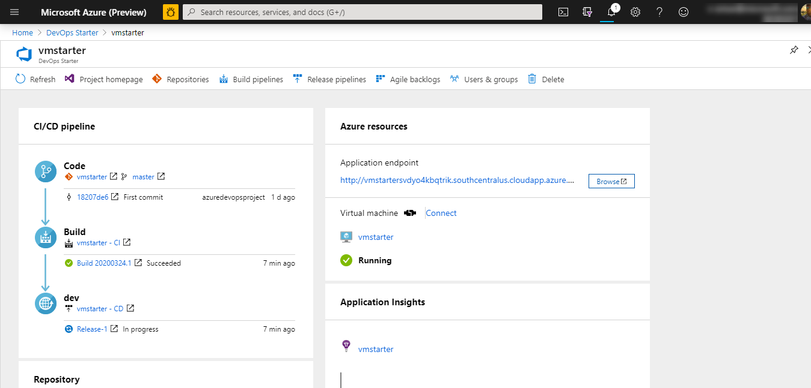

# Tutorial: Deploy your ASP.NET app to Azure virtual machines by using Azure DevOps Starter

Azure DevOps Starter presents a simplified experience where you can bring your existing code and Git repo or choose a sample application to create a continuous integration (CI) and continuous delivery (CD) pipeline to Azure. 

DevOps Starter also:
* Automatically creates Azure resources, such as a new Azure virtual machine (VM).
* Creates and configures a release pipeline in Azure DevOps that includes a build pipeline for CI.
* Sets up a release pipeline for CD. 
* Creates an Azure Application Insights resource for monitoring.

In this tutorial, you will:

> [!div class="checklist"]
> * Use DevOps Starter to deploy your ASP.NET app
> * Configure Azure DevOps and an Azure subscription 
> * Examine the CI pipeline
> * Examine the CD pipeline
> * Commit changes to Azure Repos and automatically deploy them to Azure
> * Configure Azure Application Insights monitoring
> * Clean up resources

## Prerequisites

* An Azure subscription. You can get one free through [Visual Studio Dev Essentials](https://visualstudio.microsoft.com/dev-essentials/).

## Use DevOps Starter to deploy your ASP.NET app

DevOps Starter creates a CI/CD pipeline in Azure Pipelines. You can create a new Azure DevOps organization or use an existing organization. DevOps Projects also creates Azure resources such as virtual machines in the Azure subscription of your choice.

1. Sign in to the [Azure portal](https://portal.azure.com).

1. In the search box, type **DevOps Starter**, and then select. Click on **Add** to create a new one.

    

1. Select **.NET**, and then select **Next**.

1. Under **Choose an application Framework**, select **ASP.NET**, and then select **Next**. The application framework, which you chose in a previous step, dictates the type of Azure service deployment target that's available here. 

1. Select the virtual machine, and then select **Next**.

## Configure Azure DevOps and an Azure subscription

1. Create a new Azure DevOps organization or select an existing organization. 

1. Enter a name for your Azure DevOps project. 

1. Select your Azure subscription services. Optionally, you can select **Change** and then enter more configuration details, such as the location of the Azure resources.
 
1. Enter a virtual machine name, username, and password for your new Azure virtual machine resource, and then select **Done**. After a few minutes, the Azure virtual machine will be ready. A sample ASP.NET application is set up in a repo in your Azure DevOps organization, a build and release is executed, and your application is deployed to the newly created Azure VM. 

   After it's completed, the DevOps Starter dashboard is displayed in the Azure portal. You can also navigate to the dashboard directly from **All resources** in the Azure portal. 

   The dashboard provides visibility into your Azure DevOps code repo, your CI/CD pipeline, and your running application in Azure.   

   

DevOps Starter automatically configures a CI build and release trigger that deploys code changes to your repo. You can further configure additional options in Azure DevOps. To view your running application, select **Browse**.
    
## Examine the CI pipeline
 
DevOps Starter automatically configured a CI/CD pipeline in Azure Pipelines. You can explore and customize the pipeline. To familiarize yourself with the build pipeline, do the following:

1. At the top of the DevOps Starter dashboard, select **Build Pipelines**. A browser tab displays the build pipeline for your new project.

1. Point to the **Status** field, and then select the ellipsis (...). A menu displays several options, such as queueing a new build, pausing a build, and editing the build pipeline.

1. Select **Edit**.

1. In this pane, you can examine the various tasks for your build pipeline. The build performs various tasks, such as fetching sources from the Git repo, restoring dependencies, and publishing outputs used for deployments.

1. At the top of the build pipeline, select the build pipeline name.

1. Change the name of your build pipeline to something more descriptive, select **Save & queue**, and then select **Save**.

1. Under your build pipeline name, select **History**. This pane displays an audit trail of your recent changes for the build. Azure DevOps keeps track of any changes made to the build pipeline, and it allows you to compare versions.

1. Select **Triggers**. DevOps Starter automatically creates a CI trigger, and every commit to the repo starts a new build. Optionally, you can choose to include or exclude branches from the CI process.

1. Select **Retention**. Depending on your scenario, you can specify policies to keep or remove a certain number of builds.

## Examine the CD pipeline

DevOps Starter automatically creates and configures the necessary steps to deploy from your Azure DevOps organization to your Azure subscription. These steps include configuring an Azure service connection to authenticate Azure DevOps to your Azure subscription. The automation also creates a CD pipeline, which provides the CD to the Azure virtual machine. To learn more about the Azure DevOps CD pipeline, do the following:

1. Select **Build and Release**, and then select **Releases**.  DevOps Starter creates a release pipeline to manage deployments to Azure.

1. Select the ellipsis (...) next to your release pipeline, and then select **Edit**. The release pipeline contains a *pipeline*, which defines the release process.

1. Under **Artifacts**, select **Drop**. The build pipeline you examined in previous steps produces the output that's used for the artifact. 

1. Next to the **Drop** icon, select **Continuous deployment trigger**. This release pipeline has an enabled CD trigger, which executes a deployment each time a new build artifact is available. Optionally, you can disable the trigger so that your deployments require manual execution. 

1. At the left, select **Tasks**, and then select your environment. Tasks are the activities that your deployment process executes, and they're grouped in phases. This release pipeline happens in two phases:

    - The first phase contains an Azure Resource Group Deployment task that does two things:
     
        - Configures the VM for deployment
        -   Adds the new VM to an Azure DevOps deployment group. The VM deployment group in Azure DevOps manages logical groups of deployment target machines
     
    - In the second phase, an IIS Web App Manage task creates an IIS website on the VM. A second IIS Web App Deploy task is created to deploy the site.

1. At the right, select **View releases** to display a history of releases.

1. Select the ellipsis (...) next to a release, and then select **Open**. You can explore several menus, such as a release summary, associated work items, and tests.

1. Select **Commits**. This view shows code commits that are associated with this deployment. Compare releases to view the commit differences between deployments.

1. Select **Logs**. The logs contain useful information about the deployment process. You can view them both during and after deployments.

## Commit changes to Azure Repos and automatically deploy them to Azure 

You're now ready to collaborate with a team on your app by using a CI/CD process that automatically deploys your latest work to your website. Each change to the Git repo starts a build in Azure DevOps, and a CD pipeline executes a deployment to Azure. Follow the procedure in this section, or use another technique to commit changes to your repo. The code changes initiate the CI/CD process and automatically deploy your changes to the IIS website on the Azure VM.

1. In the left pane, select **Code**, and then go to your repo.

1. Go to the *Views\Home* directory, select the ellipsis (...) next to the *Index.cshtml* file, and then select **Edit**.

1. Make a change to the file, such as adding some text within one of the div tags. 

1. At the top right, select **Commit**, and then select **Commit** again to push your change. After a few moments, a build starts in Azure DevOps and a release executes to deploy the changes. Monitor the build status in the DevOps Starter dashboard or in the browser with your Azure DevOps organization.

1. After the release is completed, refresh your application to verify your changes.

## Configure Azure Application Insights monitoring

With Azure Application insights, you can easily monitor your application's performance and usage. DevOps Starter automatically configures an Application Insights resource for your application. You can further configure various alerts and monitoring capabilities as needed.

1. In the Azure portal, go to the DevOps Starter dashboard. 

1. At the lower right, select the **Application Insights** link for your app. The **Application Insights** pane opens. This view contains usage, performance, and availability monitoring information for your app.

    

1. Select **Time range**, and then select **Last hour**. To filter the results, select **Update**. You can now view all activity from the last 60 minutes. 
    
1. To exit the time range, select **x**.

1. Select **Alerts**, and then select **Add metric alert**. 

1. Enter a name for the alert.

1. In the **Metric** drop-down list, examine the various alert metrics. The default alert is for a **server response time greater than 1 second**. You can easily configure a variety of alerts to improve the monitoring capabilities of your app.

1. Select the **Notify via Email owners, contributors, and readers** check box. Optionally, you can perform additional actions when an alert is displayed by executing an Azure logic app.

1. Select **OK** to create the alert. After a few moments, the alert appears as active on the dashboard. 

1. Exit the **Alerts** area, and go back to the **Application Insights** pane.

1. Select **Availability**, and then select **Add test**. 

1. Enter a test name, and then select **Create**. A simple ping test is created to verify the availability of your application. After a few minutes, test results are available, and the Application Insights dashboard displays an availability status.

## Clean up resources

If you are testing, you can avoid accruing billing charges by cleaning up your resources. When they are no longer needed, you can delete the Azure virtual machine and related resources that you created in this tutorial. To do so, use the **Delete** functionality on the DevOps Starter dashboard. 

> [!IMPORTANT]
> The following procedure permanently deletes resources. The *Delete* functionality destroys the data that's created by the project in DevOps Starter in both Azure and Azure DevOps, and you will be unable to retrieve it. Use this procedure only after you've carefully read the prompts.

1. In the Azure portal, go to the DevOps Starter dashboard.
1. At the top right, select **Delete**. 
1. At the prompt, select **Yes** to *permanently delete* the resources.

You can optionally modify these build and release pipelines to meet the needs of your team. You can also use this CI/CD pattern as a template for your other pipelines. 

## Next steps

In this tutorial, you learned how to:

> [!div class="checklist"]
> * Use DevOps Starter to deploy your ASP.NET app
> * Configure Azure DevOps and an Azure subscription 
> * Examine the CI pipeline
> * Examine the CD pipeline
> * Commit changes to Azure Repos and automatically deploy them to Azure
> * Configure Azure Application Insights monitoring
> * Clean up resources

To learn more about the CI/CD pipeline, see:

> [!div class="nextstepaction"]
> [Define your multi-stage continuous deployment (CD) pipeline](https://docs.microsoft.com/azure/devops/pipelines/release/define-multistage-release-process?view=vsts)
