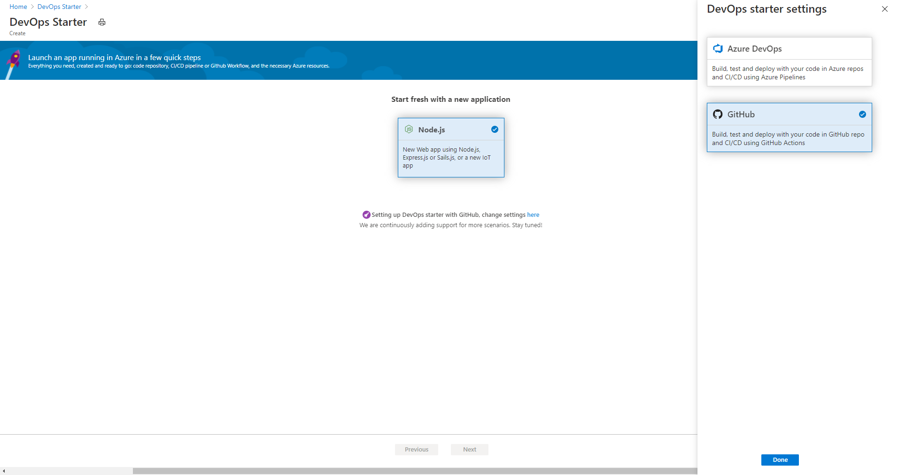
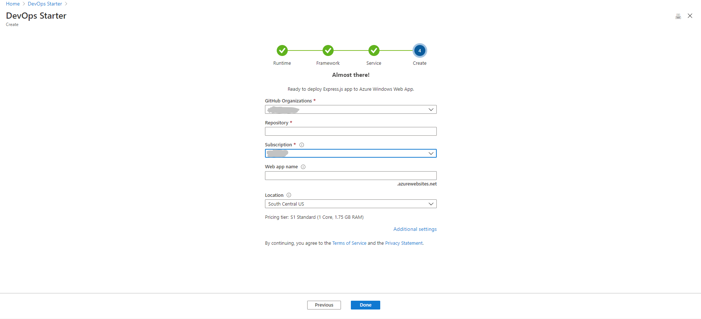
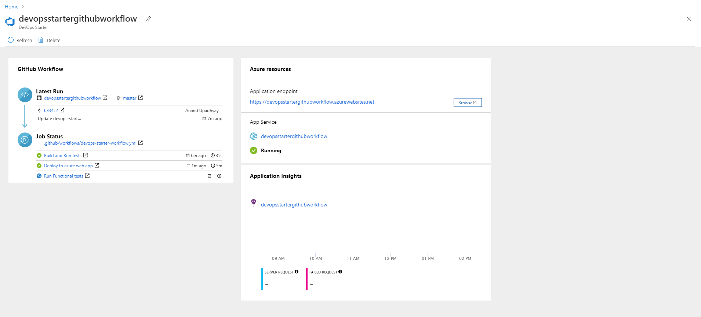

# Tutorial: Deploy Node.js app to Azure Web App using DevOps Starter for GitHub Actions

DevOps Starter for GitHub Actions presents a simplified experience where you can choose a sample application to create a continuous integration (CI) and continuous delivery (CD) workflow to deploy to Azure. 

DevOps Starter also:
* Automatically creates Azure resources, such as a new Azure Web App.
* Creates and configures a workflow in GitHub that includes a build job for CI.
* The workflow also contains a deploy job for CD. 
* Creates an Azure Application Insights resource for monitoring.

In this tutorial, you will:

> [!div class="checklist"]
> * Use DevOps Starter to deploy a Node.js app
> * Configure GitHub and an Azure subscription 
> * Examine the GitHub workflow
> * Commit changes to GitHub and automatically deploy them to Azure
> * Configure Azure Application Insights monitoring
> * Clean up resources

## Prerequisites

* An Azure account with an active subscription. [Create an account for free](https://azure.microsoft.com/free/).

## Use DevOps Starter to deploy a Node.js app

DevOps Starter creates a workflow in GitHub. You can use an existing GitHub organization. DevOps Starter also creates Azure resources such as Web App in the Azure subscription of your choice.

1. Sign in to the [Azure portal](https://portal.azure.com).

1. In the search box, type **DevOps Starter**, and then select. Click on **Add** to create a new one.

    

1. Ensure that the CI/CD provider is selected as **GitHub Actions**.

    

1. Select **Node.js**, and then select **Next**.

1. Under **Choose an application Framework**, select **Express.js**, and then select **Next**. The application framework, which you chose in a previous step, dictates the type of Azure service deployment target that's available here. 

1. Select the **Windows Web App**, and then select **Next**.

## Configure GitHub and an Azure subscription

1. **Authorize** GitHub and select an existing GitHub organization. 

1. Enter a name for your **GitHub Repository**. 

1. Select your Azure subscription services. Optionally, you can select **Change** and then enter more configuration details, such as the location of the Azure resources.
 
1. Enter a Web App name, and then select **Done**. After a few minutes, the Azure Web App will be ready. A sample Node.js application is set up in a repo in your GitHub organization, a workflow is triggered, and your application is deployed to the newly created Azure Web App.

       

   After it's completed, the DevOps Starter dashboard is displayed in the Azure portal. You can also navigate to the dashboard directly from **All resources** in the Azure portal. 

   The dashboard provides visibility into your GitHub code repo, your CI/CD workflow, and your running application in Azure.   

   

DevOps Starter automatically configures a trigger that deploys code changes to your repo.
    
## Examine the GitHub workflow

In the previous step, DevOps Starter automatically configured a full GitHub workflow. Explore and customize the workflow as needed. Take the following steps to familiarize yourself with the workflow.

1. On the left of the DevOps Starter dashboard, select **GitHub workflow**. This link opens a browser tab and the GitHub workflow for your new project.
    > [!NOTE]
    > Do not rename the workflow file. The name of the workflow file should be **devops-starter-workflow.yml** for the dashboard to reflect the changes

1. The workflow yaml file contains all the GitHub Actions required to build and deploy the application. Click on **edit file** option to customize your workflow file.

1. Under the **Code** tab of the repo click on **commits**. This view shows code commits that are associated with the specific deployment.

1. Under the **Actions** tab of the repo you can view the history of all the workflow runs of your repository.

1. Select the **latest run** to view all the jobs that ran in the workflow.

1. Click on the **jobs** to view the detailed logs of the workflow run. The logs contain useful information about the deployment process. They can be viewed both during and after deployments.

1. Click on the **Pull request** tab to view all the pull requests on your repository

## Commit code changes and execute CI/CD

DevOps Starter creates a repository in GitHub. To view the repository and make code changes to your application, do the following:

1. On the left of the DevOps Starter dashboard, select the link for your master branch. This link opens a view to the newly created GitHub repository.

1. To view the repository clone URL, select **Clone** on the top right of the browser. You can clone your Git repository in your favorite IDE. In the next few steps, you can use the web browser to make and commit code changes directly to the master branch.

1. On the left side of the browser, go to the **/Application/views/index.pug** file.

1. Select **Edit**, and then make a change to some of the text.
    For example, change some of the text for one of the tags.

1. Select **Commit**, and then save your changes.

1. In your browser, go to the DevOps Starter dashboard.   
You should now see a GitHub workflow build job in progress. The changes you just made are automatically built and deployed via a GitHub workflow.

1. After the deploy is completed, refresh your application to verify your changes.

## Configure Azure Application Insights monitoring

With Azure Application insights, you can easily monitor your application's performance and usage. DevOps Starter automatically configures an Application Insights resource for your application. You can further configure various alerts and monitoring capabilities as needed.

1. In the Azure portal, go to the DevOps Starter dashboard. 

1. At the lower right, select the **Application Insights** link for your app. The **Application Insights** pane opens. This view contains usage, performance, and availability monitoring information for your app.

    

1. Select **Time range**, and then select **Last hour**. To filter the results, select **Update**. You can now view all activity from the last 60 minutes. 
    
1. To exit the time range, select **x**.

1. Select **Alerts**, and then select **Add metric alert**. 

1. Enter a name for the alert.

1. In the **Metric** drop-down list, examine the various alert metrics. The default alert is for a **server response time greater than 1 second**. You can easily configure a variety of alerts to improve the monitoring capabilities of your app.

1. Select the **Notify via Email owners, contributors, and readers** check box. Optionally, you can perform additional actions when an alert is displayed by executing an Azure logic app.

1. Select **OK** to create the alert. After a few moments, the alert appears as active on the dashboard. 

1. Exit the **Alerts** area, and go back to the **Application Insights** pane.

1. Select **Availability**, and then select **Add test**. 

1. Enter a test name, and then select **Create**. A simple ping test is created to verify the availability of your application. After a few minutes, test results are available, and the Application Insights dashboard displays an availability status.

## Clean up resources

If you are testing, you can avoid accruing billing charges by cleaning up your resources. When they are no longer needed, you can delete the Azure virtual machine and related resources that you created in this tutorial. To do so, use the **Delete** functionality on the DevOps Starter dashboard. 

> [!IMPORTANT]
> The following procedure permanently deletes resources. The *Delete* functionality destroys the data that's created by the project in DevOps Starter in both Azure, and you will be unable to retrieve it. Use this procedure only after you've carefully read the prompts.

1. In the Azure portal, go to the DevOps Starter dashboard.
1. At the top right, select **Delete**. 
1. At the prompt, select **Yes** to *permanently delete* the resources.

You can optionally modify the workflow to meet the needs of your team. You can also use this CI/CD pattern as a template for your other repositories. 

## Next steps

In this tutorial, you learned how to:

> [!div class="checklist"]
> * Use DevOps Starter to deploy a Node.js app
> * Configure GitHub and an Azure subscription 
> * Examine the GitHub workflow
> * Commit changes to GitHub and automatically deploy them to Azure
> * Configure Azure Application Insights monitoring
> * Clean up resources

To learn more about GitHub Actions and workflows, see:

> [!div class="nextstepaction"]
> [Customize GitHub workflow](https://docs.github.com/actions/configuring-and-managing-workflows/configuring-and-managing-workflow-files-and-runs)
