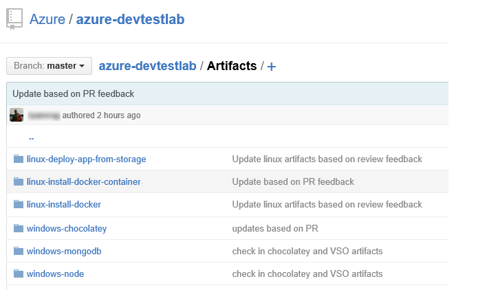
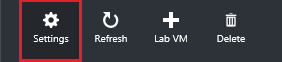

<properties
	pageTitle="Add a Git artifact repository to a lab | Microsoft Azure"
	description="Add a GitHub or Visual Studio Team Services Git repository for your custom artifacts in DevTest Labs"
	services="devtest-lab,virtual-machines,visual-studio-online"
	documentationCenter="na"
	authors="tomarcher"
	manager="douge"
	editor=""/>

<tags
	ms.service="devtest-lab"
	ms.workload="na"
	ms.tgt_pltfrm="na"
	ms.devlang="na"
	ms.topic="article"
	ms.date="06/01/2016"
	ms.author="tarcher"/>

# Add a Git artifact repository to a lab

> [AZURE.NOTE] View this article's accompanying video: [How to add your private artifacts repository to a lab in DevTest Labs](/documentation/videos/how-to-add-your-private-artifacts-repository-in-a-devtest-lab) 

## Overview

By default, a lab includes artifacts from the official Azure DevTest Labs artifact repository. You can add a Git artifact repository to your lab to include the artifacts that your team creates. The repository can be hosted on [GitHub](https://github.com) or on [Visual Studio Team Services (VSTS)](https://visualstudio.com).

- To learn how to create a GitHub repository, see [GitHub Bootcamp](https://help.github.com/categories/bootcamp/).
- To learn how to create a Team Services project with a Git Repository, see [Connect to Visual Studio Team Services](https://www.visualstudio.com/get-started/setup/connect-to-visual-studio-online).

The following screen shot shows an example of how a repository containing artifacts might look in GitHub:  

## Add a GitHub artifacts repository to your lab

To add a GitHub artifacts repository to your lab, you first get the HTTPS clone URL and Personal Access Token from the artifacts repository, then you enter that information in your lab

### Get the GitHub repository clone URL and personal access token

1. On the home page of the GitHub repository that contains the team artifacts, save the **HTTPS clone url** for later use.

1. Select the profile image in the upper-right corner, and select **Settings**.

1. In the **Personal settings** menu on the left, select **Personal access tokens**.

1. Select **Generate new token**.

1. On the **New personal access token** page, enter a **Token description**, accept the default items in the **Select scopes**, and then choose **Generate Token**.

1. Save the generated token as you'll need it later.

1. You can close GitHub now.   

###Connect your lab to the GitHub repository

1. Sign in to the [Azure portal](http://go.microsoft.com/fwlink/p/?LinkID=525040).

1. Select **Browse**, and then select **DevTest Labs** from the list.

1. From the list of labs, select the desired lab.   

1. On the lab's blade, select **Settings**.

1. On the lab's **Settings** blade, select **Artifacts Repository**.

1. On the **Artifacts Repository** blade:

    1. Enter a **Name** for the repository.
    1. Enter the saved **Git Clone Url**.
    2. Enter the **Folder Path** in the artifacts repository that contains the artifacts.
    3. Enter the saved **Personal Access Token** to the artifacts repository.
    4. Select **Save**.

The artifacts in your repository are now listed on the **Add Artifacts** blade.

## Adding a Visual Studio Git artifact repository to your lab

To add a Visual Studio Git artifact repository to your lab, you first get the HTTPS clone url and Personal Access Token from the artifacts repository, then you enter that information in your lab.

### On the Visual Studio web page of your artifact project

1. Open the home page of your team collection (for example, `https://contoso-web-team.visualstudio.com`), and then select the artifact project.

2. On the project home page, select **Code**.

1. To view the clone URL, on the project **Code** page, select **Clone**.

1. Save the URL as you'll need it later in this tutorial.

1. To create a Personal Access Token, select **My profile** from the user account drop-down menu.

1. On the profile information page select the **Security**.

1. On the **Security** tab, select **Add**.

1. In the **Create a personal access token** page:

    1. Enter a **Description** for the token.
    2. Select **180 days** from the **Expires In** list.
    3. Choose **All accessible accounts** from the **Accounts** list.
    4. Choose the **All scopes** option.
    5. Choose **Create Token**.

1. When finished, the new token will appear in the **Personal Access Tokens** list. Select **Copy Token**, and then save the token value as it will be used shortly.

### In the lab

1. On the your lab's blade, select **Settings**.

    

1. On the **Settings** blade, select **Artifacts Repository**.

1. On the **Artifacts Repository** blade

    1. Enter a display **Name** for the repository.
    1. Enter the saved **Git Clone Url**.
    2. Enter the **Folder Path** in the artifacts repository that contains the artifacts.
    3. Enter the saved **Personal Access Token** to the artifacts repository.
    4. Select **Save**.

## Related blog posts
- [How to troubleshoot failing Artifacts in AzureDevTestLabs](http://www.visualstudiogeeks.com/blog/DevOps/How-to-troubleshoot-failing-artifacts-in-AzureDevTestLabs)
- [Join a VM to existing AD Domain using ARM template in Azure Dev Test Lab](http://www.visualstudiogeeks.com/blog/DevOps/Join-a-VM-to-existing-AD-domain-using-ARM-template-AzureDevTestLabs)