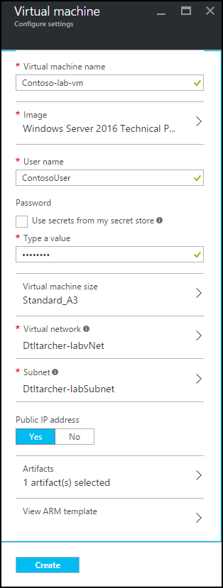
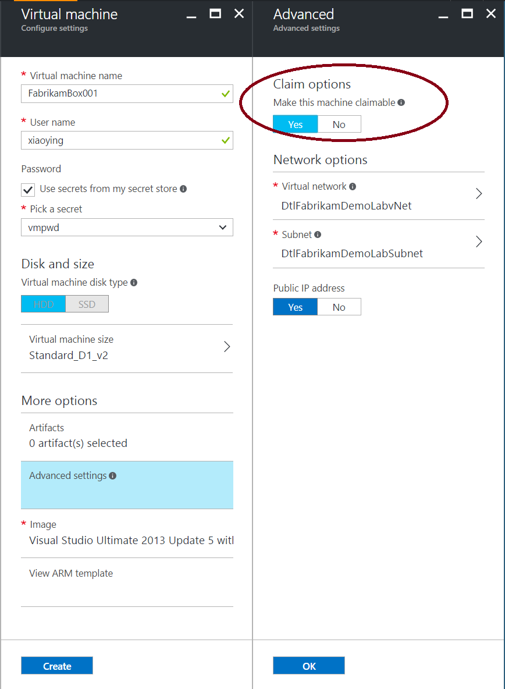
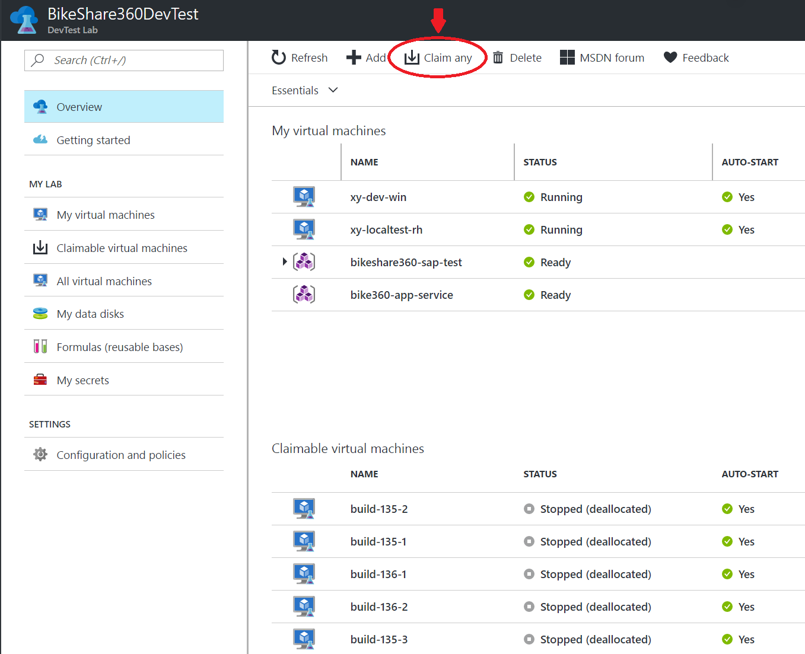

# Add a claimable VM to a lab in Azure DevTest Labs
You add a claimable VM to a lab in a similar manner to how you [add a standard VM](devtest-lab-add-vm.md) – from a *base* that is either a [custom image](devtest-lab-create-template.md), [formula](devtest-lab-manage-formulas.md), or [Marketplace image](devtest-lab-configure-marketplace-images.md). This tutorial walks you through using the Azure portal to add a claimable VM to a lab in DevTest Labs, and shows the process a user follows to claim the VM.

> [!NOTE]
> If you deploy lab VMs through [Azure Resource Manager templates](devtest-lab-create-environment-from-arm.md), you can create claimable VMs by setting the **allowClaim** property to true in the properties section.
>
>

## Steps to add a claimable VM to a lab in Azure DevTest Labs
1. Sign in to the [Azure portal](http://go.microsoft.com/fwlink/p/?LinkID=525040).
1. Select **More Services**, and then select **DevTest Labs** from the list.
1. From the list of labs, select the lab in which you want to create the claimable VM.  
1. On the lab's **Overview** blade, select **+ Add**.  

    

1. On the **Choose a base** blade, select a base for the VM.
1. On the **Virtual machine** blade, enter a name for the new virtual machine in the **Virtual machine name** text box.

    

1. Enter a **User Name** that is granted administrator privileges on the virtual machine.  
1. If you want to use a password stored in your [secret store](https://azure.microsoft.com/updates/azure-devtest-labs-keep-your-secrets-safe-and-easy-to-use-with-the-new-personal-secret-store), select **Use a saved secret**, and specify a key value that corresponds to your secret (password). Otherwise, enter a password in the text field labeled **Type a value**.
1. The **Virtual machine disk type** determines which storage disk type is allowed for the virtual machines in the lab.
1. Select **Virtual machine size** and select one of the predefined items that specify the processor cores, RAM size, and the hard drive size of the VM to create.
1. Select **Artifacts** and from the list of artifacts, select and configure the artifacts that you want to add to the base image. If you're new to DevTest Labs or configuring artifacts, refer to the [Add an existing artifact to a VM](devtest-lab-add-vm.md#add-an-existing-artifact-to-a-vm) section, and then return here when finished.
1. Select **Advanced settings** to configure the VM's network options and expiration options. Under **Claim options**, choose **Yes** to make the machine claimable.

  

1. If you want to view or copy the Azure Resource Manager template, refer to the [Save Azure Resource Manager template](devtest-lab-add-vm.md#save-azure-resource-manager-template) section, and return here when finished.
1. Select **Create** to add the specified VM to the lab.
1. The lab blade displays the status of the VM's creation - first as **Creating**, then as **Running** after the VM has been started.

## Using a claimable VM

A user can claim any VM from the list of "Claimable virtual machines" by doing one of these steps:

* From the list of "Claimable virtual machines" at the bottom of the lab's Overview blade, right-click on one of the VMs in the list and choose **Claim machine**.

 

* At the top of the **Overview** blade, choose **Claim any**. A random virtual machine is assigned from the list of claimable VMs.

 

After a user claims a VM, it is moved up into their list of "My virtual machines" and is no longer claimable by any other user.

## Next steps
* Once the VM has been created, you can connect to the VM by selecting **Connect** on the VM's blade.
* Explore the [DevTest Labs Azure Resource Manager QuickStart template gallery](https://github.com/Azure/azure-devtestlab/tree/master/ARMTemplates)
