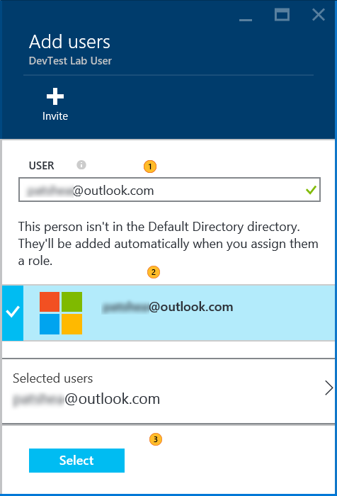

    <properties 
	pageTitle="Add a DevTest Lab User | Microsoft Azure" 
	description="Securely add a user who is not in your subscription to your Azure DevTest Lab." 
	services="devtest-lab,virtual-machines" 
	documentationCenter="na" 
	authors="patshea123" 
	manager="douge" 
	editor=""/>
  
<tags 
	ms.service="devtest-lab" 
	ms.workload="na" 
	ms.tgt_pltfrm="na" 
	ms.devlang="na" 
	ms.topic="article" 
	ms.date="10/23/2015" 
	ms.author="patshea"/>

# Securely add a user to your Azure DevTest Lab.

## Overview

Access to a **DevTest Lab** is controlled by Azure Role-Based Access Control (RBAC). Search for [Role-Based-Access-Control (RBAC)](https://azure.microsoft.com/searchresults?query=Role%20Based%20Access%20Control%20%28RBAC%29) in the Azure portal to learn more.

You grant access to your **DevTest-Lab** through two roles: 

 - **Owner**: Principals assigned to the **owner** role at the Azure subscription level have complete access to the lab, including management and monitoring functions. To add an **owner** role to your subscription, see [Role-based access control in the Microsoft Azure portal](http://go.microsoft.com/fwlink/?LinkId=624812). 
 
     > [AZURE.NOTE] **Owner** roles that are assigned at RBAC levels other than the subscription level are not supported in **DevTest Lab**. Assigning a principal to the **Owner** roles in the **DevTest Lab** is not supported.
 -  **DevTest Lab User**: Principals assigned to the **DevTest Lab User** role can create VMs, read, update and delete virtual machines in the specified lab. Users can be either *internal* (a member of the Azure Active Directory for the subscription), or *external* (a user who is not a member of the Azure AD, such as a member of a partner organization). 
     -  A **DevTest Lab User** role must be assigned through the **Add Users** tiles of the lab. 
     -  Principals in the **DevTest Lab User** role can perform these operations only inside in the lab that they are assigned to.  
     For example, a **DevTest Lab User** cannot create a virtual machine using the Virtual Machine service of the subscription. Creating a virtual machine is only allowed from the DevTest Lab account.
     - *External* users must have an account in one of the Microsoft account domains (i.e. @hotmail.com, @live.com, @msn.com, @passport.com, @outlook.com, or any variant for a specific country).

> [AZURE.NOTE] Azure roles other than **Owner** and **DevTest Lab User** are not supported in a **DevTest Lab**.

## Add a DevTest Lab User to your lab 

1. Sign in to the [Azure preview portal](http://portal.azure.com).

1. Tap **Browse**, and then tap **DevTest Labs** from the list.

1. From the list of labs, tap the desired lab.   

1. Tap the **Access** icon.
 

1. On the **Users** blade, tap **Add** to display the **Add access** blade.
 

2. In the **Select a role** blade, tap **DevTest Lab User**.

1. In the **Add users** blade:

	1. Enter the email account in the **Users** text box and press **Enter**. An error message is displayed if the account does not exist.

	1. Tap the verified account.

	3. Tap **Select**.

	
