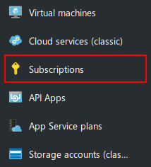
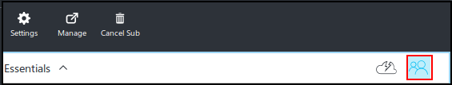
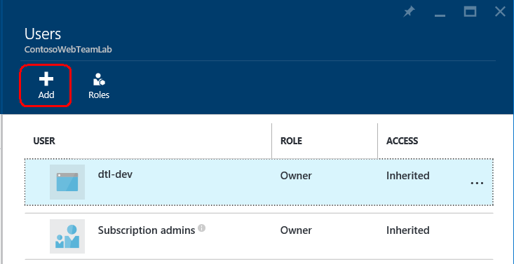
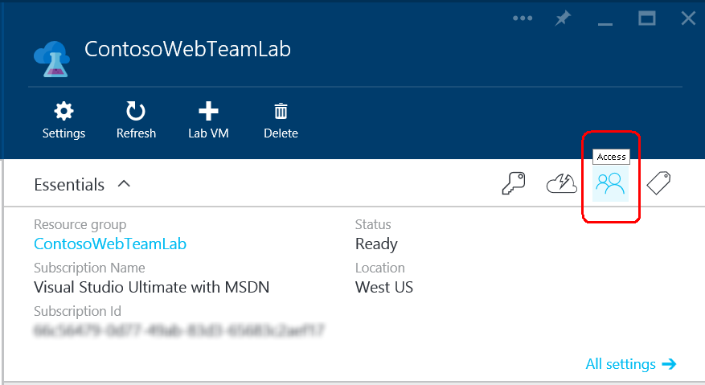

<properties
	pageTitle="Add owners and users to a lab | Microsoft Azure"
	description="Securely add a user who is not in your subscription to Azure DevTest Labs"
	services="devtest-lab,virtual-machines"
	documentationCenter="na"
	authors="tomarcher"
	manager="douge"
	editor=""/>

<tags
	ms.service="devtest-lab"
	ms.workload="na"
	ms.tgt_pltfrm="na"
	ms.devlang="na"
	ms.topic="article"
	ms.date="08/01/2016"
	ms.author="tarcher"/>

# Add owners and users to a lab

> [AZURE.VIDEO how-to-set-security-in-your-devtest-lab]

## Overview
DevTest Labs access is controlled by Azure Role-Based Access Control (RBAC). Search for [Role-Based-Access-Control (RBAC)](https://azure.microsoft.com/search/?q=role%20based%20access%20control) in the [Azure portal](http://go.microsoft.com/fwlink/p/?LinkID=525040) to learn more.

You grant access to your lab through two roles:

- **Owner**: Users assigned to the **Owner** role at the lab level have complete access to the lab, including management and monitoring functions. The **Owner** role assigned at the lab level does not grant users permissions to access resources in the subscription outside the lab scope. Users assigned to the **Owner** role at the Azure subscription level automatically have **Owner** rights to any resources created in that subscription, including labs and VMs.

-  **DevTest Labs User**: Users assigned to the **DevTest Labs User** role can create VMs in the specified lab as well as view all lab resources, such as VMs, policies or virtual networks. Users can be either *internal* (a member of the Azure Active Directory for the subscription), or *external* (a user who is not a member of the Azure AD, such as a member of a partner organization).
	-  A **DevTest Labs User** role must be assigned through the **Add Users** tiles of the lab.
	-  Users in the **DevTest Labs User** role can perform these operations only inside in the lab that they are assigned to.
	For example, a **DevTest Labs User** cannot create a virtual machine using the Virtual Machine service of the subscription. Creating a virtual machine is only allowed from the DevTest Labs account.
	- *External* users are users with a Microsoft Account (MSA).
 
Once a VM gets created, the user that created it gets automatically assigned to the **Owner** role on the created VM, which allows them to perform all the actions that are offered in the lab.

## Add an owner to your lab

Because of the way permissions are propagated from parent scope to child scope in Azure, owner(s) of an Azure subscription that contains labs will automatically be owner(s) of those labs, as well as of all the VMs and other resources that get created by the lab's users as well as by the DevTest Lab service. While you can add additional owners to a lab via the lab's blade in the [Azure portal](http://go.microsoft.com/fwlink/p/?LinkID=525040), their scope of administration will be more narrow than that of the subscription owners, because they would not have full access to some of the resources that are created in the subscription by the DevTest Labs service. 

To add an owner to an Azure subscription where you have labs already created or will be creating new labs, follow these steps:

1. Sign in to the [Azure portal](http://go.microsoft.com/fwlink/p/?LinkID=525040).

1. In the left-nav, select **Subscriptions**.

	
	
1. Select the subscription that will contain the lab(s).

1. Select the **Access** icon. 

	

1. On the **Users** blade, select **Add**.

	

1. On the **Select a role** blade, select **Owner**.

1. Enter into the **User** text box the email of the user you want to add as an owner. If the user can't be found, you'll get an error message explaining the issue. If the user is found, that user will be listed under the **User** text box.

1. Select the located user name.

1. Select **Select**.

1. Select **OK** to close the **Add access** blade.

1. When you return to the **Users** blade, you'll see that the user has been added as an owner. This person will now be an owner of any labs created under this subscription, and thus be able to perform owner tasks. 

## Add a DevTest Labs user to your lab

To add a DevTest Labs user to your lab, follow these steps:

1. Sign in to the [Azure portal](http://go.microsoft.com/fwlink/p/?LinkID=525040).

1. Select **Browse**.

1. Select **DevTest Labs**.

1. From the list of labs, select the desired lab.   

1. Select the **Access** icon.

	

1. On the **Users** blade, select **Add**.

	

1. In the **Select a role** blade, select **DevTest Labs User**

1. In the **Add users** blade:

	1. The **Add users** blade will display a list of built-in users. If the desired user is already in the list, you can simply select the user row to select it. A checkmark will appear to the left of the user to indicate that the user has been selected. To select multiple users, hold the **&lt;Ctrl>** key while selecting each user. To deselect a user, hold the **&lt;Ctrl>** key and select the user. A counter at the bottom of the blade indicates the number of selected users.

	1. If the desired user is not in the list, enter a valid Microsoft email account in the **Users** text box. If the email address is valid, the user will display below the **User** text box.    

	1. Once you've selected the users you want to add to the lab, select **Select**.

	1. Select **OK** to close the **Add access** blade.

1. The **Users** blade displays the added roles and users.
