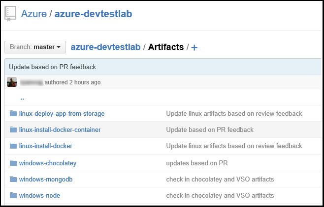
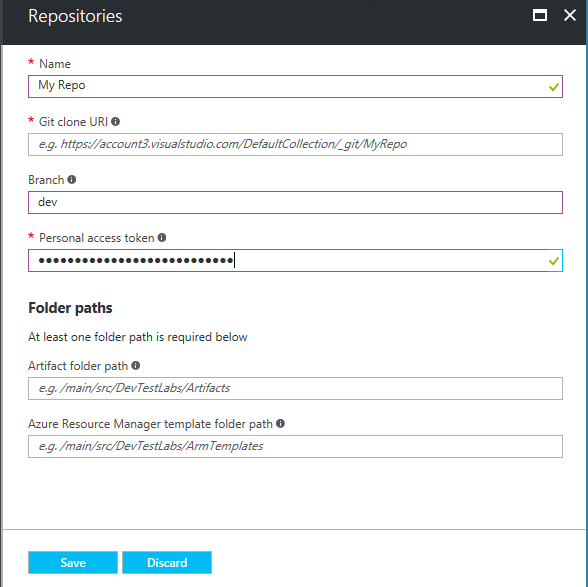

# Add a Git repository to use custom artifacts and Azure Resource Manager templates in your Azure DevTest Labs

You can use your own artifacts or customize Azure Resource Manager templates to blah and then add a repo

You can add a Git repository to your lab to include the artifacts or Azure Resource Manager templates that your team creates. The repository can be hosted on [GitHub](https://github.com) or on [Visual Studio Team Services (VSTS)](https://visualstudio.com).

We have provided Github repositories of [Artifacts](https://github.com/Azure/azure-devtestlab/tree/master/Artifacts) and [Azure Resource Manager templates](https://github.com/Azure/azure-devtestlab/tree/master/ARMTemplates) that you can deploy as-is or customize for your labs. By default, a lab includes artifacts and Azure Resource Manager templates from the official Azure DevTest Labs repository.

* To learn how to create a GitHub repository, see [GitHub Bootcamp](https://help.github.com/categories/bootcamp/).
* To learn how to create a Team Services project with a Git Repository, see [Connect to Visual Studio Team Services](https://www.visualstudio.com/get-started/setup/connect-to-visual-studio-online).

The following screen shot shows an example of how a repository containing artifacts might look in GitHub:  

## Get the repository information and credentials
To add a repository to your lab, you must first get certain information from your repository. The following sections guide you through getting this information for repositories hosted on GitHub and Visual Studio Team Services.

### Get the GitHub repository clone URL and personal access token
To get the GitHub repository clone URL and personal access token, follow these steps:

1. Browse to the home page of the GitHub repository that contains the artifact or Azure Resource Manager template definitions.
2. Select **Clone or download**.
3. Select the button to copy the **HTTPS clone url** to the clipboard, and save the URL for later use.
4. Select the profile image in the upper-right corner of GitHub, and select **Settings**.
5. In the **Personal settings** menu on the left, select **Personal access tokens**.
6. Select **Generate new token**.
7. On the **New personal access token** page, enter a **Token description**, accept the default items in the **Select scopes**, and then choose **Generate Token**.
8. Save the generated token as you need it later.
9. You can close GitHub now.   
10. Continue to the [Connect your lab to the repository](#connect-your-lab-to-the-repository) section.

### Get the Visual Studio Team Services repository clone URL and personal access token
To get the Visual Studio Team Services repository clone URL and personal access token, follow these steps:

1. Open the home page of your team collection (for example, `https://contoso-web-team.visualstudio.com`), and then select your project.
2. On the project home page, select **Code**.
3. To view the clone URL, on the project **Code** page, select **Clone**.
4. Save the URL as you need it later in this tutorial.
5. To create a Personal Access Token, select **My profile** from the user account drop-down menu.
6. On the profile information page, select **Security**.
7. On the **Security** tab, select **Add**.
8. In the **Create a personal access token** page:

   * Enter a **Description** for the token.
   * Select **180 days** from the **Expires In** list.
   * Choose **All accessible accounts** from the **Accounts** list.
   * Choose the **All scopes** option.
   * Choose **Create Token**.
9. When finished, the new token appears in the **Personal Access Tokens** list. Select **Copy Token**, and then save the token value for later use.
10. Continue to the [Connect your lab to the repository](#connect-your-lab-to-the-repository) section.

## Connect your lab to the repository
1. Sign in to the [Azure portal](http://go.microsoft.com/fwlink/p/?LinkID=525040).
2. Select **More Services**, and then select **DevTest Labs** from the list.
3. From the list of labs, select the desired lab.   
4. On the lab's blade, select **Configuration and policies**.
5. On the lab's **Configuration and policies** blade, select **Repositories**.
6. On the **Repositories** blade, select **+ Add**.

    
7. On the second **Repositories** blade, specify the following:

   * **Name** - Enter a name for the repository.
   * **Git Clone Url** - Enter the Git HTTPS clone URL that you copied earlier from either GitHub or Visual Studio Team Services.
   * **Branch** - Enter the branch to get your definitions.
   * **Personal Access Token** - Enter the personal access token you obtained earlier from either GitHub or Visual Studio Team Services.
   * **Folder Paths** - Enter at least one folder path relative to the clone URL that contains your artifact or Azure Resource Manager template definitions.

     
8. Select **Save**.

[!INCLUDE [devtest-lab-try-it-out](../../includes/devtest-lab-try-it-out.md)]

## Related blog posts
* [How to troubleshoot failing Artifacts in AzureDevTestLabs](http://www.visualstudiogeeks.com/blog/DevOps/How-to-troubleshoot-failing-artifacts-in-AzureDevTestLabs)
* [Join a VM to existing AD Domain using ARM template in Azure Dev Test Lab](http://www.visualstudiogeeks.com/blog/DevOps/Join-a-VM-to-existing-AD-domain-using-ARM-template-AzureDevTestLabs)
