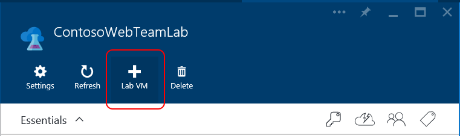
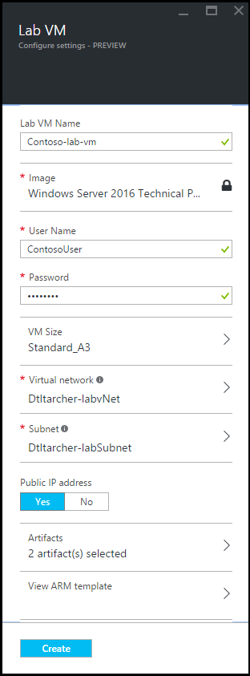
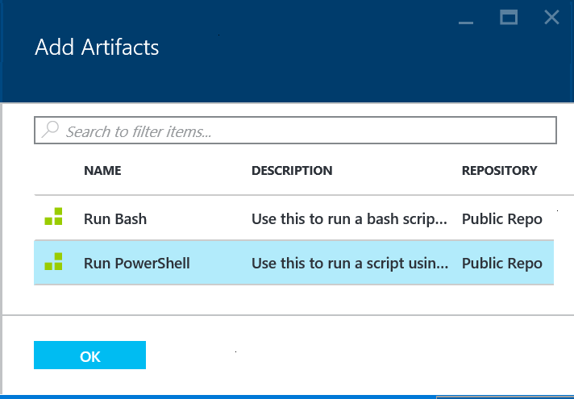
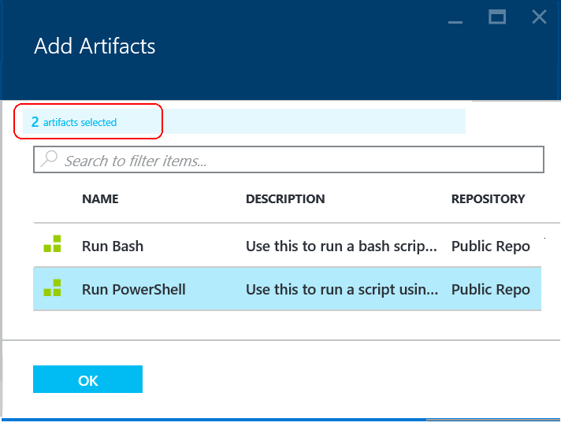

<properties
	pageTitle="Add a VM with artifacts to a lab | Microsoft Azure"
	description="Learn how to add a VM with artifacts in DevTest Labs"
	services="devtest-lab,virtual-machines"
	documentationCenter="na"
	authors="tomarcher"
	manager="douge"
	editor=""/>

<tags
	ms.service="devtest-lab"
	ms.workload="na"
	ms.tgt_pltfrm="na"
	ms.devlang="na"
	ms.topic="article"
	ms.date="08/01/2016"
	ms.author="tarcher"/>

# Add a VM with artifacts to a lab

> [AZURE.VIDEO how-to-create-vms-with-artifacts-in-a-devtest-lab]

## Overview

You create a VM in a lab from a *base* that is either a [custom image](./devtest-lab-create-template.md), [formula](./devtest-lab-manage-formulas.md), or [Marketplace image](./devtest-lab-configure-marketplace-images.md).

DevTest Labs *artifacts* let you specify *actions* that are performed when the VM is created. 

Artifact actions can perform procedures such as running Windows PowerShell scripts, running Bash commands, and installing software. 

Artifact *parameters* let you customize the artifact for your particular scenario.

This article shows you how to create a VM in your lab with artifacts.

## Add a VM with artifacts

1. Sign in to the [Azure portal](http://go.microsoft.com/fwlink/p/?LinkID=525040).

1. Select **Browse**, and then select **DevTest Labs** from the list.

1. From the list of labs, select the lab in which you want to create the new VM.  

1. On the lab's blade, select **+ Lab VM** as shown in the following figure.  
    

1. On the **Choose a base** blade, select a base for the VM.

1. On the **Lab VM** blade, enter a name for the new virtual machine in the **Lab VM Name** text box.

	

1. Enter a **User Name** that will be granted administrator privileges on the virtual machine.  

1. If the OS type of the selected base is Linux, specify an authentication type of either *Password* or *SSH Public Key*.

1. Depending on the authentication type specified, enter either a password or SSH public key.

1. Select **VM Size** and select one of the predefined items that specify the processor cores, RAM size, and the hard drive size of the VM to create.

1. Select **Virtual network** and select the desired virtual network.

1. Select **Subnet** and select subnet.

1. If the lab policy is set to allow public IP addresses for the selected subnet, specify whether or not you want the IP address to be public by 
selecting either **Yes** or **No**. Otherwise, this option is disabled and selected as **No**. 

1. Select **Artifacts** and, from the list of artifacts, select and configure the artifacts that you want to add to the base image. 
**Note:** If you're new to DevTest Labs or configuring artifacts, skip to the [Add an existing artifact to a VM](#add-an-existing-artifact-to-a-vm) section, 
and then return here when finished.

1. If you want to view or copy the ARM template, skip to the [Save ARM template](#save-arm-template) section, and return here when finished.

1. Select **Create** to add the specified VM to the lab.

1. The lab blade displays the status of the VM's creation; first as **Creating**, then as **Running** after the VM has been started.

1. Go to the [Next Steps](#next-steps) section. 

## Add an existing artifact to a VM

While creating a VM, you can add existing artifacts. Each lab includes artifacts from the Public DevTest Labs Artifact Repository as 
well as artifacts that you've created and added to your own Artifact Repository.
To discover how to create artifacts, see the article, [Learn how to author your own artifacts for use with DevTest Labs](devtest-lab-artifact-author.md).

1. On the **Lab VM** blade, select **Artifacts**. 

1. On the **Add Artifacts** blade, select the desired artifact.  

1. Enter the required parameter values and any optional parameters that you need.  

1. Select **Add** to add the artifact and return to the **Add Artifacts** blade.

1. Continue adding artifacts as needed for your VM.

1. Once you've added your artifacts, you can [change the order in which the artifacts are run](#change-the-order-in-which-artifacts-are-run). You can 
also go back to [view or modify an artifact](#view-or-modify-an-artifact).

## Change the order in which artifacts are run

By default, the actions of the artifacts are executed in the order in which they are added to the VM. 
The following steps illustrate how to change the order in which the artifacts are run.

1. At the top of the **Add Artifacts** blade, select the link indicating the number of artifacts that have been added to the VM.

    

1. Drag and drop the artifacts in the list to reflect the desired order. **Note:** If you have
having trouble dragging the artifact, make sure that you are dragging from the left side of the 
artifact. 

1. Select **OK** when done.  

## View or modify an artifact

The following steps illustrate how to view or modify the parameters of an artifact:

1. At the top of the **Add Artifacts** blade, select the link indicating the number of artifacts that have been added to the VM.

    

1. On the **Selected Artifacts** blade, select the artifact that you want to view or edit.  

1. On the **Add Artifact** blade, make any needed changes, and select **OK** to close the **Add Artifact** blade.

1. Select **OK** to close the **Selected Artifacts** blade.

## Save ARM template

An ARM template provides a declarative way to define a repeatable deployment. 
The following steps explain how to save the ARM template for the VM being created.
Once saved, you can use the ARM template to [deploy new VMs with Azure PowerShell](../resource-group-overview.md#template-deployment).

1. On the **Lab VM** blade, select **View ARM Template**.

1. On the **View Azure Resource Manager Template blade**, select all of the template text.

1. Copy the selected text to the clipboard.

1. Select **OK** to close the **View Azure Resource Manager Template blade**.

1. Open a text editor.

1. Paste in the template text from the clipboard.

1. Save the file for later use.

## Next steps

- Once the VM has been created, you can connect to the VM by selecting **Connect** on the VM's blade.
- Learn how to [create custom artifacts for your DevTest Labs VM](devtest-lab-artifact-author.md).
- Explore the [DevTest Labs ARM QuickStart template gallery](https://github.com/Azure/azure-devtestlab/tree/master/ARMTemplates)