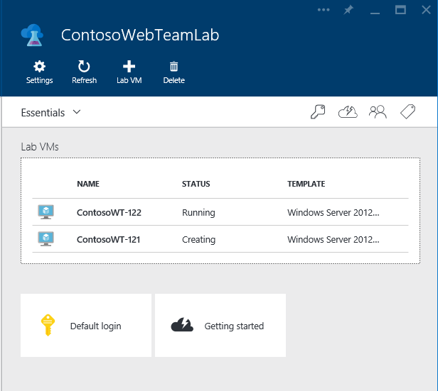
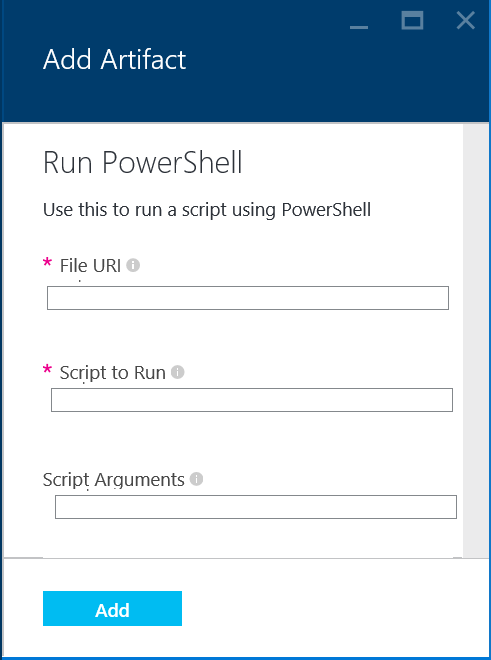
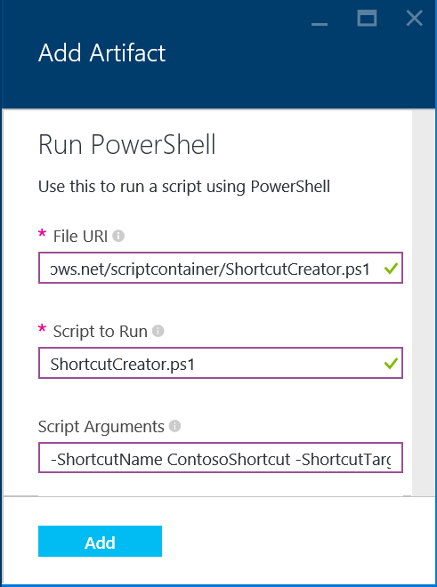
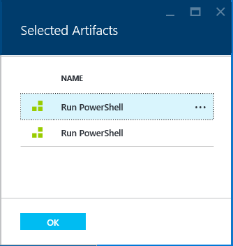
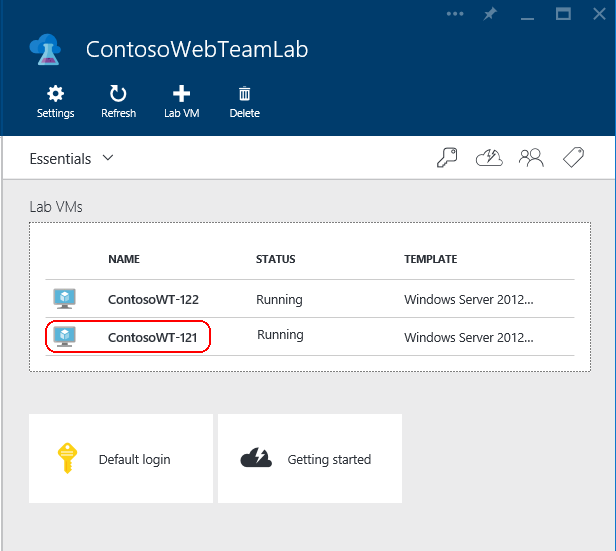
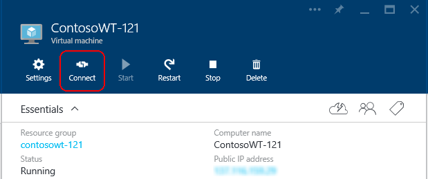

    <properties 
	pageTitle="Add a VM with artifacts to a DevTest Lab | Microsoft Azure" 
	description="Create a new virtual machine with Artifacts in DevTest Lab." 
	services="devtest-lab,virtual-machines" 
	documentationCenter="na" 
	authors="patshea123" 
	manager="douge" 
	editor="tglee"/>
  
<tags 
	ms.service="devtest-lab" 
	ms.workload="na" 
	ms.tgt_pltfrm="na" 
	ms.devlang="na" 
	ms.topic="article" 
	ms.date="10/07/2015" 
	ms.author="patshea"/>

# Add a VM with artifacts to an Azure DevTest Lab

## Overview

You create a virtual machine in a DevTest Lab starting with an Azure base image or with an image that you have uploaded to your lab.

DevTest Lab *artifacts* let you specify actions that are performed when the VM is created. Artifacts actions can run Powershell and Bash commands, install software, and a many other procedures. Artifact *parameters* let you customize the artifact for your scenario.

Your lab includes artifacts from the official DevTest Lab artificact repository. The lab can also include artifacts that are created and added to your own artifact repository. 

This article shows you how create a VM in your lab using artifacts.

## Adding a VM with artifacts

1. On the home blade of the lab, choose **Add**.  
    

1. On the **Lab VM** blade, enter a name for the new virtual machine in the **Lab VM Name** text box.

1.  Choose **Base / Configure required settings** and select a base image for the VM.

      
    The **Lab VM** blade expands to include the **User Name** and **Password** items.  
    

1. Enter a **User Name** that will be granted administrator privileges on the virtual machine.
1. Enter a **Password** for the **User Name** principal.
1. Choose **VM Size** and select one of the pre-defined items that specify the processor cores, the size of RAM, and the size of the hard drive of the virtual machine to create.
1. Choose **Artifacts** and select and configure the artifacts that you want to add to the base image.  
    See [Selecting and configuring an artifact](#configuring-an-artifact)
1. Choose **Create** add the specified VM to the lab.

The lab home blade shows the status of the VM, first as **Creating**, then as **Running** after the VM is started:

## Selecting and configuring an artifact

After you choose **Artifacts** on the **Lab VM** blade, you can add one or more artifacts from the **Add Artifacts** blade.

The **Add Artifacts** list contains artifact files from the official DevTest Lab repository (**Official Repo)** and artifacts from the team repository.

**To add an artifact to the VM:**

1. Choose the artifact file in the **Add Artifacts** blade. The **Add Artifact** blade lets you added parameters to the artifact:  
      
    Required parameters are marked with a red asterisk (*).

2. Enter the required parameter values and any optional parameters that you need.  
    

3. Choose **Add**.

Repeat these steps to add additional artifacts.

**To view and modify the selected artifacts.**

 The actions of the artifact are executed in order. You can change the order and view and revise the artifacts' parameters on the **Selected Artifacts** blade.

1. To open the **Selected Artifacts** blade, choose *N* **selected artifacts**, where *N* is the number of artifacts that you have added to the VM.

    

2. To view or edit the parameters of an artifact, choose the artifact in the **Selected Artifacts** blade:  
      
    The parameters appear in the **Lab VM / Configure settings** blade.  
    Make any changes you want and then choose **Create**.

3. To changes the execution order of the artifacts, drag and drop the artifact items in the **Selected Artifacts** blade to create the order you want.

>![AZURE.NOTE] Remember to choose **Create** on the **Lab VM** blade to create the virtual machine.

## Connect to a virtual machine

To connect to a virtual machine in a lab:

1. Choose the VM on the lab home blade:  
    

1. On the VM blade, choose **Connect**:  
    

