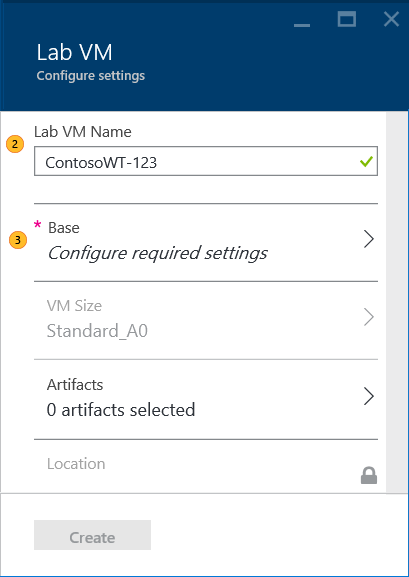
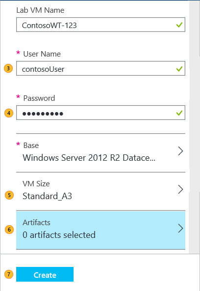

    <properties 
	pageTitle="Add a VM with artifacts to a DevTest Lab | Microsoft Azure" 
	description="Create a new virtual machine with Artifacts in DevTest Lab." 
	services="devtest-lab,virtual-machines" 
	documentationCenter="na" 
	authors="patshea123" 
	manager="douge" 
	editor=""/>
  
<tags 
	ms.service="devtest-lab" 
	ms.workload="na" 
	ms.tgt_pltfrm="na" 
	ms.devlang="na" 
	ms.topic="article" 
	ms.date="10/23/2015" 
	ms.author="patshea"/>

# Add a VM with artifacts to an Azure DevTest Lab

## Overview

You create a virtual machine in a DevTest Lab starting with an Azure base image or with an image that you have uploaded to your lab.

DevTest Lab *artifacts* let you specify actions that are performed when the VM is created. Artifact actions can perform procedures such as running Powershell and Bash commands, and installing software. Artifact *parameters* let you customize the artifact for your particular scenario.

Your lab includes artifacts from the official DevTest Lab Artifact Repository as well as artifacts that are created and added to your own Artifact Repository. 

This article shows you how create a VM in your lab using artifacts.

## Add a VM with artifacts

1. Sign in to the [Azure preview portal](http://portal.azure.com).

1. Tap **Browse**, and then tap **DevTest Labs** from the list.

1. From the list of labs, tap the lab in which you want create the new VM.  

1. On the lab's blade, tap **+ Lab VM** as shown in the following figure.  
    

1. On the **Lab VM** blade, enter a name for the new virtual machine in the **Lab VM Name** text box.

1. Tap **Base / Configure required settings** and select a base image for the VM.

      

1. After selecting a base image, the **Lab VM** blade will expand to include the **User Name** and **Password** items. Enter a **User Name** that will be granted administrator privileges on the virtual machine.  

    

1. Enter a **Password**.

1. Tap **VM Size** and select one of the predefined items that specify the processor cores, RAM size, and the hard drive size of the VM to create.

1. Tap **Artifacts** and, from the list of artifacts, select and configure the artifacts that you want to add to the base image. **Note:** If you're new to DevTest Labs or configuring artifacts, skip to the [Selecting and configuring an artifact](#configuring-an-artifact) section, and then return here when finished.

1. Tap **Create** to add the specified VM to the lab.

1. The lab blade displays the status of the VM's creation; first as **Creating**, then as **Running** after the VM has been started. To connect to the VM, tap the VM and, from the VM's blade, tap **Connect**.  

## Select and configure an artifact

While creating a VM, you can add artifacts by tapping **Artifacts** from the **Lab VM** blade. This will display the **Add Artifacts** blade that allows you to add and configure your VM's artifacts from the official DevTest Lab repository (**Official Repo**) and artifacts from the team repository.

**Adding an artifact to a VM**

Follow these steps for each artifact you want to add to your VM: 

1. Tap the desired artifact in the **Add Artifacts** blade to view a blade that enables you to specify the artifact's parameters.  
    
2. Enter the required parameter values and any optional parameters that you need.  

3. Tap **Add** to add the artifact and return to the **Add Artifacts** blade.

**Changing the order in which artifacts are run**

As you add and configure artifacts to your VM, a link showing the current number of artifacts is displayed at the top of the **Add Artifacts** blade. By default, the actions of the artifacts are executed in the order in which they are added to the VM. To change the order in which the artifacts are run, simply drag and drop the artifacts in the list, and tap **OK** when done.  

**Viewing/Modifing selected artifacts**

Follow these steps to view or modify the parameters of your selected artifacts:

1. At the top of the **Add Artifacts** blade, tap the link indicating how many artifacts have been added to the VM.

    

1. To view or edit the parameters of a specific artifact, tap that artifact in the **Selected Artifacts** blade.  
    
1. Make any needed changes, and tap **OK** to close the **Add Artifact** blade.

1. Tap **OK** to close the **Selected Artifacts** blade.

1. Tap **OK** to close the **Add Artifacts** blade.      
