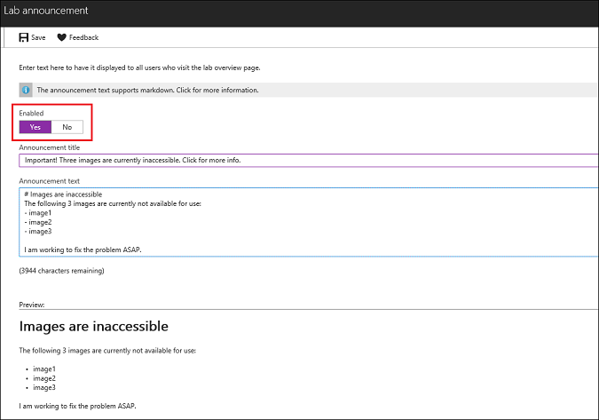

# Post announcements to a lab in Azure DevTest Labs

As a lab administrator, you can post announcements for an existing lab to notify users about recent changes or additions to the lab. For example, you might want to notify users about:

- Images that are currently unusable
- Updates to lab policies
- New VM sizes that are available

Once posted, an announcement is displayed on the lab's Overview page and the user can select it for more details.

The announcement feature is meant to be used for temporary notifications.  You can easily disable an announcement after it is no longer applicable.

## Steps to post an announcement in an existing lab

1. Sign in to the [Azure portal](http://go.microsoft.com/fwlink/p/?LinkID=525040).
1. If necessary, select **All Services**, and then select **DevTest Labs** from the list. (Your lab might already be shown on the Dashboard under **All Resources**).
1. From the list of labs, select the lab in which you want to post an announcement.  
1. On the lab's **Overview** area, select **Configuration and policies**.  

    

1. On the left under **SETTINGS**, select **Lab announcement**.

    

1. To create a message for the users in this lab, set **Enabled** to **Yes**.

1. Enter an **Announcement title** and the **Announcement text**.

   The title can be up to 100 characters and is shown to the user on the lab's main page. If the user selects the title, the announcement text is displayed.

   The announcement text accepts markdown. As you enter the announcement text, you can preview the message below.

    

1. Select **Save** once your announcement is ready to post.

When you no longer need to show this announcement to lab users, return to the **Lab announcement** page and set **Enabled** to **No**.

## Steps for users to view an announcement

1. From the [Azure portal](http://go.microsoft.com/fwlink/p/?LinkID=525040), select a lab.

1. If the lab has an announcement posted for it, an information notice is shown at the top of the lab's Overview page. This information notice is the announcement title that was specified when the announcement was created.

    

1. The user can select the message to view the entire announcement.

    

[!INCLUDE [devtest-lab-try-it-out](../../includes/devtest-lab-try-it-out.md)]

## Next steps
* You can apply restrictions and conventions across your subscription by using customized policies. If you were to change or set a lab policy, you might want to post an announcement to inform users. For more information, see [Set policies and schedules](devtest-lab-set-lab-policy.md).
* Explore the [DevTest Labs Azure Resource Manager QuickStart template gallery](https://github.com/Azure/azure-devtestlab/tree/master/Samples).
