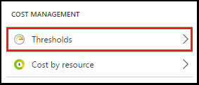
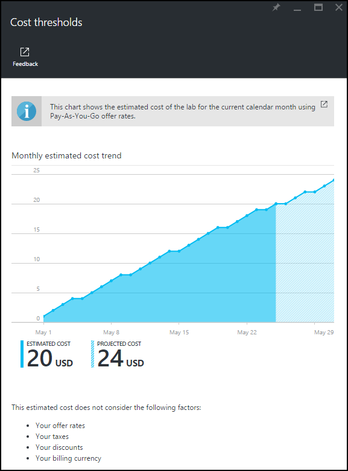

<properties
	pageTitle="Monthly estimated cost trend | Microsoft Azure"
	description="Learn about the DevTest Labs monthly estimated cost trend chart."
	services="devtest-lab,virtual-machines"
	documentationCenter="na"
	authors="tomarcher"
	manager="douge"
	editor=""/>

<tags
	ms.service="devtest-lab"
	ms.workload="na"
	ms.tgt_pltfrm="na"
	ms.devlang="na"
	ms.topic="article"
	ms.date="08/02/2016"
	ms.author="tarcher"/>

# Monthly estimated cost trend

## Overview

The Cost Management feature of DevTest Labs helps you track the cost of your lab. 
This article illustrates how to use the **Monthly Estimated Cost Trend** chart 
to view the current calendar month's estimated cost-to-date as well as the projected end-of-month cost for the current calendar month.

## Viewing the Monthly Estimated Cost Trend chart

In order to view the Monthly Estimated Cost Trend chart, follow these steps: 

1. Sign in to the [Azure portal](http://go.microsoft.com/fwlink/p/?LinkID=525040).

1. Select **Browse**, and then select **DevTest Labs** from the list.

1. From the list of labs, select the desired lab.   

1. Select **Settings**.

	

1. On the lab's **Settings** blade, under **Cost Management**, select **Thresholds**.

	
 
1. The following screen shot shows an example of a cost chart. 

    

The **Estimated cost** value is the current calendar month's estimated cost-to-date while the **Projected cost** is the estimated cost for the entire current calendar month,
calculated using the the lab cost for the previous 5 days.
 
Note that the cost amounts are rounded up to the next whole number. For example: 

- 5.01 rounds up to 6 
- 5.50 rounds up to 6
- 5.99 rounds up to 6

As it states above the chart, the costs you see in the chart are *estimated* costs using [Pay-As-You-Go](https://azure.microsoft.com/offers/ms-azr-0003p/) offer rates.
Additionally, the following are *not* included in the cost calculation:

- CSP and Dreamspark subscriptions are currently not supported as DevTest Labs uses the [Azure billing APIs](../billing-usage-rate-card-overview.md) 
to calculate the lab cost, and the Azure billing APIs do not support CSP or Dreamspark subscriptions.
- Your offer rates. Currently, we are not able to use your offer rates (shown under your subscription) that you have negotiated with Microsoft or Microsoft partners. We are using Pay-As-You-Go rates.
- Your taxes
- Your discounts
- Your billing currency. Currently, the lab cost is displayed only in USD currency.

## Related blog posts

- [Two more things to keep your cost on track in DevTest Labs](https://blogs.msdn.microsoft.com/devtestlab/2016/06/21/keep-your-cost-on-track/)
- [Why Cost Thresholds?](https://blogs.msdn.microsoft.com/devtestlab/2016/04/11/why-cost-thresholds/)

## Next steps

Here are some things to try next:

- [Define lab policies](./devtest-lab-set-lab-policy.md) - Learn how to set the various policies used to govern how your lab and its VMs are used. 
- [Create custom image](./devtest-lab-create-template.md) - When you create a VM, you specify a base, which can be either a custom image or a Marketplace image. This article illustrates
how to create a custom image from a VHD file.
- [Configure Marketplace images](./devtest-lab-configure-marketplace-images.md) - DevTest Labs supports creating new VMs based on Azure Marketplace images. This article
illustrates how to specify which, if any, Azure Marketplace images can be used when creating new VMs in a lab.
- [Create a VM in a lab](./devtest-lab-add-vm-with-artifacts.md) - Illustrates how to create a new VM from a base image (either custom or Marketplace), and how to work with
artifacts in your VM.