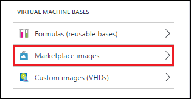
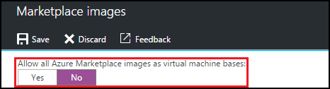
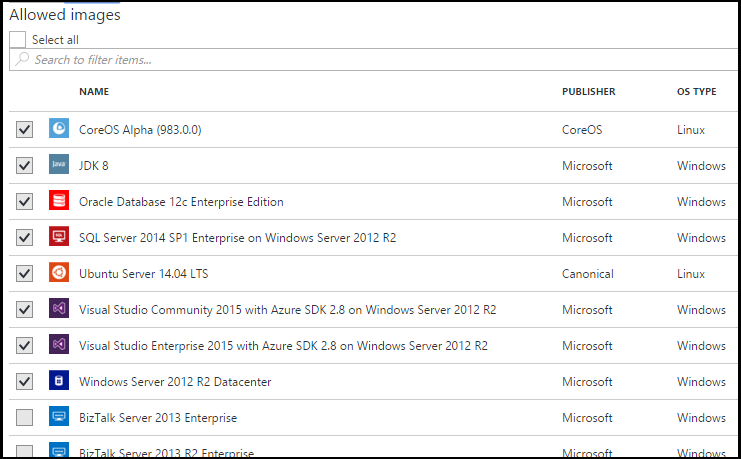

<properties
	pageTitle="Configure Marketplace image settings in a DevTest Lab | Microsoft Azure"
	description="Configure which Marketplace images can be used when creating a VM in a DevTest Lab"
	services="devtest-lab,virtual-machines"
	documentationCenter="na"
	authors="tomarcher"
	manager="douge"
	editor=""/>

<tags
	ms.service="devtest-lab"
	ms.workload="na"
	ms.tgt_pltfrm="na"
	ms.devlang="na"
	ms.topic="article"
	ms.date="03/14/2016"
	ms.author="tarcher"/>

# Configure Marketplace image settings in a DevTest Lab

## Overview

DevTest Labs supports creating new VMs based on Azure Marketplace images depending
on how you have configured Azure Marketplace images to be used in your lab. This article
will show you how to specify which, if any, Azure Marketplace images can be used when
creating new VMs in a DevTest Lab.

## Allow or disallow Azure Marketplace images

1. Sign in to the [Azure portal](https://portal.azure.com).

1. Tap **Browse**, and then tap **DevTest Labs** from the list.

1. From the list of labs, tap the desired lab. 

1. The selected lab's **Settings** blade will be displayed. 

1. On the **Settings** blade, tap **Marketplace images**

	

1. Specify whether you want all Azure Marketplace images to be available for use as a base of a new VM. If you select **Yes**, 
then all Marketplace images are allowed in the lab. If you want no images to be allowed, or you want to specify which images
can be used, select **No**.
 
	
 
1. If you select **No** to the previous step, the **Allowed images/Select all** checkbox will be enabled. Checking this option
allows all listed Marketplace images to be available for use as base images for new VMs. Leave this option unchecked if you 
want to specify which Marketplace images can be used (by checking each one). 
Select the Marketplace images you want to allow for VM creation by checking each image's corresponding checkbox.
Select nothing from the list if you don't want to allow any Azure Marketplace images to be used in the lab.

	

## Next steps

Once you have configured how Marketplace images are allowed when creating a VM, the next step is to [add a VM to your DevTest Lab](./devtest-lab-add-vm-with-artifacts.md).