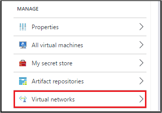
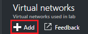
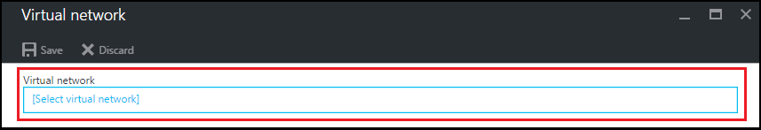
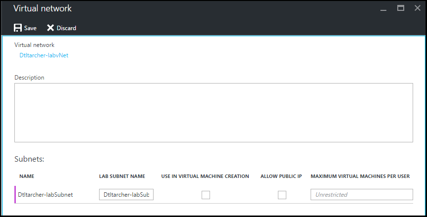

<properties
	pageTitle="Configure a virtual network for a lab  | Microsoft Azure"
	description="Learn how to configure an existing virtual network and subnet, and use them in a VM with DevTest Labs"
	services="devtest-lab,virtual-machines"
	documentationCenter="na"
	authors="tomarcher"
	manager="douge"
	editor=""/>

<tags
	ms.service="devtest-lab"
	ms.workload="na"
	ms.tgt_pltfrm="na"
	ms.devlang="na"
	ms.topic="article"
	ms.date="06/01/2016"
	ms.author="tarcher"/>

# Configure a virtual network for a lab

## Overview

As explained in the article, [Add a VM with artifacts to a lab](devtest-lab-add-vm-with-artifacts.md), when you create a VM in a lab, 
you can specify a configured virtual network (and subnet) for that VM. One scenario for doing this is if you want to be able to access your corpnet resources 
from your VMs using the virtual network that has been set up with ExpressRoute or site-to-site VPN. The following sections 
illustrate how to add your existing virtual network into the lab's Virtual Network settings so that it will be available 
to choose when creating your VMs.

## Configure a virtual network for a lab using the Azure portal
The following steps walk you through adding an existing virtual network (and subnet) to a lab so that it can be used when creating a VM in the same lab. 

1. Sign in to the [Azure portal](http://go.microsoft.com/fwlink/p/?LinkID=525040).

1. Select **Browse**, and then select **DevTest Labs** from the list.

1. From the list of labs, select the desired lab. 

1. The selected lab's **Settings** blade will be displayed. 

1. Select **Virtual networks**.

	
	
1. On the **Virtual networks** blade, you'll see a list of virtual networks you've configured for the current lab as well
as the default virtual network that is created for your lab. 

1. Select **+ Add**.

	
	
1. On the **Virtual network** blade, select **[Select virtual network]**.

	
	
1. On the **Choose virtual network** blade, select the desired virtual network. The blade shows all the virtual networks that 
are under the same region in the subscription as the lab.  

1. Once you select a virtual network and return to the **Virtual network** blade, you'll see that several fields have been
enabled.  

	

1. Specify a description for your virtual network / lab combination.

1. To allow a subnet to be used in lab VM creation, check the **USE IN VM CREATION** option.

1. To allow public IP addresses in a subnet, check the **ALLOW PUBLIC IP** option.

1. In the **MAX VMS PER USER** field, specify the maximum VMs per user for each subnet. If you want an unrestricted number of VMs, leave this field blank.

1. Select **Save**.

1. Now that the virtual network is configured, it can be selected when creating a new VM. 
This is explained in the article, [Add a VM with artifacts to a lab](devtest-lab-add-vm-with-artifacts.md). 

## Next steps

Once you have added the desired virtual network(s) to your lab, the next step is to [add a VM to your lab](devtest-lab-add-vm-with-artifacts.md).