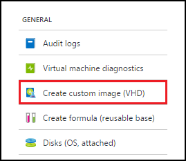
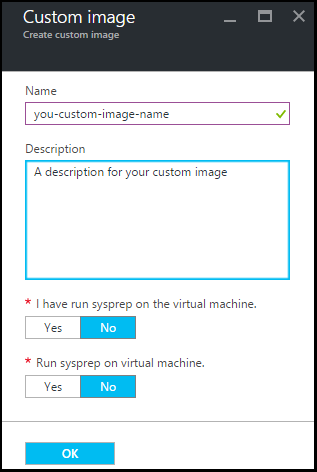

# Create a custom image from a VM

[!INCLUDE [devtest-lab-custom-image-definition](../../includes/devtest-lab-custom-image-definition.md)]

## Step-by-step instructions

You can create a custom image from a provisioned VM, and afterwards use that custom image to create identical VMs. The following steps illustrate how to create a custom image from a VM:

1. Sign in to the [Azure portal](http://go.microsoft.com/fwlink/p/?LinkID=525040).

1. Select **More services**, and then select **DevTest Labs** from the list.

1. From the list of labs, select the desired lab.  

1. On the lab's blade, select **My virtual machines**.
 
1. On the **My virtual machines** blade, select the VM from which you want to create the custom image.

1. On the VM's blade, select **Create custom image (VHD)**.

	

1. On the **Create image** blade, enter a name and description for your custom image. This information is displayed in the list of bases when you create a VM.

	

1. Select whether sysprep was run on the VM. If the sysprep was not run on the VM, specify whether you want sysprep run when a VM is created from this custom image.

1. Select **OK** when finished to create the custom image.

[!INCLUDE [devtest-lab-try-it-out](../../includes/devtest-lab-try-it-out.md)]

## Related blog posts

- [Custom images or formulas?](https://blogs.msdn.microsoft.com/devtestlab/2016/04/06/custom-images-or-formulas/)
- [Copying Custom Images between Azure DevTest Labs](http://www.visualstudiogeeks.com/blog/DevOps/How-To-Move-CustomImages-VHD-Between-AzureDevTestLabs#copying-custom-images-between-azure-devtest-labs)

##Next steps

- [Add a VM to your lab](./devtest-lab-add-vm-with-artifacts.md)
