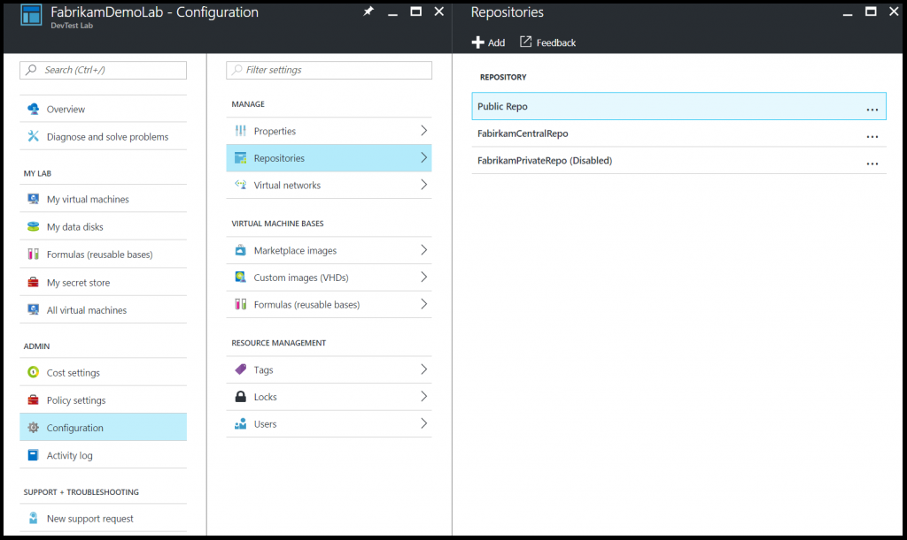
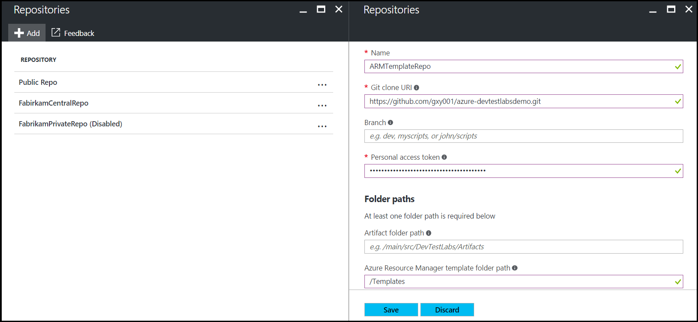
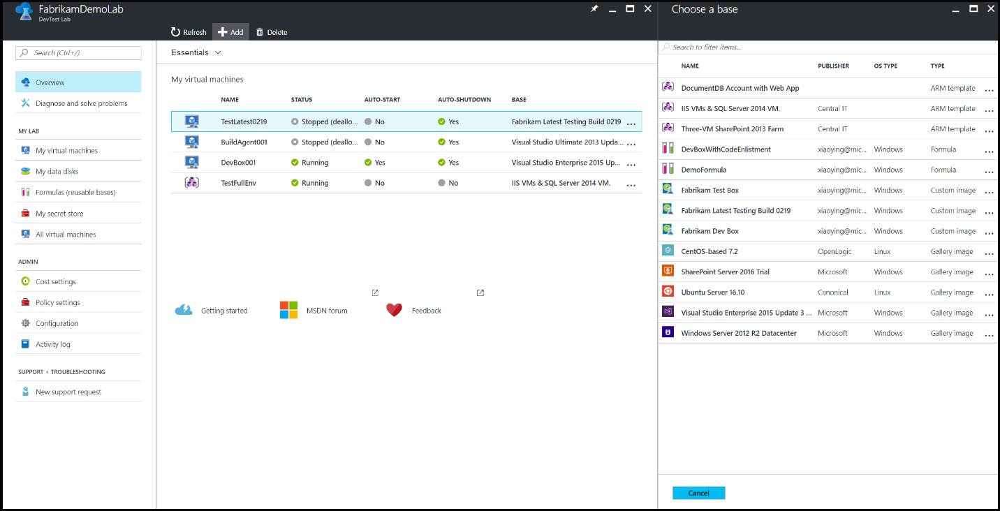
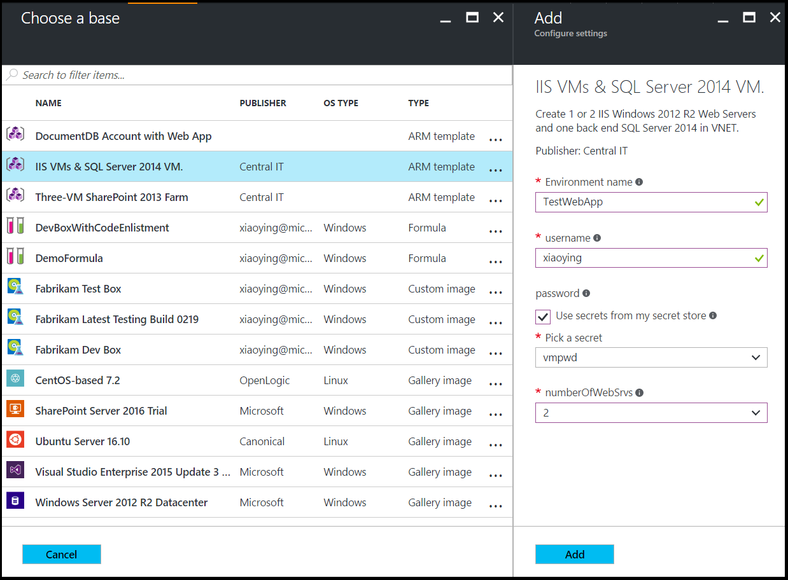
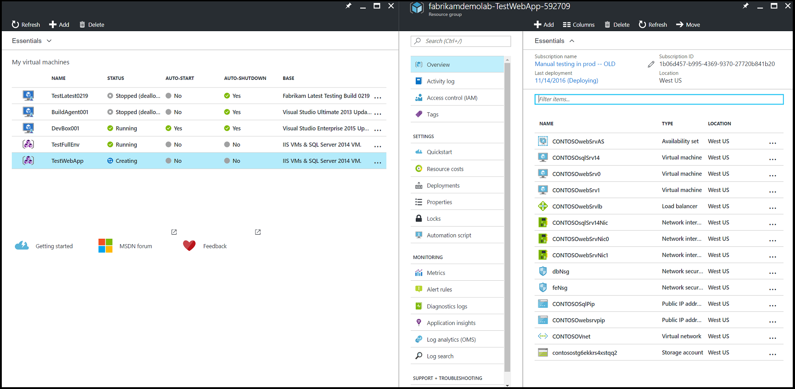

# Create multi-VM environments and PaaS resources with Azure Resource Manager templates

The [Azure portal](http://go.microsoft.com/fwlink/p/?LinkID=525040) enables you to easily [create and add a VM to a lab](https://docs.microsoft.com/en-us/azure/devtest-lab/devtest-lab-add-vm). This works well for creating one VM at a time. However, if the environment contains multiple VMs, each VM has to be individually created. For scenarios such as a multi-tier Web app or a SharePoint farm, a mechanism is needed to allow for the creation of multiple VMs in a single step. By using Azure Resource Manager templates, you can now define the infrastructure and configuration of your Azure solution and repeatedly deploy multiple VMs in a consistent state. This feature provides the following benefits:

- Azure Resource Manager templates are loaded directly from your source control repository (GitHub or Team Services Git).
- Once configured, your users can create an environment by picking an Azure Resource Manager template from the Azure portal as what they can do with other types of [VM bases](./devtest-lab-comparing-vm-base-image-types.md).
- Azure PaaS resources can be provisioned in an environment from an Azure Resource Manager template in addition to IaaS VMs.
- The cost of environments can be tracked in the lab in addition to individual VMs created by other types of bases.
- PaaS resources are created and will appear in cost tracking; however, VM auto shutdown does not apply to PaaS resources.
- Users have the same VM policy control for environments as they have for single-lab VMs.

Learn more about the many [benefits of using Resource Manager templates](https://docs.microsoft.com/azure/azure-resource-manager/resource-group-overview#the-benefits-of-using-resource-manager) to deploy, update, or delete all of your lab resources in a single operation.

> [!NOTE]
> When you use a Resource Manager template as a basis to create more lab VMs, there are some differences to keep in mind whether you are creating Multi-VMs or single-VMs. Use a virtual machine's Azure Resource Manager template explains these differences in greater detail.
>
>

## Configure Azure Resource Manager template repositories

As one of the best practices with infrastructure-as-code and configuration-as-code, environment templates should be managed in source control. Azure DevTest Labs follows this practice and loads all Azure Resource Manager templates directly from your GitHub or VSTS Git repositories. As a result, Resource Manager templates can be used across the entire release cycle, from the test environment to the production environment.

There are a couple of rules to follow to organize your Azure Resource Manager templates in a repository:

- The master template file must be named `azuredeploy.json`. 

	

- If you want to use parameter values defined in a parameter file, the parameter file must be named `azuredeploy.parameters.json`.
- You can use the parameters `_artifactsLocation` and `_artifactsLocationSasToken` to construct the parametersLink URI value, allowing DevTest Labs to automatically manage nested templates. See [How Azure DevTest Labs makes nested Resource Manager template deployments easier for testing environments](https://blogs.msdn.microsoft.com/devtestlab/2017/05/23/how-azure-devtest-labs-makes-nested-arm-template-deployments-easier-for-testing-environments/) for more information.
- Metadata can be defined to specify the template display name and description. This metadata must be in a file named `metadata.json`. The following example metadata file illustrates how to specify the display name and description: 

```json
{
 
"itemDisplayName": "<your template name>",
 
"description": "<description of the template>"
 
}
```

The following steps guide you through adding a repository to your lab using the Azure portal. 

1. Sign in to the [Azure portal](http://go.microsoft.com/fwlink/p/?LinkID=525040).
1. Select **More Services**, and then select **DevTest Labs** from the list.
1. From the list of labs, select the desired lab.   
1. On the lab's blade, select **Configuration and Policies**.

	

1. From the **Configuration and Policies** settings list, select **Repositories**. The **Repositories** blade lists the repositories that have been added to the lab. A repository named `Public Repo` is automatically generated for all labs, and connects to the [DevTest Labs GitHub repo](https://github.com/Azure/azure-devtestlab) that contains several VM artifacts for your use.

	

1. Select **Add+** to add your Azure Resource Manager template repository.
1. When the second **Repositories** blade opens, enter the necessary information as follows:
	- **Name** - Enter the repository name that is used in the lab.
	- **Git clone URL** - Enter the GIT HTTPS clone URL from GitHub or Visual Studio Team Services.  
	- **Branch** - Enter the branch name to access your Azure Resource Manager template definitions. 
	- **Personal access token** - The personal access token is used to securely access your repository. To get your token from Visual Studio Team Services, select **&lt;YourName> > My profile > Security > Public access token**. To get your token from GitHub, select your avatar followed by selecting **Settings > Public access token**. 
	- **Folder paths** - Using one of the two input fields, enter the folder path that starts with a forward slash - / - and is relative to your Git clone URI to either your artifact definitions (first input field) or your Azure Resource Manager template definitions.   
	
		

1. Once all the required fields are entered and pass the validation, select **Save**.

The next section will walk you through creating environments from an Azure Resource Manager template.

## Create an environment from an Azure Resource Manager template

Once an Azure Resource Manager template repository has been configured in the lab, your lab users can create an environment using Azure portal with the following steps:

1. Sign in to the [Azure portal](http://go.microsoft.com/fwlink/p/?LinkID=525040).
1. Select **More Services**, and then select **DevTest Labs** from the list.
1. From the list of labs, select the desired lab.   
1. On the lab's blade, select **Add+**.
1. The **Choose a base** blade displays the base images you can use with the Azure Resource Manager templates listed first. Select the desired Azure Resource Manager template.

	
  
1. On the **Add** blade, enter the **Environment name** value. The environment name is what is displayed to your users in the lab. The remaining input fields are defined in the Azure Resource Manager template. If default values are defined in the template or the `azuredeploy.parameter.json` file is present, default values are displayed in those input fields. For parameters of type *secure string*, you can use the secrets stored in the lab’s [personal secret store](https://azure.microsoft.com/en-us/updates/azure-devtest-labs-keep-your-secrets-safe-and-easy-to-use-with-the-new-personal-secret-store).

	

	> [!NOTE]
	> There are several parameter values that - even if specified - are displayed as empty values. Therefore, if users assign those values to parameters in an Azure Resource Manager template, DevTest Labs does not display the values; instead showing blank input fields where the lab users need to enter a value when creating the environment.
	> 
	> - GEN-UNIQUE
	> - GEN-UNIQUE-[N]
	> - GEN-SSH-PUB-KEY
	> - GEN-PASSWORD 
 
1. Select **Add** to create the environment. The environment starts provisioning immediately with the status displaying in the **My virtual machines** list. A new resource group is automatically created by the lab to provision all the resources defined in the Azure Resource Manager template.
1. Once the environment is created, select the environment in the **My virtual machines** list to open the resource group blade and browse all of the resources provisioned in the environment.
	
	
   
   You can also expand the environment to view just the list of VMs that are provisioned in the environment.
	
	

1. Click any of the environments to view the available actions - such as applying artifacts, attaching data disks, changing auto-shutdown time, and more.

	

## Next steps
* Once a VM has been created, you can connect to the VM by selecting **Connect** on the VM's blade.
* View and manage resources in an environment by selecting the environment in the **My virtual machines** list in your lab. 
* Explore the [Azure Resource Manager templates from Azure Quickstart template gallery](https://github.com/Azure/azure-quickstart-templates)
