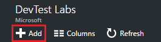
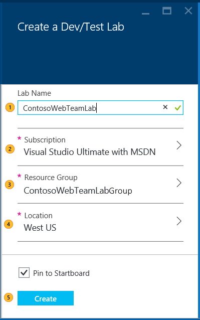

<properties
	pageTitle="Create a lab in DevTest Labs | Microsoft Azure"
	description="Create a new lab in DevTest Labs for virtual machines"
	services="devtest-lab,virtual-machines"
	documentationCenter="na"
	authors="tomarcher"
	manager="douge"
	editor=""/>

<tags
	ms.service="devtest-lab"
	ms.workload="na"
	ms.tgt_pltfrm="na"
	ms.devlang="na"
	ms.topic="get-started-article"
	ms.date="06/01/2016"
	ms.author="tarcher"/>

# Create a lab in Azure DevTest Labs

## Prerequisites

To create a lab, you will need:

- An Azure subscription. To learn about Azure purchase options, see [How to buy Azure](https://azure.microsoft.com/pricing/purchase-options/) or [Free one-month trial](https://azure.microsoft.com/pricing/free-trial/). You must be the owner of the subscription to create the lab.
- An Azure Resource Group for the lab. See [Azure Resource Manager Overview](../resource-group-overview.md) and [Azure Role-based Access Control](../active-directory/role-based-access-control-configure.md).

## Create a lab

1. Sign in to the [Azure portal](http://go.microsoft.com/fwlink/p/?LinkID=525040).

1. Select **Browse**.

1. Select **DevTest Labs** from the list.

1. On the **DevTest Labs** blade, select **Add**.

    

1. On the **Create a DevTest Lab** blade:

    1. Enter a **Lab Name** for the new lab.
    1. Select the **Subscription** to associate with the lab.
    1. Select a **Location** in which to store the lab.
    1. Select **Create**.

    

## Next steps

Once you've created your lab, here are some next steps to consider:

- [Secure access to a lab](devtest-lab-add-devtest-user.md).

- [Set lab policies](devtest-lab-set-lab-policy.md).

- [Create a lab template](devtest-lab-create-template.md).

- [Create custom artifacts for your VMs](devtest-lab-artifact-author.md).

- [Add a VM with artifacts to a lab](devtest-lab-add-vm-with-artifacts.md).