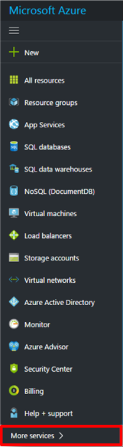

# Create a lab in Azure DevTest Labs
A lab in Azure DevTest Labs is the infrastructure that encompasses a group of resources, such as Virtual Machines (VMs), that lets you better manage those resources by specifying limits and quotas. This article walks you through the process of creating a lab using the Azure portal.

## Prerequisites
To create a lab, you need:

* An Azure subscription. To learn about Azure purchase options, see [How to buy Azure](https://azure.microsoft.com/pricing/purchase-options/) or [Free one-month trial](https://azure.microsoft.com/pricing/free-trial/). You must be the owner of the subscription to create the lab.

## Steps to create a lab in Azure DevTest Labs
The following steps illustrate how to use the Azure portal to create a lab in Azure DevTest Labs. 

1. Sign in to the [Azure portal](http://go.microsoft.com/fwlink/p/?LinkID=525040).
1. From the main menu on the left side, select **More Services** (at the bottom of the list).

	

1. From the list of available services, **DevTest Labs**.
1. On the **DevTest Labs** blade, select **Add**.
   
    

1. On the **Create a DevTest Lab** blade:
   
	1. Enter a **Lab Name** for the new lab.
	2. Select the **Subscription** to associate with the lab.
	3. Select a **Location** in which to store the lab.
	4. Select **Auto-shutdown** to specify if you want to enable - and define the parameters for - the automatic shutting down of all the lab's VMs. The auto-shutdown feature is mainly a cost-saving feature whereby you can specify when you want the VM to automatically be shut down. You can change auto-shutdown settings after creating the lab by following the steps outlined in the article, [Manage all policies for a lab in Azure DevTest Labs](./devtest-lab-set-lab-policy.md#set-auto-shutdown).
	5. Select **Pin to Dashboard** if you want a shortcut of the lab to appear on the portal dashboard.
	6. Select **Automation options** to get Azure Resource Manager templates for configuration automation. 
	7. Select **Create**. After selecting **Create**, the **DevTest Labs** blade displays. You can monitor the status of the lab creation process by watching the **Notifications** area. Once completed, refresh the page to see the newly created lab in the list of labs.  
    
    

[!INCLUDE [devtest-lab-try-it-out](../../includes/devtest-lab-try-it-out.md)]

## Next steps
Once you've created your lab, here are some next steps to consider:

* [Secure access to a lab](devtest-lab-add-devtest-user.md).
* [Set lab policies](devtest-lab-set-lab-policy.md).
* [Create a lab template](devtest-lab-create-template.md).
* [Create custom artifacts for your VMs](devtest-lab-artifact-author.md).
* [Add a VM with artifacts to a lab](devtest-lab-add-vm-with-artifacts.md).

