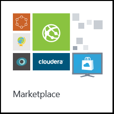
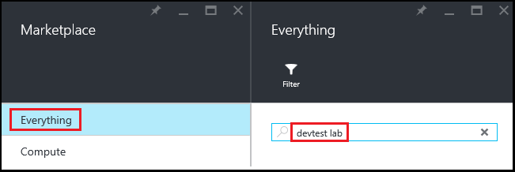
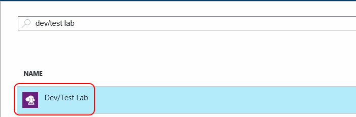

    <properties 
	pageTitle="Create a DevTest Lab | Microsoft Azure" 
	description="Create a new DevTest Lab lab for virtual machines" 
	services="devtest-lab,virtual-machines" 
	documentationCenter="na" 
	authors="tomarcher" 
	manager="douge" 
	editor=""/>
  
<tags 
	ms.service="devtest-lab" 
	ms.workload="na" 
	ms.tgt_pltfrm="na" 
	ms.devlang="na" 
	ms.topic="get-started-article" 
	ms.date="10/29/2015" 
	ms.author="tarcher"/>

# Create an Azure DevTest Lab

## Prerequisites

To create a DevTest Lab, you will need: 

- An Azure subscription. To learn about Azure purchase options, see [How to buy Azure](http://azure.microsoft.com/pricing/purchase-options/) or [Free one-month trial](https://azure.microsoft.com/pricing/free-trial/). You must be the owner of the subscription to create the lab.
- An Azure Resource Group for the lab. See [Azure Resource Manager Overview](resource-group-overview.md) and [Managing and Auditing Access to Resources](./azure-portal/resource-group-rbac.md).

## Create a lab

1. Sign in to the [Azure preview portal](http://portal.azure.com).

3. Tap the **Marketplace** tile.

       

2. On the **Marketplace** blade, tap **Everything**, enter **devtest labs** in the search box, and press the **Enter** key.

    

3. Tap the **DevTest Labs** item.

    

4. On the **DevTest Lab** blade, tap **Create**.

5. On the **Create a DevTest Lab** blade:

    1. Enter a **Lab Name** for the new lab.
    1. Select the **Subscription** to associate with the lab.
    1. Select a **Location** in which to store the lab.
    1. Tap **Create**.

    

## What happens

Azure creates the lab and opens the blade for the lab.

## Next steps

Once you've created your lab, here are some next steps to consider:

- [Secure access to a DevTest Lab](devtest-lab-secure-user-access.md).

- [Add a VM with artifacts to an Azure DevTest Lab](devtest-lab-add-vm-with-artifacts.md).

- [Author custom artifacts for your VM](devtest-lab-artifact-author.md).

- [Set lab policies](devtest-lab-set-lab-policy.md).

- [Create a lab template](devtest-lab-create-template.md).