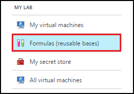
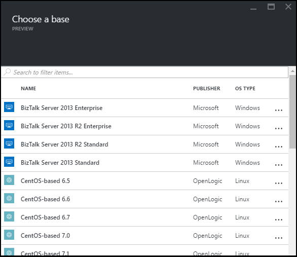
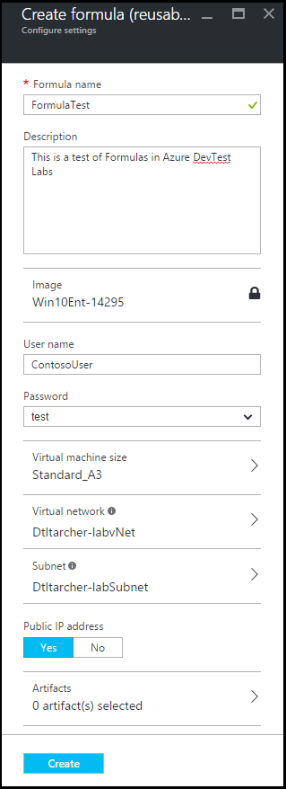
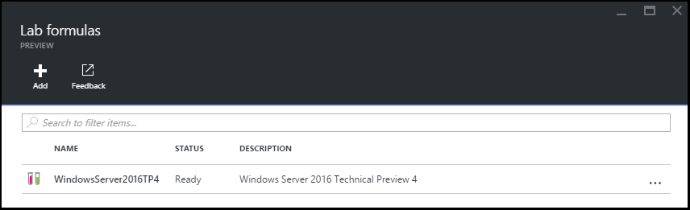
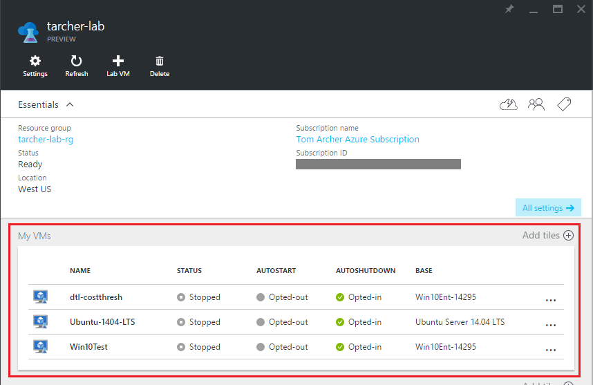
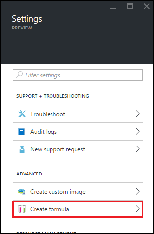
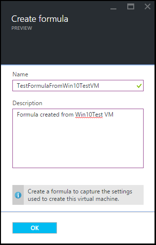
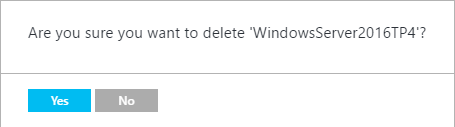

<properties
	pageTitle="Manage DevTest Labs formulas to create VMs | Microsoft Azure"
	description="Learn how to create, update, and remove DevTest Labs formulas, and use them to create new VMs."
	services="devtest-lab,virtual-machines"
	documentationCenter="na"
	authors="tomarcher"
	manager="douge"
	editor=""/>

<tags
	ms.service="devtest-lab"
	ms.workload="na"
	ms.tgt_pltfrm="na"
	ms.devlang="na"
	ms.topic="article"
	ms.date="06/01/2016"
	ms.author="tarcher"/>

# Manage DevTest Labs formulas to create VMs

## Overview

Formulas - like [custom images](./devtest-lab-create-template.md) and [Marketplace images](./devtest-lab-configure-marketplace-images.md) -
provide a mechanism for fast VM provisioning. A formula in DevTest Labs is a list of default property values used to create a lab VM. When creating a VM
from a formula, the default values can be used as-is, or modified. 

In this article, you'll learn how to perform the following tasks:

- [Create a new formula](#create-a-new-formula)
- [Use a formula to create a new VM](#use-a-formula-to-create-a-new-vm)
- [Modify a formula](#modify-a-formula)
- [Delete a formula](#delete-a-formula)

> [AZURE.NOTE] Formulas are similar to [custom images](./devtest-lab-create-template.md) in that 
each allows you to create a base image from a VHD that is used to provision a VM. To help decide which is right
for your particular environment, refer to the article,
[Comparing custom images and formulas in DevTest Labs](./devtest-lab-comparing-vm-base-image-types.md).

## Create a new formula
Anyone with DevTest Labs *Users* permissions is able to create VMs in a lab using a formula as a base. 
There are two ways to create formulas: 

- From scratch - Use when you want to define all the characteristics of the formula from scratch.
- From an existing lab VM - Use when you want to create a formula based on the settings of an existing VM.

### Create a new formula from scratch
The following steps guide you through the process of creating a new formula from scratch.

1. Sign in to the [Azure portal](http://go.microsoft.com/fwlink/p/?LinkID=525040).

1. Select **Browse**, and then select **DevTest Labs** from the list.

1. From the list of labs, select the desired lab.  

1. The selected lab's **Settings** blade will be displayed. 

1. On the lab **Settings** blade, select **Formulas**.

    

1. On the **Lab formulas** blade, select **+ Add**.

    

1. On the **Choose a base** blade, select the custom image or Marketplace image from which you want to create the formula.

    

1. On the **Create formula** blade, specify the following values:

	- **Formula name** - Enter a name for your formula. This value will be displayed in the list of base images when you create a VM. The name is validated as you type it, and if not valid, a message will indicate the requirements for a valid name.
	- **Description** - Enter a meaningful description for your formula. This value is available from the formula's context menu when you create a VM.
	- **Image** - This field displays name of the base image you selected on the previous blade. 
	- **VM Size** - Select to one of the predefined items that specify the processor cores, RAM size, and the hard drive size of the VM to create.
	- **Virtual network** - Select and select the desired virtual network.
	- **Subnet** - Select and and select the desired subnet.
	- **Public IP address** - If the lab policy is set to allow public IP addresses for the selected subnet, specify whether or not you want the IP address to be public by selecting either **Yes** or **No**. Otherwise, this option is disabled and selected as **No**.
	- **Artifacts** - Select and - from the list of artifacts - select and configure the artifacts that you want to add to the base image. Note that artifact parameters that are secure strings don’t display, since the formula doesn’t save any secure string values. 

    	

1. Select **Create** to create the formula. When the formula has been successfully created, it will be listed on the **Lab formulas** blade.

	

### Create a new formula from a lab VM
The following steps guide you through the process of creating a formula based on an existing VM. 

> [AZURE.NOTE] Only VMs created after March 30, 2016 support creating a new formula from a lab VM. 

1. Sign in to the [Azure portal](http://go.microsoft.com/fwlink/p/?LinkID=525040).

1. Select **Browse**, and then select **DevTest Labs** from the list.

1. From the list of labs, select the desired lab.  

1. On the lab blade, locate the section with the title **My VMs** and select the VM from which you wish to create the new formula.

	

1. On the VM's **Settings** blade, select **Create formula**.

	

1. On the **Create formula** blade, enter a **Name** and **Description** for your new formula, and select **OK**. When the formula has been successfully created, it will be listed on the **Lab formulas** blade.

	

## Modify a formula
To modify a formula, follow these steps:

1. Sign in to the [Azure portal](http://go.microsoft.com/fwlink/p/?LinkID=525040).

1. Select **Browse**, and then select **DevTest Labs** from the list.

1. From the list of labs, select the desired lab.  

1. On the lab **Settings** blade, select **Formulas**.

    

1. On the **Lab formulas** blade, select the formula you wish to modify.

1. On the **Update formula** blade, make the desired edits, and select **Update**.

## Delete a formula 
To delete a formula, follow these steps:

1. Sign in to the [Azure portal](http://go.microsoft.com/fwlink/p/?LinkID=525040).

1. Select **Browse**, and then select **DevTest Labs** from the list.

1. From the list of labs, select the desired lab.  

1. On the lab **Settings** blade, select **Formulas**.

    

1. On the **Lab formulas** blade, select the ellipsis to the right of the formula you wish to delete.

    

1. On the formula's context menu, select **Delete**.

    

1. Select **Yes** to the deletion confirmation dialog.

    

## Related blog posts

- [Custom images or formulas?](https://blogs.msdn.microsoft.com/devtestlab/2016/04/06/custom-images-or-formulas/)

## Next steps
Once you have created a formula for use when creating a VM, the next step is to [add a VM to your lab](./devtest-lab-add-vm-with-artifacts.md).