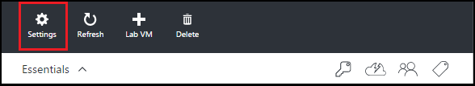
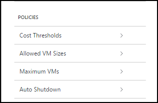
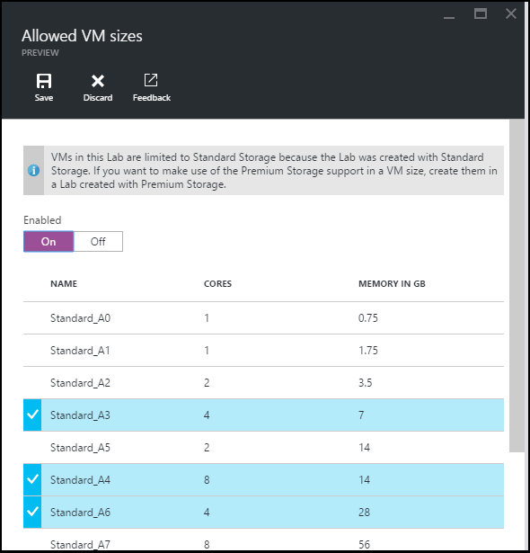
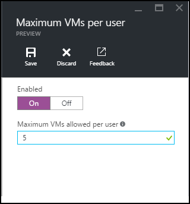
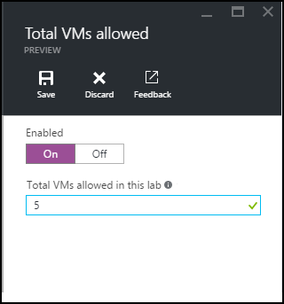
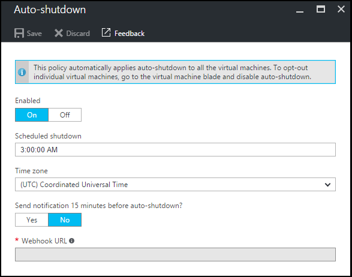
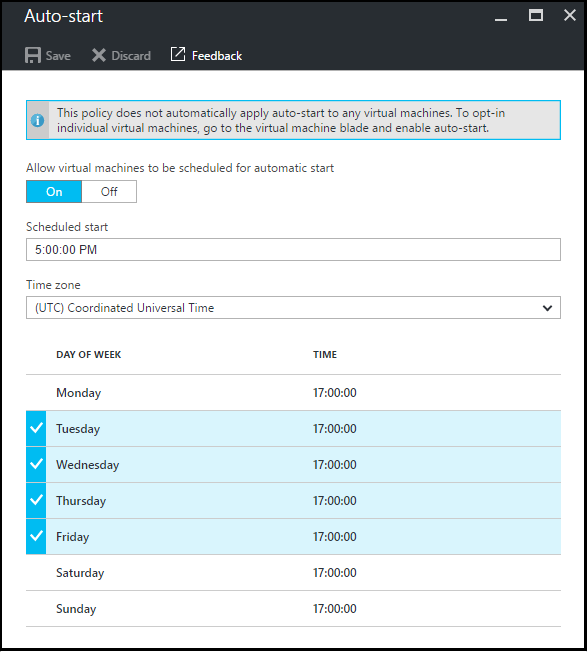

<properties
	pageTitle="Define lab policies | Microsoft Azure"
	description="Learn how to define lab policies such as VM sizes, maximum VMs per user, and shutdown automation."
	services="devtest-lab,virtual-machines"
	documentationCenter="na"
	authors="tomarcher"
	manager="douge"
	editor=""/>

<tags
	ms.service="devtest-lab"
	ms.workload="na"
	ms.tgt_pltfrm="na"
	ms.devlang="na"
	ms.topic="article"
	ms.date="08/01/2016"
	ms.author="tarcher"/>

# Define lab policies

> [AZURE.VIDEO how-to-set-vm-policies-in-a-devtest-lab]

## Overview

DevTest Labs allows you to specify key policies that govern how your lab and its VMs are used. 
For example, you can set the rules for the VM sizes allowed to create VMs, the threshold for the number of VMs that can be created, and schedule jobs to automatically start/stop the lab VMs. 

## Accessing a lab's policies

In order to view (and change) the policies for a lab, follow these steps:

1. Sign in to the [Azure portal](http://go.microsoft.com/fwlink/p/?LinkID=525040).

1. Select **Browse**, and then select **DevTest Labs** from the list.

1. From the list of labs, select the desired lab.   

1. Select **Settings**.

	

1. On the **Settings** blade, there is a grouping of settings called **VM Policies**. 

	

	Select the desired policy from the list below to learn more about setting it:

	- [Allowed VM Sizes](#set-allowed-vm-sizes) - Select the list of VM sizes allowed in the lab. A user can create VMs only from this list.

	- [Maximum VMs per user](#set-maximum-vms-per-user) - Specify the maximum number of VMs that can be created by a user. 

	- [Total VMs allowed](#set-total-vms-allowed) - Specify the maximum number of VMs that can be created for a lab. 

	- [Auto shutdown](#set-auto-shutdown) - Specify the time when the current lab's VMs automatically shut down.

	- [Auto start](#set-auto-start) - Specify the time when the current lab's VMs automatically start up.

## Set allowed VM sizes

The policy for setting the allowed VM sizes helps to minimize lab waste by enabling you to specify which VM sizes are allowed in the lab. If this policy is activated, only VM sizes from this list can be used to create VMs.

1. On the lab's **Settings** blade, under **VM Policies**, select **Allowed VM Sizes**.

	
 
1. Select **On** to enable this policy, and **Off** to disable it.

1. If you enable this policy, select one or more VM sizes that can be created in your lab.

1. Select **Save**.

## Set maximum VMs per user

The policy for **Maximum VMs per user** allows you to specify the maximum number of VMs that can be created by an individual user. 
If a user attempts to create a new VM when the user limit has been met, an error message will indicate that the VM cannot be created. 

1. On the lab's **Settings** blade, under **VM Policies**, select **Maximum VMs per user**.

	

1. Select **On** to enable this policy, and **Off** to disable it.

1. If you enable this policy, in the **Maximum VMs allowed per User** text box, enter a numeric value indicating the maximum number of VMs that can be created by a user. 
If you enter a number that is not valid, the UI will display the maximum number allowed for this field.

1. Select **Save**.

## Set total VMs allowed

The policy for **Total VMs allowed** allows you to specify the maximum number of VMs that can be created for the current lab. 
If a user attempts to create a new VM when the lab limit has been met, an error message will indicate that the VM cannot be created. 

1. On the lab's **Settings** blade, under **VM Policies**, select **Total VMs allowed**.

	

1. Select **On** to enable this policy, and **Off** to disable it.

1. If you enable this policy, in the **Total VMs allowed in this lab** text box, enter a numeric value indicating the maximum number of VMs that can be created for the current lab. 
If you enter a number that is not valid, the UI will display the maximum number allowed for this field.

1. Select **Save**.

## Set auto shutdown

The auto-shutdown policy helps to minimize lab waste by allowing you to specify the time that this lab's VMs shut down.

1. On the lab's **Settings** blade, under **VM Policies**, select **Auto shutdown**.

	

1. Select **On** to enable this policy, and **Off** to disable it.

1. If you enable this policy, specify the local time to shut down all VMs in the current lab.

1. Select **Save**.

1. By default, once enabled, this policy applies to all VMs in the current lab. To remove this setting from a specific VM, open the VM's blade and change its **Auto Shutdown** setting 

## Set auto start

The auto-start policy allows you to specify when the VMs in the current lab should be started.  

1. On the lab's **Settings** blade, under **VM Policies**, select **Auto start**.

	

1. Select **On** to enable this policy, and **Off** to disable it.

1. If you enable this policy, specify the local scheculed start time and the days of the week for which the time applies. 

1. Select **Save**.

1. Once enabled, this policy is not automatically applied to any VMs in the current lab. To apply this setting to a specific VM, open the VM's blade and change its **Auto Start** setting 

## Next steps

Once you've defined and applied the various VM policy settings for your lab, here are some things to try next:

- [Configure cost management](./devtest-lab-configure-cost-management.md) - Illustrates how to use the **Monthly Estimated Cost Trend** chart  
to view the current month's estimated cost-to-date as well as the projected end-of-month cost.
- [Create custom image](./devtest-lab-create-template.md) - When you create a VM, you specify a base, which can be either a custom image or a Marketplace image. This article illustrates
how to create a custom image from a VHD file.
- [Configure Marketplace images](./devtest-lab-configure-marketplace-images.md) - DevTest Labs supports creating new VMs based on Azure Marketplace images. This article
illustrates how to specify which, if any, Azure Marketplace images can be used when creating new VMs in a lab.
- [Create a VM in a lab](./devtest-lab-add-vm-with-artifacts.md) - Illustrates how to create a new VM from a base image (either custom or Marketplace), and how to work with
artifacts in your VM.
