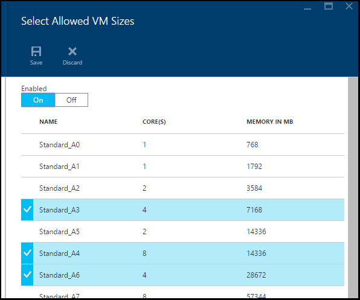
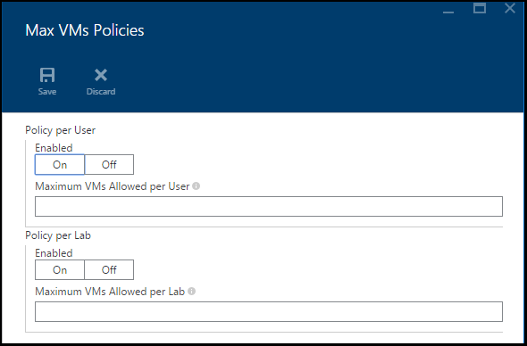
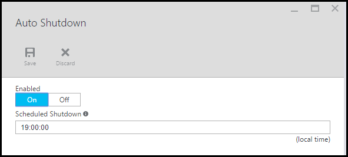

<properties
	pageTitle="Define lab policies | Microsoft Azure"
	description="Learn how to define lab policies such as VM sizes, maximum VMs per user, and shutdown automation."
	services="devtest-lab,virtual-machines"
	documentationCenter="na"
	authors="tomarcher"
	manager="douge"
	editor=""/>

<tags
	ms.service="devtest-lab"
	ms.workload="na"
	ms.tgt_pltfrm="na"
	ms.devlang="na"
	ms.topic="article"
	ms.date="02/18/2016"
	ms.author="tarcher"/>

# Define lab policies

> [AZURE.NOTE] Click the following link to view this article's accompanying video: [How to author custom artifacts](/documentation/videos/how-to-set-vm-policies-in-a-devtest-lab) 

## Overview

DevTest Lab allows you to specify key policies that govern how your lab and its VMs are used. These policies include cost thresholds, allowed VM sizes, maximum number of VMs per user, and an auto-shutdown for the VMs in your lab.

## Accessing a lab's policies

In order to view (and change) the policies for a lab, follow these steps:

1. Sign in to the [Azure preview portal](https://portal.azure.com).

1. Tap **Browse**, and then tap **DevTest Labs** from the list.

1. From the list of labs, tap the desired lab.   

1. Tap **Settings**.

	

1. On the **Settings** blade, there is a grouping of settings called **Policies**. 

	

	Tap the desired policy from the list below to learn more about setting it:

	- Cost Thresholds - This policy is not currently supported.

	- [Allowed VM Sizes](#set-allowed-vm-sizes) - Select the list of VM sizes allowed in the lab. A user can create VMs only from this list.

	- [Maximum VMs](#set-maximum-vms) - Specify the maximum number of VMs that can be created for a lab, as well as the maximum number of VMs that can be created by a user. 

	- [Auto shutdown](#set-auto-shutdown) - Specify the time that the current lab's VMs must shut down.

## Set allowed VM sizes

The policy for setting the allowed VM sizes helps to minimize lab waste by enabling you to specify which VM sizes are allowed in the lab. If this policy is activated, only VM sizes from this list can be used to create VMs.

1. On the lab's **Settings** blade, under **Policies**, tap **Allowed VM Sizes**.

	
 
1. Tap **On** to enable this policy, and **Off** to disable it.

1. If you enabled this policy, tap one or more VM sizes that can be created in your lab.

1. Tap **Save**.

## Set maximum VMs

The policy for maximum VMs allows you to specify the maximum number of VMs that can be created for the current lab, as well as the maximum number of VMs that can be created by a user. If a user attempts to create a new VM when either the user limit or lab limit has been met, an error message will indicate that the VM cannot be created. 

1. On the lab's **Settings** blade, under **Policies**, tap **Maximum VMs**.

	

1. In the **Policy per User** section:
 
	1. Tap **On** to enable this policy, and **Off** to disable it.
	
	1. If you enabled this policy, in the **Maximum VMs allowed per User** text box, enter a numeric value indicating the maximum number of VMs that can be created by a user. If you enter a number that is not valid, the UI will display the maximum number allowed for this field.

1. In the **Policy per Lab** section:
 
	1. Tap **On** to enable this policy, and **Off** to disable it.
	
	1. If you enabled this policy, in the **Maximum VMs allowed in this lab** text box, enter a numeric value indicating the maximum number of VMs that can be created for the current lab. If you enter a number that is not valid, the UI will display the maximum number allowed for this field.

1. Tap **Save**.

## Set auto shutdown

The auto-shutdown policy helps to minimize lab waste by allowing you to specify the time that this lab's VMs shut down.

1. On the lab's **Settings** blade, under **Policies**, tap **Auto Shutdown**.

	

1. Tap **On** to enable this policy, and **Off** to disable it.

1. If you enabled this policy, specify a time to shut down all VMs in the current lab.

1. Tap **Save**.
