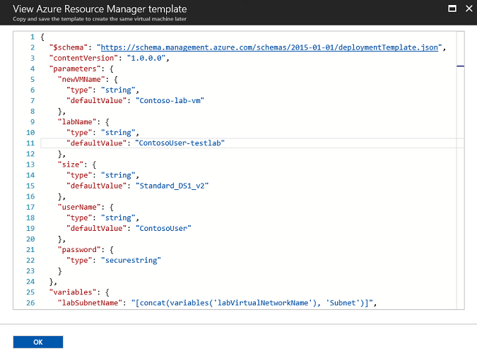

# Use a virtual machine's Azure Resource Manager template

When you are creating a virtual machine (VM) in DevTest Labs through the [Azure portal](http://go.microsoft.com/fwlink/p/?LinkID=525040), you have the option to view the Azure Resource Manager template before you save the VM. The template can then be used as a basis to create more lab VMs with the same settings.

This article describes how to view the resource manager template when creating a VM, and how to deploy it later to automate creation of the same VM.

## Multi-VM vs. single-VM resource manager templates
There are two ways to create VMs in DevTest Labs using a resource manager template: provision the Microsoft.DevTestLab/labs/virtualmachines resource or provision the Microsoft.Commpute/virtualmachines resource. Each is used in different scenarios and require different permissions.

- Resource manager templates that use a Microsoft.DevTestLab/labs/virtualmachines resource type (as declared in the “resource” property in the template) can provision individual lab VMs so that each VM shows up as a single item in the DevTest Labs virtual machines list:

   

   This type of resource manager template can be provisioned through the Azure PowerShell command **New-AzureRmResourceGroupDeployment** or through the Azure CLI command **az group deployment create**. It requires administrator permissions, so users who are assigned with a DevTest Labs user role can’t perform the deployment. 

- Resource manager templates that use a Microsoft.Compute/virtualmachines resource type can provision multiple VMs as a single environment in the DevTest Labs virtual machines list:

   

   VMs in the same environment can be managed together and share the same lifecycle. Users who are assigned with a DevTest Labs user role can create environments using those templates as long as the administrator has set up the lab that way.

The remainder of this article discusses resource manager templates that use Mirosoft.DevTestLab/labs/virtualmachines, often used by lab admins to automate lab VM creation (for example, claimable VMs) or golden image generation (for example, image factory).

## View and save a virtual machine's resource manager template
1. Follow the steps at [Create your first VM in a lab](devtest-lab-create-first-vm.md) to begin creating a virtual machine.
1. Enter the required information for your virtual machine and add any artifacts you want for this VM.
1. At the bottom of the Configure settings window, choose **View ARM template**.

   
1. Copy and save the resource manager template to use later to create another virtual machine.

   

After you have saved the resource manager template, you can edit it to customize it for your needs before deploying it.

## Deploy a resource manager template to create a VM
After you have saved a resource manager template and customized it for your needs, you can use it to automate VM creation. [Deploy resources with Resource Manager templates and Azure PowerShell](https://docs.microsoft.com/azure/azure-resource-manager/resource-group-template-deploy) describes how to use Azure PowerShell with resource manager templates to deploy your resources to Azure. [Deploy resources with Resource Manager templates and Azure CLI](https://docs.microsoft.com/azure/azure-resource-manager/resource-group-template-deploy-cli) describes how to use Azure CLI with resource manager templates to deploy your resources to Azure.

> [!NOTE]
> Only a user with lab owner permissions can create VMs from a resource manager template by using Azure PowerShell. If you want to automate VM creation using a resource manager template and you only have lab user permissions, you can use the [**az lab vm create** command in the CLI](https://docs.microsoft.com/cli/azure/lab/vm#create).

### Next steps
* Learn how to [Create multi-VM environments with resource manager templates](devtest-lab-create-environment-from-arm.md).
* Explore more quick-start resource manager templates for DevTest Labs automation from the [public DevTest Labs GitHub repo](https://github.com/Azure/azure-quickstart-templates).
