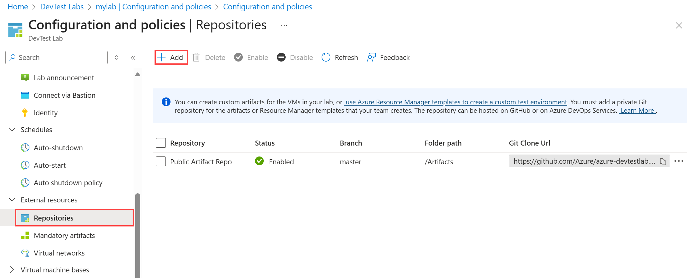

# Add an artifact repository to a lab

This article tells you how to add an *artifact* repository to your lab in Azure DevTest Labs. Artifacts are tools or applications to install on virtual machines (VMs). You define artifacts in a JSON file that you load from a GitHub or Azure Repos Git repository.

The public [DevTest Labs GitHub artifact repository](https://github.com/Azure/azure-devtestlab/tree/master/Artifacts) provides many common artifacts for Windows and Linux. The artifacts in this public repository are available by default in DevTest Labs. For information about adding artifacts to VMs, see [Add artifacts to DevTest Labs VMs](add-artifact-vm.md).

You can also create custom artifacts that aren't available in the public artifact repository.  To learn about creating custom artifacts, see [Create custom artifacts](devtest-lab-artifact-author.md). You can add your custom artifacts to your own artifact repository, and add the repository to your lab so all lab users can use the artifacts.

This article shows you how to add an artifact repository to your lab by using the Azure portal, an Azure Resource Management (ARM) template, or Azure PowerShell. You can also use an Azure PowerShell or Azure CLI script to automate adding an artifact repository to a lab.

[!INCLUDE [updated-for-az](../../includes/updated-for-az.md)]

## Prerequisites
To add an artifact repository to a lab, you need to know the Git HTTPS clone URL and the personal access token for the GitHub or Azure Repos repository that has the artifact files.

### Get the clone URL and personal access token for GitHub

1. On the home page of the GitHub repository that has your artifacts, select **Code**, and under **Clone**, copy the HTTPS URL.
1. Select your profile image in the upper-right corner of GitHub, and then select **Settings**.
1. On your profile page, in the left menu, select **Developer Settings**, and then select **Personal access tokens**.
1. Select **Generate new token**.
1. On the **New personal access token** page, under **Note**, enter an optional description for the token. Accept all the defaults, and then select **Generate token**.
1. Save the generated token.

### Get the clone URL and personal access token for Azure Repos

1. On the main page of the repository that has your artifacts, select **Clone**. On the **Clone Repository** page, copy the clone URL.
1. In the upper-right corner of the Azure DevOps page, select **User settings** > **Personal access tokens**.
1. On the **Personal Access Tokens** page, select **New Token**.
1. Fill out the information for the token, selecting **Read** for the scopes, and then select **Create**.
1. On the **Success** page, be sure to copy the token, because Azure Repos doesn't store the token or show it again.

## Add an artifact repository to a lab in the Azure portal

1. On the lab's **Overview** page, select **Configuration and policies** from the left navigation.

1. On the **Configuration and policies** page, select **Repositories** under **External resources** in the left navigation.

   On the **Repositories** page, the **Public Artifact Repo** is automatically present and connects to the [DevTest Labs public GitHub repository](https://github.com/Azure/azure-devtestlab). If this repo isn't enabled for your lab, you can enable it by selecting the checkbox next to **Public Artifact Repo**, and then selecting **Enable** on the top menu bar.

1. To add your artifact repository to the lab, select **Add** in the top menu bar.

   

1. In the **Repository** pane, enter the following information:

   - **Name**: A repository name to use in the lab.
   - **Git clone URL**: The Git HTTPS clone URL from GitHub or Azure Repos.
   - **Branch** (optional): The branch that has your artifact definitions.
   - **Personal access token**: The personal access token from GitHub or Azure Repos.
   - **Folder paths**: The folder for your ARM template definitions, relative to the Git clone URL. Be sure to include the initial forward slash in the folder path.

1. Select **Save**.

   

The repository now appears in the **Repositories** list for the lab.

## Add an artifact repository by using an ARM template

ARM templates are JSON files that describe Azure resources to create. For more information about ARM templates, see [Understand the structure and syntax of ARM templates](../azure-resource-manager/templates/syntax.md).

The following ARM template adds an artifact repository to a lab.  The template creates the lab if it doesn't already exist.

### Review the ARM template

The sample template gathers the following information in parameters. Some of the parameters have defaults, but the deployment command must specify the lab name, artifact repository URI, repository type, and repository personal access token.

- Lab name.
- Display name for the artifact repository in DevTest Labs. The default value is `Team Repository`.
- URI of the artifact repository, which you copied earlier.
- Repository branch that contains the artifacts. The default value is `main`.
- Name of the folder that contains the artifacts. The default value is: `/Artifacts`.
- Repository type. The allowed values are `VsoGit`, for Azure Repos, or `GitHub`.
- Personal access token for the repository, which you copied earlier.

```json
{

    "$schema": "https://schema.management.azure.com/schemas/2015-01-01/deploymentTemplate.json#",
    "contentVersion": "1.0.0.0",
    "parameters": {
        "labName": {
            "type": "string"
        },
        "artifactRepositoryDisplayName": {
            "type": "string",
            "defaultValue": "Team Repository"
        },
        "artifactRepoUri": {
            "type": "string"
        },
        "artifactRepoBranch": {
            "type": "string",
            "defaultValue": "main"
        },
        "artifactRepoFolder": {
            "type": "string",
            "defaultValue": "/Artifacts"
        },
        "artifactRepoType": {
            "type": "string",
            "allowedValues": ["VsoGit", "GitHub"]
        },
        "artifactRepoSecurityToken": {
            "type": "securestring"
        }
    },
    "variables": {
        "artifactRepositoryName": "[concat('Repo-', uniqueString(subscription().subscriptionId))]"
    },
    "resources": [{
            "apiVersion": "2016-05-15",
            "type": "Microsoft.DevTestLab/labs",
            "name": "[parameters('labName')]",
            "location": "[resourceGroup().location]",
            "resources": [
                {
                    "apiVersion": "2016-05-15",
                    "name": "[variables('artifactRepositoryName')]",
                    "type": "artifactSources",
                    "dependsOn": [
                        "[resourceId('Microsoft.DevTestLab/labs', parameters('labName'))]"
                    ],
                    "properties": {
                        "uri": "[parameters('artifactRepoUri')]",
                        "folderPath": "[parameters('artifactRepoFolder')]",
                        "branchRef": "[parameters('artifactRepoBranch')]",
                        "displayName": "[parameters('artifactRepositoryDisplayName')]",
                        "securityToken": "[parameters('artifactRepoSecurityToken')]",
                        "sourceType": "[parameters('artifactRepoType')]",
                        "status": "Enabled"
                    }
                }
            ]
        }
    ]
}
```

### Deploy the template

There are several ways to deploy ARM templates to create or update Azure resources. For information and instructions, see the following articles:

- [Deploy resources with ARM templates and Azure PowerShell](../azure-resource-manager/templates/deploy-powershell.md)
- [Deploy resources with ARM templates and Azure CLI](../azure-resource-manager/templates/deploy-cli.md)
- [Deploy resources with ARM templates in the Azure portal](../azure-resource-manager/templates/deploy-portal.md)
- [Deploy resources with ARM templates and Resource Manager REST API](../azure-resource-manager/templates/deploy-rest.md)

For this example, deploy the template by using Azure PowerShell.

> [!NOTE]
> The cmdlets that deploy the template are context-specific, so they use the current tenant and subscription. If you need to change the context, use [Set-AzContext](/powershell/module/az.accounts/set-azcontext) before you deploy the template

1. Create a resource group by using [New-AzResourceGroup](/powershell/module/az.resources/new-azresourcegroup). If the resource group you want to use already exists, skip this step.

   ```powershell
   New-AzResourceGroup -Name MyLabResourceGroup1 -Location westus
   ```

1. Create a deployment to the resource group by using [New-AzResourceGroupDeployment](/powershell/module/az.resources/new-azresourcegroupdeployment). You can make several resource deployments to the same resource group. If you're deploying several times to the same resource group, make sure each deployment name is unique.

   ```powershell
   New-AzResourceGroupDeployment `
       -Name MyLabResourceGroup-Deployment1 `
       -ResourceGroupName MyLabResourceGroup1 `
       -TemplateFile azuredeploy.json `
       -TemplateParameterFile azuredeploy.parameters.json
   ```
   
After `New-AzResourceGroupDeployment` runs successfully, the output shows important information like the provisioning state, which should be `succeeded`, and any outputs for the template.

## Add an artifact repository by using Azure PowerShell

The following sample PowerShell script, *New-DevTestLabArtifactRepository.ps1*, adds an artifact repository to a lab. The full script includes some verbose messages and comments.

```powershell

<#

.SYNOPSIS
This script creates a new custom repository and adds it to an existing DevTest Lab.

.PARAMETER LabName
The name of the lab.

.PARAMETER LabResourceGroupName
The name of the resource group that contains the lab.

.PARAMETER ArtifactRepositoryName
Name for the new artifact repository. The script creates a random name for the repository if not specified.

.PARAMETER ArtifactRepositoryDisplayName
Display name for the artifact repository.
This name appears in the list of artifact repositories for a lab.

.PARAMETER RepositoryUri
Uri to the artifact repository.

.PARAMETER RepositoryBranch
Branch that contains the artifact files. Defaults to 'main'.

.PARAMETER FolderPath
Folder that contains the artifact files. Defaults to '/Artifacts'

.PARAMETER PersonalAccessToken
Personal access token for the GitHub or Azure Repos repository.

.PARAMETER SourceType
Whether the artifact repository is a VSOGit (Azure Repos) or GitHub repository.

.EXAMPLE
Set-AzContext -SubscriptionId 11111111-1111-1111-1111-111111111111
.\New-DevTestLabArtifactRepository.ps1 -LabName "mydevtestlab" -LabResourceGroupName "mydtlrg" -ArtifactRepositoryName "MyTeam Repository" -RepositoryUri "https://github.com/<myteam>/<nameofrepo>.git" -PersonalAccessToken "1111...." -SourceType "GitHub"

.NOTES
The script uses the current Azure context. To set the context, use Set-AzContext.

#>


[CmdletBinding()]
Param(

    [Parameter(Mandatory=$true)]
    $LabName,

    [Parameter(Mandatory=$true)]
    $LabResourceGroupName,
    $ArtifactRepositoryName,
    $ArtifactRepositoryDisplayName  = 'Team Artifact Repository',

    [Parameter(Mandatory=$true)]
    $RepositoryUri,
    $RepositoryBranch = 'main',
    $FolderPath = '/Artifacts',

    [Parameter(Mandatory=$true)]
    $PersonalAccessToken ,

    [Parameter(Mandatory=$true)]
    [ValidateSet('VsoGit', 'GitHub')]
    $SourceType
)

# Set artifact repository internal name if not specified.

if ($ArtifactRepositoryName -eq $null){
    $ArtifactRepositoryName = "PrivateRepo" + (Get-Random -Maximum 999)
}

# Sign in to Azure.
Connect-AzAccount


#Get Lab Resource.
$LabResource = Get-AzResource -ResourceType 'Microsoft.DevTestLab/labs' -ResourceName $LabName -ResourceGroupName $LabResourceGroupName

Write-Verbose "Lab Name: $($LabResource.Name)"
Write-Verbose "Lab Resource Group Name: $($LabResource.ResourceGroupName)"
Write-Verbose "Lab Resource Location: $($LabResource.Location)"

Write-Verbose "Artifact Repository Internal Name: $ArtifactRepositoryName"

#Prepare properties object for the call to New-AzResource.
$propertiesObject = @{
    uri = $RepositoryUri;
    folderPath = $FolderPath;
    branchRef = $RepositoryBranch;
    displayName = $ArtifactRepositoryDisplayName;
    securityToken = $PersonalAccessToken;
    sourceType = $SourceType;
    status = 'Enabled'
}

Write-Verbose "Properties to be passed to New-AzResource:$($propertiesObject | Out-String)"

#Add resource to the current subscription.
$resourcetype = 'Microsoft.DevTestLab/labs/artifactSources'
$resourceName = $LabName + '/' + $ArtifactRepositoryName
Write-Verbose "Az ResourceType: $resourcetype"
Write-Verbose "Az ResourceName: $resourceName"

Write-Verbose "Creating artifact repository '$ArtifactRepositoryDisplayName'..."
$result = New-AzResource -Location $LabResource.Location -ResourceGroupName $LabResource.ResourceGroupName -properties $propertiesObject -ResourceType $resourcetype -ResourceName $resourceName -ApiVersion 2016-05-15 -Force

#Alternate implementation:
# Use resourceId rather than resourcetype and resourcename parameters.
# Using resourceId lets you specify the $SubscriptionId rather than using the
# subscription id of Get-AzContext.
#$resourceId = "/subscriptions/$SubscriptionId/resourceGroups/$($LabResource.ResourceGroupName)/providers/Microsoft.DevTestLab/labs/$LabName/artifactSources/$ArtifactRepositoryName"
#$result = New-AzResource -properties $propertiesObject -ResourceId $resourceId -ApiVersion 2016-05-15 -Force


# Check the result.
if ($result.Properties.ProvisioningState -eq "Succeeded") {
    Write-Verbose ("Successfully added artifact repository source '$ArtifactRepositoryDisplayName'")
}
else {
    Write-Error ("Error adding artifact repository source '$ArtifactRepositoryDisplayName'")
}

#Return the newly created resource to use in later scripts.
return $result
```

### Parameters

The PowerShell script takes the following parameters:

| Parameter | Description |
| --------- | ----------- |
| `LabName` | The name of the lab. |
| `ArtifactRepositoryName` | Name for the new artifact repository. The script creates a random name for the repository if it isn't specified. |
| `ArtifactRepositoryDisplayName` | Display name that appears in the lab's artifact repository list. |
| `RepositoryUri` | URI of the artifact repository, which you copied earlier.
| `RepositoryBranch` | Repository branch that contains the artifacts. The default value is `main`.|
| `FolderPath` | Folder that contains the artifacts. The default value is: `/Artifacts`.|
| `PersonalAccessToken` | Security token for accessing the repository, which you copied earlier.|
| `SourceType` | Whether the artifact repository is a VSOGit (Azure Repos) or GitHub repository.|


The repository needs an internal name for identification, which is different than the display name in the Azure portal. You don't see the internal name when using the Azure portal, but you see it when using Azure REST APIs or Azure PowerShell. The script creates a random name if the deployment command doesn't specify one.

```powershell
#Set artifact repository name, if not set by user
if ($ArtifactRepositoryName -eq $null){
    $ArtifactRepositoryName = "PrivateRepo" + (Get-Random -Maximum 999)
}
```

### PowerShell commands

The script uses the following PowerShell commands:

| Command | Notes |
| ------------------ | ----- |
| [Get-AzResource](/powershell/module/az.resources/get-azresource) | Gets details about the lab, such as its location. You create the artifact repository source in the same location and under the same resource group as the lab.|
| [New-AzResource](/powershell/module/az.resources/new-azresource) | Adds the Azure resource. There's no specific command for adding artifact repositories. This cmdlet needs either the `ResourceId` or the `ResourceName` and `ResourceType` pair to know the type of resource to create. The current script uses the `ResourceName` and `ResourceType` pair. |

A good way to discover resource name and resource type information is to use the [Azure REST API Browser](https://azure.github.io/projects/apis/) website. DevTest Labs [Artifact Sources](/rest/api/dtl/artifact-sources) shows REST APIs for creating and managing DevTest Labs artifact sources. The current script uses the following resource ID:

```powershell
https://management.azure.com/subscriptions/{subscriptionId}/resourceGroups/{resourceGroupName}/providers/Microsoft.DevTestLab/labs/{labName}/artifactsources/{name}
```

The resource type is everything listed after `providers` in the URI, except for items in curly brackets. The resource name is everything in the curly brackets. If you use more than one item for the resource name, separate each item with a slash:

```powershell
$resourcetype = 'Microsoft.DevTestLab/labs/artifactSources'
$resourceName = $LabName + '/' + $ArtifactRepositoryName
```

### Run the PowerShell script

Run the PowerShell script, substituting your own values for the example values in `LabName`, `LabResourceGroupName`, `ArtifactRepositoryName`, `RepositoryUri`, `PersonalAccessToken`, and `SourceType`:
```powershell
Set-AzContext -SubscriptionId <Your Azure subscription ID>

.\New-DevTestLabArtifactRepository.ps1 -LabName "mydevtestlab" -LabResourceGroupName "mydtlrg" -ArtifactRepositoryName "myteamrepository" -RepositoryUri "https://github.com/myteam/myteamrepository.git" - "1111...." -SourceType "GitHub"
```

## Next steps
- [Specify mandatory artifacts for DevTest Labs VMs](devtest-lab-mandatory-artifacts.md)
- [Diagnose artifact failures in the lab](devtest-lab-troubleshoot-artifact-failure.md)
