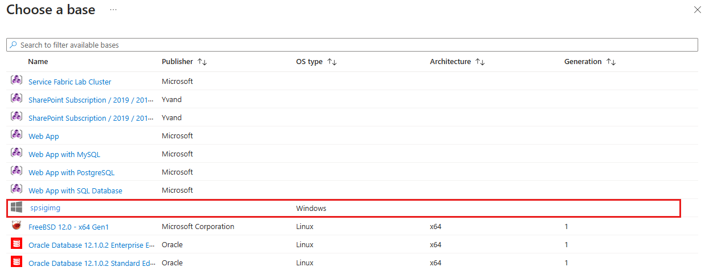
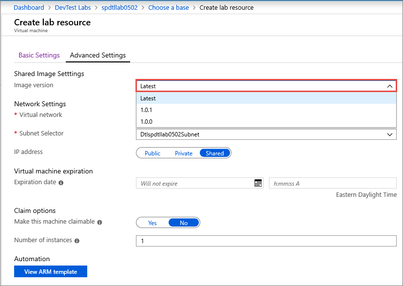

# Add a VM using an image from the attached shared image gallery
Azure DevTest Labs allows you to attach a shared image gallery to your lab and then use images in the gallery as bases for the VMs you create in the lab. To learn how to attach a shared image gallery to your lab, see [Configure shared image gallery](configure-shared-image-gallery.md). This article shows you how to add a VM to your lab by using an image from the attached shared image gallery as a base. 

## Azure portal
In this section, you learn how to use the Azure portal to add a VM to your lab based on an image from the attached shared image gallery. This section doesn't provide detailed step-by-step instructions for creating a VM using the Azure portal. For those details, see [Create a VM - Azure portal](devtest-lab-add-vm.md). It only highlights the steps where you select an image from the attached shared image gallery and select a version of the image you want to use. 

When adding a VM to your lab, you can select an image from the attached shared image gallery as a base image: 



Then, on the **Advanced settings** tab of the **Create lab resource** page, you can select the version of the image you want to use as the base image:



You can switch to using a different version of the image after the VM is created. 

## Resource Manager template
If you're using an Azure Resource Manager template to create a virtual machine using a shared image gallery image, specify a value for the **sharedImageId** in the **Properties** section. See the following example: 

```json
"resources": [
{
    ...
    "properties": {
         "sharedImageId": "/subscriptions/111111111-1111-1111-1111-111111111111/resourcegroups/mydtlrg/providers/microsoft.devtestlab/labs/mydtllab/sharedgalleries/spsig/sharedimages/myimagefromgallery",
        "sharedImageVersion": "1.0.1",
        ...
    }
}
],
```

For a complete Resource Manager template example, see
[Create a virtual machine using a shared image gallery image](https://github.com/Azure/azure-devtestlab/tree/master/samples/DevTestLabs/QuickStartTemplates/101-dtl-create-vm-username-pwd-sharedimage) sample in our GitHub repository. 

## REST API

1. First, you need to get the ID of the image in the shared image gallery. One way is to list all images in the attached shared image gallery by using the following GET command. 

    ```rest
    GET  https://management.azure.com/subscriptions/{subscriptionId}/resourceGroups/{resourceGroupName}/providers/Microsoft.DevTestLab/labs/{labName}/sharedgalleries/{name}/sharedimages?api-version= 2018-10-15-preview
    ```
2. Invoke the PUT method on virtual machines by passing the ID of the shared image you received from the previous call to the `properties.SharedImageId`.

## Next steps
To learn how to attach a shared image gallery to a lab and configure it, see [Configure shared image gallery](configure-shared-image-gallery.md).