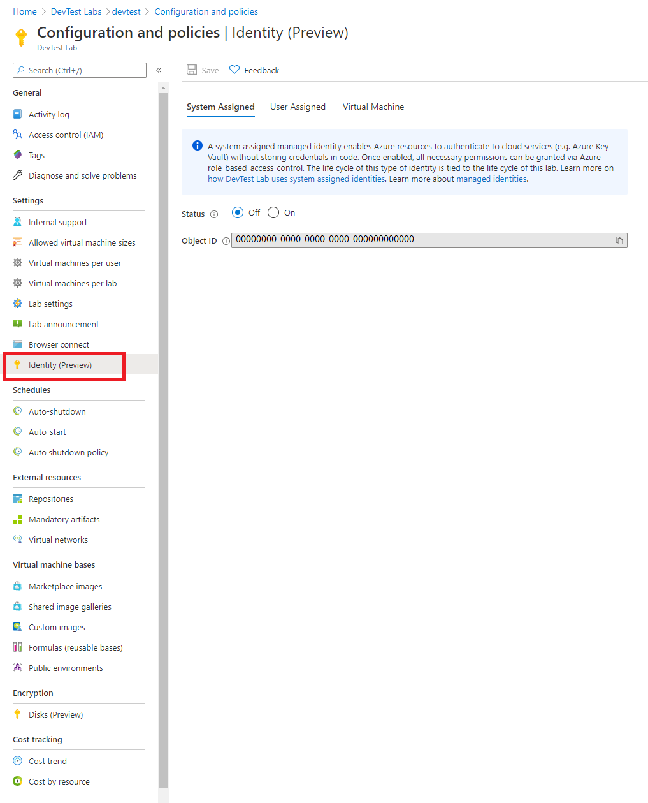

# Configure a lab identity

A common challenge when building cloud applications is how to manage the credentials in your code for authenticating to cloud services. Keeping the credentials secure is an important task. Ideally, the credentials never appear on developer workstations and aren't checked into source control. Azure Key Vault provides a way to securely store credentials, secrets, and other keys, but your code must authenticate to Key Vault to retrieve them. 

The managed identities for Azure resources feature in Microsoft Entra solve this problem. The feature provides Azure services with an automatically managed identity in Microsoft Entra ID. You can use the identity to authenticate to any service that supports Microsoft Entra authentication, including Key Vault, without any credentials in your code. Learn more about [managed identities on Azure](../active-directory/managed-identities-azure-resources/overview.md). 

There are two types of managed identities: 

## System-assigned managed identity  

A **system-assigned managed identity** is enabled directly on an Azure service instance. When the identity is enabled, Azure creates an identity for the instance in the Microsoft Entra tenant that's trusted by the subscription of the instance. After the identity is created, the credentials are provisioned onto the instance. The life cycle of a system-assigned identity is directly tied to the Azure service instance that it's enabled on. If the instance is deleted, Azure automatically cleans up the credentials and the identity in Microsoft Entra ID. 

### Scenarios for using lab’s system assigned identity  

Every DevTest Labs is created with a system assigned identity that remains valid for the life of the lab. The system assigned identity is used for the following purposes:  

- All [Azure Resource Manager](devtest-lab-create-environment-from-arm.md) based deployments used to spin up multi-VM and/or platform as a service environment will be executed using the lab’s system assigned identity  
- Disk encryption for lab disks using a customer-managed key is supported through lab’s system assigned identity. By providing explicit access to the lab’s identity to access your disk encryption set, the lab can encrypt all virtual machine disks on your behalf. Learn more about [how to enable Disk Encryption](encrypt-disks-customer-managed-keys.md) for your lab disks using a customer managed key.  

### Configure identity

This section demonstrates how to configure lab's identity policy.

> [!NOTE]
> For labs created prior to 8/10/2020, system assigned identity will be set to Off. As a lab owner, you can turn it on, in case you intend to use labs for the purposes listed in the previous section.  
>
> For new labs created after 8/10/2020, the lab's system assigned identity is set to On by default and lab owner will not be able to turn this off for the lifecycle of the lab.  

1. Sign in to the [Azure portal](https://portal.azure.com).
1. Search for **DevTest Labs**.
1. From the list of labs, select the lab you want.
1. Select **Configuration and policies** -> **Identity (Preview)**. 

> [!div class="mx-imgBorder"]
> 

## User-assigned managed identity  

A user-assigned managed identity is created as a standalone Azure resource. Through a create process, Azure creates an identity in the Microsoft Entra tenant that's trusted by the subscription in use. After the identity is created, the identity can be assigned to one or more Azure service instances. The life cycle of a user-assigned identity is managed separately from the life cycle of the Azure service instances to which it's assigned. 

DevTest Labs supports user assigned identities for both virtual machines and Azure Resource Manager based environments.  For more information, see the following topics:

- [Add a user-assigned identity to deploy lab Azure Resource Manager environments](use-managed-identities-environments.md)
- [Add a user-assigned identities to deploy lab virtual machines](enable-managed-identities-lab-vms.md)

## Next steps

Review [Configure cost management](devtest-lab-configure-cost-management.md)
